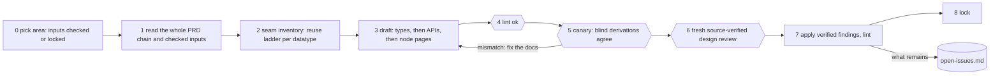

> **Draft, not yet approved.** The standing procedure for building this vault. Written 2026-10-01.

# How the architecture is built

**The goal.** Turn the PRD into API-level design that is checked area by area and precise enough that separate builders can implement connected modules and get code that connects. Schemas are what make that possible, so the process is built around them. `locked` records Muk's approval; checked contracts may be design inputs before approval.

**Decisions and precedents.** Every architecturally significant choice is recorded in the [decision ledger](decisions.md) with its primary precedent, the exact pattern borrowed, local rationale, owner, affected contracts, validation state, replacement trigger and migration boundary. A cited system is precedent, not proof and not automatically a dependency.

## What a page's status means

| Status | Means | Who sets it |
|---|---|---|
| `draft` | written, not yet through the loop | the author |
| `checked` | through the loop: the lint passes, the canary agrees or a review's findings are applied, and every dependency it relies on is `checked`, `locked`, or an explicitly named `blackbox` interface. It **should** be complete; what is still open is listed in [open issues](open-issues.md) | the architect, after the loop. The lint refuses `checked` while a dependency is still `draft` |
| `locked` | `checked`, and approved by Muk. It changes only through the change order below. Locking is an approval state, not a prerequisite for other architecture work to consume the checked contract | Muk |
| `blackbox` | an interface blocked by a genuine product-scope conflict or an unvalidated safety mechanism. It fixes a provisional boundary, states the unsafe or conflicting condition, and fails closed. Missing prose alone is handled with a sourced, replaceable `draft` default | the architect, after recording why a safe provisional default is impossible |

**A black box is promoted, never patched.** When its missing input arrives, it goes through the area loop like any new area, and its status becomes `checked`. Every page that depends on it is checked again in the same change. A checked or locked interface change likewise reopens the owner and every transitive producer, consumer, gate, run-plan, seam, and diagram page that relies on the changed field, meaning, error, or effect. Record that recheck set with the change. The list of black boxes, with what each waits on, is [system/blackboxes](system/blackboxes.md).

The banner under the front matter says the same: **Checked, not yet approved** or **Draft**.

## Where things live

- **Design:** this folder, jiuwenswarm `docs/architecture/`. **PRD:** `docs/product/`, verbatim, indexed in its README. Notes elsewhere (obby) are never the design.
- **Upstream material found anywhere else** (a teammate's PRD or design) is copied verbatim into `docs/product/` or a workstream folder here the same day, and its seams with CC are written in [seams](seams.md).
- **One concept per page,** about 30 KB at most. A bigger page becomes a folder with an index. The lint warns.
- **Mermaid is the graph format,** because machines can read it. [graph.md](graph.md) is generated from front matter; never edit it.

## The order for changing anything

A change flows from its owner outward. Never edit a consumer before the owner.

1. **Record** the change in [decisions](decisions.md): what, why, precedent, replacement trigger and which pages consume it. A schema or API has one owning page; list downstream pages and seams that consume that definition. Put only unresolved product conflicts or implementation-validation facts in [open issues](open-issues.md). For a checked contract change, identify its full dependent recheck set before updating pages.
2. **The owner page:** the one page that defines the thing (a `types/` page, a `schemas/` page, [fields](capsule/fields.md), [policy](schemas/policy.md)). The table [where every shared datatype is defined](types/types.md#where-every-shared-datatype-is-defined) names it.
3. **Lint** until it prints `ok`.
4. **Consumers:** update them to **link** to the owner, never to restate it.
5. **Module, node and capsule pages,** then [seams](seams.md). Before separate implementers build connected modules, their pages must reference the same checked type/API and the seam canary must agree.
6. **Indexes:** [README](README.md), the "where defined" table.
7. **Notes last.**

## Rules for a good schema

| Rule | Prevents |
|---|---|
| Every shared datatype has one page, one id and one current version | copies drifting apart; several versions in force at once |
| One identity per object, one field name for it everywhere | the same object under two ids |
| No task, step or run id inside a reusable schema (INV-7) | values that only work in one run |
| Closed core plus one `ext`; consumers read only declared fields | checkers and schemas that disagree on field names |
| Every field in the type grammar, compiled mechanically, with a validating example | schemas that do not match the code |
| A rule written only in prose is not enforced: make it a check | "always", "never" and "at least" that nothing checks |
| Unknown never passes (INV-8); no default status | gates that pass what they cannot evaluate |
| Refer, never copy (INV-5, INV-6); one writer per record kind (INV-3) | drift between copies; many state surfaces |
| Every promise has a check, written by someone other than the builder (INV-9, INV-10) | a referee that judges itself |
| Every code claim cited `path:line` at a commit | docs that drift from code |
| **One interface, policy-selected profiles.** Different assurance, Gate, retry or execution needs use a named versioned profile behind the same API. A new need creates a profile or schema version, not a call-site exception | special cases that multiply |

**The schema holds; the policy tightens** (INV-17). A field can exist before any tool reads it. As tools arrive, the policy starts requiring and checking more fields. Nobody re-authors a capsule because a new check switched on.

## Fitting existing code

**The reuse ladder.** Try each step in order, and write down which was taken:
1. Reuse an agent-core or jiuwenswarm piece as it is, cited.
2. Map it at a seam, with the mapping written on the owning page.
3. Define it new.

**Every connection to existing code** is a row on [integration](system/integration.md) before it is code, and goes through `cc/adapters/`. Earlier systems, such as AI4Research, are lessons only: a schema stands on its own reasons.

## The area loop

An area starts when the contracts it reads are `checked` or `locked`. A named `blackbox` dependency may be used only at its published provisional interface; the consuming page must state its assumptions and which interface changes require revision. A `draft` dependency is not a usable contract.



- **Node pages** follow [the node template](system/nodes.md#node-spec-template), so each can become a Declaration and code directly.
- **Every review finding is checked in source before it is applied.** A third review round is never run; what remains goes to open issues.
- **The review checklist:** a datatype defined twice; an API whose arguments, return value, errors or records are unstated; a reference to something undefined; a type that does not compile or an example that does not validate; an invariant broken; a PRD sub-feature with no page and no written reason; stale text after a change; control flow outside a capsule or the run plan; a host with stage logic. Reviewers use a fresh context and verify every finding against the PRD and architecture sources. Apply verified findings; record unresolved product decisions in [open issues](open-issues.md).

## The canary

For each seam an area touches, two fresh agents, each with only the vault and no session context, derive the two sides as Declarations. Then:

```text
python _tools/arch_lint.py canary --producer A.json --consumer B.json --wire OUT=IN --external NAME
python _tools/arch_lint.py canary --compare A.json B.json
```

**Any mismatch means the docs are under-specified.** Fix the docs, never a derivation, and run again.

## The overall system diagram

[The overall system diagram](system/diagram.md) is a standing canary. Every module and every datatype that moves between modules is on it. The lint checks:
- every drawn node is in its Nodes table, and the reverse;
- every edge label is a datatype in its Edge labels table, linked to its one definition;
- every payload type is on an edge;
- every capsule of the M1 run plan is drawn.

**Redraw it in the same change** whenever a module, an adapter or a datatype is added, removed or renamed. A part that cannot be drawn is a wrong part. A drawing that does not make sense is a design error, found before any code exists.

## The step back

- **When:** after every third locked area, after any change to a CC rule, and before a hand-off to coders.
- **Who:** a fresh reviewer, reading the vault and the PRD without relying on the author’s conclusions. It walks one run end to end, maps every PRD sub-feature to a page, and reads the graph. No particular model is required.
- **Output:** a report in [reviews/](reviews/2026-10-01-system-step-back.md). The loop resumes once every finding has a disposition.

## The lint

`python docs/architecture/_tools/arch_lint.py [--check]`. The old `tundle/tools/architecture_sync.py` now runs it. It checks:
- field tables and the INV-11 to INV-13 rules;
- links and Mermaid;
- every type page compiles and its example validates;
- no page restates a type's field table;
- no retired name is in use;
- system pages carry front matter;
- `graph.md` is current;
- page sizes (as warnings).

Still to add: lock hashes for locked pages, and `adapters_only` once code exists.

## Seven coding-handoff questions

Every module must link canonical answers for: placement/reuse/process/owner; typed API/files/errors/deadlines/duplicates/cancellation; startup/call/Gate/release/halt/restart; durable writers/correlation/crash recovery/frozen inputs; actual identity/filesystem/network/credentials/IPC confinement; platform/dependency/config/precedence/reload; standalone invocation/observations/failure injection/integration path. [Module map](system/modules.md) indexes these owners; [verification](system/verification.md) specifies invocation evidence. Internal algorithms remain implementation choices. A linked PRD clause without a concrete contract does not establish readiness. Runtime tests and their observed results are supplied later by the coding role.
