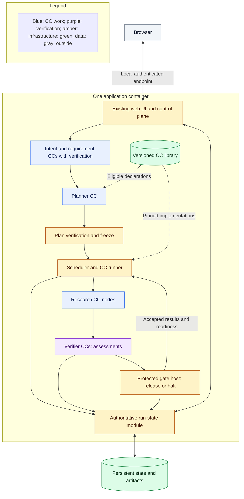

# AI4Research architecture

Architecture baseline, 2026-10-06. This describes intended behavior; runtime implementation is not established by these documents.

## Intent and reading boundary

Turn a research objective and supplied baseline into an evidence-grounded opportunity, a falsifiable hypothesis, a bounded proof of concept (POC), measured results, and a traceable report. Keep the server working after the browser closes. Prefer existing JiuwenSwarm and OpenJiuwen components where they preserve these boundaries.

Three labels distinguish implementation obligations:

- **Required now:** behavior required for full M1, except where the [first build](immediate-plan.md) explicitly narrows its slice.
- **Required compatibility:** contract meaning and extension boundaries that must survive the first implementation; runtime support may come later.
- **Future direction:** an approach to investigate, not permission to implement or a claim that it works.

Architecture fixes intent, responsibilities, placement, connections, and important decisions. The PRD supplies product behavior. Spec Kit supplies detailed APIs, serialization, algorithms, acceptance criteria, tests, and build order. The complete [CC field reference](capsule/declaration.md) is a requirement; temporary payload schemas are left to coding agents.

| Read | Question answered |
|---|---|
| This overview | What is the system and what must it contain? |
| [Workflow](workflow.md) | How does planning become execution? |
| [Capsules and verification](capsules.md) | How are results assessed and released? |
| [Placement and reuse](placement.md) | What runs where and what is reused? |
| [Principles and decisions](principles.md) | Why these choices, and which PRD assumptions changed? |
| [First build](immediate-plan.md) | What is the first connected implementation? |
| [Declaration](capsule/declaration.md) / [authoring](capsule/authoring.md) | Which fields must survive, and how is a CC published? |

The core reading target is approximately 6,000 prose words. Historical details are supporting sources, not another required specification.

## Glossary

| Term | Meaning |
|---|---|
| CC | Reusable capability declaration and referenced implementation |
| Node | One CC invocation with bound inputs and dependencies |
| Task | Logical objective grouping one or more nodes; distinct from a coding TASK |
| Run | One request and its recorded workflow execution |
| Stage | Recognizable responsibility in the research journey |
| Freeze | Durable acceptance of a graph, version pins, verification assignments, policy, and limits |
| Verifier CC | Read-only assessment of a declared question using supplied evidence |
| Gate | Protected decision that releases a result or blocks advancement |
| Library | Admitted declarations and implementations, version history, and active-version references |
| Artifact | Stored input, output, or evidence with attributable identity |
| Declaration | Authored capability contract; distinct from its code and a particular invocation |
| Admission | Recorded eligibility of an immutable version for supported use |
| Activation | Human-controlled selection of an admitted version for future runs |
| Suspension | Revocation of eligibility to start or release affected work; no automatic replacement |
| Evidence | Attributable observations and artifacts supporting a check or conclusion |
| Assessment | Verifier findings and reasons; distinct from the authoritative gate decision |
| Research Brief | Accepted research requirements consumed by planning; more complete than intermediate intent |
| Protocol | Pre-registered experimental procedure and scientific decision criteria |
| Composite CC | Capability with pinned member CCs, internal DAG, and boundary wiring |
| RSI | Offline recursive self-improvement of explicitly eligible implementation parts |
| TASK / TASKS | Coding-task entry point / program source and allocation register |
| Spec Kit feature | One TASK's native spec, plan, work list, and implementation evidence |

## System picture

**Required now.** These are logical modules within one application deployment, not independent network services.

Every work CC, including the planner and delivery, has verification. The diagram groups preparation and plan checking; it does not authorize the planner to freeze its own proposal. The runtime loop shows dispatch control, not a cycle in the frozen task DAG. The control plane exposes only gate-released results. [Placement](placement.md) shows model access and generated-code isolation.

## Complete capability inventory

**Required now.** Retain each responsibility below even when a coding agent combines private helpers. Each work capability needs semantic verification suited to its output, alongside deterministic checks.

| Capability | Responsibility and downstream result |
|---|---|
| Intent compiler | Preserve the requested objective, scope, constraints, and unresolved information |
| Requirement compiler | Form the accepted Research Brief used for planning |
| Planner | Propose bounded tasks, CC selections, connections, and verification assignments |
| Search and ideation | Retrieve permitted evidence and produce cited candidate ideas |
| Screening | Score and select one feasible opportunity; retain the pure ranking helper needed by offline RSI |
| Hypothesis | Establish the claim, baseline, data, measurement, and frozen experimental protocol |
| POC builder | Construct and package the bounded intervention and benchmark harness |
| Benchmark | Execute baseline then treatment under that protocol and capture measurements |
| Scientific evaluation | Apply the pre-registered criteria to accepted measurement evidence |
| Delivery | Produce the report, supporting artifacts, and disclosed limitations |
| Verifier CCs | Assess intent, requirements, plan coverage, grounding, feasibility, protocol, build, measurements, evaluation, and delivery through pinned profiles |

Intake transport, simple input qualification, scheduling, integrity checks, gate application, and final transfer are infrastructure. Scheduled substantive intake transformations use CCs. Offline RSI is a separate required M1 path described in [placement](placement.md#offline-rsi); it is not a research DAG stage.

## Sources and handoff

The [frozen master PRD](../product/prd-m1-full-2026-10-02.txt) remains verbatim. [Decisions](principles.md#decisions-and-source-amendments) record authorized changes rather than silently treating the October 5 draft as PRD compliance. [Old snapshots](old/README.md) retain detailed rationale and prior approaches. The [M1 register](../tasks/M1/TASKS.md) owns source versions and allocation.

Give coding agents exact clauses and the relevant architecture pages through [TASKS → TASK → Spec Kit](../code/code_sop/SPEC_KIT_WORKFLOW.md). The first intent pair is a limited trial. Complete M1 also requires CLI/headless execution, native web UI and TUI, installation/startup diagnostics, local terminal sessions, security/configuration (PRD 5.1–5.6), evidence exports, and offline RSI validation.
