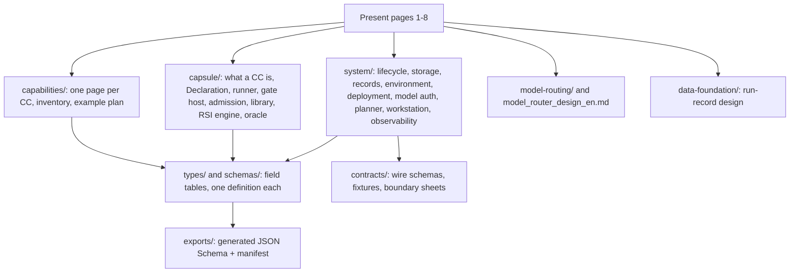

# M1 architecture

PRD: 1.2, 1.3, 1.4, 1.5, 1.6

> Answers: what does the M1 architecture look like, why was it chosen, and where do I find each part?


AI4Research M1 on OpenJiuwen [SwarmFlow](system/integration.md#term-swarmflow): a fixed outer flow (intake, intent, requirements, planner, bind and freeze, local governed DAG, delivery) where every dispatch call has a [Gate](verification.md#term-gate), plus a separate offline improvement area ([RSI](rsi.md#term-rsi)). Status: **specified design; implementation validation pending**. Open this folder as an Obsidian vault.

> **Naming note:** names for [capsules](capsule/capsule.md#term-capability-capsule), [nodes](system/nodes.md#term-node), [ports](capsule/fields.md#term-port), types, records and files in these docs are working names. They will be consolidated into one naming scheme with the PRD and the coding side. Until then, use the names as written here and expect renames.

## Read in this order (present level)

| # | Page | Answers |
|---|---|---|
| 1 | [terms](terms.md) | what is and is not a capsule; node vs CC; Gate vs verifier |
| 2 | [flow](flow.md) | the graph: data in, DAG, answer out; overview and full view; failures; supported IO |
| 2a | [flow variants](flow-variants.md) | generated smaller views: without observability, without RSI, core |
| 3 | [placement](placement.md) | one Docker container; where model routing sits; where each piece lives and why |
| 3a | [k8s-lens](k8s-lens.md) | which Kubernetes patterns we borrowed and where we deliberately differ |
| 3c | [reuse](reuse.md) | what we reuse from jiuwenswarm and agent-core, and what we build and why |
| 3b | [isolation](isolation.md) | how agents drive capsules; workspaces; what jiuwenswarm isolation we rely on |
| 4 | [verification](verification.md) | how Gates and verifier CCs work; test policy |
| 5 | [runtime](runtime.md) | [halts](system/lifecycle.md#term-halt), exception handling, permissions, observability |
| 6 | [rsi](rsi.md) | the separate RSI flow, benchmarks per capsule, activation |
| 7 | [build-order](build-order.md) | what to build in what order, and the [demos](build-order.md#term-demo) at each step |
| 7b | [v-model](v-model.md) | each design level and the tests that prove it. Where we are: design and test specs written, no code yet |
| 8 | [decisions](decisions.md) | decisions, PRD [deviations](decisions.md#term-deviation), open items |

How the design maps to the PRD: [prd-map](prd-map.md).

## Presentation route (about 40 minutes)

| Min | Open | Say |
|---|---|---|
| 0-3 | [README](README.md) | what the system is, the two levels of docs, one home per fact |
| 3-10 | [flow](flow.md): Overview, then Full view | the fixed flow, planned nodes, a Gate on every dispatch call, halt, delivery. Data in and out, failures |
| 10-14 | [terms](terms.md) | CC vs node vs step; verifier is a CC; what is not a capsule |
| 14-20 | [verification](verification.md) | Gates, two tiers, zero RSI on referees, test policy |
| 20-24 | [placement](placement.md), [isolation](isolation.md) | one Docker container, where model routing sits, how capsules are run and confined |
| 24-28 | [runtime](runtime.md) | runner, exceptions, permissions, observability |
| 28-31 | [rsi](rsi.md) | separate offline area, [Puppet admission](capsule/admission.md#term-puppet-admission), human activation |
| 31-35 | [build-order](build-order.md) | strategy and demos D0 to D6, work CC to Gate CC first |
| 35-38 | [stories](stories.md) | what must be seen working. Pick US-02, US-07, US-11 |
| 38-40 | [decisions](decisions.md) | decisions with reasons, PRD deviations, open items |

Depth, if asked: a capability page ([intent compile](capabilities/intent-compile.md)), the inventory ([capabilities](capabilities/README.md)), the [Declaration](capsule/fields.md#term-declaration) ([fields](capsule/fields.md)), the runner ([runner](capsule/runner.md)), and the schemas ([contracts](contracts/README.md)). The PDF in `output/pdf/` is the short version of the first eight pages.

## Detail level (build specs, not presented)



| Folder | Holds | Start at |
|---|---|---|
| `capabilities/` | the capability pages, ordinary-module pages, improvement guide | [README](capabilities/README.md) |
| `capsule/` | CC specification | [capsule](capsule/capsule.md) |
| `system/` | module map and engineering specs | [modules](system/modules.md) |
| `types/`, `schemas/` | [payload types](types/types.md#term-payload-type), CC records, policy, invariants | [types](types/types.md), [schemas](schemas/schemas.md) |
| `contracts/` | authored wire schemas (services, execution, library-rsi, tools), [fixtures](system/test-surfaces.md#term-fixture), [boundary sheets](contracts/principles.md#term-boundary-sheet) | [README](contracts/README.md) |
| `exports/` | **generated**. Never edit. | [manifest](exports/manifest.json) |

## Library map (generated from the files)

Every page in the library, grouped by folder. This is the one place to navigate from. Regenerate with `python _tools/library_map.py`.

<!-- generated:library-map -->
### Start here (present level)

| Page | What it is |
|---|---|
| [README.md](README.md) | M1 architecture |
| [terms.md](terms.md) | Terms: what is a capsule, and where each term is defined |
| [flow.md](flow.md) | Flow: how data goes in, through the system, and out |
| [flow-variants.md](flow-variants.md) | Flow variants: smaller views of the same graph |
| [placement.md](placement.md) | Placement: where everything runs |
| [k8s-lens.md](k8s-lens.md) | Kubernetes as inspiration |
| [reuse.md](reuse.md) | What we reuse from jiuwenswarm and what we build |
| [isolation.md](isolation.md) | Agents, workspaces and isolation |
| [verification.md](verification.md) | Verification: how Gates work and how we test |
| [runtime.md](runtime.md) | Runtime: runner, exceptions, permissions, observability |
| [rsi.md](rsi.md) | RSI: the separate improvement area |
| [build-order.md](build-order.md) | Build order: what to build, in what order, how to know it works |
| [v-model.md](v-model.md) | V model: what each design level is tested by, and where we are |
| [stories.md](stories.md) | User stories: what must be possible and must happen |
| [decisions.md](decisions.md) | Decisions, PRD deviations and open items |
| [prd-map.md](prd-map.md) | Frozen M1 clause and responsibility coverage |
| [standards.md](standards.md) | Page format standard |

### Capabilities: every CC and ordinary module

| Page | What it is |
|---|---|
| [capabilities/benchmark.md](capabilities/benchmark.md) | benchmark_capsule: research.run_benchmark (PRD 3.7) |
| [capabilities/benchmarking-material.md](capabilities/benchmarking-material.md) | Benchmark material and fixture preparation |
| [capabilities/brief-gate.md](capabilities/brief-gate.md) | research.accept_brief.v1 Gate profile |
| [capabilities/delivery.md](capabilities/delivery.md) | Ordinary publication (delivery) |
| [capabilities/evaluation.md](capabilities/evaluation.md) | Scientific evaluation |
| [capabilities/extract-text.md](capabilities/extract-text.md) | Source projection (intake module) |
| [capabilities/hypothesis.md](capabilities/hypothesis.md) | hypothesis_capsule: research.form_hypothesis (PRD 3.5) |
| [capabilities/improvement.md](capabilities/improvement.md) | Capability design and improvement guide |
| [capabilities/intent-compile.md](capabilities/intent-compile.md) | research.compile_intent: what the request means |
| [capabilities/intent-gate.md](capabilities/intent-gate.md) | research.accept_intent.v1: the intent Gate profile |
| [capabilities/measurement-protocol.md](capabilities/measurement-protocol.md) | Measurement, compiler and resource contracts |
| [capabilities/op-assess-dependency.md](capabilities/op-assess-dependency.md) | Ordinary module contract: op.assess_dependency: deterministic dependency policy |
| [capabilities/op-codesearch.md](capabilities/op-codesearch.md) | op.codesearch: locate the intervention |
| [capabilities/op-local-search.md](capabilities/op-local-search.md) | op.local_search: one keyword query over the intake's documents |
| [capabilities/op-rank-opportunities.md](capabilities/op-rank-opportunities.md) | Ordinary rank_opportunities helper |
| [capabilities/op-scholarly-search.md](capabilities/op-scholarly-search.md) | op.scholarly_search: one query against the academic literature |
| [capabilities/op-workspace-io.md](capabilities/op-workspace-io.md) | Ordinary module contract: Workspace operators: one fixed API per operation |
| [capabilities/poc.md](capabilities/poc.md) | poc_capsule: research.build_poc (PRD 3.6) |
| [capabilities/prep.plan.json](capabilities/prep.plan.json) | Data |
| [capabilities/README.md](capabilities/README.md) | Capabilities: every CC, and what is not one |
| [capabilities/requirement-capsule.md](capabilities/requirement-capsule.md) | requirement_capsule: design |
| [capabilities/research-gates.md](capabilities/research-gates.md) | Gates from Hypothesis through Report |
| [capabilities/research-template.plan.json](capabilities/research-template.plan.json) | Data |
| [capabilities/screening-gate.md](capabilities/screening-gate.md) | research.accept_card.v1 Gate profile |
| [capabilities/screening.md](capabilities/screening.md) | research.select_opportunity: Screening (PRD 3.4) |
| [capabilities/search-capsule.md](capabilities/search-capsule.md) | search_capsule: research.search_ideas |
| [capabilities/search-gate.md](capabilities/search-gate.md) | research.accept_ideas.v1 Gate profile |
| [capabilities/write-report.md](capabilities/write-report.md) | research.write_report: the research report |

### Capsule specification: Declaration, runner, tools, Gates, admission, library, RSI

| Page | What it is |
|---|---|
| [capsule/admission.md](capsule/admission.md) | Admission providers and the Puppet Gate |
| [capsule/authoring.md](capsule/authoring.md) | Authoring a capsule |
| [capsule/capsule.md](capsule/capsule.md) | Capability Capsule |
| [capsule/fields.md](capsule/fields.md) | Declaration |
| [capsule/fixture-oracle.md](capsule/fixture-oracle.md) | Private RSI fixture oracle |
| [capsule/future-state.md](capsule/future-state.md) | Future state: composition, generalist, Symphony |
| [capsule/gate-capsules.md](capsule/gate-capsules.md) | The verifier capsule |
| [capsule/gate-host.md](capsule/gate-host.md) | The gate host |
| [capsule/library.md](capsule/library.md) | The M1 capsule library |
| [capsule/make-capsule.md](capsule/make-capsule.md) | make_capsule.md: the readable contract |
| [capsule/observability.md](capsule/observability.md) | Observability and quality |
| [capsule/permissions.md](capsule/permissions.md) | Permissions: how a capsule fits jiuwenswarm |
| [capsule/process-boundary.md](capsule/process-boundary.md) | M1 untrusted process boundary |
| [capsule/prompt-brief.md](capsule/prompt-brief.md) | Prompt brief: what architecture hands to the prompt layer |
| [capsule/references.md](capsule/references.md) | References |
| [capsule/rsi-attacks.md](capsule/rsi-attacks.md) | RSI attack scenarios RSI-S01 to RSI-S24 |
| [capsule/rsi-engine.md](capsule/rsi-engine.md) | Offline RSI controller and activation |
| [capsule/rsi.md](capsule/rsi.md) | M1 offline RSI boundaries |
| [capsule/runner-broker.md](capsule/runner-broker.md) | Runner model client, broker and Swarmflow backend |
| [capsule/runner-handlers.md](capsule/runner-handlers.md) | Runner kind handlers, values and ports |
| [capsule/runner.md](capsule/runner.md) | The CC runner |
| [capsule/stages.md](capsule/stages.md) | Checked and unchecked at M1 |
| [capsule/toolchain.md](capsule/toolchain.md) | The CC toolchain |
| [capsule/tools.md](capsule/tools.md) | Tools inventory and field enforcement |
| [capsule/trust.md](capsule/trust.md) | Trust |
| [capsule/why.md](capsule/why.md) | Why Capability Capsule |

### System: modules, lifecycle, storage, environment, planner, workstation

| Page | What it is |
|---|---|
| [system/benchmark-export.md](system/benchmark-export.md) | External benchmark invocation and evidence export |
| [system/boundary-cases.md](system/boundary-cases.md) | Boundary-case coverage |
| [system/deployment.md](system/deployment.md) | Dockerized modular monolith |
| [system/environment.md](system/environment.md) | Environment, configuration and security profiles |
| [system/experiments.md](system/experiments.md) | M1 track boundaries |
| [system/integration.md](system/integration.md) | Integration: where CC code meets existing code |
| [system/ledgers.md](system/ledgers.md) | Ledgers |
| [system/lifecycle.md](system/lifecycle.md) | Run lifecycle, Gate locking and explicit recovery |
| [system/model-auth.md](system/model-auth.md) | Model authentication and replaceable endpoint adapters |
| [system/model-bridge.md](system/model-bridge.md) | Model bridge |
| [system/modules.md](system/modules.md) | M1 modules, code placement and processes |
| [system/nodes.md](system/nodes.md) | Nodes and governed execution |
| [system/observability.md](system/observability.md) | Observability at M1 |
| [system/planner.md](system/planner.md) | Planner, validation and binding |
| [system/records.md](system/records.md) | Durable system records and reserved identities |
| [system/reuse-audit.md](system/reuse-audit.md) | Pinned source reuse audit |
| [system/seams.md](system/seams.md) | Seams: where each workstream meets Capability Capsule |
| [system/storage.md](system/storage.md) | Durable publication, frozen inputs and execution evidence |
| [system/test-surfaces.md](system/test-surfaces.md) | Component invocation and connected acceptance |
| [system/workstation.md](system/workstation.md) | M1 local workstation interfaces |

### Payload types (field tables, one per type)

| Page | What it is |
|---|---|
| [types/benchmark-payload.md](types/benchmark-payload.md) | benchmark_payload: empirical measurements |
| [types/code-hits.md](types/code-hits.md) | code_hits: snapshot code locations |
| [types/dependency-assessment.md](types/dependency-assessment.md) | dependency_assessment: frozen registry decision |
| [types/dependency-requirement.md](types/dependency-requirement.md) | dependency_requirement: a candidate's external requirement |
| [types/evaluation-verdict.md](types/evaluation-verdict.md) | evaluation_verdict: the scientific outcome |
| [types/evidence-bundle.md](types/evidence-bundle.md) | evidence_bundle: what the judge is shown  |
| [types/hypothesis-blueprint.md](types/hypothesis-blueprint.md) | hypothesis_blueprint: the frozen experiment contract |
| [types/idea-set.md](types/idea-set.md) | idea_set: candidate ideas with their evidence |
| [types/intake.md](types/intake.md) | intake: the Qualified Intake Package |
| [types/intent-ir.md](types/intent-ir.md) | intent_ir: what a request means |
| [types/opportunity-card.md](types/opportunity-card.md) | opportunity_card: the selected opportunity and screening record |
| [types/poc-bundle.md](types/poc-bundle.md) | poc_bundle: the benchmark-ready proof of concept |
| [types/research-brief.md](types/research-brief.md) | research_brief: the Research Brief |
| [types/research-report.md](types/research-report.md) | research_report: the user's report |
| [types/resource-snapshot.md](types/resource-snapshot.md) | resource_snapshot: immutable bound resource |
| [types/run-plan.md](types/run-plan.md) | run_plan: which nodes run, in what order, fed by what |
| [types/screening-assessments.md](types/screening-assessments.md) | screening_assessments: assessed consolidated opportunities |
| [types/search-hits.md](types/search-hits.md) | search_hits: what one search query found |
| [types/source-text.md](types/source-text.md) | source_text: text with a stable source and offset basis |
| [types/types.md](types/types.md) | Payload types: one definition for every value that moves |
| [types/verifier-assessment.md](types/verifier-assessment.md) | verifier_assessment: the judge's answer |

### Record schemas and policy

| Page | What it is |
|---|---|
| [schemas/artifact.md](schemas/artifact.md) | Artifact: one value |
| [schemas/binding.md](schemas/binding.md) | Binding |
| [schemas/candidate.md](schemas/candidate.md) | Candidate |
| [schemas/checks.md](schemas/checks.md) | Check, test case and test suite |
| [schemas/common.md](schemas/common.md) | Common: envelope and shared shapes |
| [schemas/finding.md](schemas/finding.md) | Finding |
| [schemas/invariants.md](schemas/invariants.md) | Schema invariants |
| [schemas/observation.md](schemas/observation.md) | Observation: one capsule call |
| [schemas/policy.md](schemas/policy.md) | Policy: every "how" in one place |
| [schemas/port-types.md](schemas/port-types.md) | Port type vocabulary |
| [schemas/profiles.md](schemas/profiles.md) | Policy-selected profiles |
| [schemas/schemas.md](schemas/schemas.md) | The core schemas |
| [schemas/standing.md](schemas/standing.md) | Standing |
| [schemas/verdict.md](schemas/verdict.md) | Verdict |
| [schemas/verification-record.md](schemas/verification-record.md) | Verification |

### Communication contracts: JSON Schemas, fixtures, indexes

| Page | What it is |
|---|---|
| [contracts/boundaries.json](contracts/boundaries.json) | Data |
| [contracts/boundaries.md](contracts/boundaries.md) | Boundary sheets: where modules talk |
| [contracts/execution-v1.schema.json](contracts/execution-v1.schema.json) | JSON Schema |
| [contracts/fixtures/execution-v1.json](contracts/fixtures/execution-v1.json) | Fixtures |
| [contracts/fixtures/library-rsi-v1.json](contracts/fixtures/library-rsi-v1.json) | Fixtures |
| [contracts/fixtures/services-v1.json](contracts/fixtures/services-v1.json) | Fixtures |
| [contracts/fixtures/tools-v1.json](contracts/fixtures/tools-v1.json) | Fixtures |
| [contracts/index-execution.md](contracts/index-execution.md) | Execution and control contracts index |
| [contracts/index-library-rsi.md](contracts/index-library-rsi.md) | Index: library, admission, offline RSI, oracle, process, delivery, intake and intent-repai |
| [contracts/index-services.md](contracts/index-services.md) | Index: service and bridge contracts |
| [contracts/index-tools.md](contracts/index-tools.md) | Tool-side contracts index |
| [contracts/library-rsi-v1.schema.json](contracts/library-rsi-v1.schema.json) | JSON Schema |
| [contracts/principles.md](contracts/principles.md) | Message design principles |
| [contracts/README.md](contracts/README.md) | Authored public contracts |
| [contracts/services-v1.schema.json](contracts/services-v1.schema.json) | JSON Schema |
| [contracts/tools-v1.schema.json](contracts/tools-v1.schema.json) | JSON Schema |

### Model routing and data foundation (source designs)

| Page | What it is |
|---|---|
| [model-routing/README.md](model-routing/README.md) | Model routing adaptation |
| [model_router_design_en.md](model_router_design_en.md) | Model Router Redesign: M1 Technical Design |
| [data-foundation/capsule-run-records.md](data-foundation/capsule-run-records.md) | Capsule Run Records: M1 Technical Design |
<!-- /generated:library-map -->

## How this folder stays thin

1. **One home per fact.** Each type, API, rule or number lives in one page. Other pages link it. If you edit two pages for one change, one of them should have been a link.
2. **Present pages decide and link; detail pages specify.** Present pages carry no field tables or numbers owned elsewhere.
3. **Front matter on every page:** `id`, `type`, `level`, `status`, `provides`, `consumes`, `depends_on`. Machines read it; `arch_lint.py` [checks](capsule/fields.md#term-check) it.
4. **Generated, never hand-edited:** `exports/`, the four diagrams in [flow](flow.md) (from its source block), generated example fixtures in `types/`.
5. **Unknowns are `PENDING_SOURCE`**, listed in [decisions](decisions.md#open). No invented requirements.
6. **Evidence status is explicit:** `specified`, `documentation-checked`, `implemented-validated`. Only the last means it works.

Regenerate and check from this folder:

```
python _tools/arch_lint.py            # schemas, manifest, link/front-matter lint
python _tools/flow_views.py           # the four flow diagrams
python _tools/library_map.py          # the library map above and exports/library-manifest.json
python _tools/validate_docs.py        # links, inventory
python _tools/validate_contracts.py   # schemas, fixtures, communication indexes
python _tools/arch_lint.py --check    # verify nothing is stale
```

Source documents (PRD and received designs) are in `docs/product/`. They are not edited here. `model_router_design_en.md` is the router source design, kept verbatim and is outside the M1 architecture set. The earlier Codex-subscription task overview now lives with its task in `docs/tasks/AI4R-001/`.
