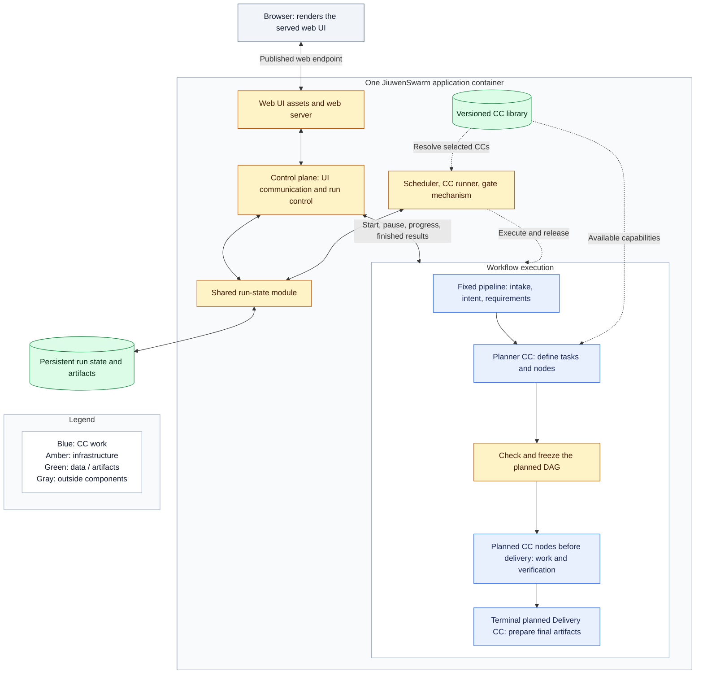

# AI4Research architecture

Tentative design plan for review, 2026-10-05. Not implemented yet. Names are provisional until reconciled with the product requirements document (PRD).

## Design intent

Run a bounded research journey: take a user's objective and baseline, find an opportunity, build a proof of concept (POC), measure it, and return evidence-backed results. The server keeps working after the browser closes.

Reuse JiuwenSwarm and OpenJiuwen wherever they fit. Spend development effort on capability capsules, the research workflow, and useful verification. Keep deployment reproducible and the architecture small enough for a person to review in under an hour.

Architecture defines responsibilities, connections, placement, and important authoring contracts. It also explains why they exist. A coding agent should follow that intent and exercise judgment within it. Detailed algorithms, temporary message formats, test procedures, and acceptance conditions belong to Spec Kit and the owning coding tasks.

## Vocabulary and naming

| Term | Meaning in this design |
|---|---|
| Run | One submitted workflow and its recorded execution |
| Task | Planner-defined work that may use any number of nodes within run limits |
| Coding task | Spec Kit development work; distinct from a planner's workflow task |
| Phase | A PRD implementation milestone |
| Stage | A recognizable step in the running pipeline |
| Capability capsule (CC) | An authored, reusable capability definition and referenced implementation; distinct from a run's requirements contract |
| Node | A workflow-graph entry that binds one CC invocation, inputs, and dependencies |
| Pipeline | The complete route from intake to delivery, including fixed stages and planned nodes |
| Fixed pipeline | Intake, intent compilation, and requirement compilation, with stable verification assignments |
| Planned DAG | The directed acyclic graph of work and verification selected by the planner |
| Freeze | Recording the accepted planned DAG, capability versions, and verification assignments before execution |
| Verifier CC | A capability that checks particular results or evidence |
| Gate | The decision to release results, request correction, or pause based on applicable checks |
| Control plane | Inside-container infrastructure for UI communication and run lifecycle control |
| Scheduler | Infrastructure that dispatches dependency-ready nodes |
| CC runner | Infrastructure that invokes a capability with its bound execution context |
| CC library | Versioned declarations and implementation references shared by planner and runner |
| Run-state module | Internal storage interface for authoritative run progress, attempts, and accepted results |
| Artifact | A stored input, output, log, or evidence item referenced by a run |
| Web UI | The built TypeScript UI served by the application container; its pages execute in the user's browser |

Use these terms consistently. A node invokes a CC; its node identifier is distinct from the reusable capability identifier. Use descriptive stage names such as "Intent compiler CC" and "Scientific evaluation CC" across diagrams and prose. Final machine identifiers will be reconciled with the PRD before release; do not reuse old B/V identifiers as new task IDs.

Diagram colors have one meaning throughout: blue for CC work, purple for verification, amber for infrastructure, green for data/artifacts, and gray for outside components. Neutral group borders identify a container, task, or other grouping; they do not add a component type. Each diagram includes a legend. Solid arrows show the main handoff or communication; dotted arrows show supporting relationships or labeled exception paths. Labels retain the meaning for readers who cannot distinguish colors.

## Read this set

| Page | Question it answers |
|---|---|
| This overview | What are we building, and why? |
| [Immediate plan](immediate-plan.md) | What small slice should we give a coding agent first? |
| [Workflow](workflow.md) | What runs, in what order, and what happens on failure? |
| [Placement and reuse](placement.md) | What runs where, what stores data, and what do we reuse? |
| [Capsules and verification](capsules.md) | What is a node, how do agents run, and where do checks belong? |
| [Principles and decisions](principles.md) | What must be preserved, and what can implementers decide? |

Capsule authors also have two short references: [declaration](capsule/declaration.md) and [authoring](capsule/authoring.md). They explain the shared CC authoring interface rather than every stage's payload. The reading goal is under an hour; clarity determines the length, not a hard word count.

## System picture

This overview groups work and verification into larger boxes; the workflow page shows individual nodes and checks. Delivery is the terminal part of the planned DAG, drawn separately to show the endpoint. Model-provider connections appear in the placement diagram. Infrastructure is not a node. Intake and final transfer may be ordinary boundary handling; scheduled processing uses a CC.

The container serves the web UI through one published endpoint. The browser renders it; the control plane connects it to execution. Substantive processing stays inside, mostly in nodes. No separate host UI server is needed.

## First working journey

The first journey covers intake, intent, requirements, search, screening, hypothesis, POC construction, benchmarking, evaluation, and delivery. The planner defines tasks and as many CC nodes as needed within scope and run limits. Tasks, stages, and nodes need not map one-to-one.

Use Python, the existing TypeScript UI, SQLite, and artifact files in one local application container. A remote workstation can later run the application with suitable access and resources.

RSI, model routing, distributed workers, autoscaling, and expanded DevOps design are later stages. A configured model endpoint is sufficient now. The wider PRD remains a source, but this first implementation does not claim its entire M1 scope.

## Sources and history

Read the relevant [PRD clauses](../product/prd-m1-full-2026-10-02.txt) and [October 5 meeting notes](../product/meeting-notes-2026-10-05.txt). Preserve owner sources verbatim. Later user decisions are summarized in [principles](principles.md#changes-from-the-previous-design).

The former library is [archived background](../archive/README.md), not an active specification. Follow the [Spec Kit workflow](../code/code_sop/SPEC_KIT_WORKFLOW.md) and [coding constitution](../../.specify/memory/constitution.md).
