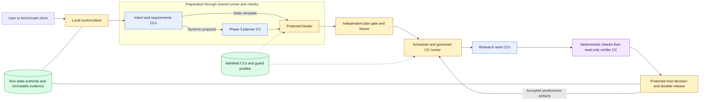

# AI4Research architecture

Architecture baseline, 2026-10-06. This describes intended behavior; runtime implementation is not established by these documents.

**Start with [TRIAL-1](immediate-plan.md).** Use the [authority index](authority-index.md) for the current design reading set and live coding entrypoints. For product alignment read [coverage](coverage.md), [PRD translation](glossary.md). The current design and required source inputs are together in this folder; existing coding authorities remain in their repository locations.

## Intent and reading boundary

Turn a research objective and supplied baseline into an evidence-grounded opportunity, a falsifiable hypothesis, a bounded proof of concept (POC), measured results, and a traceable report. Keep the server working after the browser closes. Prefer existing JiuwenSwarm and OpenJiuwen components where they preserve these boundaries.

Labels distinguish implementation obligations; use the delivery-phase qualifier wherever behavior differs:

- **Required now:** behavior required for full M1, except where the [first build](immediate-plan.md) explicitly narrows its slice.
- **Expected M1 Phase 3:** applicable integration must be attempted and evidenced; a documented gap is not automatically a core-demo blocker.
- **Required compatibility:** contract meaning and extension boundaries that must survive the first implementation; runtime support may come later.
- **Future direction:** an approach to investigate, not permission to implement or a claim that it works.

Architecture fixes intent, responsibilities, placement, connections, and important decisions. The PRD supplies product behavior. Spec Kit supplies detailed APIs, serialization, algorithms, acceptance criteria, tests, and build order. The complete [CC field reference](capsule/declaration.md) is a requirement; temporary payload schemas are left to coding agents.

| Read | Question answered |
|---|---|
| This overview | What is the system and what must it contain? |
| [Workflow](workflow.md) | How does planning become execution? |
| [Capsules and verification](capsules.md) | How are results assessed and released? |
| [Guard design](guard-design.md) | Who assigns reusable checks, what is frozen, and how does output-led review avoid leaks and self-certification? |
| [Placement and reuse](placement.md) | What runs where and what is reused? |
| [Principles and decisions](principles.md) | Why these choices, and which PRD assumptions changed? |
| [TRIAL-1](immediate-plan.md) | What is the first connected implementation? |
| [Delivery phases and stages](delivery-phases.md) | What must every M1 phase/stage demonstrate, and how does TRIAL-1 contribute? |
| [Contract shapes and native reuse](contracts-and-native-reuse.md) | What do intent, requirements and node contracts contain; what can Pydantic and Symphony supply? |
| [Usage challenges](usage-scenarios.md) | Which varied scenarios were accounted for, and what remains unrun? |
| [M1 handoffs](m1-design.md) | What does every stage need and produce? |
| [Human callbacks](failure-and-human.md) | When does failure request human action, and what may a reply do? |
| [Offline RSI](offline-rsi.md) | How do improver, target profile, referee, oracle and library connect? |
| [Automation](automation.md) | How does a benchmarker drive the same workflow as a user? |
| [Coverage and glossary](coverage.md) / [translation](glossary.md) | How does this map to the PRD? |
| [Declaration](capsule/declaration.md) / [authoring](capsule/authoring.md) | Which fields must survive, and how is a CC published? |

The short core pages give orientation; the M1, callback and automation views supply essential connections. Existing historical task records do not override current requirements.

## Glossary

| Term | Meaning |
|---|---|
| CC | Reusable capability declaration and referenced implementation |
| Node | Runtime objective instance governed by a Node Execution Contract; may invoke one or more CCs |
| Node Execution Contract | Run-specific objective, bound ports, checks, evidence, limits and exact admitted CC versions |
| Invocation | One attributable call beneath a node/attempt; distinct from the node |
| Task | Logical objective grouping one or more nodes; distinct from a coding TASK |
| Run | One request and its recorded workflow execution |
| Delivery Phase | M1 baseline (1), local-isolated RSI (2), or dynamic integration (3) |
| Implementation Stage | Engineering integration milestone 0–8; distinct from research responsibilities and native runtime phases |
| Freeze | Durable acceptance of a graph, version pins, verification assignments, policy, and limits |
| Verifier (Evaluator Gate) | One logical checking/release boundary, with deterministic checks, semantic assessment and protected decision/release |
| Guard profile / check plan | Independently approved reusable recipe / its immutable assignment to a governed invocation |
| Protected binder | Assembles contracts and mandatory guard assignments; a planner never assigns its own trusted policy |
| Runtime verifier CC | Read-only semantic assessment inside that boundary |
| Protected gate host | Authoritative decision/release responsibility inside the Verifier; never an independent agent |
| Library | Admitted declarations and implementations, version history, and active-version references |
| Artifact | Stored input, output, or evidence with attributable identity |
| Declaration | Authored capability contract; distinct from its code and a particular invocation |
| Admission | Recorded eligibility of an immutable version for supported use |
| Activation | Human-controlled selection of an admitted version for future runs |
| Suspension | Revocation of eligibility to start or release affected work; no automatic replacement |
| Evidence | Attributable observations and artifacts supporting a check or conclusion |
| Assessment | Verifier findings and reasons; distinct from the authoritative gate decision |
| Research Brief | Accepted research requirements consumed by planning; more complete than intermediate intent |
| Protocol | Pre-registered experimental procedure and scientific decision criteria |
| Composite CC | Capability with pinned member CCs, internal DAG, and boundary wiring |
| RSI | Offline recursive self-improvement of explicitly eligible implementation parts |
| TASK / TASKS | Coding-task entry point / program source and allocation register |
| Spec Kit feature | One TASK's native spec, plan, work list, and implementation evidence |

The [full PRD translation](glossary.md) defines runtime verifier profiles, scientific evaluator, RSI referee, fixture oracle, identities, outcome mappings and naming/schema principles.

## System picture

**Required now.** These are logical modules on one authorized local execution host. Durable product identity/profile state is separate from workspace state and may later use a cloud-backed store. The Phase 1 fixed workflow and Phase 3 planner share the same governed execution boundary.

Every work CC, including the planner and delivery, has verification. The diagram groups preparation and plan checking; it does not authorize the planner to freeze its own proposal. The runtime loop shows dispatch control, not a cycle in the frozen task DAG. The control plane exposes only gate-released results. [Placement](placement.md) shows model access and generated-code isolation.

## Complete capability inventory

**Required now.** Retain each responsibility below even when a coding agent combines private helpers. Each work capability needs semantic verification suited to its output, alongside deterministic checks.

| Capability | Responsibility and downstream result |
|---|---|
| Intent compiler | Preserve the requested objective, scope, constraints, and unresolved information |
| Requirement compiler | Form the accepted Research Brief used for planning |
| Static graph binding / Phase 3 planner | Baseline binds the fixed research graph; isolated dynamic path proposes bounded objectives, CC selections, connections and checks |
| Search and ideation | Retrieve permitted evidence and produce cited candidate ideas |
| Screening | Score and select one feasible opportunity; retain the pure ranking helper needed by offline RSI |
| Hypothesis | Establish the claim, baseline, data, measurement, and frozen experimental protocol |
| POC builder | Construct and package the bounded intervention and benchmark harness |
| Benchmark | Execute baseline then treatment under that protocol and capture measurements |
| Scientific evaluation | Apply the pre-registered criteria to accepted measurement evidence |
| Delivery | Produce the report, supporting artifacts, and disclosed limitations |
| Verifier CCs | Assess intent, requirements, plan coverage, grounding, feasibility, protocol, build, measurements, evaluation, and delivery through pinned profiles |

Intake transport, simple input qualification, scheduling, integrity checks, gate application, and final transfer are infrastructure. Scheduled substantive intake transformations use CCs. Offline RSI is a separate required M1 path described in [placement](placement.md#offline-rsi); it is not a research DAG stage.

[Open scalable diagram views](diagrams/README.md) when an embedded diagram is too small.

## Sources and handoff

The [latest user-supplied PRD](sources/product/prd-m1-current-2026-10-06.txt) remains verbatim. [Delivery phases](delivery-phases.md) distinguishes core demo acceptance from accounting for all M1 dynamic integration work. [Decisions](principles.md#decisions-and-source-amendments) record intentional exceptions. The [coding entry](handoff.md) identifies the live allocation authorities.

Give coding agents exact clauses and the relevant architecture pages through [TASKS → TASK → Spec Kit](handoff.md). The first intent pair is a limited trial. Complete M1 includes all three delivery phases, with every applicable Phase 3 effort attempted and reported. It also requires CLI/headless execution, native web UI and TUI, installation/startup diagnostics, local terminal sessions, security/configuration (PRD 5.1–5.6), evidence exports, and offline RSI validation.
