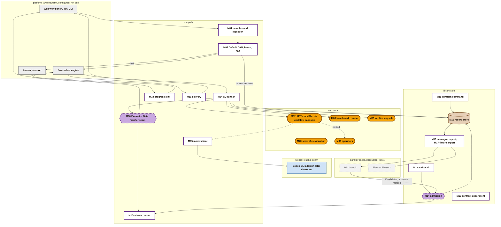
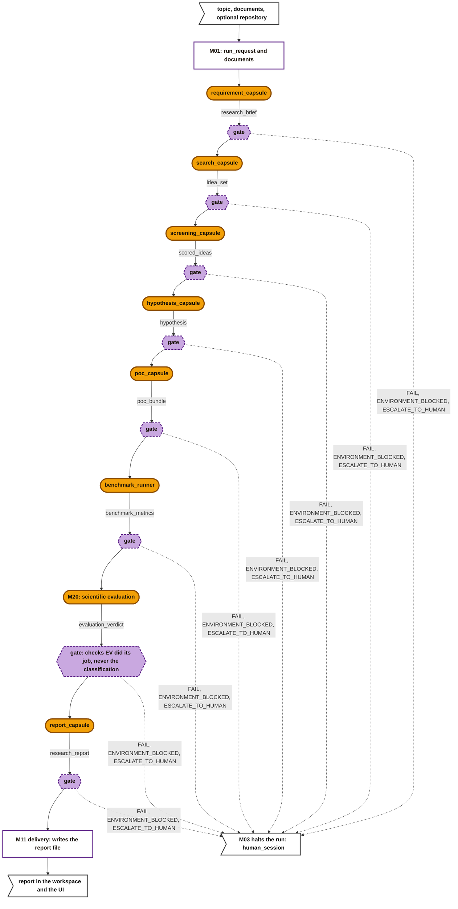
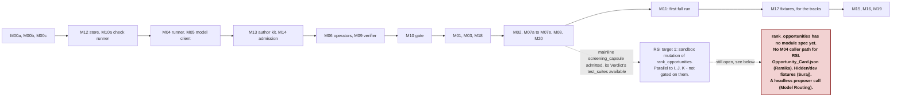

# M1 architecture: the build design

> **Draft, not yet approved.** The design a coding agent builds M1 from. It splits the PRD's M1 into modules, fixes each module's inputs, outputs and tests, and gives the build order. Each module is one issue. It replaces the [past M1 design](m1-design.md).

## How to use this document

**For the coding agent:**

- **Sources of truth.** The PRD says *what* M1 must do. This page says *which modules* do it and *how they connect*. The [capsule folder](../capsule/capsule.md) and the [schemas](../schemas/schemas.md) define every record, and [guards](../capsule/guards.md) lists the checks that keep them valid. If two of these disagree, stop and report; do not choose.
- **One issue per module.** Build each module against its interface and tests only, with fixtures standing in for its neighbours. Never depend on another module's internals ([what architecture covers](../architecture.md)).
- **Do not build what is excluded.** Each module says what it must not do. The [stages page](../capsule/stages.md) lists the schema fields M1 does not check: accept them when present, never require or act on them.
- **Working choices** are decisions made here to unblock the build. Treat them as fixed until this page changes.
- **Seam modules** belong to RSI, the Verifier or Model Routing. Their owners build them to the interface given here.

**Latest data wins.** Where the PRD and the later kickoff messages differ, this page follows the kickoff: five gate verdicts. The capsules are the PRD 4.1 list (with `requirement_capsule` among them), plus `verifier_capsule` and a code-only `benchmark_runner`.

**Runtime.** Model calls go through the Codex CLI adapter, which is being made fully usable now.

**Open by design.** Payloads fix a minimum and allow more. Registries are open lists. A capsule's model and its router are its author's business, as long as the capsule can be tested.

## The system

Grey = jiuwenswarm, used as it ships. White = our control code. Amber = capsule. Purple = a gate. Brown = records. Blue = a seam owned by another workstream. Grey dashed = a parallel track: in M1, but off the main path.

## One run, end to end

- `PASS` and `PASS_WITH_KNOWN_LIMITATIONS` continue; the other three verdicts halt.
- Each node's inputs are earlier outputs, wired by port. For example, `hypothesis_capsule` takes `idea_set` and `scored_ideas`, and `report_capsule` takes `benchmark_metrics`, `evaluation_verdict` and every earlier output.
- **PRD 3.8, Scientific Evaluation, is M20, not a change to M10 — but this is not yet the whole fix, see M20's own entry for the real gaps.** The intent: a disproven hypothesis is a *value* inside `evaluation_verdict.classification` (`FAIL` among four tags), never a gate-level `FAIL` — G6b's checks should be about whether M20 assembled and classified correctly, never about what the tag says, so M03's fixed DAG routes M20's output to `report_capsule` unconditionally like any other node. The fold mechanism itself genuinely can't be tripped by an Artifact field value (verified against `policy.md`), so that half holds. What's still open: which checks actually get bound to G6b is unenumerated, so the guarantee isn't enforced yet; and G6 (the gate right after `benchmark_runner`, before M20 runs at all) may itself judge the falsifiability comparison per PRD 3.7.4's own text, which would halt the run before M20 gets a chance to classify anything. See M20's entry for both.

## Payloads

> **Superseded in part, 2026-10-01.** Every payload type now has one definition in [`types/`](../types/types.md), and named types replace `json` ports between capsules. Rows that point there are settled; the rest are still drafts until their stage is designed.

Every payload is a `json` port whose `value_schema` is a shared JSON Schema file, pinned by hash. Producer and consumer pin the same file ([fields](../capsule/fields.md#ports-what-it-takes-and-gives)).

**Each schema is open.** It fixes the minimum fields below with their types, and allows extra fields (`additionalProperties: true`). Anything beyond the minimum belongs to the capsule's author. M00b writes these files. Named port types can come later, when a second consumer needs to match by type.

| Payload | Made by | Minimum fields |
|---|---|---|
| `intake` | M01 | **Defined only in [`types/intake.md`](../types/intake.md).** Replaces `run_request` and `documents` |
| `intent_ir` | `research.compile_intent` | **Defined only in [`types/intent-ir.md`](../types/intent-ir.md)** |
| `research_brief` | `requirement_capsule` | **Defined only in [`types/research-brief.md`](../types/research-brief.md).** |
| `idea_set` | `search_capsule` | `ideas: [{id: string, title: string, summary: string, sources: [{ref: string, locator: string}]}]`, at least one |
| `scored_ideas` | `screening_capsule` | `scores: [{idea_id: string, dimensions: {string: number}}]`; `chosen_id: string`; `rationale: string` |
| `hypothesis` | `hypothesis_capsule` | **Broken, adversarially reviewed 2026-09-30, do not build from this row.** A genuinely serious error, not just a missing field: it collapses the PRD's *claim* (the expected effect, e.g. "reduce VRAM by 40%", 3.5.1) and its *falsification threshold* (e.g. "falsified if <10%", 3.5.4) into one `comparator`+`target` pair. The PRD's own worked examples give these as two different numbers with a band between them — almost certainly where `INCONCLUSIVE`/`CONDITIONALLY_ACCEPTABLE` (3.8.5) actually live. `repository_ref` (meant to name a runnable baseline) is also hollow — a bare optional path, same problem `run_request.repository` had before, just moved; `hypothesis_capsule` (a `skill`, pinning nothing) has no way to reach a repository or ground a file:line mechanism via `op.codesearch` either, the same kind-conflict already found and fixed for M20 and not yet applied here. No sign convention or absolute/delta/relative basis exists for any metric, so `benchmark_metrics.deltas` (arithmetic difference) and this payload's thresholds can disagree in sign and nobody would notice (a 3 GB reduction on a 10 GB baseline gives `delta_value: -3`, which a `>=30` comparator reads as false). Full findings: `tundle/obby/HANDOFF.md`, 2026-09-30. |
| `poc_bundle` | `poc_capsule` | **Broken, adversarially reviewed 2026-09-30, do not build from this row.** Shape is on the right track (it correctly separates the requirements file, patch, harness and a smoke-test flag) but: `environment_config` is undefined; the bundle is not actually self-contained since the harness runs `hypothesis.baseline.repository_ref`, a path outside the zip (so it isn't reproducible the way 3.6.5 requires); nothing confirms the harness applies the patch to a *copy* rather than the user's real repository in place, which would make the "unmodified" baseline no longer unmodified on any later run; no gate check implements 3.6.5's "script bounds checking" this shape was designed to enable. Full findings: `tundle/obby/HANDOFF.md`, 2026-09-30. |
| `benchmark_metrics` | `benchmark_runner` | Redesigned 2026-09-30 from PRD 3.7.2-3.7.4, not the original flat shape, which could not represent a comparison. `seed: integer` (held constant across both runs, 3.7.2); `baseline: {metrics: [{name: string, value: number, unit: string}], stdout: string, stderr: string, exit_status: integer}`; `treatment: {same shape as baseline}`; `deltas: [{name: string, baseline_value: number, treatment_value: number, delta_value: number, unit: string}]`; `unmeasured: [string]`; `runtime_s: number` |
| `evaluation_verdict` | M20 (scientific evaluation) | `classification: "PASS", "FAIL", "INCONCLUSIVE" or "CONDITIONALLY_ACCEPTABLE"` (PRD 3.8.5 — `FAIL` here is a disproven hypothesis, a valid research outcome, never a gate halt); `evidence_complete: boolean`; `provenance_notes: [string]` (3.8.2); `plausibility_check: {plausible: boolean, rationale: string}` (3.8.3); `threshold_comparison: [{metric_name: string, target: number, comparator: string, observed: number, met: boolean}]` (3.8.4, from the pinned deterministic helper); `residual_risks: [string]`; `follow_ups: [string]` (3.8.6) |
| `research_report` | `report_capsule` | `markdown: string`; `sections: [string]`; `citations: [{ref: string, source_idea_id: string}]`; `limitations: [string]` |
| `evidence_bundle` | M10a | **Defined only in [`types/evidence-bundle.md`](../types/evidence-bundle.md)** |
| `verifier_assessment` | `verifier_capsule` | **Defined only in [`types/verifier-assessment.md`](../types/verifier-assessment.md)** |

**Caveats go in the output.** Any output can carry caveats in its Artifact's `issues` ([Artifact](../schemas/artifact.md)). `report_capsule` lists every earlier `issues` entry in `limitations`.

## The modules

Each module lists its owner, inputs and outputs, what it must do and must not do, its tests, and the modules it needs first. "CC" means this team. The checks each module hosts are in [guards](../capsule/guards.md).

**Audit status** (against PRD section 3, in [build order](#build-order); full detail in `tundle/obby/HANDOFF.md`): **audited** — M00a, M00b, M00c (batch A); M12, M10a (batch B); M04, M05 (batch C); M13, M14 (batch D). Everything else below is drafted but not yet cross-checked against the PRD text — read it as a working draft, not yet a build-from source.

### Shared content

**M00a Port type vocabulary v1.** Owner: CC.
- **Out:** the vocabulary record with the base types and the registry checks ([port types](../schemas/port-types.md)).
- **Tests:** a valid and an invalid value of each type pass and fail `check.value_matches_type.v1`.

**M00b Payload schemas.** *Retired 2026-10-01: the vocabulary builder generates each payload type's schema from its page ([toolchain](../capsule/toolchain.md#m00a-vocabulary-builder)).* Owner: CC.
- **Out:** one JSON Schema file per payload above, each with its sha256.
- **Tests:** a minimal and an extended example of each validate; each example with a required field missing fails.

**M00c Policy epochs.** Owner: CC; the reason-code owners are agreed with the Verifier.
- **Out:** development epochs during the build, each accepting the earlier ones, and `e1` for release ([policy](../schemas/policy.md)).
- **Contents:** the first-epoch values, the admission judge by name, the time budget (default 600 s, cap 1800 s, 120 s per judge call), and the reason-code owners.
- **Tests:** the lint passes; every rule has a reason code; every call-level code has an owner ([Open](#open) 2 — not yet true).

### Library side

**M12 Record store.** Owner: CC.
- **In:** any CC record or content.
- **Out:** records keyed `cc/<kind>/<scope>/<id>` under the profile root, and content keyed by sha256 ([library](../capsule/library.md#what-the-library-holds)).
- **Must:** write once; read by key and by prefix. `exclusive_set` alone cannot tell a duplicate write from a conflicting one — it returns `false` whenever the key exists, whatever the bytes are (agent-core `openjiuwen/core/foundation/store/base_kv_store.py:42`, pin `9e339019`) — so M12 reads the existing value and compares bytes before applying `guard.store.write_once`. It also checks `guard.common.envelope_shape`, `guard.common.scope_exclusive` and `guard.common.ref_integrity` on every write, `guard.store.one_writer_per_kind` at admission, and `guard.porttype.vocabulary_version_monotonic` for the port type vocabulary ([guards](../capsule/guards.md)).
- **Must not:** edit or delete.
- **Tests:** a second write of different bytes to an existing key is refused; the same bytes at the same key are a no-op; equal content bytes are stored once.

**M10a Check runner.** Owner: CC. Admission, the author kit and the gate all use it.
- **In:** a check, the values it targets, and for a judged check the judge to call.
- **Out:** `pass`, `fail` or `unknown`, with evidence and `runner_sha256` ([verification-record](../schemas/verification-record.md)).
- **Must:** run `deterministic` and `reference` checks as pinned code; run `judged` checks through the given judge via M04 (`caller: gate`, or `admission` at admission).
- **Must not:** decide a gate outcome; that is M10's job. [guards](../capsule/guards.md) lists every gate-time guard under "Check runner and gate (M10a, M10)" jointly, without splitting the two — M10a runs each check and reports its result; M10 owns the fold (`guard.verification.decision_fold_correct`) and everything downstream of it (`judge_not_self`, `one_per_dispatch`, `seb_complete`).
- **Tests:** each anchor on fixtures; an error in a check's code gives `unknown`, never `pass`.

**M13 Author kit.** Owner: CC.
- **In:** a draft Declaration, its files and tests, and the policy.
- **Out:** errors with reason codes; the computed `decl_hash`, `interface_hash` and `code_sha256`; and the generated `make_capsule.md` ([make_capsule.md](../capsule/make-capsule.md)).
- **Must:** share admission's validation and hashing code, and run the admission checks through M10a.
- **Tests:** the [example Declaration](../capsule/fields.md#example) passes; each checked rule has a fixture that fails with its code.

**M14 Admission.** Owner: CC.
- **In:** a [Candidate](../schemas/candidate.md), from an author or from the RSI branch.
- **Out:**
  - a [Verdict](../schemas/verdict.md), recording the judge in `checks_run[].judge`;
  - test cases, a visible suite, and Artifacts for test inputs;
  - the stored files;
  - a [Standing](../schemas/standing.md) entry: `admitted`, or `admitted_inactive` for an RSI child of a `propose` parent.
- **Must:**
  - follow the [admission steps](../capsule/library.md#admission-the-only-way-in);
  - run test calls through M04 as `admission` calls, and checks through M10a;
  - use the policy's admission judge, never a capsule's own `decl_hash`;
  - apply the RSI rules to RSI Candidates: `rsi_permitted`, `changes_allowed`, `rsi_cannot_grant`, `parent_admitted`, `parent_suites_pass`.
- **Must not:** certify above `provisional`. M1 has no sealed suites.
- **Admission is never automatic into the main branch.** A person reviews and merges each admitted capsule.
- **Tests:** a good Candidate is admitted; each rule's failing Candidate is refused with its code; a changed file gives `HASH_MISMATCH`; an RSI child that changes a path not in `may_change` gives `RSI_NOT_PERMITTED`.

**M15 Librarian command.** Owner: CC.
- **In:** a person's request: a name, a move (`suspect`, `deprecated`, `retired`, `revoked`, activate, or revert to an admitted version) and a reason.
- **Out:** a new Standing entry, with an `_BY_OWNER` reason or `REVERTED`.
- **Must not:** move anything on its own; leave `revoked`.
- **Tests:** a revert makes the next run pin the earlier version; a `revoked` capsule is refused at freeze.

**M16 Catalogue export.** Owner: CC. For Planner Phase 2, and the Model Routing PRD's 3.X.2 "Capsule Registry" dependency — the same list serves both; there is no second registry to build.
- **Out:** a JSON list of admitted capsules: name, summary, ports, effect class, `decl_hash`.
- **Tests:** only `admitted` versions appear.
- **What it gives a router is the Declaration's existing descriptive fields, never a dedicated model-capability field.** `fields.md`'s own rule: "There is no model field and no role field... The Declaration still describes the work in enough detail that a router could choose from it" ([capsule/fields.md#needs-what-must-hold-and-what-it-uses](../capsule/fields.md#needs-what-must-hold-and-what-it-uses)). A router works from `summary`, `ports` and the rest of what's already here — it does not get a purpose-built capability tag, and CC will not add one to suit it. See [seams](#seams-with-other-workstreams).

**M17 Fixture export.** *Retired 2026-10-01 in favour of Data Foundation's sample run export ([seams](../seams.md#data-foundation)).* Owner: CC. For the RSI branch and the RSI data foundation.
- **In:** a finished `run_id`.
- **Out:** a folder `fixtures/<run_id>/` with one subfolder per node holding `inputs/`, `outputs/`, `observation.json` and `verification.json`, plus `declarations/` and a `manifest.json` of hashes. These are the PRD's "sample DAG fixtures".
- **Tests:** replaying an export through tier 1 of M10 gives the same tier 1 results. Tier 2 calls a model, so it is not replayed.

### Run path

**M01 Launcher and ingestion.** Owner: CC. The PRD's Ingestion, and Intention Compiler Phase 1.
- **In:** a topic from the CLI or the web UI; `.txt`, `.md` and `.pdf` files in the workspace input directory; an optional repository path.
- **Out:** a `run_request` and the documents, handed to M04 to record as Artifacts with `origin: human`; then a Swarmflow run of M03 with a new `run_id`.
- **Must:** extract PDF text; map CLI and UI inputs to the DAG's run variables by template; list skipped files in `skipped`.
- **Must not:** interpret the topic. That is `requirement_capsule`'s job.
- **Tests:** each file type becomes a non-empty document; an unsupported file appears in `skipped`.
- **Builds on:** B1's [launcher](b1-design.md#the-cc-runner-how-capsules-plug-into-jiuwenswarm).

**M03 Default DAG, freeze and halt.** Owner: CC. The PRD's Planner Phase 1.
- **In:** the `run_request`; each named capsule's current Standing and Verdict; the policy; the vocabulary.
- **Out:** one [Binding](../schemas/binding.md) per node, then the Swarmflow script running the nodes in order.
- **Freeze must:**
  - bind only `admitted` capsules;
  - re-hash each capsule's code, and all the code it pins in `needs.external`, and refuse any that differs from what was admitted (`CARRIER_CHANGED`). Changed code is never bound on the hot path;
  - refuse a wiring whose output type differs from the input it feeds (`PORT_TYPE_MISMATCH`);
  - refuse a verifier that RSI may change.
- **Halt must:** on a halting verdict, end the run, and open `human_session` with the failing node's Verification. Where `human_session` is not available yet, stop and show the failure.
- **Must not:** choose capsules. The script names them. The M19 experiment passes a map from node to capsule name.
- **Tests:** a missing, revoked, changed or type-mismatched capsule stops the run before any call; a `FAIL` fixture halts at that node.

**M04 CC runner.** Owner: CC. The only way any capsule runs.
- **Four entry points:**

  | Caller | Needs a Binding | Output goes to M10 | Recorded as |
  |---|---|---|---|
  | `dispatch`: Swarmflow's `agent()` for a node | yes | yes | Observation; Verification by M10 |
  | `gate`: M10a calling the verifier | the node's Binding (`verifier`) | no | Observation |
  | `admission`: M14's test calls | no; the test case instead | no | Observation with `test_ref` |
  | `nested`: capsule code calling a capsule in its `needs.external` | the parent's Binding | no; the parent's gate covers it | Observation with the pinned `decl_hash` |

- **Must:**
  - re-hash code at load, and check `needs.when` and the input names;
  - call by kind: a `skill` becomes a model turn through M05; a `tool` is a Python call; a `prompt_section` is inserted into a skill's turn;
  - pass a nested callee the caller's `decl_hash` and declared effects;
  - stop a call at its time budget (`BUDGET_EXCEEDED`);
  - honour `needs.human_interaction` ([fields](../capsule/fields.md#needs-what-must-hold-and-what-it-uses)): `none` gets no way to reach a person; `optional` may ask through `human_session` and carries on without an answer; `blocking` waits for the answer;
  - return `{value, verdict, obs_id}` to the engine for `dispatch` calls.
- **Must not:** raise to the engine; let the engine retry; run a nested call to a capsule the caller does not pin.
- **Tests:**
  - a changed file gives `CARRIER_CHANGED`;
  - an unpinned nested call is refused with `OPERATOR_NOT_ADMITTED`;
  - a slow capsule gives `BUDGET_EXCEEDED`, never `TIMEOUT`;
  - an admission call writes no Verification.
- **Builds on:** B1's [runner](b1-design.md#the-cc-runner-how-capsules-plug-into-jiuwenswarm), whose agent-core citations are now confirmed at the real pin (`9e339019`) — see that page's Open item 8. **Genuinely new work:** checked `jiuwenswarm` at `ai4r_main_branch` `eb4c2901c` (2026-09-30) for any existing CC-runner-shaped code (`AgentBackend`, `decl_hash`, a capsule runner) — none exists yet. M04 plugs into real, existing platform hooks (Swarmflow's `agent()`, the Codex chat adapter) but has no CC-specific code to build on.
- **`blocking` human interaction is not implementable on the current runtime.** `interface_codex.py:67-70` (confirmed at `eb4c2901c`): `handle_swarmflow_reply` is aliased to `handle_user_answer`, which always returns `ok: false` with `MILESTONE_TEXT_ONLY` — there is no path back into a waiting call today. See [Open](#open) 3.

**M05 Model client.** Owner: CC; a thin helper.
- **In:** a prompt and an optional model hint from the capsule. Grounded in the real adapter (`jiuwenswarm/server/runtime/agent_adapter/interface_codex.py`, `ai4r_main_branch` `eb4c2901c`): the prompt is `params.get("query")` or `"content"`, falling back to `inputs.get("query")` (line 45); the model hint is `params.get("codex_model")`, passed straight through to `SubscriptionService.stream(session_id, request_id, text, model=None)` (`codex_subscription/service.py:131`).
- **Out:** the reply text; `model: {id, version}`; `tokens: {input, output, cache_hit}` when reported — **confirmed always absent today:** `codex_subscription/service.py` has no token accounting anywhere in it.
- **Seam with Model Routing:** the call goes to the Codex CLI adapter today, and to the router later. Where the router sits is Model Routing's decision. CC needs only that every model call can be recorded, and replayed from fixtures in tests.
- **Confirmed current scope, `interface_codex.py:38-42`:** team mode, MCP, skills, attachments, media items, images, files, plugins and agent templates are all refused with `MILESTONE_TEXT_ONLY` before a call reaches M05 — text only, matching PRD 3.0's whitelist.
- **Tests:** a reply that is not valid JSON, when JSON was asked for, is a capsule error.

**M06 Operator capsules: `op.deepsearch`, `op.codesearch`, `op.workspace_io`.** Owner: CC. `tool` capsules that wrap the deepsearch repo and workspace I/O. Other capsules pin them by `decl_hash` at admission and call them as `nested` calls.
- **In and out:**
  - `op.deepsearch`: a query and the run's documents in; ranked passages with locators out. It indexes the run's documents itself.
  - `op.codesearch`: a query and the repository in; files and line references out.
  - `op.workspace_io`: a read or write of a path.
- **Must:** `op.workspace_io` refuses any path outside the run's workspace, or outside the caller's declared `fs:` effects. On the Codex runtime nothing else enforces these ([permissions](../capsule/permissions.md#gaps-and-conflicts)).
- **Tests:** each works on a fixture corpus or repository; an out-of-bounds write is refused.

**M09 `verifier_capsule`.** Owner: CC builds it; the Verifier owns its rubric.
- **Kind:** skill, ported from `result-evaluator` and `citation-reviewer`.
- **In:** `evidence_bundle`. **Out:** `verifier_assessment`, keyed by `check_id`.
- **Must:** assess, never decide. `evolution.rsi: none`.
- **Admission:** it declares deterministic checks only (its output shape), so admitting it needs no judge.
- **Tests:** a fixture with an unsupported claim is assessed `fail` on claim-to-evidence.

**M10 Evaluator Gate.** Owner: the **Verifier (seam)**. CC supplies M10a and the inputs.
- **In:** the Stage Evidence Bundle (the output Artifacts, the Declaration, the Observation), and the Binding's checks and `verifier`.
- **Out:** a [Verification](../schemas/verification-record.md) with the decision (`pass`, `fail`, `blocked`), and one of five verdicts for M03.
- **Must:**
  - tier 1, through M10a: the deterministic and reference checks, and the fixed checks on the call's outcome and time. Tokens are recorded, not gated, until they are checked;
  - tier 2, only if tier 1 passes: the judged checks, through M10a and the verifier;
  - derive the verdict:
    - `PASS`: the decision is `pass`, and no output has `issues`.
    - `PASS_WITH_KNOWN_LIMITATIONS`: the decision is `pass`, and an output has `issues`.
    - `FAIL`: the decision is `fail`.
    - `ENVIRONMENT_BLOCKED`: the decision is `blocked`, with a `runtime`-owned reason.
    - `ESCALATE_TO_HUMAN`: any other `blocked`.
- **Must not:** halt the run or open `human_session`; M03 does.
- **Tests:** a fixture for each verdict; a capsule crash or a `BUDGET_EXCEEDED` is never `ENVIRONMENT_BLOCKED`.

**M18 Progress sink.** Owner: CC.
- **In:** engine progress events, and each gate's verdict.
- **Out:** run-tree updates in the web UI (`/swarmflows`), including failure details when a node halts.
- **Builds on:** B1's progress sink ([B1 modules](b1-design.md#the-cc-runner-how-capsules-plug-into-jiuwenswarm)).
- **Tests:** a run shows every node's verdict in order.

**M02, M07a to M07e: the six workflow capsules.** Owner: CC. One issue each.
- **Each is a Declaration, code or skill files, and test cases,** admitted through M14.
- **Ported prompts and rubrics** are copied into the capsule's own files. Each capsule sets `evolution.rsi` and `may_change`.

  | Issue | Capsule | Kind | Ported from | In | Out | Pins |
  |---|---|---|---|---|---|---|
  | M02 | `requirement_capsule` | skill | custom | `run_request`, `documents` | `research_brief` | none |
  | M07a | `search_capsule` | tool | `idea-tree-team` | `research_brief`, `documents` | `idea_set` | `op.deepsearch` |
  | M07b | `screening_capsule` | skill | `assessment-screening` | `idea_set`, `research_brief` | `scored_ideas` | none |
  | M07c | `hypothesis_capsule` | skill | `evolve-design` | `idea_set`, `scored_ideas`, `research_brief`, `documents` (added 2026-09-30: 3.5.2 locks the dataset to something ingested in 3.1, never synthesized) | `hypothesis` | none |
  | M07d | `poc_capsule` | tool | custom | `hypothesis`, `run_request`, `documents`, `research_brief` (added 2026-09-30: 3.6.1 maps ingested files/datasets and generates `requirements.txt` from the Brief's framework constraints) | `poc_bundle` | `op.codesearch`, `op.workspace_io` |
  | M07e | `report_capsule` | skill | `report-writer` | every earlier output | `research_report` | none |

  *Working choice:* a capsule that calls an operator is a `tool`. Its code makes the operator call as a `nested` call, and its model call through M05.
- **Checks per capsule:**
  - deterministic: its payload schema, plus its own rules. For example, every `idea_set` source resolves; `chosen_id` is one of the scored ideas; every `research_brief.metrics[].id` a mandatory requirement names has a matching `hypothesis.expected_metrics[].source_metric_id` (by id, not by name — matching the Brief's own `brief_matches_reference` design so a name mismatch never fails a fixture);
  - judged: its acceptance criteria, for tier 2.
- **Tests:** admitted, with at least one test case per check.

**M07d `poc_capsule`, in more detail.** PRD 3.6, all five sub-features (3.6.1-3.6.5). **Broken, adversarially reviewed 2026-09-30, do not build from this entry.** Real gaps, not polish: no pre-registered measurement function, so 3.5.5/3.6.3's "cannot alter the measurement functions" is unenforceable — the model that writes the patch can also write how it's measured; 3.6.4's output-schema-conformance half is dropped because that schema doesn't exist yet; a failed smoke test has no actual gate check routing it to triage, it's prose only; no Declaration, effect class, `evolution` or check list at all, though every other workflow capsule has one. Full findings: `tundle/obby/HANDOFF.md`, 2026-09-30.
- **Must:**
  - map `documents` and the locked `hypothesis.dataset_ref` into a standardized workspace directory, and generate `requirements_txt_ref` from `research_brief.constraints.framework` — no dynamic `pip install` at this stage, only a static file (3.6.1);
  - call `op.codesearch` to locate the exact file and line for the change `hypothesis.mechanism` describes, and generate `poc_patch_ref`: one standalone file, never a multi-file refactor (3.6.2);
  - generate `run_benchmark_ref`: one script that sequentially runs the baseline (from `hypothesis.baseline.repository_ref`, unmodified) and then the treatment (`poc_patch_ref` applied), wired to produce exactly the fields `hypothesis.dependent_vars` names, with the data flow the Blueprint specifies (3.6.3);
  - run a syntax-only check on `run_benchmark_ref` (`python -m py_compile`, nothing scientific) and set `smoke_test_passed`; a failure routes to human triage, never an autonomous repair loop (3.6.4);
  - package everything into `bundle_zip_ref` (3.6.5).
- **Must not:** alter `hypothesis.dataset_ref`, `.expected_metrics` or `.mechanism` — it reads the Blueprint, it does not rewrite it (3.5.5's role-separation rule, binding on this capsule and on M08 both); write or run any code beyond the smoke test's syntax check (3.6.4's Blacklist).
- **Tests:** a fixture `hypothesis` with a named file:line mechanism produces a patch at that location; the generated harness's baseline branch runs the unmodified fixture repository unchanged; a syntactically invalid generated harness sets `smoke_test_passed: false` and does not proceed to a repair attempt.
- **Open:** the exact `run_benchmark_ref` output schema (what it must print or write for M08 to parse) is not yet specified — needed before M08 can be finished; likely a small JSON schema of its own, following the same "declare the shape, ground it in what downstream actually reads" rule as everything else in this pass.

**M08 `benchmark_runner`.** Owner: CC. A `tool` capsule with no model. PRD 3.7, all four sub-features (3.7.1-3.7.4). **Second attempt, also broken, adversarially reviewed 2026-09-30 — do not build from this entry.** The baseline-mechanism correction (M07d's harness owns it, M08 just executes) is itself right, but: the effect-class fix below misreads `permissions.md` — enforcement happens "by the runner", which per `policy.md`'s mapping means `irreversible` is DENY on an unattended run, not "unenforced" as claimed; nothing gives `pip install` network access or an isolated environment despite 3.7.1 requiring one; the policy's 1800s call-time cap is below the Brief's own 3600s default for a single benchmark run, and M08 never reads the Brief to know its own limit anyway; no check confirms a baseline actually ran before scoring a delta. Full findings: `tundle/obby/HANDOFF.md`, 2026-09-30.
- **In:** `poc_bundle` (M07d, 3.6 — `bundle_zip_ref` to unpack, `requirements_txt_ref` to install, `run_benchmark_ref` is the one script this capsule runs), `hypothesis` (M07c, 3.5 — `dependent_vars` to parse from the harness's output).
- **Out:** `benchmark_metrics` — carries a baseline/treatment split, `stdout`/`stderr` for each, and a computed delta, because `run_benchmark_ref` (M07d's harness) produces both runs from one execution, not because M08 orchestrates two separate runs itself.
- **Must:**
  - unpack `bundle_zip_ref` into the workspace and run `pip install -r` on `requirements_txt_ref`'s content inside the isolated runtime; an install failure ends the run and routes to human triage — it does not attempt to resolve the conflict itself (3.7.1);
  - execute `run_benchmark_ref` exactly once — it is the harness M07d built to run the baseline and the treatment sequentially, with the same hardware state and seed held constant across both; M08 does not source, run, or diff a baseline separately (3.7.2, and the correction from the first attempt);
  - capture `stdout`, `stderr` and runtime telemetry from that one execution, and parse every `hypothesis.dependent_vars` entry the harness reports, per run, into a structured result — report what the numbers are, never what they mean (3.7.3);
  - compute each metric's delta (treatment minus baseline) as a plain arithmetic fact, from the two per-run results the harness's own output distinguishes. A delta is data, not a verdict — whether it passes a threshold is M20's job, never M08's (3.7.4);
  - bundle both runs' metrics, `stdout`, `stderr` and the computed deltas into one `benchmark_metrics` payload (3.7.4).
- **Must not:** apply the falsifiability rules or grade the experiment — that is 3.8/M20's job, strictly after this node (3.7.4's Blacklist, word for word: "This node strictly acts as a data collector").
- **Effect class:** `harness_command`-equivalent code (`run_benchmark_ref`) is arbitrary, written by an earlier model call, run as a subprocess with no sandbox at M1 — the "no sandbox in M1" statement lives in this page's own [Not in M1](#not-in-m1) list, not in `permissions.md`'s Gaps section (a miscitation in the first attempt, corrected here). Declaring a narrow `compensable`, `fs:workspace/runs/*` scope would understate what the subprocess can actually do. Honest declaration: `effect_class: irreversible`. **Real, unaddressed consequence:** `policy.md`'s `mappings` puts `irreversible` at `ASK, DENY when unattended` — a Swarmflow DAG run is unattended, and nothing answers an ASK on one (`permissions.md`). On the Codex runtime the permission rail is skipped entirely (`permissions.md`'s "Codex runtimes skip the whole system"), so this declaration is currently unenforced rather than fatal — but that needs to be said explicitly, not left to be discovered, since the same declaration on any future runtime that does enforce the rail would deny every benchmark call outright.
- **Open, not resolved here:** the exact schema `run_benchmark_ref` must print or write for M08 to parse (M07d's own Open item) — M08 cannot be finished until that exists; PRD 3.7.3 names jiuwenswarm's native Task Memory and Coding Memory modules as the capture mechanism, this design uses M12 instead, unsettled since 2026-09-28 (see [Open](#open) item 6).
- **Tests:** a fixture `run_benchmark_ref` with known baseline and treatment outputs produces the correct delta; an install failure routes to human triage, not a silent skip; a dependent variable `hypothesis` names but the harness's output never reports is listed in `unmeasured`, per run; a hanging execution gives `BUDGET_EXCEEDED`.

**M20 Scientific evaluation capsule.** Owner: CC builds it; the Verifier owns its rubric. PRD 3.8, all six sub-features (3.8.1-3.8.6). Reverses the earlier "build on existing structure, no new module" call — see [Open](#open) 5. **Draft, adversarially reviewed 2026-09-30, real gaps found and listed below — do not build from this entry yet.** The core mechanism (a scientific `FAIL` is a data value, never a gate-level check failure) is verified sound at the fold level; everything else here is honest about what still doesn't work.
- **Kind:** `tool`, not `skill` — the working choice (above, "a capsule that calls an operator is a `tool`. Its code makes the operator call as a `nested` call, and its model call through M05") applies here the same as anywhere else: M20 needs both a model call (the plausibility check, 3.8.3) and a nested call to a pinned deterministic helper, and only `tool` code can make a nested call at all. Ported from `sciencediscovery/result-evaluator` and `citation-reviewer` (the PRD's own architectural note for 3.8 names the same lineage M09 uses; M20 is a separate capsule identity from M09, a `dispatch` node in the DAG, not the generic `gate`-caller tier-2 judge — **this is a departure from the PRD's literal text, which says all of 3.8 runs inside `verifier_capsule.md`; flagged for the PRD owner, not decided unilaterally here, same as Open 1 does for the capsule count**).
- **In:** `benchmark_metrics` (M08, 3.7 — **marked broken**, see its own entry), `hypothesis` (M07c, 3.5 — **also marked broken**: `expected_metrics[].comparator`/`.target` exist, but collapse the PRD's claim and falsification threshold into one number, losing the band `INCONCLUSIVE`/`CONDITIONALLY_ACCEPTABLE` need), `research_brief` (M02, 3.2). **M20's own Must below is missing a 3.8.5 classification bullet and a 3.8.1 evidence-binding bullet** (found on the same review pass) — this entry needs another editing pass, not just its upstream dependencies.
- **Out:** `evaluation_verdict`.
- **Must:** confirm every `hypothesis.dependent_vars` entry has a matching, non-null `benchmark_metrics.deltas` entry (3.8.2); audit `benchmark_metrics.baseline.stdout`/`.stderr` and `.treatment.stdout`/`.stderr` to confirm metric values trace back to real execution output, not hallucinated text (3.8.2); run one single-turn plausibility check on `benchmark_metrics.deltas` — a physically impossible value (a >100% reduction, negative memory) is flagged, not silently classified (3.8.3); compare each `benchmark_metrics.deltas` entry against its matching `hypothesis.expected_metrics[].comparator`/`.target` (joined by `source_metric_id`/name) via a pinned deterministic helper, `compare_to_thresholds` — **the helper itself still has no module entry, the same gap as `rank_opportunities`** (3.8.4); record residual risks and follow-ups as text, never patching code or rerunning a node (3.8.6).
- **Must not:** decide whether the run halts — but this guarantee is **not yet enforced, only intended.** The gate fold mechanism itself cannot read an Artifact's field values (verified against `policy.md`'s Fold steps), so a validly-classified `FAIL` cannot trip it directly — but any check actually bound to G6b *can* read `evaluation_verdict.classification`, and nothing today stops one from being bound. This page's own test list below already blurs the line (see next bullet). **Open, not resolved:** enumerate exactly which checks G6b runs, and add a rule — a guard or a policy rule — that none of them may read `classification`, the pass/fail margin, or the threshold-comparison outcome.
- **Separate, upstream risk not fixed by M20 at all:** PRD 3.7.4 describes the Evaluator Gate's own tier-2 verifier "compar[ing] empirical performance deltas and the pre-registered falsifiability thresholds" — if G6 (the gate right after `benchmark_runner`, before M20 even runs) does this comparison as a judged check, a disproven hypothesis can halt the run at G6, before M20 gets the chance to classify it as a valid scientific `FAIL`. Nothing in this design currently prevents that. Needs its own fix, not assumed solved by M20 existing.
- **Tests:** dependent-variable completeness, the `stdout`/`stderr` provenance audit, the plausibility check on a fixture with an impossible delta, the threshold comparison (now that `hypothesis` carries a comparator), and follow-up recording are all specifiable against fixtures. None can actually run yet — `compare_to_thresholds` has no module entry, and M08 (the real source of `benchmark_metrics`) is marked broken. Fixture-level tests can still be written against the schemas alone, ahead of either being fixed.

**M11 Delivery.** Owner: CC.
- **In:** the checked `research_report`.
- **Out:** the report written to `outputs/<run_id>/report.md` in the workspace; the run's final answer in the UI, naming the file and every `PASS_WITH_KNOWN_LIMITATIONS` node.
- **Tests:** the file exists, and matches `research_report.markdown`.

**M19 Contract experiment.** Owner: CC. The PRD's CC M1 state.
- **In:** a fixed prompt set.
- **Out:** runs in two arms, and a comparison of verdicts, halts, time and report quality.
  - **with:** the M02 and M07 capsules;
  - **without:** a second set under their own names (such as `screening_capsule_bare`), with a `text` payload, one minimal output check, and one judged check against the Brief.
- **Must:** run each arm through M03 with its own node-to-capsule map; share runs with the Verifier's benchmark.
- **Tests:** both arms run end to end on one prompt.

## Seams with other workstreams

| Workstream | Owner | Interface | This page's side |
|---|---|---|---|
| Model Routing | Xiaoyang | a model call that can be recorded and replayed; the Codex CLI integration, which is the PRD's first step. **CC is in charge of the capsule side of this seam**: M05 calls the adapter, M16 is the one Capsule Registry the router reads (name, summary, ports, effect class, `decl_hash`). There is no dedicated model-capability field — `fields.md`'s rule is that a router works from the Declaration's existing descriptive fields, never a purpose-built tag; CC will not add one. **Unresolved, not CC's to invent:** the Model Routing PRD's 3.X.2 names routing for "Planner, Coder, and Reviewer roles" — none of those names match any of the M1 workflow, benchmark or verifier capsules (`requirement_capsule`, `search_capsule`, `screening_capsule`, `hypothesis_capsule`, `poc_capsule`, `benchmark_runner`, `report_capsule`, `verifier_capsule`), nor the M06 operators or M19's bare-arm capsules. Muk confirmed 09-30 this is about M1's own model-using capsules, not the team's coding process — so the PRD's role vocabulary needs mapping onto real capsule names, or dropping; that mapping is the Router PRD owner's to make, not assumed here. | M05 calls it; M16 serves it |
| Verifier | Ramika | M10: the Stage Evidence Bundle in; the decision and one of five verdicts out; the reason-code owners; `verifier_capsule`'s rubric | M04, M10a and M09 are built by CC |
| RSI | Saurav | works on its own branch, against a sandbox copy with `evolution.rsi: propose` that never goes through mainline admission. It reads the mainline Verdict's `test_suites` (not M17's fixtures — that dependency is soft, see [build order](#build-order)) and submits Candidates (`submitted_by.kind: rsi`) to M14 for the capsules it actually promotes | M14 checks them; a person merges; nothing is admitted automatically |
| RSI data foundation | Suraj | fixtures in M17's layout and the [test case](../schemas/checks.md) format | M14 stores them |
| Verifier fine-tuning | James | a new `verifier_capsule` version, submitted by a person | M14 admits it |
| Planner Phase 2, Leader Agent, Code Mode | Planner and Builder tracks | M16's catalogue; M17's fixtures | read only |

## Not in M1

- **Kinds:** `mcp`, `a2a`, `subagent`, `agent_template` and `composite` capsules. Importing outside capabilities.
- **Selection:** search and ranking.
- **Library automation:** certification above `provisional`; automatic Standing moves; drift and quality monitoring; publishing to a store.
- **Run control:** retries and repair loops; adding or removing capsules mid-run.
- **Sandboxing** of capsule code.
- **Token gates,** until the adapter reports tokens and they are checked.

The parallel tracks *are* in M1, but decoupled: they work on fixtures and meet the main path only through admission and M16.

## Build order

- **M17 ships right after the first full run,** so the parallel tracks get sample fixtures early for the general case. Until then they can use B1's run.
- **RSI's target 1 does not need M17 or the first full run (M11)** — no dependency the RSI design states for target 1 names either as a hard gate (checked against `rsi-3y-full.md` and `PRD - RSI_completed.txt` directly). But it is not down to one blocker, and the `screening_capsule` dependency below was wrong in an earlier version of this note — corrected after review:
  - **What it needs from mainline is not an admitted RSI Candidate.** `screening_capsule` itself is `evolution.rsi: propose` (that is target 2's territory). Target 1's mutation target is narrower: `rank_opportunities`, the pure helper nested inside it, which stays `evolution.rsi: none` in the mainline Declaration — `rsi_permitted` refuses an RSI child of a `none` parent, so RSI never proposes against the helper through mainline admission at all. What target 1 actually needs is a mainline `rank_opportunities` with its own Declaration (`none`), code, tier 1 checks, visible suite and Verdict — plus a sandbox copy of that same helper, whose Declaration is set to `propose` with `may_change` limited to the code file. The parent's Verdict `test_suites` run in the sandbox as compatibility tests; the copy never reaches mainline admission, so `parent_suites_pass` does not apply to target 1 in M1.
  - **Not specced anywhere yet: `rank_opportunities` itself.** It has no Declaration, code file, tier 1 checks or visible suite on this page or in `m1/order.md`, only a name in this diagram. It needs writing, most naturally alongside a proper `screening_capsule` design page (the next one after `requirement_capsule`, per `m1/order.md`).
  - **Not built anywhere yet: a way to run it.** M04 (batch C, audited) has exactly four callers — `dispatch`, `gate`, `admission`, `nested` — none for RSI. `rsi-3y-full.md` says RSI may ship its own thin hook if needed, so this is plausibly RSI's build rather than M04's, but it doesn't exist yet either way.
  - **Genuinely someone else's, still missing:** the `Opportunity_Card.json` schema (Ramika, PRD 3.4.7), hidden and dev fixtures with known-good picks (Suraj), and the headless proposer model call (Model Routing).
  - **The admission rules exist only as specification, not as enforced code.** `changes_allowed`, `parent_suites_pass`, `rsi_permitted`, `rsi_cannot_grant` are correctly documented in `policy.md` and in M14's spec (confirmed by batch D's audit) — but the RSI PRD itself still calls them "draft," and nothing runs them yet. Audited-as-documented is not the same as built.
- **Each box is one or more issues,** each built and tested against its interface alone.
- **This graph is a build (code) dependency order — the audit is now deviating from it on purpose.** An independent review (2026-09-30) found that every module audited so far (batches A-E: boxes A through part of E) is CC's own infrastructure, and nothing that maps to a PRD stage has actually been checked against the PRD text. Box H (the modules that carry the PRD's substance: M01, M02, M07a-e, M08, M20) is now next for audit, ahead of finishing F and moving to G/I/J/K as code-build order alone would suggest — the build order itself is unchanged, since those PRD-bearing modules still can't be coded before F's gate exists.

## Open

1. **The five workflow capsules.** The kickoff counts "5 workflow + 1 verifier". This page follows PRD 4.1's six. Confirm with the PRD owner.
2. **Four call/gate-level reason codes have no owner, though `guard.observation.reason_owner_known` requires one for every `blocked` Observation.** Found auditing M00c against [guards](../capsule/guards.md): `SCHEMA_NONCONFORMANT` (raised at each call by `guard.declaration.kind_known`, and by several Observation/Artifact shape guards, not only at admission), `HASH_MISMATCH` (raised at each call by `guard.artifact.content_sha256_correct`, on an Artifact's own content — distinct from the carrier-hash case, which already renames to the owned `CARRIER_CHANGED` at load), `OPERATOR_NOT_ADMITTED` (raised at each call by `guard.declaration.external_admitted_and_pinned`), and `JUDGE_IS_SELF` (raised at gate time by `guard.verification.judge_not_self`). Agree owners for these with the Verifier; `BUDGET_EXCEEDED` itself is already owned (`capsule`), so it is these four, not it, that are open.
3. **`blocking` human interaction and the time budget.** Does waiting for a person count against a call's time budget, and what happens on the Codex runtime while `human_session` has no reply path? All six M1 workflow capsules can be `none` until this is settled.
4. **DeepSearch's own model endpoint and index.** To confirm with the deepsearch repo. They sit inside `op.deepsearch` either way.
6. **Task Memory and Coding Memory vs. M12.** PRD 3.7.3 (and 3.1.4) name jiuwenswarm's native Task Memory and Coding Memory modules as the capture mechanism for run telemetry and provenance. This design uses CC's own M12 record store instead. Raised once, 2026-09-28 ("no custom database schema"), never settled here since. Whether M12 satisfies the PRD's "durably capture" in the native-module sense, or M01/M08 need to also write through Task/Coding Memory, is the PRD owner's call.
5. **PRD 3.8, reversed 2026-09-30, still a draft.** An earlier call (see `tundle/obby/Directives.md`, 2026-09-30) deferred Scientific Evaluation on the premise that M09/M10 already had the data and the ability to cover it. An independent review of the whole design against the PRD showed that premise was false; a second, adversarial review of the M20 fix that followed found the fix itself isn't finished either. What's actually settled: the gate fold mechanism can't be tripped by an Artifact field value, so "a scientific FAIL is data, not a check failure" is mechanically possible. Status by sub-blocker: (a) **schema resolved, module still broken** — `benchmark_metrics`'s shape carries `stdout`/`stderr` and a delta, so 3.8.2/3.8.3 have something to read against, but M08 itself (which produces this payload) got the baseline mechanism wrong and is marked broken, not built from; (b) **resolved 2026-09-30** — `hypothesis.expected_metrics` now carries `comparator`/`target`, so 3.8.4 has something to compare against; (c) which checks G6b actually runs is still unenumerated, so "never reads the classification" is intention, not an enforced rule; (d) G6, the gate immediately after `benchmark_runner` and before M20 ever runs, may itself judge falsifiability per PRD 3.7.4's own text and halt the run before M20 exists — a separate fix, not covered by M20 at all; (e) `compare_to_thresholds` still has no module entry, the same gap as `rank_opportunities`; (f) `report_capsule`/M11 aren't required to surface `evaluation_verdict.classification`, so a FAIL could reach Delivery and still go unexplained to the user. Exact `INCONCLUSIVE` vs. `CONDITIONALLY_ACCEPTABLE` thresholds are Ramika's to set once (a), (c) and (e) are resolved.
