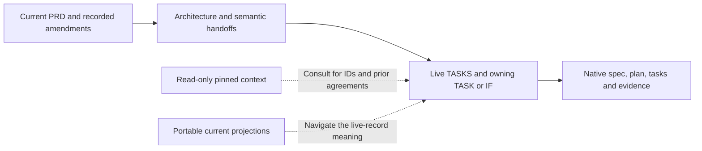

# Read this package, then use the live coding authorities

**This folder contains the complete design reading set.** Start at [the overview](README.md), then [TRIAL-1](immediate-plan.md), [contract shapes](contracts-and-native-reuse.md), [guard assignment and review disclosure](guard-design.md), [phase/stage exits](delivery-phases.md) and [failure routing](failure-and-human.md). The latest received PRD and recorded decisions govern current product behavior. Source snapshots preserve context; they are not another executable specification or approval system.

| Information / authority | Portable reading | Live location in the target-main checkout |
|---|---|---|
| Current product behavior | [Latest received PRD](sources/product/prd-m1-current-2026-10-06.txt), [source index](sources/product/README.md), [decisions](principles.md#decisions-and-source-amendments) | This package's registered PRD and architecture revision |
| Current design-to-owner mapping | [Clause allocation](coverage-allocation.md), [complete stages](delivery-phases.md) | Canonical program register below owns allocation; this map owns no ACs |
| Canonical program register, including the trial | [Current register projection](sources/live-program/TASKS.md) | `docs/code/Missions/M1/TASKS.md` |
| TRIAL-1 identity and interface | [Current TASK projection](sources/live-program/TRIAL-1/TASK.md) | `docs/code/Missions/M1/TRIAL-1/TASK.md`; feature directory is the same directory; spec/plan/tasks are NOT_GENERATED |
| Existing task/AC/IF context | [Pinned main register](sources/main-baseline/docs/code/Missions/M1/TASKS.md) and its complete linked task/spec/plan/work context | Existing M1-001–019 and M1-SYSTEM records; preserve IDs and reconcile source before affected implementation |
| Coding process | [Target-main Code SOP](sources/main-baseline/docs/code/Code_SOP.md), [plugin workflow](sources/main-baseline/docs/code/SPEC_KIT_WORKFLOW.md), [verification method](sources/main-baseline/docs/code/VERIFICATION.md) | `docs/code/Code_SOP.md`, `docs/code/SPEC_KIT_WORKFLOW.md`, `docs/code/VERIFICATION.md`; plugin stays unchanged |
| Constitution | [Pinned constitution](sources/main-baseline/.specify/memory/constitution.md) | `.specify/memory/constitution.md` |
| Native reuse evidence | [Inspected interfaces and limits](contracts-and-native-reuse.md), [pinned source observations](sources/native-reuse-evidence.json) | Dependency pin and source files recorded in the evidence; source availability is not runtime compatibility |

Required reading depends on the assigned responsibility; no implementer needs to read all historical native artifacts before specifying the trial. The pinned main program uses an older product capture. Its scope labels and pending design entries are historical context until the owning native artifacts are reconciled. Current decisions and phase labels take precedence. Do not implement an old AC literally when it contradicts the newly registered source; update it in its owning native feature, retain identity and invalidate affected evidence.

Portable register/TASK copies have rebased links and both source and projection hashes. They are generated views of live records, never independently edited authorities. Target-main snapshots retain their original directory layout and bytes; their links resolve within this folder. Folder Git attributes preserve exact bytes across platforms; canonical projected records use LF in the checkout. Their exact commit/origin is recorded in [the manifest](package-manifest.json). Older architecture under `old/` is outside the active reading set.

Architecture fixes semantic responsibilities, meaningful inputs/outputs, authority, trust boundaries and failure outcomes. Spec Kit supplies exact serialization, APIs, algorithms, prompts, supported confinement realization, limits, measured thresholds and implementation evidence. These are deliberate owning-task decisions, not missing permission to bypass the architecture. [Scenario review](usage-scenarios.md) distinguishes designed outcomes from unrun proof.

Run `python _tools/check_package.py` from a copied folder for standalone closure. Add `--repo <target-main-checkout>` for live authority, projection and pinned Git provenance checks. The checker is read-only; a document pass is not a runtime or scientific pass. Optional external citations in received bibliography remain optional source references, not required offline design inputs.
