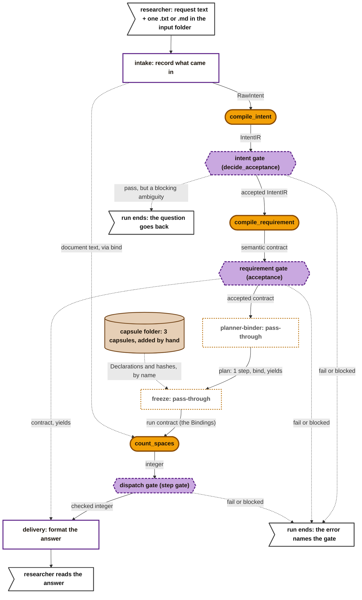
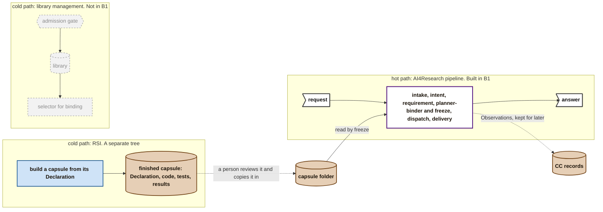
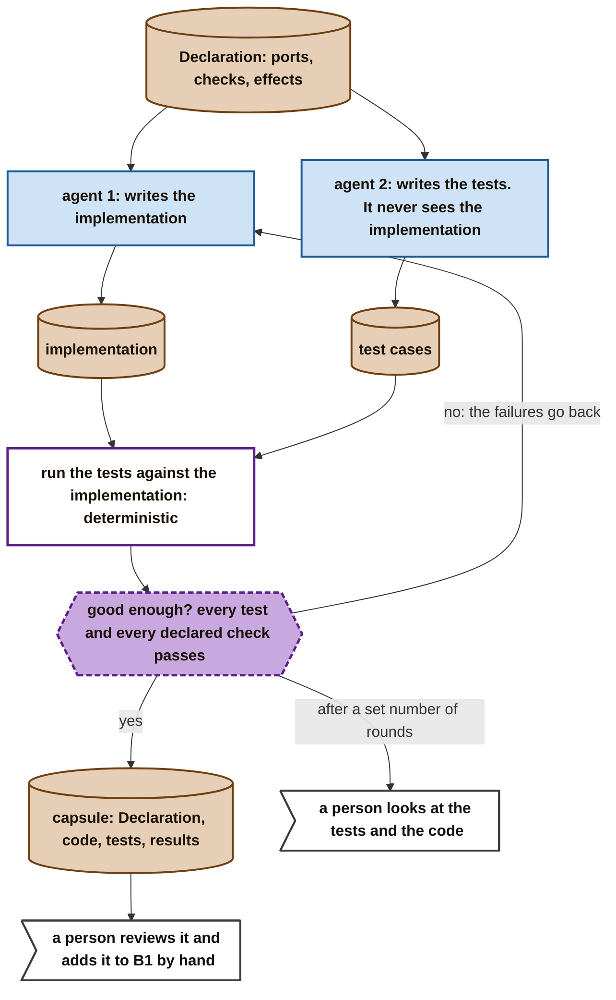
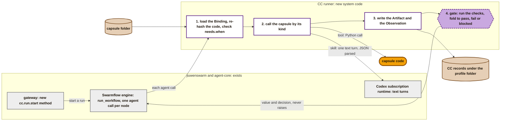
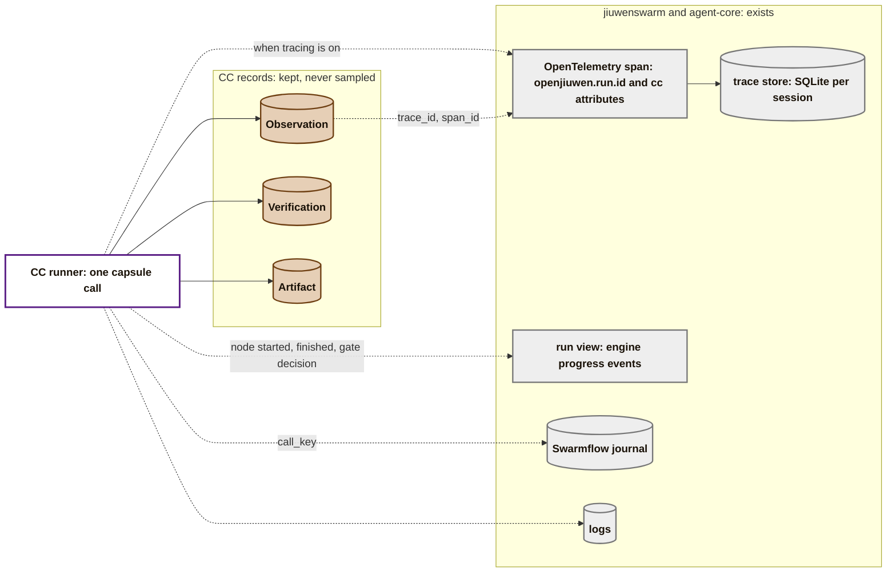

# B1: the first working pipeline

> **Preliminary design, open to change.** B1 is the earliest form of the system. It has the same components as the full workflow, but every step is general except one: dispatch runs a single task-specific capsule, `count_spaces`. The task is deliberately trivial so that B1 proves the pipeline itself, from intake to delivery.

**What B1 is:**

- **One straight line.** Every node runs once, in a fixed order: no branching, no retries, no repair loops. The CC backend never raises, so the engine's own retries never fire.
- **The same components as the full workflow:** intake, intent compilation, requirement compilation, planner-binder, freeze, dispatch and delivery.
  - Planner-binder and freeze are **pass-throughs**: they make no choices. There is no library, no selector for binding and no planner. So there is also no admission gate: a person adds each capsule to a fixed capsule folder by hand (see [How capsules get into B1](#how-capsules-get-into-b1-by-hand)).
- **A capsule and a gate where work is done.**
  - A **capability capsule (CC)** makes one object and decides nothing. It is a model call with deterministic post-checks, or plain code for a pure task.
  - A **gate** is deterministic code. It checks that object and decides whether the run goes on.
- **A gate that does not pass stops the run.** The run ends with the failed gate named in the error. Where the person sees it is open (question 3).
- **An unclear request is not a failure.** If the accepted IntentIR has a blocking ambiguity, control code ends the run with a clarify message that quotes the question. The fault is the input's, not the system's.

**Only dispatch is task-specific.** To swap `count_spaces` for another capsule, you change the allowed-capsule list in the policy, the capsule folder and the step's checks. The stage code stays the same. The research stages (search, screening, hypothesis, POC, benchmark, report) come later as dispatch capsules; see [the M1 design](m1-design.md).

**What goes in and out is known; how each capsule works inside is not.** A capsule's job may grow. In the original workflow, intent compilation was several modules: normalise, compile, an independent fidelity review, then the acceptance gate. B1 starts it as one capsule and one gate, and the capsule's ports fix what goes in and out, so its inside can change later.

## The pipeline

**Key** (as in the M1 map): amber stadium = a capability capsule. Purple dashed hexagon = a gate: deterministic code that decides. White box, purple border = control code. White box, dashed orange border = a pass-through that makes no choices. Brown = an object or the capsule folder. White flag = the researcher.

The gates are drawn as separate nodes because they are separate modules. In the code they run inside the CC backend, right after the runner.

## Inside a capsule and its gate

```mermaid
flowchart LR
    IN["input object"]:::rec --> RN["runner: checks hashes and needs.when, then calls"]:::ctrl
    subgraph CAP["capability capsule: makes the object, decides nothing"]
        M["the work: a model call with the output schema, or plain code"]:::cc --> POST["post-checks: deterministic, only add issues"]:::cc
    end
    RN --> M
    POST --> OBJ["output object + Observation"]:::rec
    OBJ --> G{{"gate: Binding checks, then call checks"}}:::gate
    G -->|"pass"| NEXT["next node"]:::ctrl
    G -->|"fail or blocked"| STOP>"run ends"]:::ext

    classDef cc fill:#F2A007,stroke:#8A4B00,stroke-width:3px,color:#1a1208,font-weight:bold
    classDef gate fill:#C9A8E0,stroke:#5B1F86,stroke-width:2.5px,stroke-dasharray:6 3,color:#1a1208,font-weight:bold
    classDef ctrl fill:#ffffff,stroke:#5B1F86,stroke-width:2.5px,color:#1a1208,font-weight:bold
    classDef rec fill:#E6CFB6,stroke:#6E3F12,stroke-width:2px,color:#1a1208,font-weight:bold
    classDef ext fill:#ffffff,stroke:#3b3b3b,stroke-width:2px,color:#111111,font-weight:bold
```

- **The runner** checks the code against its hashes and the Declaration's preconditions (`needs.when`) before the call. The capsule does not.
- **The capsule** always returns an object that matches its output port. If the input is unclear, it says so inside the object (an ambiguity, an unknown) rather than failing. A failed post-check adds an entry to the output's `issues`; it never repairs and never stops the call. *(Proposed: INV-19 and `issues` are not yet checked.)*
- **The gate** runs the Binding's `checks`: the capsule's, the output type's and the step's, those that apply at `node`. Then it runs its fixed checks on the call (it ended ok, it stayed within budget). It folds them into `pass`, `fail` or `blocked`. Anything but `pass` stops the run. B1's gates are this deterministic tier only. The PRD's second tier, an LLM judge, comes after B1.

## How capsules get into B1: by hand

The full system has three loops, like three clocks running at different speeds:

- **The hot path** is the AI4Research pipeline: one request, intake to delivery. B1 builds this.
- **The RSI cold path** builds and improves capsules, away from any run.
- **The library cold path** admits capsules, keeps the library, and selects capsules for binding.

In the full system, the library is the middle where the three loops meet. **B1 has no middle.** There is no library, no admission gate, no selector and no planner. So nothing connects the loops: a person moves a finished capsule into B1 by hand. This is deliberate for the earliest form.

Grey dashed = not built in B1. Blue = an agent in the RSI tree.

### The RSI tree: from a Declaration to a capsule

This runs outside B1, in its own tree. One way it could work:

- **The Declaration comes first.** It fixes the ports, the checks and the effects, so both agents work to the same spec.
- **Two agents, kept apart.** One writes the code and one writes the tests. The test writer never sees the code, so the capsule is not its own judge.
- **The loop is deterministic.** Running the tests decides; no model judges the result. Failures go back to the implementer, and a set number of rounds stops the loop and hands it to a person. That person may find the tests themselves are wrong.
- **The output is what a Candidate will hold** (Declaration, files, tests), so the same capsule can later go through admission unchanged, once the library exists.

### What adding a capsule by hand means

- A person copies the capsule's Declaration, code and tests into the capsule folder, and runs its tests once.
- Freeze reads the Declaration and hashes from the folder by name, and pins them in the Binding. The runner still re-hashes the code before every call, so a file changed after it was added is refused.
- There is no Verdict, because nothing admits the capsule. The Binding schema requires one today; see question 1.
- **One policy file** holds the gates' fold, the time budget per call, the effect-class mappings, the registries and the allowed-capsule list.

## The nodes

| Node | Kind | In | Out | The gate passes when |
|---|---|---|---|---|
| intake | control code | the request text; one `.txt` or `.md` file from the workspace input directory | RawIntent (the request text), and the document as a `text` Artifact | (no gate: intake only records what came in) |
| `compile_intent` | CC, model | RawIntent | IntentIR: goals, outcomes, constraints, ambiguities, unknowns | the IR matches its schema; every goal, outcome, constraint and ambiguity has at least one source span, and each span is a non-empty range inside the RawIntent text (unknowns have no spans: nobody stated them) |
| `compile_requirement` | CC, model | accepted IntentIR; the allowed-capsule list from the policy | semantic contract: what is wanted (`count`: `integer`), what is given (`document`: `text`), the capsule allowed to produce it, and requirements, each with check ids and `source_refs` to IntentIR goals | the contract matches its schema; every IntentIR goal id appears in some requirement's `source_refs`; the capsule it names is on the list; the `want` and `given` types equal that capsule's output and input port types; every check id it names exists and applies at `node` or `both` |
| planner-binder | control code, pass-through | accepted contract | plan: one step naming the contract's capsule, with `bind: [{input: text, from: given.document}]` and `yields: [{want: count, from: step.count}]` | (no gate: it decides nothing) |
| freeze | control code, pass-through | plan | run contract (the Bindings): the capsule's `decl_hash` and `code_sha256` from the capsule folder, its checks, budget and policy | (no gate, but it refuses a capsule name that is not in the folder, or whose files do not match their hashes) |
| `count_spaces` | CC, pure code | the document text, through `bind` | integer: the number of U+0020 characters | the value is an integer, 0 or more and at most the text's length; it passes the checks the contract named |
| delivery | control code | the checked integer, found through the plan's `yields`; the contract | the answer shown to the researcher | (no gate) |

- **Control code fills the references.** After the requirement gate passes, control code sets each `given[].artifact_ref` from intake's Artifacts. The model names only `given[].name` and `type`.
- **Why `count_spaces` is a capsule.** It shows that a capsule need not use a model. It is pure code (`effect_class: pure`), with typed ports and a check, pinned and recorded like any other capsule.
- **Why intent and requirement compilation are general.** They turn any request into an IntentIR and a contract. Only the contract's content ("count the spaces in this document") is specific to the task.

## The CC runner: how capsules plug into jiuwenswarm

**The CC runner is system code, not a capsule.** It serves the capsules: it is the only way a capsule runs inside the jiuwenswarm codebase. It does not exist yet, and B1 needs it. Everything around it already exists.

It plugs in through one existing interface. agent-core's Swarmflow engine runs a script and hands every `agent()` call to a backend (`AgentBackend`). The CC runner is that backend. So the engine drives the pipeline, and the runner handles each capsule call.

**Key:** grey = jiuwenswarm or agent-core, already built. White with purple = the CC runner, new. Purple dashed = the gate. Amber = capsule code. Brown = stored objects.

**What the runner does on every call:**

1. **Pin.** It loads the node's Binding from the run contract and re-hashes the capsule's code against `code_sha256`. A mismatch refuses the call. It checks the capsule's preconditions (`needs.when`).
2. **Call.** It calls the capsule through the handler for its `kind` (below).
3. **Record.** It stores the output as an Artifact and writes an Observation: outcome, model, time.
4. **Gate.** It runs the gate and returns the value and the decision to the engine. It never raises, so the engine never retries on its own. The script ends the run on anything but `pass`.

**One handler per kind.** What the runner can do for a capsule depends on the capsule's `kind` field. Each kind has its own handler, and a handler gives the runner the capabilities that kind needs. B1 builds two.

| `kind` | The handler gives the runner | M1 |
|---|---|---|
| `skill` | a model turn: the capsule's files plus its inputs as the prompt, its output schema as the reply format, JSON parsed from the reply | checked; built in B1 |
| `tool` | a Python call to the pinned code, with typed inputs and outputs | checked; built in B1 |
| `prompt_section` | text inserted into another capsule's model turn | checked; not needed in B1 |
| `mcp`, `a2a` | a call to a remote MCP tool or A2A agent, pinned by endpoint and version | unchecked |
| `subagent`, `agent_template` | starting an agent for one task | unchecked |
| `composite` | running member capsules as `structure` and `wiring` say | unchecked |

A new kind means a new handler in the runner. The capsules, the gate and the pipeline stay the same.

**The modules to build.** Each is one issue, with fixed inputs and outputs (see [What architecture covers](architecture.md)):

| Module | In | Out |
|---|---|---|
| launcher | a request from the gateway | a Swarmflow run of the fixed script, with a fresh `run_id` |
| runner backend | one `agent()` call: node name, inputs | the value and the gate's decision |
| kind handlers: `skill`, `tool` | a pinned capsule and its inputs | its output, or a declared failure |
| capsule folder loader | a capsule name | its Declaration and code, checked by hash |
| model adapter | a prompt and an output schema | JSON parsed from one Codex text turn |
| gate | the output Artifact, the Observation, the Binding's checks | a Verification: `pass`, `fail` or `blocked` |
| record writer | Artifacts, Observations, Verifications | files under the profile folder |

## Observability and traces

**What we imagine.** There are two layers, joined by ids:

- **CC records: the source of truth.** Every capsule call writes an Observation, every gate a Verification, and every value an Artifact. Each Binding is kept. Records are never sampled and never expire. They answer "what ran, on which exact code, with what result", and they are what RSI, the librarian and benchmarking read later.
- **Traces: for debugging.** The runner opens one OpenTelemetry span per capsule call, using agent-core's span conventions. The span carries our `run_id` as `openjiuwen.run.id`, plus `cc.obs_id`, `cc.decl_hash`, `cc.caller` and `cc.outcome`. The Observation keeps the span's `trace_id` and `span_id` (unchecked at M1). Spans can be sampled and can expire. They link to records; they never replace them.

**The connectors, and where they plug in:**

| Connector | jiuwenswarm or agent-core side | What the CC side sends | B1 |
|---|---|---|---|
| Records | files under the profile folder (`JIUWENSWARM_DATA_DIR`), beside jiuwenswarm's sessions and logs | Observations, Verifications, Artifacts, Bindings, keyed by `run_id` | needed |
| Traces | agent-core span conventions (`extensions/observability/semconv.py`, `openjiuwen.run.id`); jiuwenswarm's trace store keeps OTLP spans in SQLite per session (`jiuwenswarm/observability/store.py:388`) | one span per capsule call, with `cc.*` attributes | optional. The store is fed from the harness path (`agents/harness/agent_observability.py:125`); whether the Codex path produces spans is open |
| Run view | the engine's `progress_sink` (`engine/runner.py`); jiuwenswarm's workflow monitor takes team events | node started or finished, and each gate's decision | open: a non-team run may need its own view |
| Journal | the Swarmflow journal, set per run with `journal_path` | the engine writes it; each Observation keeps the engine's `call_key` in `ext` so the two join | needed, for replay |
| Model usage | the Codex service reads no token usage today | Observation `cost.time_s`; `cost.tokens` stays empty | time only |

## How B1 fits jiuwenswarm

| B1 piece | In jiuwenswarm or agent-core | Status |
|---|---|---|
| The pipeline | a Swarmflow script run by agent-core `run_workflow(path, backend=...)`, one `agent()` call per capsule, a fresh `run_id` per launch | the engine exists; nothing calls it this way yet |
| Capsule calls | CC's runner as the engine's `AgentBackend`. The capsule name and input references travel in `options`, declared in the backend's `KNOWN_OPTIONS`. `compile_intent` and `compile_requirement` are one model turn each; `count_spaces` is a Python call | new backend on an existing interface |
| Gates | inside the CC backend, right after the runner writes the Observation. The backend returns the value and the gate's decision, and never raises. The script raises when `agent()` returns `None` or the decision is not `pass` | new |
| The model | one model through the Codex subscription runtime, which is text-only. Each call is a text turn on a new session through `SubscriptionService.stream`; the backend parses JSON from the reply and the engine validates it against the schema. The text/JSON port proposed in AI4R-001 is the clean version | works now as text turns; the port is proposed |
| The document | read by intake from the workspace input directory. Chat attachments are refused on this runtime | new |
| Stopping | the script raises and the run ends with the gate named in the error. `human_session` needs a backend with sessions; only the team backend has one, and this runtime does not start it | B1 stops and shows the failure |
| Capsule folder and records | files beside jiuwenswarm's own logs, under the profile folder | new |

The file-level details are in [A possible first design](first-design.md).

## What B1 uses from the schemas

| Schema | Used in B1 for |
|---|---|
| [Declaration](schemas/declaration.md) | the three capsules' ports, preconditions, effect class and checks |
| [Check](schemas/checks.md) | the checks the gates run; the test cases the RSI tree writes |
| [Policy](schemas/policy.md) | the one policy file every Binding pins |
| [Port types](schemas/port-types.md) | `raw_intent`, `intent_ir` and `semantic_contract` as domain types, and `text` and `integer`, each with its checks |
| [Binding](schemas/binding.md) | freeze's pin of `count_spaces` (and of the two compile capsules at run start), with no Verdict |
| [Observation](schemas/observation.md) | one per capsule call: outcome, model, time |
| [Artifact](schemas/artifact.md) | each object a node makes, and the request and document |
| [Verification](schemas/verification-record.md) | each gate's `pass`, `fail` or `blocked` |

**Not used in B1:** Candidate, Verdict and Standing, because there is no library or admission, and Finding. The RSI tree's output already has a Candidate's shape, ready for when admission exists.

## Open

1. **A Binding without a Verdict.** The Binding schema requires `verdict_ref`, and B1 has no admission. Proposed schema change: `verdict_ref` may be empty when a person added the capsule by hand, and the Binding then records that (for example `pinned_by: human`). The runner's hash check still applies.
2. **Is one capsule enough for intent compilation?** The original had a separate fidelity review before its gate. If `compile_intent` alone cannot pass its gate reliably, add the review as a second capsule on the same line.
3. **IntentIR and the semantic contract.** Their earlier drafts are parked. B1 needs a first version of each, as port types.
4. **Failed gates.** B1 stops the run. Who is shown the failure, and where, depends on the UI path.
5. **"Good enough" in the RSI tree.** Every test passing is the floor. Whether RSI also needs a judged quality bar, and who writes the tests' own checks, is for the RSI tree to decide.
