# Capsule System Map (aspirational M4)

The whole system at M4: hot loop, library where the three loops meet, cold loop with RSI and the optimizer, librarian, verifiers, the CC schema and where it plugs in, and meta-RSI over whole-pipeline versions. Black boxes are open. This is the repo version as of 2026-09-25 16:01.

Published artifact (draft 8, older): https://claude.ai/artifact/NFknMZ8ow37Tyc98tUTpAn · pictures: `big-picture-blackbox.png`, `big-picture-expanded.png`

**Legend.** Amber stadium = capability capsule (CC). Purple dashed hexagon = gate or decision, never a CC.
White box, purple border = our control code. Grey = Symphony / agent-core, already built. Brown cylinder = record or
store. Blue = CC schema section or record. Green = verifier (a tool). Black box with `?` = open: inputs and outputs
known, method not. Grey struck-through = not in this milestone. White / black parallelograms = a block's IN / OUT.
Heavy black line = main data flow; pink = answer back to the human; teal = bind from the library; dashed lines =
schema plug-ins, Symphony links, verifier checks, reject / repair, observations.

The diagrams use the ELK layout (set in each block's front matter). A renderer without ELK falls back to its default
layout: the content is the same, the arrangement differs.

## Blackbox view

Each block is one box: what goes in, what it does, what comes out.

```mermaid
---
config:
  layout: elk
---
flowchart TB
subgraph SYS ["AI4Research v3 · one tree node"]
    subgraph COLD ["COLD LOOP"]
        RSI["<b>RSI [M3]</b><br/>IN · gaps + observations<br/>DOES · builds what is missing<br/>OUT · candidate"]:::box_cold
        OPT["<b>OPTIMIZER [M4]</b><br/>IN · Bindings: A→B often<br/>DOES · chain → one capsule<br/>OUT · AB candidates"]:::box_cold
        AUTH>"authors<br/>people · importers"]:::ext
        FUN["<b>ADMISSION [M1–M3]</b><br/>IN · candidate<br/>DOES · tests before use<br/>OUT · admitted, next run"]:::box_cold
    end
    subgraph LIBZ ["LIBRARY · 3 loops meet"]
        SCH["<b>CC SCHEMA [M1–M4]</b><br/>IN · an author's Declaration<br/>DOES · the contract, and 5 records<br/>OUT · fields every block reads"]:::box_sch
        LIB["<b>LIBRARY [M1–M4]</b><br/>IN · admitted Declarations<br/>DOES · holds what can be bound<br/>OUT · snapshot · admitted"]:::box_lib
        SYM["<b>SYMPHONY [HAVE]</b><br/>IN · capabilities<br/>DOES · index, plan, merge<br/>OUT · ranked plan graph"]:::box_sym
        LBR["<b>LIBRARIAN [M3]</b><br/>IN · records + observations<br/>DOES · keeps Standing current<br/>OUT · Standing moves"]:::box_lib
    end
    FE["<b>FRONTEND · jiuwenswarm [HAVE · choice open]</b><br/>IN · a human<br/>DOES · channel → Gateway → AgentServer<br/>OUT · E2A request"]:::box_sym
    subgraph HOT ["HOT LOOP · M4"]
        REQ["<b>INTAKE · INTENT · REQUIREMENT COMPILATION [M1]</b><br/>IN · request + files<br/>DOES · capsules and gates compile the contract<br/>OUT · semantic contract"]:::box_hot
        PLN["<b>PLANNER-BINDER [M1–M4]</b><br/>IN · contract + snapshot<br/>DOES · M1 pass-through; M2 chains + needs.when; M3 Symphony plans<br/>OUT · Plan DAG · ~9 steps"]:::box_hot
        FRZ["<b>FREEZE [M1–M4]</b><br/>IN · Plan + choices<br/>DOES · pins what will run<br/>OUT · run contract"]:::box_hot
        DSP["<b>SCHEDULE + DISPATCH [M1–M4]</b><br/>IN · run contract<br/>DOES · Kahn order; the runner calls each capsule<br/>OUT · gated outputs"]:::box_hot
        DEL["<b>DELIVERY [M1–M4]</b><br/>IN · gated outputs<br/>DOES · returns the answer<br/>OUT · report + claims"]:::box_hot
        FORMS["<b>ONE JOB, 3 FORMS [M4]</b><br/>IN · input<br/>DOES · gate after the capsule<br/>OUT · output"]:::box_hot
    end
    OBS[("OBSERVABILITY [M1]<br/>spans · Bindings · cost<br/>effects · gate results")]:::rec
    EVAL[["evaluator [M1]<br/>needs.when → PASS · FAIL · DEFER<br/>dispatch from M1 · planning from M2"]]:::ver
    VER["<b>VERIFIERS [M1–M3]</b><br/>IN · declared checks<br/>DOES · tools, never capsules<br/>OUT · pass · fail · label"]:::box_ver
end
META["<b>META-RSI [beyond M5 · design]</b><br/>IN · a whole pipeline version + its outcomes<br/>DOES · evolves the entire workflow<br/>OUT · AI4Research vN+1"]:::box_meta
FE -->|"E2A request"| REQ
DEL ==>|"answer + report"| FE
REQ -->|"semantic contract"| PLN
LIB ==>|"bind · out"| PLN
SYM -.->|"plan graph"| PLN
PLN -->|"Plan"| FRZ
FRZ -->|"run contract"| DSP
DSP -->|"outputs"| DEL
LIB ==>|"all bindable"| FORMS
LIB -.->|"admitted only"| SYM
DSP --> OBS
DSP -.->|"needs.when, fresh state"| EVAL
PLN -.->|"needs.when at planning"| EVAL
REQ -.->|"reject / clarify"| FE
REQ -.- OBS
OBS --> RSI
OBS --> OPT
OBS --> LBR
LIB --o|"audit"| LBR
SYM -.->|"flow distill"| OPT
RSI -->|"candidate"| FUN
OPT -->|"AB"| FUN
AUTH -->|"submission"| FUN
FUN --o|"admit · in"| LIB
LBR --o|"Standing"| LIB
VER -.->|"gates"| DSP
VER -.->|"tests"| FUN
VER -.->|"audits"| LBR
OBS -.->|"whole-version outcomes"| META
META -.->|"vN+1 replaces the whole pipeline"| SYS
SCH -.-> DSP
SCH -.-> VER
SCH -.-> LIB
SCH -.-> PLN
SCH -.-> RSI
SCH -.-> SYM
SCH -.-> OPT
SCH -.-> FUN
SCH -.-> LBR
SCH -.-> FRZ
SCH -.-> DEL
SCH -.-> META
classDef cc fill:#F2A007,stroke:#8A4B00,stroke-width:3px,color:#1a1208,font-weight:bold
classDef gate fill:#C9A8E0,stroke:#5B1F86,stroke-width:2.5px,stroke-dasharray:6 3,color:#1a1208,font-weight:bold
classDef ctrl fill:#ffffff,stroke:#5B1F86,stroke-width:2.5px,color:#1a1208,font-weight:bold
classDef rec fill:#E6CFB6,stroke:#6E3F12,stroke-width:2px,color:#1a1208,font-weight:bold
classDef sym fill:#C9C9C9,stroke:#3b3b3b,stroke-width:2px,color:#111111,font-weight:bold
classDef ext fill:#ffffff,stroke:#3b3b3b,stroke-width:2px,color:#111111,font-weight:bold
classDef ver fill:#9FDDC4,stroke:#006B4B,stroke-width:2.5px,color:#0d1a14,font-weight:bold
classDef rsi fill:#AEB8EE,stroke:#26358F,stroke-width:2.5px,color:#0d1030,font-weight:bold
classDef sch fill:#0B63A6,stroke:#062F52,stroke-width:3px,color:#ffffff,font-weight:bold
classDef schr fill:#CFE3F5,stroke:#0B63A6,stroke-width:3px,color:#062F52,font-weight:bold
classDef box_meta fill:#F5E1F7,stroke:#A21CAF,stroke-width:5px,stroke-dasharray:10 4,color:#3B0A45,font-weight:bold
classDef box_sch fill:#CFE3F5,stroke:#0B63A6,stroke-width:5px,color:#062F52,font-weight:bold
classDef unk fill:#111111,stroke:#F2A007,stroke-width:2px,stroke-dasharray:5 3,color:#ffffff,font-weight:bold
classDef io_in fill:#ffffff,stroke:#111111,stroke-width:3px,color:#111111,font-weight:bold
classDef io_out fill:#3a3a3a,stroke:#111111,stroke-width:3px,color:#ffffff,font-weight:bold
classDef box_hot fill:#FFF1D6,stroke:#B86E00,stroke-width:4px,color:#111111,font-weight:bold
classDef box_lib fill:#F3E4D2,stroke:#6E3F12,stroke-width:4px,color:#111111,font-weight:bold
classDef box_sym fill:#E3E3E3,stroke:#3b3b3b,stroke-width:4px,color:#111111,font-weight:bold
classDef box_cold fill:#DDE2FA,stroke:#26358F,stroke-width:4px,color:#111111,font-weight:bold
classDef box_ver fill:#D3F1E4,stroke:#006B4B,stroke-width:4px,color:#111111,font-weight:bold
style SYS fill:#FDFCFA,stroke:#A21CAF,stroke-width:4px,stroke-dasharray:14 6,color:#111111,font-weight:bold
style HOT fill:#FFF6E6,stroke:#B86E00,stroke-width:4px,color:#111111,font-weight:bold
style LIBZ fill:#FBF3EA,stroke:#6E3F12,stroke-width:5px,color:#111111,font-weight:bold
style COLD fill:#EFF1FC,stroke:#26358F,stroke-width:4px,color:#111111,font-weight:bold
linkStyle 0,2,5,6,7 stroke:#111111,stroke-width:2.6px
linkStyle 1 stroke:#D6246E,stroke-width:4.5px
linkStyle 3,8 stroke:#00A3A3,stroke-width:3.6px
linkStyle 18,23,24 stroke:#8B4513,stroke-width:3.0px,stroke-dasharray:14 4
linkStyle 10,15,16,17,20,21,22 stroke:#3A3FD9,stroke-width:2.6px,stroke-dasharray:10 3 2 3
linkStyle 13 stroke:#8E24AA,stroke-width:2.4px,stroke-dasharray:7 4
linkStyle 11,12,25,26,27 stroke:#16A34A,stroke-width:2.6px,stroke-dasharray:2 3
linkStyle 4,9,19 stroke:#6B7280,stroke-width:2.4px,stroke-dasharray:12 3 3 3 3 3
linkStyle 30,31,32,33,34,35,36,37,38,39,40,41 stroke:#1D6FE0,stroke-width:2.0px,stroke-dasharray:6 2 1 2
linkStyle 14 stroke:#D98200,stroke-width:1.6px,stroke-dasharray:1 4,stroke-opacity:0.45
linkStyle 28,29 stroke:#A21CAF,stroke-width:3.0px,stroke-dasharray:16 3 2 3 2 3
```



## Expanded view

Each block opened into its components.

```mermaid
---
config:
  layout: elk
---
flowchart TB
subgraph SYS ["AI4Research v3 · one tree node"]
    subgraph COLD ["COLD LOOP"]
        subgraph RSI ["RSI [M3]<br/>builds what is missing"]
            RSI_in[/"IN · gaps + observations"/]:::io_in
            RS1["gap analysis<br/>recurs in 2+ runs"]:::rsi
            RS2["? RSI selection policy<br/>in: gaps · tree · rates<br/>out: what to build"]:::unk
            RS3["implementer · MODEL<br/>admit / reject only"]:::rsi
            RSI_in --> RS1
            RS1 --> RS2
            RS2 --> RS3
            RS3 --> RSI_out
            RSI_out[\"OUT · candidate"\]:::io_out
        end
        subgraph OPT ["OPTIMIZER [M4]<br/>chain → one capsule"]
            OPT_in[/"IN · Bindings: A→B often"/]:::io_in
            OP1["flow distill<br/>qualified A→B"]:::sym
            OP2["? merge proposer<br/>in: qualified edges<br/>out: pairs worth merging"]:::unk
            OP3["composer<br/>derives the Declaration"]:::rsi
            OP4["? fuser<br/>in: composed AB<br/>out: one-body AB"]:::unk
            OP5[["oracle test<br/>fused vs composed"]]:::ver
            OPT_in --> OP1
            OP1 --> OP2
            OP2 --> OP3
            OP3 -->|"composed"| OPT_out
            OP3 -.->|"optional"| OP4
            OP4 --> OP5
            OP5 -->|"fused"| OPT_out
            OPT_out[\"OUT · AB candidates"\]:::io_out
        end
        AUTH>"authors<br/>people · importers"]:::ext
        subgraph FUN ["ADMISSION [M1–M3]<br/>tests before use"]
            FUN_in[/"IN · candidate"/]:::io_in
            FU1[["suite<br/>members' + own"]]:::ver
            FU2["PackageReviewGate<br/>reused"]:::sym
            FU3{{"ADMISSION GATE<br/>protected · code"}}:::gate
            FU4["? judge calibration<br/>in: spot checks<br/>out: trusted judge"]:::unk
            FU5{{"provisional<br/>→ certified"}}:::gate
            FUN_in --> FU1
            FU1 --> FU3
            FU3 --> FU5
            FU5 --> FUN_out
            FU2 --> FU3
            FU4 --> FU3
            FUN_out[\"OUT · admitted, next run"\]:::io_out
        end
    end
    subgraph LIBZ ["LIBRARY · 3 loops meet"]
        subgraph SCH ["CC SCHEMA [M1–M4]<br/>the contract, and 5 records"]
            SCH_in[/"IN · an author's Declaration"/]:::io_in
            subgraph DECL ["DECLARATION · the builder writes it · immutable"]
                S_id["identity<br/>name · kind · summary<br/>carrier {ref, sha256} · body[]<br/>load_mode · lineage · overlays"]:::sch
                S_po["ports<br/>inputs[] · outputs[]<br/>each output names its check"]:::sch
                S_ne["needs<br/>when[] · external[]<br/>network · resources · model"]:::sch
                S_ch["changes<br/>effect_class · effects[]<br/>provides · invariants"]:::sch
                S_gu["guarantees<br/>checks[] · acceptance<br/>evals · quality · exempt"]:::sch
                S_bu["budget<br/>tokens · time · money<br/>concurrency"]:::sch
                S_me["members · structure · wiring<br/>composites only<br/>pinned by decl_hash"]:::sch
                S_ev["evolution · coverage<br/>frozen · notes for builder<br/>what is left out"]:::sch
            end
            S_hash{{"computed by the gate<br/>decl_hash · contract_hash"}}:::gate
            subgraph RECS ["RECORDS · each written by one party"]
                R_ve[("Verdict · admission gate<br/>outcome · level<br/>checks_run · suites[]")]:::schr
                R_st[("Standing · librarian<br/>a moving pointer<br/>every move logged")]:::schr
                R_ps[("Plan step · planner<br/>typed wants per step")]:::schr
                R_bi[("Binding · freeze writes<br/>the runner appends<br/>bound · offered · blocked")]:::schr
                R_fi[("Finding · many producers<br/>gap · overlap · drift<br/>audit · build_decision")]:::schr
            end
            SCH_in --> S_id
            S_id --> S_hash
            S_hash --> SCH_out
            SCH_out[\"OUT · fields every block reads"\]:::io_out
        end
        subgraph LIB ["LIBRARY [M1–M4]<br/>holds what can be bound"]
            LIB_in[/"IN · admitted Declarations"/]:::io_in
            subgraph CCLIB ["CC LIBRARY · Declarations only<br/>each points by hash, holds no code"]
                subgraph CERT ["certified"]
                    direction LR
                    L1(["CC · list_files"]):::cc
                    L2(["CC · parse_txt"]):::cc
                    L3(["CC · clean_text"]):::cc
                    L4(["CC · tokenize"]):::cc
                    L5(["CC · count_spaces"]):::cc
                    L6(["CC · count_words"]):::cc
                    L7(["CC · regex"]):::cc
                    L8(["CC · summarize"]):::cc
                    L9(["CC · report_assemble"]):::cc
                end
                subgraph PROV ["provisional"]
                    direction LR
                    LP1(["CC · detect_lang"]):::cc
                    LP2(["CC · parse_pdf"]):::cc
                end
                subgraph BLKS ["blocks  [M4]"]
                    direction LR
                    subgraph LB1 ["CC · clean→tokenize<br/>composes"]
                        direction LR
                        LB1a(["CC · clean"]):::cc
                        LB1b(["CC · tokenize"]):::cc
                    end
                    LB2(["CC · stats fused<br/>relation: fuse"]):::cc
                end
                subgraph GENS ["generalists · exempt"]
                    direction LR
                    LG1(["CC · Codex"]):::cc
                    LG2(["CC · Claude"]):::cc
                end
                subgraph TREE ["version tree"]
                    direction LR
                    LT1(["CC · parse_txt v1"]):::cc
                    LT2(["CC · v2<br/>parent's tests +"]):::cc
                    LT3(["CC · v1-utf16<br/>specialised"]):::cc
                end
                LT1 --o LT2
                LT1 --o LT3
                LS[("Standing<br/>active · inactive · retired")]:::rec
                LPV["CC provider<br/>admitted only"]:::ctrl
            end
            subgraph CODE ["CODE STORE · own repo or submodule<br/>files by sha256"]
                direction LR
                K1[("parse_txt.py<br/>sha256 9f3a…")]:::rec
                K2[("tokenize.py<br/>sha256 41c0…")]:::rec
                K3[("stats_fused.py<br/>sha256 c7e2…")]:::rec
                K4[("summarize/SKILL.md<br/>sha256 d05b…")]:::rec
            end
            subgraph TESTS ["TEST STORE · suites by id<br/>inputs by hash"]
                direction LR
                T1[["parse_txt suite"]]:::ver
                T2[["tokenize suite"]]:::ver
                T3[["stats suite<br/>A's + B's + own"]]:::ver
                T4[["summarize<br/>judge set"]]:::ver
            end
            LR1[("records<br/>Verdict · Binding · Finding<br/>extensions/store")]:::rec
            L2 --o|"code"| K1
            L2 --o|"tests"| T1
            L4 --o|"code"| K2
            L4 --o|"tests"| T2
            LB2 --o|"code"| K3
            LB2 --o|"tests"| T3
            L8 --o|"code"| K4
            L8 --o|"tests"| T4
            LIB_in --> LR1
            LR1 --> LPV
            LPV --> LIB_out
            LS --> LPV
            LIB_out[\"OUT · snapshot · admitted"\]:::io_out
        end
        subgraph SYM ["SYMPHONY [HAVE]<br/>index, plan, merge"]
            SYM_in[/"IN · capabilities"/]:::io_in
            SY1["CapabilityProvider<br/>interfaces/capability.py"]:::sym
            SY2["FingerprintService<br/>snapshot read twice"]:::sym
            SY3["RecursiveSearchEngine<br/>retrieval tree"]:::sym
            SY4["plan()<br/>JGF graph of ids"]:::sym
            SY5["SkillGraphUpdater<br/>add · update · delete"]:::sym
            SY6["submit_observation<br/>graph_engine.py"]:::sym
            subgraph SYF ["symphony/flow · merge pipeline"]
                direction LR
                SF1["qualified_edges<br/>success ≥ 0.8"]:::sym
                SF2["group_by_structure"]:::sym
                SF3["status grade<br/>candidate · verified"]:::sym
                SF4["PackageReviewGate<br/>10 static checks"]:::sym
                SF5["CapabilityPackager<br/>cap- + sha256"]:::sym
            end
            SYM_in --> SY1
            SY1 --> SY2
            SY2 --> SY3
            SY3 --> SY4
            SY4 --> SYM_out
            SY1 --> SY5
            SY6 --> SF1
            SF1 --> SF2
            SF2 --> SF3
            SF3 --> SF4
            SF4 --> SF5
            SYM_out[\"OUT · ranked plan graph"\]:::io_out
        end
        subgraph LBR ["LIBRARIAN [M3]<br/>keeps Standing current"]
            LBR_in[/"IN · records + observations"/]:::io_in
            LBa[["audit<br/>replay · drift"]]:::ver
            LBb["? quality thresholds<br/>in: rates · windows<br/>out: promote · demote"]:::unk
            LBc{{"librarian<br/>decides Standing"}}:::gate
            LBR_in --> LBa
            LBa --> LBb
            LBb --> LBc
            LBc --> LBR_out
            LBR_out[\"OUT · Standing moves"\]:::io_out
        end
    end
    subgraph FE ["FRONTEND · jiuwenswarm [HAVE · choice open]<br/>channel → Gateway → AgentServer"]
        FE_in[/"IN · a human"/]:::io_in
        FE0>"HUMAN<br/>asks · reads the answer"]:::ext
        FE1["channel<br/>Web :5173 · TUI · CLI<br/>IDE · IM"]:::sym
        FE2["Gateway<br/>wraps it as E2A"]:::sym
        FE3["AgentServer<br/>session · mode"]:::sym
        FE4["reply path<br/>same session back"]:::sym
        FE_in --> FE0
        FE0 --> FE1
        FE1 --> FE2
        FE2 --> FE3
        FE3 --> FE_out
        FE4 ==>|"E2A reply"| FE2
        FE2 ==> FE1
        FE1 ==>|"answer shown"| FE0
        FE_out[\"OUT · E2A request"\]:::io_out
    end
    subgraph HOT ["HOT LOOP · M4"]
        subgraph REQ ["INTAKE · INTENT · REQUIREMENT COMPILATION [M1]<br/>capsules and gates compile the contract"]
            direction LR
            REQ_in[/"IN · request + files"/]:::io_in
            RQ1["intake<br/>E2A → RawIntent"]:::ctrl
            RQ2(["CC · compile_intent<br/>normalize + IntentIR"]):::cc
            RQ3(["CC · review_fidelity<br/>independent reviewer"]):::cc
            RQ4{{"decide_acceptance<br/>+ deterministic checks"}}:::gate
            RQ5(["CC · compile_requirement<br/>RequirementIR v2"]):::cc
            RQ6(["CC · review_requirement<br/>advisory"]):::cc
            RQ7{{"acceptance<br/>contract validation"}}:::gate
            REQ_in --> RQ1
            RQ1 --> RQ2
            RQ2 --> RQ3
            RQ3 --> RQ4
            RQ4 --> RQ5
            RQ5 --> RQ6
            RQ6 --> RQ7
            RQ7 --> REQ_out
            RQ4 -.->|"bounded repair"| RQ2
            RQ7 -.->|"bounded repair"| RQ5
            REQ_out[\"OUT · semantic contract"\]:::io_out
        end
        subgraph PLN ["PLANNER-BINDER [M1–M4]<br/>M1 pass-through; M2 chains + needs.when; M3 Symphony plans"]
            PLN_in[/"IN · contract + snapshot"/]:::io_in
            PL1{{"hard filter · code<br/>contract's allowed · ports<br/>effects · level"}}:::gate
            PLX[("removed<br/>never offered")]:::rec
            PL2["Symphony retrieve<br/>retrieval tree"]:::sym
            PL3["Symphony plan()<br/>candidate DAGs"]:::sym
            PL4["Symphony rank<br/>not CC's job"]:::sym
            PL5["? block or parts?<br/>in: DAG + blocks<br/>out: one per span"]:::unk
            PL6["binder · MODEL<br/>one capsule per step"]:::ctrl
            PL7["fit review · MODEL<br/>bounded repair"]:::ctrl
            PL8{{"nothing fits?<br/>generalist or gap"}}:::gate
            PLN_in --> PL1
            PL1 --> PL2
            PL2 --> PL3
            PL3 --> PL4
            PL4 --> PL5
            PL5 --> PL6
            PL6 --> PL7
            PL7 --> PL8
            PL8 --> PLN_out
            PL1 -.->|"rejected"| PLX
            PLN_out[\"OUT · Plan DAG · ~9 steps"\]:::io_out
        end
        subgraph FRZ ["FREEZE [M1–M4]<br/>pins what will run"]
            direction LR
            FRZ_in[/"IN · Plan + choices"/]:::io_in
            FZ1["freeze · code<br/>the run contract:<br/>one Binding per node<br/>+ semantic_contract_sha256"]:::ctrl
            FZ2[("pins<br/>decl_hash · code sha256 · Verdict")]:::rec
            FZ3[("fallbacks<br/>pre-approved")]:::rec
            FRZ_in --> FZ1
            FZ1 --> FRZ_out
            FZ2 --> FZ1
            FZ3 --> FZ1
            FRZ_out[\"OUT · run contract"\]:::io_out
        end
        subgraph DSP ["SCHEDULE + DISPATCH [M1–M4]<br/>Kahn order; the runner calls each capsule"]
            DSP_in[/"IN · run contract"/]:::io_in
            subgraph LOADP ["runner: every capsule call goes through it"]
                direction LR
                LD1["loader<br/>code store by sha256"]:::ctrl
                LD2["CapsuleTool<br/>ports in → out"]:::ctrl
                LD4["PermissionEngine<br/>allow · ask · deny"]:::sym
                LD3["run<br/>tool · model · skill agent"]:::ctrl
                BIND[("invocation appended<br/>to the node's Binding")]:::rec
            end
            LD1 --> LD2
            LD2 --> LD4
            LD4 --> LD3
            LD3 --> BIND
            SCHD["? parallel fan-out<br/>in: DAG · write scopes<br/>out: ready nodes"]:::unk
            subgraph D1 ["1 · find files"]
                direction LR
                C1(["CC · list_files<br/>dir → paths"]):::cc
                C1g{{"gate"}}:::gate
            end
            C1 --> C1g
            subgraph D2 ["2 · parse, per file"]
                direction LR
                C2(["CC · parse_txt<br/>path → text"]):::cc
                C2g{{"gate"}}:::gate
            end
            C2 --> C2g
            subgraph D3 ["3 · composed block"]
                direction LR
                subgraph D3B ["CC · clean→tokenize"]
                    direction LR
                    C3a(["CC · clean_text"]):::cc
                    C3b(["CC · tokenize"]):::cc
                end
                C3g{{"gate"}}:::gate
            end
            C3a -->|"no gate"| C3b
            C3b --> C3g
            subgraph D4 ["4a · stats, fused"]
                direction LR
                C4(["CC · AB fused<br/>spaces + words<br/>one pass"]):::cc
                C4g{{"gate"}}:::gate
            end
            C4 --> C4g
            subgraph D5 ["4b · extract"]
                direction LR
                C5(["CC · regex<br/>dates, ids"]):::cc
                C5g{{"gate"}}:::gate
            end
            C5 --> C5g
            subgraph D6 ["4c · language"]
                direction LR
                C6(["CC · detect_lang<br/>provisional"]):::cc
                C6g{{"gate"}}:::gate
            end
            C6 --> C6g
            subgraph D7 ["5 · summarize"]
                direction LR
                C7(["CC · summarize · skill<br/>agent per call"]):::cc
                C7g{{"gate<br/>judge labels"}}:::gate
            end
            C7 --> C7g
            subgraph D8 ["6 · no capsule fit"]
                direction LR
                C8(["CC · GENERALIST<br/>exempt · low trust"]):::cc
                C8g{{"gate<br/>code only"}}:::gate
            end
            C8 --> C8g
            subgraph D9 ["7 · assemble"]
                direction LR
                C9(["CC · report_assemble"]):::cc
                C9g{{"gate"}}:::gate
            end
            C9 --> C9g
            DSP_in --> SCHD
            SCHD -->|"Kahn order"| C1
            SCHD -->|"each node's capsule"| LD1
            C1g --> C2
            C2g --> C3a
            C3g --> C4
            C3g --> C5
            C3g --> C6
            C3g --> C8
            C4g --> C7
            C5g --> C7
            C6g --> C7
            C7g --> C9
            C8g --> C9
            C9g --> DSP_out
            DSP_out[\"OUT · gated outputs"\]:::io_out
        end
        subgraph DEL ["DELIVERY [M1–M4]<br/>returns the answer"]
            direction LR
            DEL_in[/"IN · gated outputs"/]:::io_in
            DL1["delivery · control<br/>no delivery capsule"]:::ctrl
            DL2[("claims keep<br/>their Binding")]:::rec
            DEL_in --> DL1
            DL1 --> DEL_out
            DL1 --> DL2
            DEL_out[\"OUT · report + claims"\]:::io_out
        end
        subgraph FORMS ["ONE JOB, 3 FORMS [M4]<br/>gate after the capsule"]
            FORMS_in[/"IN · input"/]:::io_in
            subgraph F_M2 ["two capsules"]
                direction LR
                FA(["CC · A"]):::cc
                FgA{{"gate"}}:::gate
                FB(["CC · B"]):::cc
                FgB{{"gate"}}:::gate
            end
            subgraph F_C ["composed →(A→B)→"]
                direction LR
                subgraph F_CAB ["CC · AB"]
                    direction LR
                    FCA(["CC · A"]):::cc
                    FCB(["CC · B"]):::cc
                end
                FgC{{"gate"}}:::gate
            end
            subgraph F_F ["fused →(AB)→"]
                direction LR
                FF(["CC · AB<br/>one body"]):::cc
                FgF{{"gate"}}:::gate
            end
            FORMS_in --> FA
            FA --> FgA
            FgA --> FB
            FB --> FgB
            FgB --> FORMS_out
            FORMS_in --> FCA
            FCA --> FCB
            FCB --> FgC
            FgC --> FORMS_out
            FORMS_in --> FF
            FF --> FgF
            FgF --> FORMS_out
            FORMS_out[\"OUT · output"\]:::io_out
        end
    end
    OBS[("OBSERVABILITY [M1]<br/>spans · Bindings · cost<br/>effects · gate results")]:::rec
    EVAL[["evaluator [M1]<br/>needs.when → PASS · FAIL · DEFER<br/>dispatch from M1 · planning from M2"]]:::ver
    subgraph VER ["VERIFIERS [M1–M3]<br/>tools, never capsules"]
        direction LR
        VER_in[/"IN · declared checks"/]:::io_in
        VE1[["deterministic<br/>checks"]]:::ver
        VE2[["hash check"]]:::ver
        VE3[["effect monitor"]]:::ver
        VE4[["held-out suites"]]:::ver
        VE5[["judges<br/>label, not block"]]:::ver
        VER_in --> VE1
        VE1 --> VER_out
        VER_in --> VE2
        VE2 --> VER_out
        VER_in --> VE3
        VE3 --> VER_out
        VER_in --> VE4
        VE4 --> VER_out
        VER_in --> VE5
        VE5 --> VER_out
        VER_out[\"OUT · pass · fail · label"\]:::io_out
    end
end
subgraph META ["META-RSI [beyond M5 · design]<br/>evolves the entire workflow"]
    META_in[/"IN · a whole pipeline version + its outcomes"/]:::io_in
    MT1["observer<br/>outcomes of a whole version<br/>success · cost · gaps"]:::rsi
    subgraph WTREE ["WORKFLOW VERSION TREE<br/>each node = a whole AI4Research"]
        direction LR
        W1[("AI4Research v1")]:::rec
        W2[("v2")]:::rec
        W2b[("v2-b<br/>a branch")]:::rec
        W3[("v3 · current<br/>= the box on the left")]:::rec
        W4["v4 · candidate"]:::unk
    end
    W1 -.-> W2
    W2 -.-> W2b
    W2 -.-> W3
    W3 -.-> W4
    MT2["? meta-policy<br/>in: tree + outcomes<br/>out: which version, what to change"]:::unk
    MT3["builds vN+1<br/>stages · loops · policies<br/>library · schema use"]:::rsi
    MT7["? what meta-RSI may change<br/>in: the whole pipeline<br/>out: the allowed edits"]:::unk
    MT6[["compare vN+1 with vN<br/>on replayed tasks"]]:::ver
    MT4{{"person approves<br/>unattended: reject"}}:::gate
    META_in --> MT1
    MT1 --> MT2
    MT2 --> MT3
    MT3 --> MT6
    MT6 --> MT4
    MT4 --> META_out
    W3 -.->|"reads"| MT1
    MT7 -.->|"limits"| MT3
    MT3 -.->|"new node"| W4
    META_out[\"OUT · AI4Research vN+1"\]:::io_out
end
FE_out -->|"E2A request"| REQ_in
DEL_out ==>|"answer + report"| FE4
REQ_out -->|"semantic contract"| PLN_in
LIB_out ==>|"bind · out"| PLN_in
SYM_out -.->|"plan graph"| PLN_in
PLN_out -->|"Plan"| FRZ_in
FRZ_out -->|"run contract"| DSP_in
DSP_out -->|"outputs"| DEL_in
LIB_out ==>|"all bindable"| FORMS_in
LIB_out -.->|"admitted only"| SYM_in
DSP_out --> OBS
DSP_out -.->|"needs.when, fresh state"| EVAL
PLN_out -.->|"needs.when at planning"| EVAL
RQ4 -.->|"reject / clarify"| FE4
RQ2 -->|"same runner"| LD1
OBS --> RSI_in
OBS --> OPT_in
OBS --> LBR_in
LIB_out --o|"audit"| LBR_in
SYM_out -.->|"flow distill"| OPT_in
RSI_out -->|"candidate"| FUN_in
OPT_out -->|"AB"| FUN_in
AUTH -->|"submission"| FUN_in
FUN_out --o|"admit · in"| LIB_in
LBR_out --o|"Standing"| LIB_in
VER_out -.->|"gates"| DSP_in
VER_out -.->|"tests"| FUN_in
VER_out -.->|"audits"| LBR_in
OBS -.->|"whole-version outcomes"| META_in
META_out -.->|"vN+1 replaces the whole pipeline"| SYS
S_id -.->|"carrier sha256"| LD1
S_id -.-> VE2
S_id -.->|"carrier ref"| K1
S_id -.->|"summary"| PL6
S_id -.->|"lineage"| LT1
S_id -.->|"lineage"| RS2
S_id -.->|"content_hash"| SY2
S_po -.->|"ports"| PL1
S_po -.-> PL3
S_po -.->|"CapabilityIO"| SY1
S_po -.->|"boundary ports"| OP3
S_ne -.->|"when[]"| PL1
S_ne -.->|"when[]"| EVAL
S_ne -.->|"network"| LD4
S_ch -.->|"effect_class"| LD4
S_ch -.->|"effects[]"| VE3
S_ch -.->|"legality"| OP4
S_ch -.-> PL1
S_gu -.->|"checks[]"| VE1
S_gu -.->|"node gate"| C2g
S_gu -.->|"checks"| FU1
S_gu -.->|"suites"| T1
S_gu -.->|"exempt"| C8
S_gu -.->|"quality"| LBb
S_bu -.->|"budget"| LD2
S_me -.->|"members"| C3a
S_me -.->|"writes"| OP3
S_me -.-> LB1a
S_ev -.->|"frozen"| RS3
S_hash -.->|"pinned"| FZ2
S_hash -.-> LPV
S_hash -.-> FU3
R_ve -.->|"level"| FZ2
R_ve -.->|"writes"| FU3
R_ve -.->|"level"| PL1
R_st -.->|"writes"| LBc
R_st -.->|"active only"| LPV
R_ps -.->|"writes"| PL3
R_ps -.-> FZ1
R_bi -.->|"writes"| FZ1
R_bi -.->|"appends"| BIND
R_bi -.->|"edge evidence"| OP1
R_bi -.->|"claims"| DL2
R_bi -.->|"Bindings"| MT1
R_ve -.->|"Verdicts"| MT1
R_fi -.->|"gap"| PL8
R_fi -.->|"reads gaps"| RS1
R_fi -.->|"audit"| LBa
RQ2 -.- OBS
RQ3 -.- OBS
RQ5 -.- OBS
RQ6 -.- OBS
C1 -.- OBS
C2 -.- OBS
C3a -.- OBS
C3b -.- OBS
C4 -.- OBS
C5 -.- OBS
C6 -.- OBS
C7 -.- OBS
C8 -.- OBS
C9 -.- OBS
RQ4 -.- OBS
RQ7 -.- OBS
C1g -.- OBS
C2g -.- OBS
C3g -.- OBS
C4g -.- OBS
C5g -.- OBS
C6g -.- OBS
C7g -.- OBS
C8g -.- OBS
C9g -.- OBS
classDef cc fill:#F2A007,stroke:#8A4B00,stroke-width:3px,color:#1a1208,font-weight:bold
classDef gate fill:#C9A8E0,stroke:#5B1F86,stroke-width:2.5px,stroke-dasharray:6 3,color:#1a1208,font-weight:bold
classDef ctrl fill:#ffffff,stroke:#5B1F86,stroke-width:2.5px,color:#1a1208,font-weight:bold
classDef rec fill:#E6CFB6,stroke:#6E3F12,stroke-width:2px,color:#1a1208,font-weight:bold
classDef sym fill:#C9C9C9,stroke:#3b3b3b,stroke-width:2px,color:#111111,font-weight:bold
classDef ext fill:#ffffff,stroke:#3b3b3b,stroke-width:2px,color:#111111,font-weight:bold
classDef ver fill:#9FDDC4,stroke:#006B4B,stroke-width:2.5px,color:#0d1a14,font-weight:bold
classDef rsi fill:#AEB8EE,stroke:#26358F,stroke-width:2.5px,color:#0d1030,font-weight:bold
classDef sch fill:#0B63A6,stroke:#062F52,stroke-width:3px,color:#ffffff,font-weight:bold
classDef schr fill:#CFE3F5,stroke:#0B63A6,stroke-width:3px,color:#062F52,font-weight:bold
classDef box_meta fill:#F5E1F7,stroke:#A21CAF,stroke-width:5px,stroke-dasharray:10 4,color:#3B0A45,font-weight:bold
classDef box_sch fill:#CFE3F5,stroke:#0B63A6,stroke-width:5px,color:#062F52,font-weight:bold
classDef unk fill:#111111,stroke:#F2A007,stroke-width:2px,stroke-dasharray:5 3,color:#ffffff,font-weight:bold
classDef io_in fill:#ffffff,stroke:#111111,stroke-width:3px,color:#111111,font-weight:bold
classDef io_out fill:#3a3a3a,stroke:#111111,stroke-width:3px,color:#ffffff,font-weight:bold
classDef box_hot fill:#FFF1D6,stroke:#B86E00,stroke-width:4px,color:#111111,font-weight:bold
classDef box_lib fill:#F3E4D2,stroke:#6E3F12,stroke-width:4px,color:#111111,font-weight:bold
classDef box_sym fill:#E3E3E3,stroke:#3b3b3b,stroke-width:4px,color:#111111,font-weight:bold
classDef box_cold fill:#DDE2FA,stroke:#26358F,stroke-width:4px,color:#111111,font-weight:bold
classDef box_ver fill:#D3F1E4,stroke:#006B4B,stroke-width:4px,color:#111111,font-weight:bold
style SYS fill:#FDFCFA,stroke:#A21CAF,stroke-width:4px,stroke-dasharray:14 6,color:#111111,font-weight:bold
style HOT fill:#FFF6E6,stroke:#B86E00,stroke-width:4px,color:#111111,font-weight:bold
style LIBZ fill:#FBF3EA,stroke:#6E3F12,stroke-width:5px,color:#111111,font-weight:bold
style COLD fill:#EFF1FC,stroke:#26358F,stroke-width:4px,color:#111111,font-weight:bold
style REQ fill:#ffffff,stroke:#B86E00,stroke-width:3px,color:#111111,font-weight:bold
style PLN fill:#ffffff,stroke:#B86E00,stroke-width:3px,color:#111111,font-weight:bold
style FRZ fill:#ffffff,stroke:#B86E00,stroke-width:3px,color:#111111,font-weight:bold
style DEL fill:#ffffff,stroke:#B86E00,stroke-width:3px,color:#111111,font-weight:bold
style D1 fill:#ffffff,stroke:#8A4B00,stroke-width:2px,color:#111111,font-weight:bold
style D2 fill:#ffffff,stroke:#8A4B00,stroke-width:2px,color:#111111,font-weight:bold
style D3 fill:#ffffff,stroke:#8A4B00,stroke-width:2px,color:#111111,font-weight:bold
style D4 fill:#ffffff,stroke:#8A4B00,stroke-width:2px,color:#111111,font-weight:bold
style D5 fill:#ffffff,stroke:#8A4B00,stroke-width:2px,color:#111111,font-weight:bold
style D6 fill:#ffffff,stroke:#8A4B00,stroke-width:2px,color:#111111,font-weight:bold
style D7 fill:#ffffff,stroke:#8A4B00,stroke-width:2px,color:#111111,font-weight:bold
style D9 fill:#ffffff,stroke:#8A4B00,stroke-width:2px,color:#111111,font-weight:bold
style F_M2 fill:#ffffff,stroke:#8A4B00,stroke-width:2px,color:#111111,font-weight:bold
style F_C fill:#ffffff,stroke:#8A4B00,stroke-width:2px,color:#111111,font-weight:bold
style F_F fill:#ffffff,stroke:#8A4B00,stroke-width:2px,color:#111111,font-weight:bold
style DSP fill:#FFFBF3,stroke:#B86E00,stroke-width:3px,color:#111111,font-weight:bold
style FORMS fill:#FFFBF3,stroke:#B86E00,stroke-width:3px,color:#111111,font-weight:bold
style LOADP fill:#F2F2F2,stroke:#3b3b3b,stroke-width:2px,color:#111111,font-weight:bold
style FE fill:#F4F4F4,stroke:#3b3b3b,stroke-width:3px,color:#111111,font-weight:bold
style D8 fill:#ffffff,stroke:#3b3b3b,stroke-width:2px,color:#111111,font-weight:bold
style D3B fill:#F9C95E,stroke:#8A4B00,stroke-width:3px,color:#111111,font-weight:bold
style F_CAB fill:#F9C95E,stroke:#8A4B00,stroke-width:3px,color:#111111,font-weight:bold
style LB1 fill:#F9C95E,stroke:#8A4B00,stroke-width:3px,color:#111111,font-weight:bold
style LIB fill:#ffffff,stroke:#6E3F12,stroke-width:3px,color:#111111,font-weight:bold
style CERT fill:#FBF3EA,stroke:#6E3F12,stroke-width:2px,color:#111111,font-weight:bold
style PROV fill:#FBF3EA,stroke:#6E3F12,stroke-width:2px,color:#111111,font-weight:bold
style BLKS fill:#FBF3EA,stroke:#6E3F12,stroke-width:2px,color:#111111,font-weight:bold
style GENS fill:#EEEEEE,stroke:#3b3b3b,stroke-width:2px,color:#111111,font-weight:bold
style TREE fill:#FBF3EA,stroke:#26358F,stroke-width:2px,color:#111111,font-weight:bold
style CCLIB fill:#ffffff,stroke:#6E3F12,stroke-width:2px,color:#111111,font-weight:bold
style META fill:#FBF0FC,stroke:#A21CAF,stroke-width:4px,color:#111111,font-weight:bold
style WTREE fill:#ffffff,stroke:#A21CAF,stroke-width:2px,color:#111111,font-weight:bold
style SCH fill:#EEF5FC,stroke:#0B63A6,stroke-width:4px,color:#111111,font-weight:bold
style DECL fill:#ffffff,stroke:#0B63A6,stroke-width:2px,color:#111111,font-weight:bold
style RECS fill:#ffffff,stroke:#0B63A6,stroke-width:2px,color:#111111,font-weight:bold
style CODE fill:#F1E6DA,stroke:#6E3F12,stroke-width:2px,color:#111111,font-weight:bold
style TESTS fill:#EEF9F4,stroke:#006B4B,stroke-width:2px,color:#111111,font-weight:bold
style SYM fill:#F4F4F4,stroke:#3b3b3b,stroke-width:3px,color:#111111,font-weight:bold
style SYF fill:#E9E9E9,stroke:#3b3b3b,stroke-width:2px,color:#111111,font-weight:bold
style RSI fill:#ffffff,stroke:#26358F,stroke-width:3px,color:#111111,font-weight:bold
style OPT fill:#ffffff,stroke:#26358F,stroke-width:3px,color:#111111,font-weight:bold
style FUN fill:#ffffff,stroke:#006B4B,stroke-width:3px,color:#111111,font-weight:bold
style LBR fill:#FBF3EA,stroke:#6E3F12,stroke-width:3px,color:#111111,font-weight:bold
style VER fill:#EEF9F4,stroke:#006B4B,stroke-width:3px,color:#111111,font-weight:bold
linkStyle 0,1,2,3,4,5,6,7,9,10,11,12,13,14,15,16,17,18,19,30,31,32,33,34,35,36,37,38,39,40,41,42,43,44,45,46,47,48,49,50,51,52,53,57,58,59,60,61,62,63,64,67,68,69,70,71,72,73,74,75,77,78,79,80,81,82,83,84,85,86,87,88,89,90,91,92,93,94,95,96,97,98,99,100,101,102,103,104,105,106,107,108,109,110,111,112,113,114,115,116,117,118,119,120,121,122,123,124,125,126,127,128,129,130,131,132,133,134,139,140,141,142,143,144,148,150,153,154,155,162 stroke:#111111,stroke-width:2.6px
linkStyle 54,55,56,149 stroke:#D6246E,stroke-width:4.5px
linkStyle 151,156 stroke:#00A3A3,stroke-width:3.6px
linkStyle 20,21,166,171,172 stroke:#8B4513,stroke-width:3.0px,stroke-dasharray:14 4
linkStyle 158,163,164,165,168,169,170 stroke:#3A3FD9,stroke-width:2.6px,stroke-dasharray:10 3 2 3
linkStyle 8,65,66,76,146,161 stroke:#8E24AA,stroke-width:2.4px,stroke-dasharray:7 4
linkStyle 159,160,173,174,175 stroke:#16A34A,stroke-width:2.6px,stroke-dasharray:2 3
linkStyle 152,157,167 stroke:#6B7280,stroke-width:2.4px,stroke-dasharray:12 3 3 3 3 3
linkStyle 22,23,24,25,26,27,28,29 stroke:#E4572E,stroke-width:2.2px,stroke-dasharray:4 2
linkStyle 178,179,180,181,182,183,184,185,186,187,188,189,190,191,192,193,194,195,196,197,198,199,200,201,202,203,204,205,206,207,208,209,210,211,212,213,214,215,216,217,218,219,220,221,222,223,224,225 stroke:#1D6FE0,stroke-width:2.0px,stroke-dasharray:6 2 1 2
linkStyle 226,227,228,229,230,231,232,233,234,235,236,237,238,239,240,241,242,243,244,245,246,247,248,249,250 stroke:#D98200,stroke-width:1.6px,stroke-dasharray:1 4,stroke-opacity:0.45
linkStyle 135,136,137,138,145,147,176,177 stroke:#A21CAF,stroke-width:3.0px,stroke-dasharray:16 3 2 3 2 3
```
