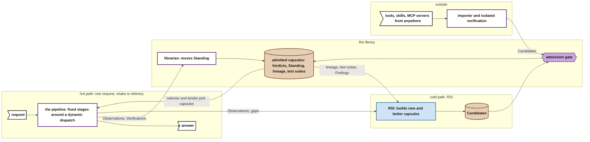
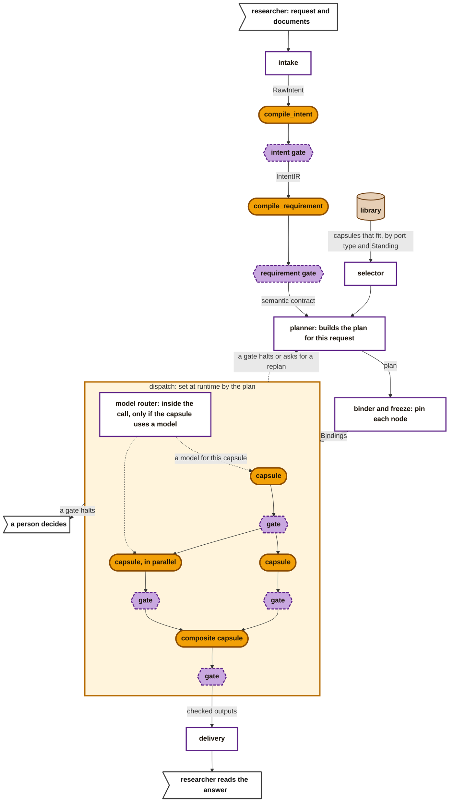
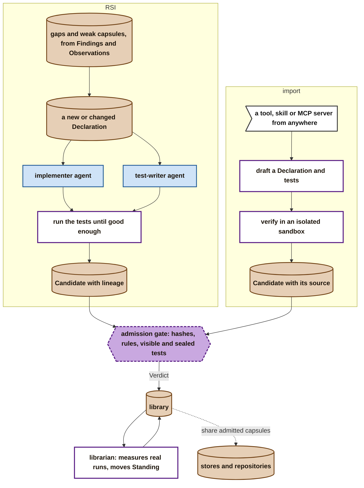

# The big picture: where we are heading

> **A potential near-term goal, open to change.** This page gives context: it shows where the project is heading, so that someone reading [M1](m1-design.md) can see why M1 builds what it builds. Anyone may propose changes to it. It is not a design and not granular enough to build from: the smallest thing drawn is a capability capsule or a gate. The designs to build from are [B1](b1-design.md) and [M1](m1-design.md).

**What the goal adds to M1:**

- **Dispatch becomes truly dynamic.** A planner builds the plan for each request, and a selector picks capsules from the library. The fixed pipeline stays as a fallback.
- **A library sits in the middle.** It holds every admitted capsule, its Verdicts, its Standing, its lineage and its test suites. The hot path takes capsules out of it, and the cold paths put capsules into it.
- **RSI is attached to the library.** It reads what the library has learned, builds better or new capsules, and sends them back through admission. No person has to copy them in.
- **A librarian keeps the library honest.** It watches how capsules behave in real runs and moves their Standing.
- **Capabilities come from anywhere.** An importer turns an outside tool, skill or MCP server into a capsule, after verifying it in isolation.

## Three loops, meeting at the library

- **The hot path runs fast, once per request.** It takes admitted capsules out of the library and records every call.
- **The cold paths run slowly, away from any request.** RSI and the importer put capsules in, and the librarian keeps their Standing current.
- **Admission is the only way in.** A capsule from RSI, from the importer or from a person passes the same gate.

## The hot path after M1

**Key** (as in B1 and M1): amber stadium = a capability capsule. Purple dashed hexagon = a gate. White box = control code. Brown = the library or an object. White flag = a person. Orange box = the dynamic dispatch stage. Thick arrow = binding.

- **The stages around dispatch stay the same as in B1 and M1:** intake, intent compilation, requirement compilation, then delivery. What changes is how dispatch is filled.
- **The planner and selector fill dispatch at runtime.** The selector offers the admitted capsules that fit the contract. The planner orders them, possibly in parallel, and the binder pins each node by hash.
- **Every capsule is still followed by its gate.** A gate can halt the run, or send it back to the planner for a new plan.
- **A composite capsule** is a capsule made of other capsules. It is pinned and gated like any other.
- **The model router is inside a capsule call,** not a stage of the pipeline. When the runner calls a capsule that uses a model, the router picks a model for that one call at runtime, within the capsule's `needs.model` limits. A capsule that uses no model, such as a tool, never reaches it.

## The cold paths after M1

- **RSI grows the system in two ways:** new capsules let it do more, and better capsules let it do the same things well. Capsules are isolated and testable one at a time, so each change is tested on its own capsule.
- **Import brings in outside capabilities.** A tool, skill or MCP server is drafted into a Declaration with tests, verified in isolation, and then admitted like any other capsule.
- **The librarian closes the loop.** It measures how capsules behave in real runs, lowers the Standing of those that drift, and its Findings tell RSI where to work next.
- **Stores and repositories** are the end point: admitted capsules shared with other systems, each carrying its Declaration, checks and Verdict.

## How the workstreams fit together

Each workstream builds one part of the pictures above, and meets the others only at a named interface.

| Workstream | Where it sits in the pictures | Its interface to the rest |
|---|---|---|
| Capability Capsule | the capsules, the CC runner, admission and the library at the middle of the three loops | the Declaration; admission; the Binding |
| Evaluator gate | every gate after a capsule, both tiers | the Verification record; its verdicts |
| RSI | the RSI cold path, attached to the library | reads Findings, Observations, lineage and test suites; sends Candidates to admission |
| RSI data foundation | feeds the RSI cold path | sample runs and fixtures |
| Verifier fine-tuning | the model behind the tier 2 judge | a new version of the verifier capsule, through admission |
| Model routing | inside each capsule call that uses a model | reads the capsule's `needs.model`; records the model in the Observation |
| Planner | fills the dispatch box at runtime | reads the contract and the selector's offer; writes the plan |
| Benchmarking | outside the loops, measuring the whole | reads the records of runs |

Because the parts meet only at these interfaces, each workstream can build and test its part on its own.

## Where each part comes from

| Part | First appears | Where to read more |
|---|---|---|
| fixed pipeline, CC runner, gates | B1 | [B1](b1-design.md) |
| two-tier gate, admission, operators | M1 | [M1](m1-design.md) |
| RSI in an offline sandbox, dynamic planner and router on their own tracks | M1, as parallel tracks | [M1](m1-design.md#parallel-tracks) |
| library, selector, planner and binder on the main path, librarian | after M1 | this page |
| importer, isolated verification, composites, stores | after M1 | [Tools](capsule/tools.md), [Composition](capsule/composition.md) |
