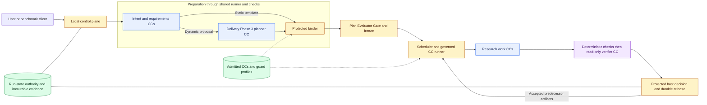

# AI4Research M1 Design Package — Current Architecture

**October 7, 2026 · PRD received October 6 · branch `ai4r_muk`.** Design-package and build-package name this same maintained architecture at `docs/architecture/build-package/`. Send the PRD alongside it.

This is the last whole-system design layer intended for complete human review before agents expand it into detailed specifications and implementation. It explains which modules exist, why, how they connect, who has authority, and what readiness means. The PRD owns product behavior, exclusions and acceptance; this design does not repeat its feature catalogue. Recorded amendments remain explicit. Detailed realization and evidence belong to native coding records.

| State | Meaning |
|---|---|
| Design | Adopted baseline; first slice ready for detailed specification under the recorded decisions. |
| First build | Intent Compilation and Verification Slice (formerly TRIAL-1), within Delivery Phase 1; accepted intermediate intent or durable halt. |
| Coding | Registration/source reconciliation pending in [M1 TASKS](../../tasks/M1/TASKS.md). |
| Evidence | No runtime or M1 acceptance is established by this package. |

## Required reading order

Review breadth before depth. Humans start with this page's system picture, module map and readiness guidance, then [decisions D1–D15](principles.md#decisions-and-source-amendments). Consult the accompanying [PRD](sources/product/prd-m1-current-2026-10-06.txt) for product obligations. Review only the deeper page relevant to a disputed boundary or assigned module; the complete reading graph is agent reference, not a mandatory cover-to-cover human review.

| Deeper question | Read when needed |
|---|---|
| How do source responsibilities elaborate into modules? | [Crosswalk](glossary.md), [research handoffs](m1-design.md) |
| How are preparation, planning and execution connected? | [Workflow](workflow.md), [rough contracts/reuse](contracts-and-native-reuse.md) |
| Who may check, release, persist or disclose? | [Capsules](capsules.md), [guard design](guard-design.md), [placement](placement.md) |
| What does the first connected build demonstrate? | [First slice](immediate-plan.md), then [coding handoff](handoff.md) |
| What must later integration preserve? | [Phase/stage boundaries](delivery-phases.md), [offline RSI](offline-rsi.md), [failure/human routing](failure-and-human.md), [automation](automation.md) |
| Which exact source clauses and fields are allocated? | [Clause index](coverage-allocation.md), [CC declaration](capsule/declaration.md) and [authoring](capsule/authoring.md); detailed reference for agents |

## Intent and reading boundary

Turn a supplied research objective and baseline into grounded opportunity, falsifiable hypothesis, bounded POC, comparable measurements and a traceable report. Keep scientific conclusions separate from infrastructure acceptance and keep server-owned execution alive after browser closure. Reuse native JiuwenSwarm/OpenJiuwen components while retaining protected authority boundaries.

Maintain a small architectural core. Add detail here only when its omission could change a module's responsibility, consumer, authority, failure outcome or extension seam. Put schemas, algorithms, prompt wording, numerical tuning and concrete tests in the owning specification. PRD amendments belong in decisions; product feature detail stays in the PRD. New detail should replace duplication or expand a targeted deeper page, rather than enlarge every reader's route.

Optional [test-runner tooling](development-tools/test-runner/README.md) is outside product/design inputs and automatic M1 allocation. [Historical sources](history.md) are provenance only. The separate [very condensed design](../very-condensed-design.md) covers the same full M1 scope and architectural intent with far less detail. Either design, accompanied by the PRD, is intended to guide an M1 build. Only the current comparison experiment is limited to the Intent Compilation and Verification Slice; reduced detail does not reduce product scope. The condensed file remains an experimental projection of this maintained baseline.

## System picture

Logical modules share one authorized local execution host. Durable product account/profile state is separate from workspace/run state and may later use approved cloud persistence. Fixed preparation, the baseline graph and later dynamic planning share the governed runner and release boundary.

Arrows represent governed handoffs, not calls that bypass checks. The runtime feedback edge releases dependency-ready work; the frozen research graph remains acyclic. The planner proposes and the binder assigns; neither producer nor assessor owns release. [Placement](placement.md) shows model and generated-code isolation. Use [scalable diagram views](diagrams/README.md) for larger system views.

## Complete capability inventory

These are logical responsibilities, not required services or coding TASK identities. Retain them even when private helpers are combined. “Ready to connect” below means demonstrated use by the intended consumer under the applicable PRD obligations, not an implemented file or schema alone.

| Module / design intent | Connection and authority | Ready-to-connect meaning | Seam to preserve beyond M1 |
|---|---|---|---|
| Intake and compilation: preserve what the user means | Original input/assets → checked intent → checked Research Brief; compilers do not invent solutions | Consumer receives attributed meaning, constraints and explicit unknowns; material uncertainty cannot silently advance | Richer/interactive compilers keep the same Brief meaning and verification boundary |
| Planning and binding: turn accepted requirements into bounded work | Brief + eligible library → fixed graph or proposal → protected contracts, checks and freeze | Dispatchable bindings cover the objective, accepted inputs, versions, effects and obligations; unsupported work blocks | Dynamic discovery/logical planning lower into the same contracts and freeze |
| Scheduler, runner and model bridge: execute governed work | Committed readiness → scoped CC calls through native harness/audited model access | Real work receives only accepted predecessors; execution/failure and effective model/resource observations remain attributable | Additional routes or concurrency preserve identity, budgets, effects and durable readiness |
| Research capabilities: produce and test one claim | Search & Ideation → Idea Screening → Hypothesis → POC Builder → Scientific Benchmarking → Scientific Evaluation → Delivery | Next responsibility can use the exact accepted output; protocol is frozen before measurement; valid negative science reaches truthful delivery | Alternate admitted implementations preserve ports, scientific protocol and evidence meaning |
| Evaluator Gate and guards: authorize advancement | Independently bound deterministic checks → read-only semantic assessment → protected decision | Real candidate is assessed against obligations; deficient results block; exact acceptance commits before successor release | Reusable profiles and alternate assessors retain policy ownership, evidence scope and nonrecursive checking |
| Run-state and evidence: make decisions reconstructable | Captured inputs/artifacts/observations → immutable files and SQLite release authority → scoped records/exports | Consumer can identify what actually ran and was accepted; missing essential persistence grants no readiness | Derived views, richer memory and export adapters never replace authoritative decisions |
| Library and offline RSI: evolve eligible capabilities safely | Admitted pins → sandbox candidate → independent referee/oracle → lineage/admission; human activation is separate | Fixed contract and protected evaluation survive mutation; paired evidence identifies candidate and limits without altering production | Composite/fused CCs and new targets retain dependency closure, member checks, effects and protected scoring |
| Control plane, identity and platform shell: expose usable product state | Authenticated Web/CLI/TUI or benchmark client ↔ server-owned workflow; profiles separate from execution state | Submission, observation, retrieval and mode-specific halt work through the same authority; headless never waits | Cloud profile adapters, larger campaigns and future clients preserve audience and local execution boundaries |

## Module readiness and output quality

Architecture defines these meanings; the coder selects concrete ACs, fixtures, thresholds and procedures in native records.

- **Ready to specify:** purpose, producer/consumer, input/output meaning, authority, essential limits and failure outcome are clear. A missing product decision constrains affected work; routine implementation choices remain agent-owned.
- **Ready to connect:** actual output satisfies its assigned obligations and is usable by its intended consumer. Required execution/security/evidence observations and applicable verification are demonstrated, including both tiers for governed CC work. A compiling implementation, schema-valid payload or mock consumer alone does not establish this.
- **Ready for the milestone:** connected modules demonstrate the assigned PRD stage/phase exit, including required failure behavior. Isolated readiness does not imply system readiness; a narrow slice does not complete M1.

At a runtime boundary, advance only when the output is mechanically conformant, materially faithful to accepted input/protocol, and supported enough for its next consumer. Missing mandatory meaning, evidence, security or persistence blocks. Nonessential polish, presentation and optimization may remain disclosed limitations when every mandatory obligation passes. More elegant output is not a new mandatory gate merely because a reviewer prefers it.

Use the system to judge quality: follow a realistic input through the connected boundary, inspect the actual output and its next consumer's use, and see whether deficient output is stopped. Varied contexts and repeated use expose limits; one working case supports only a narrow conclusion. Architecture supplies this direction, not a growing checklist. Exact campaigns, debugging commands, regression cases and evidence accounting are coding work. Debugging must preserve attributable failures and cannot become undeclared automatic runtime repair.

## Vocabulary and PRD crosswalk

The [glossary](glossary.md) elaborates source responsibilities into cooperating parts. CC declaration, node contract, invocation, assessment and release remain distinct. Phase 1 is the fixed baseline; Phase 2 is required isolated RSI; Phase 3 attempts applicable dynamic integration while retaining the baseline. Future-compatible seams do not grant unimplemented capability or promote future behavior into M1.

## Sources and handoff

The [PRD](sources/product/prd-m1-current-2026-10-06.txt) remains verbatim; [decisions](principles.md#decisions-and-source-amendments) record intentional differences. [Phase/stage accounting](delivery-phases.md) preserves the product's completion boundaries. [TASKS → TASK → Spec Kit](handoff.md) allocates ownership and expands this design into implementation. Preserve identities and recorded evidence. Human design review focuses on intent, connections, readiness and material decisions; agent-derived detail must remain traceable to them.
