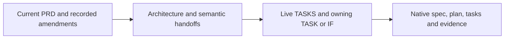

# Architecture inputs and coding authorities

Follow the [required reading order](README.md#required-reading-order). The [coding handoff](handoff.md) owns generation guidance and execution prerequisites.

| Input | Authority |
|---|---|
| Product behavior | [Latest PRD](sources/product/prd-m1-current-2026-10-06.txt); [source identity](sources/product/README.md) |
| Adopted design/amendments | [Overview](README.md), [decisions](principles.md#decisions-and-source-amendments), [clause map](coverage-allocation.md) |
| First build boundary | [TRIAL-1](immediate-plan.md); not the full Brief or M1 exit |
| Required CC meaning | [Declaration inventory](capsule/declaration.md), [schema](sources/capsule.schema.json), [semantic description](sources/capsule-semantic-v2.10b.md), [M1 policy](sources/policy-m1.json) |
| Optional reuse investigation | [Illustrative handoffs/native observations](contracts-and-native-reuse.md), [pinned source evidence](sources/native-reuse-evidence.json); not runtime proof |
| Optional historical context | [Pinned reference index](history.md); never current requirements |

Architecture fixes responsibilities, authority, trust/lifecycle boundaries and rough handoff meaning. Coding agents choose detailed serialization, APIs, algorithms, prompts, verification procedures and implementation paths in native artifacts, subject to the PRD and adopted design.

Use this reading set inside the repository; existing live authorities are intentionally not copied into this folder. Optional external bibliography is reference material, not an extra required offline input. Documentation checks do not establish runtime or scientific acceptance.
