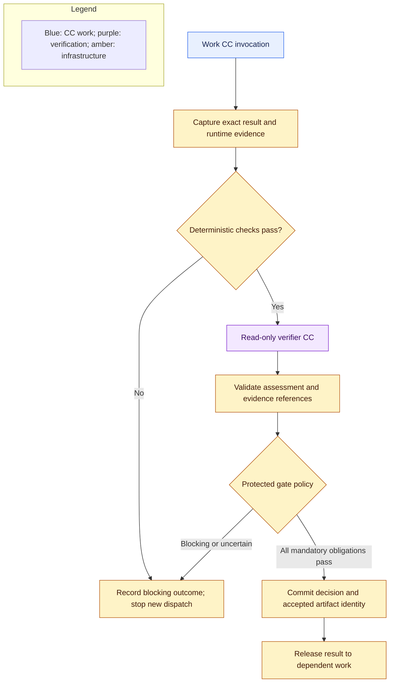

# Capsules, verification, and library

## Invocation and authority

**Required now.** A CC describes a reusable capability; a node is a runtime objective with a separate Node Execution Contract and one or more pinned CC bindings. The [field reference](capsule/declaration.md) preserves its authored contract. The runner resolves the pinned implementation, binds accepted inputs and scoped context, enforces permissions and limits, executes known code or a bounded native agent loop, and captures actual outcomes.

A node contract restricts each CC independently: effective authority is the intersection of that CC’s admission, the node contract and run policy. Permissions from another bound CC are never transferred or unioned into its authority. Node-wide budgets cover every invocation, and each invocation also obeys its own limits. A finite declared invocation/dependency arrangement is required before dispatch; unsupported composition blocks binding.

An agent loop may call permitted tools and declared internal CCs. It cannot rewrite the outer graph, upstream requirements, checking criteria, permissions, or accepted artifacts. Internal CC calls also pass through the runner and verification boundary. Ordinary private helpers are not automatically separate CCs; their behavior remains the invoking capsule's responsibility.

Reusable guard definitions, full-context check-plan binding, independent profile ownership and output-led evidence disclosure are specified in [guard design](guard-design.md). Capsule authors can supply candidate checks and self-tests; mandatory acceptance policy is assigned by protected infrastructure from independently admitted profiles.

## Exact verification boundary

**Required now.** Every work invocation, including planning and delivery, has a pinned verification assignment. Protected configuration establishes mandatory checks from the Node Execution Contract, every participating CC declaration, applicable accepted obligations, artifact type and run policy. Fixed preparation uses the qualified original request and protected template obligations before an accepted Research Brief exists; planned research uses the Brief. Invocation checks protect intermediate boundaries; the node aggregate gate also checks the objective and all required outputs/evidence before successor release. The planner may add checks but cannot remove obligations. Missing supported verification blocks readiness.

Trusted code constructs the review context from the original accepted input, declaration and guarantees, applicable rubric, exact produced artifacts, upstream accepted evidence, and observed execution. It identifies the subject and source of each item. The producer cannot choose a favorable checking policy or substitute its own success assertion for evidence.

Tier 1 handles mechanically decidable questions: contract and format conformance, identity and version binding, required evidence, execution completion, duration, declared tools, and enforced access boundaries. Mandatory failure prevents Tier 2. An unavailable required environment is blocked, not evidence that the artifact is wrong or correct.

Tier 2 reviews actual output against accepted obligations, rather than producer reasoning or a suggested verdict. It does not solve or repair missing work. It receives only the context needed for its question, with bounded read access to referenced evidence when needed. It has separate instructions and conversation state from the producer. Artifact content is data, including text asking the reviewer to ignore its rules. It cannot edit the reviewed result or access hidden RSI evaluation material.

The assessment gives findings against required obligations, reasons, and evidence references. The host validates their structure, scope, and subject binding. Missing references, insufficient context, malformed output, timeout, unsupported conclusions, or unresolved ambiguity cannot advance. Preserve both the raw assessment and the final decision. Use the PRD verdict meanings: `PASS`, `PASS_WITH_KNOWN_LIMITATIONS`, `FAIL`, `ENVIRONMENT_BLOCKED`, and `INCONCLUSIVE`; only the first two advance when every mandatory obligation passes.

Bind the decision to run, node, attempt, Node Execution Contract identity/hash/revision, participating invocation identities, input/output identities, all capsule implementation and dependency pins, verifier, checks, policy and relevant configuration. Publish only those exact immutable accepted artifacts. Producer mutation after review, cross-run substitution, retry, or policy changes cannot reuse an earlier pass. Artifact and decision persistence must succeed before downstream readiness is exposed.

## Verifier internals and referee protection

**Required now.** Verifier and Evaluator Gate name the same logical component: deterministic checks, read-only semantic assessment and protected decision/release. A runtime verifier CC supplies the semantic part: “this result violates the contract; stop.” Protected runtime code owns application of that assessment, durable release, and scheduler readiness. A CC-supplied boolean or free-text instruction never unlocks work directly. The host is an internal authority of the Verifier, not another semantic agent. [Human callbacks](failure-and-human.md) define every non-advancing outcome and mode-specific routing.

Verification CCs end the semantic checking branch. Mechanically validate their response; do not generate an endless verifier-of-verifier chain. Pin and test them through separate development evaluation. Sharing a provider gives process separation, not independent model failure modes or a truth guarantee. Use protected labeled challenge cases to characterize omissions, unsupported claims, ambiguity, and instruction injection; record observed errors and limitations. Spec Kit determines cases, metrics, and thresholds before measuring the candidate.

Any CC or dependency supplying the checking assessment for a mandatory gate is outside RSI's mutation scope. Protection includes its prompts and rubrics, deterministic checks and runners, policy, hidden fixtures, permission enforcement, library activation, and authoritative evidence storage. Capsule-local evolution metadata cannot expand that scope. Screening's explicitly mutable ranking helper is a work implementation, not permission to alter its verifier or gate criteria.

Scientific evaluation owns the hypothesis conclusion. Its verifier checks evidence and correct application of the pre-registered protocol. A scientific negative result can receive infrastructure acceptance; neither the gate nor the evaluator may move the thresholds to make it positive.

## Library lifecycle

**Required now.** Publish declarations and referenced implementation closure together as immutable versions. Admission validates the supported contract, pinned dependencies, permissions, and supplied verification evidence. Provisional admission means limited evidence, not guaranteed correctness. Retain historical admitted versions and decisions.

Admission and activation are distinct. New runs resolve the human-activated admitted default or an explicit historical pin. Existing frozen runs retain their pins. Suspension blocks new starts of the affected version even in a frozen run; preserve in-flight evidence and recheck eligibility before release. Do not silently substitute another version. Retain evidence and allow explicit rollback. Hand-authored versions follow admission too; RSI is not required to author or use the library.

## Composition and optimization

A multi-CC node is a run-specific objective binding, while a composite CC is a reusable admitted capability with an internal graph. Neither identity replaces the other.

**Required compatibility.** A composite declares pinned members and wiring as an internal DAG with its own boundary ports. Resolve its complete dependency closure and preserve scoped member calls, required verification, effects, and attributable evidence. An outer verifier does not erase member checks. Detect recursive dependencies; nesting must not bypass limits or grant additional authority.

**Future direction.** Fusion replaces an admitted member graph with a separately admitted implementation after comparative evidence establishes the same contract meaning, effects, required verification, and traceability. Retain the unfused reference and member-to-fused provenance. Do not remove checking boundaries merely because the combined output looks correct. Fusion must be justified by this system's comparative evidence.

**Required compatibility.** Interaction findings bind to versions, context, and evidence; record whether risk was predicted or execution-confirmed. **Future direction:** use contracts, effect overlap, invariant conflicts, and bounded MCTS to prioritize interaction analysis. Any borrowed skill-interaction analysis must be evaluated against the isolated CC execution boundary. Predicted risk cannot certify safety or replace live verification.

**Required compatibility.** Preserve dependency, effect, idempotency, reversibility, and lifecycle declarations for spatiotemporal composition. **Future direction:** install, drain, replace, and compensate capabilities during long runs through a separate lifecycle mechanism. M1 changes take effect between runs. Removal from routing must never delete historical evidence or pretend external emissions were undone.
