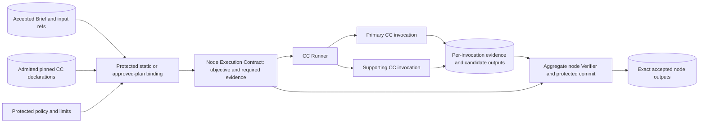

# Contract shapes and native reuse

Architecture baseline, 2026-10-06. The shapes below explain meaning and responsibility. They are illustrative, not a final wire schema, Python API, or implemented integration. The owning coding TASK and Spec Kit feature must settle serialization, interface revisions, error behavior, and executable checks.

## What passes between capsules

A capsule declares reusable input and output ports. A particular invocation binds those ports to concrete, attributable artifacts and a run-specific objective. Ports describe the class of data; bindings identify this run's data. The [declaration reference](capsule/declaration.md) preserves the full capsule field inventory.

| Object | Meaning | Example boundary |
|---|---|---|
| Qualified intake | Original request plus permitted, accessible context | User request, baseline repository reference, permitted documents and validation data |
| Intermediate intent | Interpretation of the problem, desired change, and requested result | What the user wants, relevant entities, ambiguity, and links back to the request |
| Research Brief | Accepted research requirements | Objective, scope, mandatory targets, preferences, constraints, deliverables, assumptions, and evidence expectations |
| Capsule declaration | Reusable capability and admitted implementation | Supported ports, allowed tools/effects, checks, resource needs, version and provenance |
| Node Execution Contract | Frozen instructions and authority for one governed node instance | Objective, concrete artifact bindings, output obligations, acceptance/evidence requirements, effective limits, and exact admitted capsule versions |
| Invocation result and evidence | What an execution actually produced and observed | Output artifacts, attributable observations, tool/effect records, timing and execution outcome |
| Gate decision | Protected decision on whether that result may advance | Decision plus evidence and contract references; separate from the producer's completion claim |

The PRD §§3.2 and 4.7 define interpretation and requirement compilation functions that can live in one bounded, one-shot baseline compiler. The current [workflow design](workflow.md) separates intent and requirement CCs with checking at each boundary. That separation is an architecture decomposition; it does not justify extra autonomous ideation, external context gathering, or an interactive approval wait. D5 explicitly adopts two bounded compiler invocations within one non-interactive entry, instead of the PRD literal one-generation fallback. Freeze combined budgets and cite that amendment in the owning TASK; the complete baseline still produces Research_Brief.json.

## Intent becomes requirements, then execution authority

For illustration, consider: “Reduce inference latency for my supplied baseline on one GPU; keep quality unchanged and return a reproducible comparison.”

An **intent output** can be understood as:

```text
problem: inference is too slow for the user's baseline
desired_change: lower latency while retaining quality
requested_result: a reproducible baseline/treatment comparison
context_refs: supplied baseline and permitted validation material
ambiguities: latency statistic and meaning of unchanged quality
source_refs: original request spans supporting this interpretation
```

This identifies the problem without choosing quantization, a caching method, or another solution. It also does not invent numeric targets or experimental results.

The **Research Brief** adds requirements that downstream work can consume:

```text
objective: investigate latency improvement for the supplied baseline
scope: declared inference workload and permitted project assets
mandatory_requirements: latency improvement; preserve declared quality bounds
optional_preferences: explicitly stated user preferences, if any
constraints: single GPU; declared time/compute/data/effect boundaries
deliverables: reproducible comparison and research report
target_metrics: user-supplied metrics, with units and interpretation
assumptions: conservative defaults, each distinguished from user statements
unresolved_items: missing or conflicting material requirements
evidence_expectations: attributable baseline, measurements and result artifacts
```

The compiler validates readiness according to the selected profile. PRD baseline defaults, such as `single_gpu` when hardware is unspecified, must remain visibly defaults. A missing metric threshold must not become an invented user requirement. User-level targets belong here; experiment-specific success, falsification, and classification rules belong to the later immutable `Hypothesis_Blueprint.json` under PRD §3.5. Selecting an opportunity or hypothesis remains downstream work.

For a **Search & Ideation node**, the runtime then assembles:

```text
identity: this run, node and attempt
objective: find evidence-grounded candidate opportunities within this brief
inputs: accepted Research Brief artifact and permitted source references
required_outputs: Candidate_Set artifact with traceable citations
capsule_bindings: exact admitted search and supporting citation versions/hashes
acceptance_and_evidence: protected checks and required observations
effective_limits: allowed source access, effects, time and invocation limits
```

The Node Execution Contract is assembled by protected runtime binding, not inferred from a capsule's Markdown prompt. A node may bind several admitted CCs, as PRD §4.1 allows. One-CC nodes are a simple valid realization; multi-CC nodes retain separate invocation records and aggregate node-level contract/evidence obligations.

The CC Runner consumes this effective contract and bindings. The result contains artifact references and observed execution evidence, not just a string saying “done.” The infrastructure gate checks that evidence before successors start. Scientific evaluation can legitimately produce a scientific failure while its infrastructure execution passes and advances to Delivery.

## Node, contract and participating capsules



Each invocation gets only its own admitted permissions restricted by the node contract and run policy. Per-call checks remain required; their passes do not replace aggregate node acceptance. This objective binding is not a reusable composite CC declaration.

## Validation belongs at several boundaries

| Owner | What it must establish |
|---|---|
| Intake and compiler | Required inputs are present and readable; interpretation is grounded in supplied context; extracted statements, defaults and unresolved items remain distinguishable |
| Typed artifact boundary | Required fields, types, ranges, enum values, artifact identities and supported schema revision are valid |
| Capsule admission/library | Declaration validity, implementation integrity, provenance, compatibility and required self-tests; exact version is eligible |
| Planner and protected contract assembly | Port compatibility, bound inputs, dependencies, objective coverage, assigned verification and feasible limits; selected pins are admitted |
| CC Runner | Observed tools, effects and resource use remain inside both capsule admission and the narrower node contract |
| Evaluator Gate | Deterministic evidence checks and independent semantic assessment satisfy protected obligations; only its protected host records advancement |

No data validator alone proves that a citation supports a claim, an artifact is authentic, a workload obeyed its resource limits, or a result meets the scientific protocol. A contract can narrow admitted permissions; it cannot widen them. Token budgets remain recorded constraints on the Codex baseline unless reliable endpoint telemetry supports mechanical blocking; time and invocation-count limits remain enforceable under PRD §4.7.4.

## Pydantic recommendation

Use **Pydantic v2 for Python boundary models**, with versioned JSON/JSON Schema as the interoperable artifact contract. This follows actual dependencies and patterns: `pyproject.toml` explicitly declares `pydantic>=2.0,<3.0`; `jiuwenswarm/common/model_selection.py` already defines `ModelSelection`, `ResolvedModel` and `ResolvedRoute` using `BaseModel` and validators. JiuwenSwarm's Symphony configuration also uses frozen dataclasses in `jiuwenswarm/symphony/config.py`, so an internal helper need not become a Pydantic model merely for consistency.

Pydantic is suitable for parsing untrusted boundary data, cross-field checks and schema generation. Dataclasses or typed dictionaries are sufficient for already validated internal records; JSON Schema is useful when a non-Python producer or consumer validates persisted artifacts. Select one authoritative contract definition and derive or check its other representations. Avoid independent handwritten Python and JSON definitions that drift.

The detailed TASK must choose coercion, unknown-field handling, revision migration, and immutability deliberately. Security-relevant fields should fail closed on unsupported input. Frozen Python objects alone do not supply durable freezing, integrity, deep immutability or authorization. Those properties require protected runtime records and hashes. This recommendation adds no new dependency and does not finalize any capsule or Research Brief schema.

## What Symphony already offers

These observations come from local source inspection, not an AI4Research acceptance run. Paths beginning `jiuwenswarm/` below are relative to this repository; `../openjiuwen/agent-core/` identifies the sibling upstream checkout. Code paths are evidence locations, not document links.

| Existing seam and source evidence | Reuse proposal | Remaining AI4Research responsibility |
|---|---|---|
| `CapabilityIO`, `CapabilityDescriptor`, `SourceSnapshot` in `../openjiuwen/agent-core/openjiuwen/symphony/models/capability.py` | Project admitted declarations into a normalized read-only discovery catalogue | Full artifact schema references, effect/resource authority, admission standing and pinned runtime bindings |
| `CapabilityFingerprint` and `FingerprintArtifact` in upstream `symphony/models/fingerprint.py` | Reuse semantic description, version/hash metadata and reproducible catalogue snapshots for candidate matching | Treat extracted fingerprints as derived metadata; an LLM extraction cannot replace the authored declaration or grant permissions |
| `CapabilityProvider` and `AtomicCapabilityProvider` in upstream `symphony/interfaces/capability.py`; `ScanResultCapabilityProvider` and `FingerprintArtifactCapabilityProvider` in `jiuwenswarm/symphony/adapter.py` | Add an admitted-library provider through the existing provider seam; capture inventory and identity consistently | Filter eligible versions, preserve canonical identities and schema/check references, and prevent stale catalogue data from authorizing execution |
| `SkillFolderScanner`, `FingerprintService` and `SymphonyRuntime` imports in `jiuwenswarm/symphony/build.py` | Reuse existing catalogue build and graph-artifact infrastructure where compatible | Folder presence is not admission; static Phase 1 bindings must not depend on live semantic search |
| `OrchestrationService.plan` in upstream `symphony/orchestration/service.py`; `SymphonyGraphEngine` in upstream `symphony/graph_engine.py` | Evaluate bounded planning and graph lifecycle support for the dynamic path | Accepted Research Brief adapter, deterministic feasibility checks, node-contract assembly, freeze, gate-controlled dispatch and fallback |
| `SwarmSymphonyService` in `jiuwenswarm/symphony/service.py` and upstream `SymphonyRuntime` in `symphony/runtime.py` | Reuse existing application adapters and capture seams rather than inventing an independent Symphony integration | Prove run/attempt identity, evidence completeness, admission and gate semantics at the connected boundary |

`CapabilityIO.type` is a semantic string, with a description and optional required/default metadata. It is useful for retrieval and composition reasoning, but it is not a complete payload validator. A match between two such ports does not prove that the produced JSON satisfies the consumer's schema or meaning.

Upstream `SymphonyModel` in `symphony/models/_base.py` already uses Pydantic with frozen models and `extra="ignore"`. That compatibility policy is evidence of the framework's style, not permission to ignore unknown governance fields in AI4Research's authoritative contracts. Use adapters and explicit validation at that boundary.

The observed Symphony capability graph is a reusable catalogue/relationship graph; its planned graph is a planning artifact. Neither is automatically the frozen AI4Research execution graph or Node Execution Contract. Likewise, Symphony Flow packaging/review and graph evolution are not evidence that PRD capsule admission, human activation, protected evaluation or offline RSI controls are implemented. Any reuse must preserve those product responsibilities.

## Evidence limits and next handoff

This repository pins OpenJiuwen agent-core revision `9e3390195a9ea15235b2b5f7412cb2aa440622cc` in both `pyproject.toml` dependency and UV source configuration. The inspected sibling checkout was clean at `e23806c1073275780dced2b71ddd592ffb0a21fd`. The initial review inspected that sibling HEAD. The closing review additionally inspected the actual pinned Git objects: [source hashes and interface observations](sources/native-reuse-evidence.json) establish the cited catalogue/provider/planning/model interfaces at the pin. This is source availability, not installed-runtime or connected gate compatibility.

The inspected shell's Python reported Pydantic `2.13.5`; resolving `openjiuwen` found the sibling namespace directory, not an installed agent-core package. No AI4Research/Symphony runtime compatibility test was performed, and no dependency pin was changed. An implementation TASK must first establish its actual environment, confirm the installed dependency matches the recorded pin, and then test the admitted-library adapter and one connected governed invocation before claiming native integration.

The accepted architecture responsibilities and unresolved source decisions belong in [workflow](workflow.md), [capsules](capsules.md), [placement](placement.md) and [principles](principles.md). Exact schemas, APIs and tests remain the owning Spec Kit feature's work. Source §4.8 retains older Phase 2/dynamic-test wording while §§1.3 and 6.12 place dynamic integration in M1 Delivery Phase 3; reconcile that source discrepancy explicitly rather than treating it as implementation authority.
