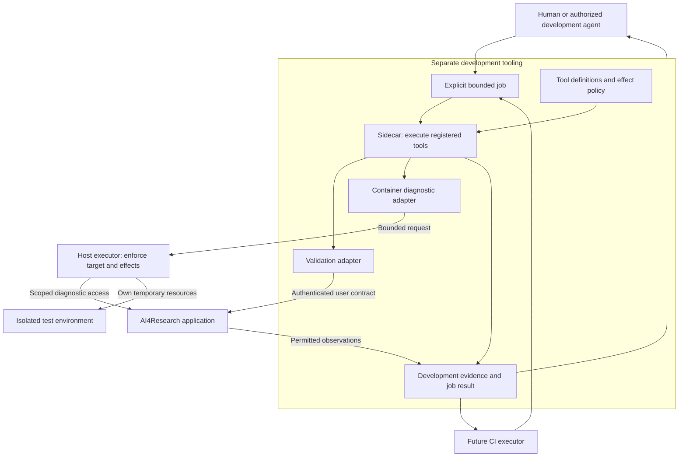

# AI4Research development sidecar

**Separate development tooling design · October 7, 2026.** A reusable tool runner for humans, authorized development agents and future CI jobs. It supports building, diagnosing and validating M1 and later versions without becoming part of the research workflow. This is adopted tooling intent, not an implemented service or a new M1 acceptance requirement.

This page defines the architectural boundary. The accompanying PRD and [product design](../../README.md) still own AI4Research behavior. Worker agents choose commands, transport, schemas, frameworks and concrete isolation mechanisms in separately scoped native coding records.

## Purpose and composition

Give development operators one named way to inspect a selected application container, collect a reproducible failure, and run agreed checks. Reuse tool definitions instead of inventing container access for every bug. Start with a finite local job; a continuously running service is unnecessary for M1 support.

Let `D` be registered development tools, `U` user-facing research tools and `C` admitted capability capsules. Their authority domains are separate: `D ∩ U = ∅` and `D ∩ C = ∅`. Shared implementation code does not share credentials or entrypoints. A development validation tool may call the authenticated product client; that does not make it a product verifier or gate. [Verifier and gate responsibilities](../../glossary.md#composition-notation) remain unchanged.

Boxes show responsibilities, not mandatory services. The host executor may be a small launcher. It alone holds any required container-management privilege; the sidecar receives no Docker socket or unrestricted host shell. Product startup, workflow execution and release do not depend on this development lane. [Scalable diagram](composition.svg) · [PNG](composition.png).

Package the runner as a separately invoked development container beside the existing application, with its own configuration and retained report location. It can target a selected existing instance or a launcher-owned disposable instance. Mount only declared tool inputs and report outputs; do not share private application-state volumes. Local CLI and future CI use the same job semantics. The exact launcher/Compose arrangement and internal adapter layout are worker-owned choices.

## Responsibilities and handoffs

| Part | Intent and connection | Authority and readiness meaning |
|---|---|---|
| Job entry | Operator supplies target, candidate identity, tool/version, parameters, purpose, allowed effects and finite budget | Establish caller scope and explicit target; reject ambiguous or unauthorized requests before execution |
| Tool registry | Reusable definitions describe input/output meaning, target kinds, prerequisites, effects and cancellation behavior | Register adapters deliberately; job parameters cannot invent tools or escalate permissions |
| Sidecar runner | Resolve a definition, validate the request, execute under limits and collect the result | Own development-job lifecycle only; every attempt has attributable success, failure or incompleteness |
| Product-client adapter | Submit, observe, retrieve and optionally cancel its own test runs through supported interfaces | Use ordinary scoped authentication; never insert accepted outputs or bypass product gates |
| Diagnostic adapter and host executor | Inspect the selected container or execute a registered bounded diagnostic operation | Executor enforces target, argument/effect scope and resource ownership; unavailable access is reported, not replaced by broader access |
| Evidence output | Return observations, tool identity, candidate/environment pins, timing, exit outcome and retained references | Preserve failures and limitations; reports inform humans or CI and never become authoritative product state |

Minimum reusable tools cover readiness inspection, scoped logs, relevant configuration/version observations with secrets removed, a registered in-container diagnostic command, and a bounded validation case. Read-only inspection is the default. A tool that writes files, rebuilds or restarts declares those effects and requires caller authority for the selected development environment. Production mutation is outside the initial scope.

An in-container command can create processes or alter its environment even when called a check. Its definition identifies actual effects. Execution is bounded by target, working directory, arguments, credentials, time and resources; detailed enforcement is implementation work. Capture allowed observations without exposing application secrets, hidden RSI fixtures, private user data or unrelated host files. Protected internals are not a generic diagnostic entitlement.

## Operating contract

The launcher establishes the operator's identity and binds existing authorization from the assigned development task or explicitly authorized operation to the permitted environment. It does not grant new authority. The job records that scope, its selected target and the resources/runs it owns; request parameters cannot grant permissions. The runner checks each request against this scope, and the host executor independently enforces it before privileged actions. Cancellation applies only to recorded job-owned resources within that authority. Identity, credential and ownership-record mechanics remain implementation choices.

The operator selects a registered tool and target. The runner checks prerequisites and permissions, resolves the exact effective request, asks the appropriate adapter to execute, and returns observations plus a truthful outcome. Results distinguish **completed**, **failed**, **blocked** and **interrupted/inconclusive**; completing a tool does not imply that the product passed a test. Validation separately states whether expected behavior was demonstrated, contradicted or not established. An expected product rejection may satisfy a case.

Application run identity and development job/attempt identity are distinct. Lost transport or timeout does not prove application work stopped. Ambiguous submission or execution is not blindly retried. Cancellation stops the owned job and, where authorized, its owned test run; it never cancels unrelated research. A failure verdict does not trigger automatic repair, restart or deployment.

The external launcher owns creation, retention and cleanup of temporary environments. Connecting to an existing container grants no lifecycle ownership. Cleanup touches only job-owned resources and retains evidence. A retained debugging environment has a named owner; interruption or cleanup failure is visible. Report optional capture failures as limitations; missing essential evidence makes validation inconclusive.

## M1 coexistence and later seams

M1 remains buildable and runnable with ordinary development commands and product clients. Register sidecar work separately from product TASKS allocation; no sidecar dependency is added to a product phase exit. Workers preserve supported client contracts and feasible diagnostic seams, but do not wait for the runner, add speculative product endpoints or make the application start it. A missing optional adapter blocks only that tooling operation. A real product boundary defect goes to its owning product task.

The [existing validation-runner design](../test-runner/README.md) supplies the bounded client-validation role. Its narrower container has no diagnostic or lifecycle privilege; privileged diagnosis follows the separate host-executor path above. Scientific benchmarking, runtime semantic verification and offline RSI scoring remain product responsibilities.

For CI/CD, preserve invocation from an external executor, machine-consumable outcomes, exact candidate/environment attribution and retained artifacts. Pipeline stages, triggers, release policy, deployment and hosting remain undecided and outside the sidecar. Later CI consumes this contract instead of redesigning product execution. Scheduling stays external.

Beyond M1, new tools, targets or longer validation campaigns extend registered adapters and evidence contracts without inheriting broader authority. Separate jobs and owned resources permit later concurrency; detailed scheduling is deferred. Container diagnosis remains available independently of model-backed research validation.

## Ready to use

Judge the first implementation by using it: diagnose a real failure in an owned application container, retain enough evidence to reproduce it, and run a bounded case through the real product client. Demonstrate refusal of an unrelated target or undeclared effect, and cancellation that preserves unrelated work. Show unavailable prerequisites and partial evidence truthfully. One successful case supports only that narrow result; broader quality claims require varied use.

These are architectural outcomes, not a new product release gate. Detailed acceptance cases, interfaces, tool definitions and evidence procedures belong to the sidecar's own TASK and native specification. This document establishes no live tools, CI pipeline or runtime readiness.
