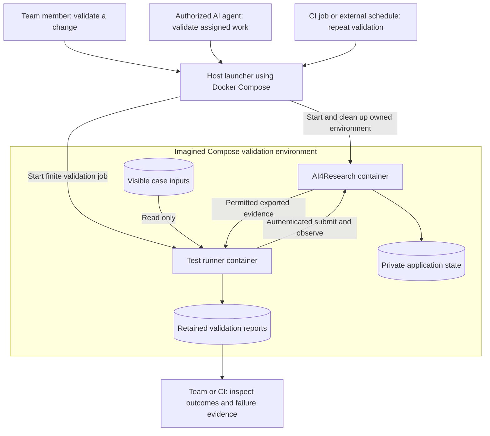

# AI4Research sidecar: client-validation runner

The proposed Docker Compose arrangement gives the team a common way to run bounded validation cases. The host launcher owns container lifecycle; the sidecar owns case execution and reporting. It can also target an explicitly selected existing application through supported seams, without taking ownership of that application's lifecycle.

## Scope and authority

Client-validation role within the [development sidecar](../sidecar/README.md), originally drafted 2026-10-06. This is optional development tooling external to the AI4Research workflow. The broader sidecar supports registered container diagnostics through a separate host executor; this client runner retains the narrower permissions below. Sidecar availability never blocks product delivery. This subtree is excluded from the product architecture reading set and automatic M1 task or Spec Kit allocation. It adds no AI4Research implementation obligations. Future implementation needs a separate tooling scope and specification.

The existing [automation boundary](../../automation.md) supplies the compatibility principle: use the same governed client contract as other clients. Described seams are intended architecture, not proof of implemented endpoints. Missing seams are reported as dependencies. Any application interface change follows the existing product change process separately.

Docker container separation and a Compose launch path are the proposed foundation. Exact commands, APIs, schemas, frameworks and thresholds remain open. The diagram is an imagined arrangement, not an executable deployment.

## Users and triggers

| Actor | Purpose | Role |
|---|---|---|
| Team member | Validate a change or reproduce a failure | Select cases and invoke or stop the job |
| Authorized AI development agent | Gather evidence for assigned work | Use the same launch path within authorized task scope |
| CI job | Validate a candidate automatically | Invoke a bounded job in an isolated environment |
| External scheduler such as cron | Repeat agreed validation periodically | Trigger the same job outside the container |

AI is an operator, not additional authority inside the runner. Scheduling, CI triggers and release policy stay outside the sidecar. It contains no autonomous development agent or internal cron service.

## Lifecycle and ownership

The default is one finite validation job, initially with sequential cases. Images and case definitions can persist; the runner process exists only during a job. After required readiness is established, it submits, observes, assesses, exports a report, and exits on completion or failure.

| Mode | Who starts it | Who stops it |
|---|---|---|
| Fresh local environment | Human or authorized AI invokes the host launcher; Compose starts a dedicated AI4Research instance and runner | Runner exits; launcher cleans up its owned environment |
| Existing application | Operator selects a permitted target; launcher starts only the runner | Runner exits; existing application remains running |
| CI or scheduled job | External executor invokes the same launcher | Executor ensures cleanup after success, failure, cancellation or timeout |
| Hung or interrupted execution | External supervisor enforces a finite deadline | Supervisor stops the runner and cleans up owned resources; incomplete evidence remains an incomplete result |

Runner exit does not itself stop AI4Research. Client shutdown also does not imply research-run cancellation. Where the client contract permits it, an explicit timeout policy may request cancellation of the runner's own submitted run. Container shutdown remains outside the runner.

An explicit local debugging option may retain a test environment, with a named owner responsible for eventual cleanup. The normal CI job is temporary. Cleanup targets only resources created for that job, preserves reports, and never performs broad Docker cleanup or stops another developer's environment. Implementation must define resource ownership and cleanup mechanics.

## Permissions

| Capability | Proposed runner permission |
|---|---|
| Submit work | Scoped credential in the declared evaluation workspace |
| Observe status and retrieve evidence | Supported authenticated client operations |
| Cancel research work | Only its own runs where the contract and case policy authorize it |
| Read inputs | Visible case inputs through narrow read-only access or supported import |
| Write reports | Its own output location, retained after container removal |
| Start, stop, restart, build or inspect containers | None; no Docker socket or daemon API credential |
| Write authoritative state, gates, configuration or accepted outputs | None; no private application volume or database access |
| Read hidden RSI fixtures or application secrets | None |
| Modify source, deploy releases or execute arbitrary host commands | None |

The runner should use a non-root user, no privileged mode, and only the filesystem and network access needed for validation. It needs no inbound service port. Compose connectivity does not grant application authorization; scoped credentials still govern client operations.

**Can the runner start a fresh AI4Research?** The overall validation command can, through the host launcher and Compose. The runner container cannot.

**Can it shut AI4Research down?** The launcher can stop the dedicated instance it created for that job. The runner cannot stop containers. Connecting to an existing instance grants no lifecycle ownership.

Docker daemon control carries broad host authority, so it stays with the external executor rather than the client container. See [Docker Engine security](https://docs.docker.com/engine/security/). CI executor permissions and runner permissions are separate.

## A bounded role for future CI/CD

The runner's role is to accept a bounded validation case, interact through supported seams, assess observable results against declared expectations, and export evidence with a process outcome that automation can consume. CI can invoke this role without keeping a permanent runner service alive.

Cases can expand as product capabilities grow. Platform benchmarking can later add repetitions and measurements under declared campaigns. Scientific benchmarking remains inside the research workflow. None of these extensions grants additional infrastructure authority.

Deployment control, environment repair, general command execution, production monitoring, workflow execution and authoritative acceptance remain outside its role. The runner can report application verdicts; it cannot replace verification, bypass gates or insert accepted results. Surrounding CI/CD owns release and deployment decisions.

For each proposed addition, ask whether it is needed to submit, observe, assess or export a bounded case. Scheduling belongs outside; provisioning belongs to the launcher; product behavior belongs to AI4Research. New permissions or responsibilities require an explicit tooling design decision, rather than becoming another case option.

## Outcomes and failure visibility

Reports distinguish an expected outcome being met, an observed mismatch, an unavailable prerequisite, and an interrupted or inconclusive job. An expected product rejection can satisfy a case. Mock runs remain visibly distinct from model-backed validation.

The runner locates failures only as precisely as exposed evidence allows. Submission failure, observation timeout and application-reported stage failure are different observations. A lost connection does not establish workflow failure; ambiguous submission does not justify blindly creating another run.

Retain candidate and case identities, relevant configuration, application run identity when available, observations and permitted evidence references. Exact report formats and timeout policies belong to the tooling specification.

## Compose foundation and remaining choices

Validation is explicitly invoked and absent from ordinary application startup. [Compose profiles](https://docs.docker.com/compose/how-tos/profiles/) support optional services; a profile or separate validation configuration remains an implementation choice. Profiles govern activation, not permissions.

Required readiness precedes measurement. [Compose startup ordering](https://docs.docker.com/compose/how-tos/startup-order/) supports health-check dependencies; the supported application readiness contract determines which prerequisites matter. CI retains reports using its artifact mechanism, such as [GitHub workflow artifacts](https://docs.github.com/en/actions/concepts/workflows-and-actions/workflow-artifacts).

Before implementation, resolve supported client seams, evaluation credential scope, input import, evidence export and launcher ownership. Keep exact Compose definitions, cleanup mechanics, report schemas, CI integration and benchmark policies in the separate tooling specification. This draft introduces no live service, schedule, CI job or application interface.
