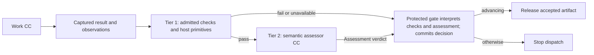
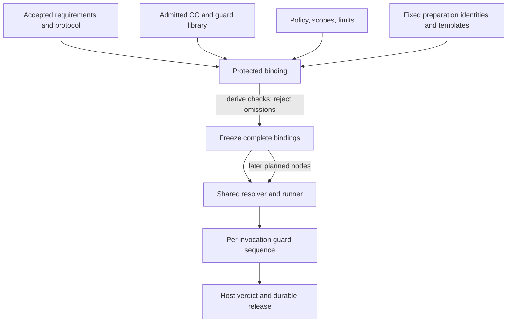
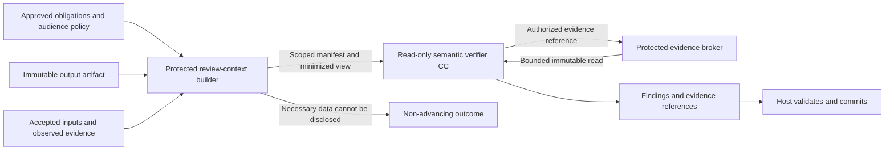

# Guard architecture

## Purpose and boundary

A guard is a reusable, admitted checking capability assigned to a governed work invocation. Its purpose is to determine whether the invocation's observed result satisfies the obligations fixed for that run. It does not certify the truth of scientific claims: the scientific evaluator owns that interpretation, while the Evaluator Gate checks that the evaluator followed its contract and produced admissible evidence. A valid scientific negative result can therefore pass infrastructure verification. See [capsules](capsules.md), [workflow](workflow.md), and [D2/D3/D10](principles.md).

Most substantive workflow work and reusable check implementations can be admitted CCs. Tier 1 deterministic domain checks may be an admitted tool or script CC; inexpensive schema, identity, scope and release-integrity primitives can remain trusted host code. Capsule packaging must not grant checks release authority. All mandatory checks, regardless of packaging, appear in the same bound check plan. Tier 2 semantic assessment is an admitted, read-only verifier CC (`V ⊆ C`). Its assessment verdict is checking data; only the protected gate interprets it into an authoritative gate decision (`G ∩ C = ∅`). A small trusted host boundary binds the evidence and policy, enforces permissions and limits, validates the terminal assessment, commits the stable verdict, and releases successors. It is infrastructure, not a second semantic reviewer. Guard-purpose CCs are mechanically checked at their boundary and terminate there; do not create a verifier-of-verifier chain. Ordinary private helper code is not automatically a CC and remains the responsibility of its containing CC.

## Assignments and check plans

Protected configuration derives the mandatory check plan from the applicable accepted obligations, Node Execution Contract, every participating CC and transitive dependency pin, guard profile and version, policy and scope, protocol references, limits, evidence obligations, and relevant runtime rules. Before a Research Brief exists, fixed preparation templates supply the product obligations and the qualified original request supplies the input meaning; no compiler depends on its own accepted output or a later Brief to establish its guard assignment. After Brief acceptance, planned research contracts use those accepted requirements. Hashes identify these inputs. The plan is invariant for the same complete binding; a CC hash alone, or a CC plus input hash, is not a sufficient reuse key. Observed time and environment are fresh evidence on every attempt and are not frozen as predicted facts.

Guard templates, profile pins, criteria, and applicable policy are fixed before execution. A future-valued input may be bound later only when it is an exact artifact accepted under the frozen protocol; seeing results cannot change criteria or guard code. A planner may propose CC nodes, internal arrangement, objective mappings, and ports, and may add checks. It cannot remove obligations. The trusted binder derives mandatory checks and rejects unsupported or incomplete plans before dispatch.

Preparation and planned work use the same resolver, binder, runner, evidence capture, Tier 1/Tier 2, host verdict, and release protocol. The protected run-state module establishes fixed preparation invocations before a research graph exists, with their own identities, pins, inputs, budgets, and guard assignments. This does not require the planner's proposed graph to run the planner itself. Freeze authorizes the later planned graph; it does not create a separate or weaker execution path.

| Reusable item | What stays fixed | What changes per governed invocation |
|---|---|---|
| Check definition | Admitted code/schema/rubric version and supported contract | Exact subject, accepted inputs and captured observations |
| Guard profile | Independently approved obligation-to-check recipe and version | Effective contract, policy, scientific protocol, resource limits and evidence references |
| Bound check plan | Immutable assignment for the full frozen context | Future accepted inputs are instantiated under the frozen rules before dispatch |
| Verdict | Exact run/attempt/subject/evidence binding | Recomputed on each attempt; a cached earlier PASS never establishes current release |

Pure deterministic calculations may be memoized under exact check-definition, subject and configuration identities when the profile permits it. This can reuse schema/hash computation, not live scope, revocation, execution observations or an authoritative PASS. Establish the current invocation evidence and complete both mandatory tiers before release.

Intent compilation can reuse a fixed fidelity/ambiguity profile, while checking each new original request and exact output. A planned Builder can reuse its schema and forbidden-module checks, but its POC, permitted dependencies, experimental protocol, output obligations and effect limits come from that particular bound contract. The planner does not author new trusted mandatory check code as part of its proposal. Unsupported obligations block binding until an independently admitted profile supports them.

## Library, ownership, and independence

The CC library stores immutable declarations, implementations, dependencies, admission evidence, and versions. Guard profiles and mandatory policy assignments are separate registry records, logically alongside that existing library. This is not a new network service. A declaration may describe checks and guarantees using its [field contract](capsule/declaration.md); declaring a check does not make it mandatory, authorize its author to approve it, or replace protected profile assignment.

The guard/policy responsibility owns protected decision semantics and evidence custody; admission owns candidate identity, dependency closure and required eligibility evidence. Current coding owners must be registered through the live workflow; historical M1-007/M1-003 records do not establish current assignment. The relevant domain owner supplies the obligation meaning, accepted requirements, and protocol references. A CC author may propose guard changes and run self-tests, but cannot approve, waive, or change a trusted mandatory guard or policy. Promotion follows admission and explicit human activation; running work keeps frozen pins, subject to current suspension or revocation checks described in the [library lifecycle](capsules.md).

Keep assessor inputs read-only and limited to the relevant contracts, accepted obligations, observations, and referenced evidence. Separate author and assessment invocation, identity, state, and authority to reduce direct self-certification and context carry-over. This is contextual independence, not guaranteed error independence: a shared provider, correlated assumptions, weak fixtures, or ambiguous requirements may still produce the same mistake.

## Output-led review and controlled disclosure

The protected review-context builder is responsible for giving the assessor enough evidence without letting the producer lead the judgment. Bind an evidence manifest to the exact subject and obligations; identify each item as trusted policy, accepted input, observed runtime evidence, or untrusted producer content. Present obligations and actual output as the primary comparison. Producer explanations, suggested verdicts, self-tests and reasoning traces are optional diagnostic material, never proof that obligations passed. Do not pass the producer's conversation, chain of thought or unrelated history by default.

| Review input | Purpose and authority |
|---|---|
| Original accepted request and requirements | Establish intended meaning and boundaries; preserve material uncertainty |
| Exact produced artifact and declared output contract | Establish the subject actually being judged, rather than a producer-written summary |
| Approved rubric, guard profile, protocol and scope | State the independently assigned acceptance questions; producer text cannot override them |
| Minimum relevant accepted predecessor evidence | Allow claim/support checks with attributable source references |
| Runtime completion, effects, limits and integrity observations | Establish compliance claims the output alone cannot prove; missing mandatory observation blocks |

The verifier checks the submitted result against these questions, not whether it can independently invent a better solution. Small bounded calculations, targeted source lookups and reproductions may be permitted when they test a stated obligation; they must not turn into unconstrained research, artifact repair or a second author. Its output is findings, coverage, uncertainty and evidence references, not replacement work. An independently useful answer supplied by the verifier cannot make a deficient producer artifact pass. If evidence is insufficient, return a non-advancing finding rather than solving the missing work.

Read-only means enforced capabilities: an immutable subject view, scoped evidence reads, no artifact mutation, project execution, arbitrary network fetch, control-state write or successor dispatch. An evidence broker resolves only manifest-authorized references and applies size/type limits, path and symlink containment, content identity and data-audience policy. Verification requiring empirical execution delegates to a separately governed restricted test invocation with its own effects, budgets and evidence, not arbitrary tools enabled on the semantic assessor. Integrity of a redacted view is distinct from identity of the original subject; mandatory checks requiring withheld fields cannot be claimed passed.

Provider and export disclosure is checked before invocation. Send only approved task-relevant content under the configured audience policy; credentials, control tokens, unrelated account history and hidden RSI fixtures are never assessor input. If no permitted model route can inspect necessary evidence, halt as environment/policy blocked. Record the disclosed evidence identities and policy decision locally without adding private correlation identifiers to prompts solely for telemetry. Retain protected raw evidence and clearly labelled minimized views; do not silently change meaning during redaction.

Effect controls apply before and during work as well as verification. A gate cannot undo a leak or external write. Enforced denied access/effects, bounded execution and evidence custody therefore precede semantic acceptance. An observed violation stops dispatch, preserves evidence and routes through [human triage](failure-and-human.md); a persuasive correct-looking output cannot excuse it.

## Two tiers and evidence

Tier 1 answers mechanically decidable questions: schema and contract conformance, identity and hash binding, required evidence presence, execution completion, declared versus observed scope, tool and access enforcement, budgets, and protocol-record integrity. Mandatory Tier 1 failure, missing required environment, or unavailable required check prevents semantic advancement; absence is never a pass.

Only after Tier 1 passes does Tier 2 assess grounded fidelity, coverage of obligations, support from cited evidence, internal consistency, and scientific interpretation where the assigned question requires it. The assessor cannot alter artifacts, criteria, permissions, or release state. A malformed, unsupported, uncertain, or out-of-scope assessment does not advance. The host validates subject and evidence references, records the applicable stable verdict and raw assessment, and releases only exact accepted artifact identities after durable commit. Verdict meanings and halt routing follow the [failure policy](failure-and-human.md).

Every related mandatory guard is admitted independently and has separate development calibration and challenge cases, including instruction injection, omissions, unsupported claims, ambiguity, and scope escapes. These development cases are not run-specific RSI evaluation material. Preserve observed errors, limitations, and provenance. Spec Kit binds concrete case sets and acceptance criteria before measuring a candidate; no universal threshold or private assessor prompt is prescribed here.

## Tradeoffs and evolution

**Strengths:** deterministic fast failure avoids unnecessary semantic calls; admitted CCs keep substantive logic inspectable and reusable; complete bindings support reproducibility; trusted host release prevents an assessor response from directly unlocking work.

**Weaknesses:** broad evidence bundles and profile maintenance add cost; semantic judgments remain fallible; shared model or domain assumptions can correlate errors; incomplete requirements cannot be repaired by more checks.

**Opportunities:** future profiles can compose admitted deterministic and semantic guards across compatible contracts while preserving member-level evidence, scope, and required checks. A profile is reusable only when its full binding and obligations match. Deterministic-only profiles may be considered under a separate policy amendment; current D2 requires deterministic checks followed by a verifier CC for every work invocation.

**Risks:** excess review-context disclosure, producer-led assessment, a verifier becoming a second author, stale profiles, overly broad scopes, author-controlled criteria, missing dependency pins, late changes after observing results, and treating a semantic pass as scientific truth can defeat the boundary. Admission, frozen assignments, exact evidence binding, and host-owned release address these risks without claiming an error-free referee.

## Ownership references

- [Architecture decisions](principles.md)
- [CC contracts and runtime verification](capsules.md)
- [CC declaration fields](capsule/declaration.md)
- [Planning, freeze, and execution](workflow.md)
- Optional historical identity reference: [M1-003 admission task](https://github.com/Stellven/jiuwenswarm/blob/45c0566aeaff1f7b8a5063c46397afa2d8084f94/docs/code/Missions/M1/M1-003/TASK.md); reconcile its older source assumptions.
- Optional historical identity reference: [M1-007 guard ownership task](https://github.com/Stellven/jiuwenswarm/blob/45c0566aeaff1f7b8a5063c46397afa2d8084f94/docs/code/Missions/M1/M1-007/TASK.md); reconcile its older source assumptions.
- [PRD §4.2 Evaluator Gate](sources/product/prd-m1-current-2026-10-06.txt)
