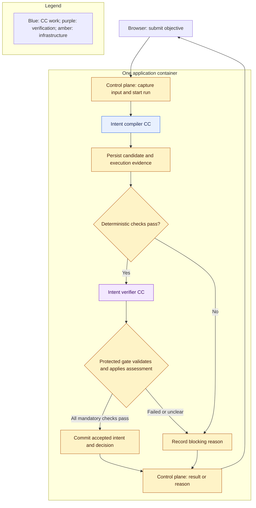

# Intent Compilation and Verification Slice (formerly TRIAL-1)

This name replaces TRIAL-1 in maintained design prose; it describes a bounded slice within M1 Delivery Phase 1, not a new delivery phase or full phase completion. Earlier conversations and historical coding references may retain TRIAL-1. The file path remains stable.

Architecture slice, 2026-10-06. **Required now for this slice:** implement the connected Intent compiler CC → intent Evaluator Gate path and its supporting runtime. The slice needs a distinct registered task identity; historical M1-001 records cover the Codex adapter; the coding owner registers current identities under the live workflow. The remaining full-M1 responsibilities stay in the [overview](README.md) and [complete phase/stage account](delivery-phases.md).

## Intended result

A user submits a text objective through the existing local web UI. Ordinary intake rejects empty input and binds the original text to a new run. The compiler extracts the objective, desired outcome, explicit scope, and stated constraints without choosing a solution or adding unsupported requirements. Preserve omissions, conflicts, and missing information visibly.

The verifier receives the original request, exact compiler output, declared responsibility, and protected fidelity rubric in a separate invocation. It assesses material omissions, unsupported additions, scope drift, and unresolved ambiguity. The producer cannot edit this rubric or the verifier context. A semantically faithful result becomes an accepted intermediate intent artifact; a blocking or unclear result leaves a visible reason and no accepted artifact.

The accepted intent contains the attributed extraction only; the complete Research Brief includes further requirements and evidence obligations. The later Requirement compiler consumes accepted intent and produces that contract.

The slice retains a bounded, non-interactive compiler pass and adds a separately checked intermediate boundary under D5. It does not depend on the external advanced Intention Compiler, introduce dynamic clarification, or satisfy the PRD Implementation Stage 2 Research Brief exit. [Decision D5](principles.md#decisions-and-source-amendments) records this deliberate decomposition; the [source index](sources/product/README.md) identifies the current PRD.

## Connected boundary

The shared runner invokes both CCs. Integrity checks and gate application are ordinary protected infrastructure, so the slice has exactly two authored CCs. Malformed or timed-out verifier output blocks acceptance; the verifier has no recursive semantic verifier. Apply the subject-binding and durable-release rules in [capsules](capsules.md#exact-verification-boundary).

The deterministic checks, runtime intent verifier CC, and protected decision/release together form the **intent Evaluator Gate**. The diagram expands its internals; it does not introduce two competing evaluators.

## Minimum supporting system

| Component | Slice responsibility |
|---|---|
| Declaration and library | Package, admit, activate, and pin two definitions with their implementation closure; preserve the [required field reference](capsule/declaration.md) without implementing deferred mechanisms |
| CC runner | Bind scoped inputs, invoke native model/skill integration, enforce time/call limits, and capture outcomes |
| Fixed orchestration and protected gate | Execute dependencies, validate both outputs, and expose only the exact accepted artifact |
| Existing UI and control plane | Submit, inspect status and failure reasons, and retrieve intermediate output |
| Run-state module and files | Persist input, attempts, candidate output, raw assessment, decisions, configuration, and accepted references |
| Observability | Correlate run, node, attempt, CC/verifier versions, duration, available model-call information, and artifact references |

Use the [placement defaults](placement.md): one local application container, existing Python/TypeScript stack, SQLite, files, protected model integration, loopback exposure, and session authentication. A mock can aid development; it cannot establish the connected model-backed trial. Keep credentials out of evidence.

Closing the browser does not cancel work. Restart preserves accepted output and marks interrupted work paused without automatic replay. For this slice, in-place resumption and automatic correction are excluded. A corrected submission starts a fresh run with a new identity and retains previous failure evidence.

## Actors, context and lifecycle

| Actor | Receives / produces | Authority |
|---|---|---|
| User client or headless driver | Original text and explicit run options / run identity, status, accepted intent or halt reason, evidence reference | Submit and inspect; no direct runner invocation or gate-state write |
| Control plane and configuration resolver | Qualified text, session, requested options / run identity and frozen effective profile | Validate intake and supported options, establish protected context; no semantic inference about intent |
| Library and runner | Two admitted pinned CCs, original input, limits / candidate intent, actual call evidence, exact implementation identities | Scoped invocation and capture; no producer-written verdict can release output |
| Protected deterministic checks | Exact candidate, protected contract/profile and captured evidence / mechanical check outcomes | Enforce mandatory Tier 1 checks; failure prevents the semantic call and blocks release |
| Runtime intent verifier CC | Original text, exact candidate, protected fidelity profile and scoped execution evidence / raw semantic assessment | Assess fidelity without changing the subject, policy, gate verdict or accepted state |
| Protected gate host | Bound mechanical outcomes and validated semantic assessment / attributable gate decision for the exact subject | Apply mandatory criteria and submit the decision to run-state; no release before durable commit |
| Run-state and artifact storage | All attempts, input/candidate references, checks/assessment/decision / durable accepted reference or recorded halt | Sole lifecycle/release authority; no UI event or native cache replaces it |
| Human attention projection | Recorded blocking state / correlated native prompt or headless status | Triage only; fresh corrected submission is new work |

Assemble a protected intent-node contract and separately recorded intent-verifier assignment. Freeze stable product-user/workspace/run attribution, the original text reference, two implementation/dependency pins, model role configuration, fidelity/check profile, mode and time/call limits at run start. Record requested/effective configuration and seed; record unsupported seed control as unavailable. The compiler needs no browsing, shell, resource profiling or autonomous solution design. The verifier receives only its scoped review context; literal instructions inside the candidate are untrusted data. Prompt/code/profile identities belong to the implementation closure.

The accepted artifact preserves objective, desired outcome, explicit scope/constraints and visible omissions/conflicts, with attribution back to the request. The coding agent registers the owning interface and chooses its exact representation. Do not prematurely force scientific metrics, a chosen method, user confirmation or a full Research Brief into this slice payload. A faithful extraction may record an omission; material ambiguity that prevents an attributable interpretation blocks acceptance.

Submit → qualify → persist run/configuration → compile once → capture candidate → deterministic checks → separate semantic assessment → validate and commit decision → expose accepted artifact or halt. If a prerequisite/check fails, later calls are NOT_RUN. Required persistence precedes release. A failed attempt remains inspectable as unaccepted evidence. A lost submit response is reconciled by client request identity; transport recovery cannot duplicate work or retry the compiler.

Use [human callback policy](failure-and-human.md) exactly: web failures show a durable reason and correlated action request in the existing surface; headless failures return stable non-zero status and machine-readable run/bundle information without a prompt. Record cancellation and interruption distinctly. No TUI implementation is required by Intent Compilation and Verification Slice, but the shared routing boundary must support full-M1 native interactive triage later.

## Runnable development boundary

Provide the packaged local workflow service and a minimal sequential headless driver using [the ordinary client contract](automation.md). The optional Compose benchmarker can run the same text cases as a user client. It receives scoped submission/retrieval access and campaign output, never authority to insert a gate pass. Full campaign dashboards, experimental model routing and scientific benchmarking remain outside the slice.

Startup seeds/validates the two pinned definitions, initializes persistent state/evidence locations and reports authenticated model, storage and required-security readiness. A supported mock profile exercises wiring only; model-backed trial evidence uses the real configured bridge. No model access or secure container IPC is assumed merely because a native adapter exists. Missing readiness yields a visible environment-blocked outcome, with no hidden fallback.

## Sources and exclusions

Give the coding agent original clauses from the [current master draft](sources/product/prd-m1-current-2026-10-06.txt) plus [D1–D15](principles.md#decisions-and-source-amendments), this page, the CC field reference, verification boundary, human-callback policy, automation and placement guidance.

| Clauses | Portion exercised by this slice |
|---|---|
| 3.0.1–3.0.2, 4.3.3–4.3.4 | Working baseline model integration, attribution, and independent verifier provisioning |
| 3.1.1, 3.1.3, 3.1.5; 3.2.1, 3.2.2, 3.2.4; 4.7.2–4.7.3 | Text input and faithful intermediate intent; no complete requirement contract |
| 4.1.1–4.1.4; 4.2.1–4.2.2, 4.2.6–4.2.9 | Two admitted pinned CCs, actual evidence, two-tier verification, protected release, and failure behavior |
| 4.5.2–4.5.3; 4.6.1–4.6.4; 5.1.1–5.1.2; 5.2.2; 5.3.2; 5.4.2; 5.6 | Durable run control, UI inspection, local access, and relevant effective configuration |

Register the distinct TASK and allocate exact subclauses before native generation; these rows do not claim entire sections are satisfied. Apply 4.2.9 to intent validity, swapped/stale outputs, timeouts, environment failures, uncertainty, and gate locking; scientific-negative and POC-specific cases remain full-M1 work. Global scope, security, evidence, and referee boundaries apply. Include headless halt behavior for automated evaluation without adding another user-facing application.

Exclude planner, Requirement compiler, search, POC execution, benchmarking, scientific evaluation, Delivery CC, internal composition, dynamic routing, and RSI execution. Final transfer is ordinary control-plane handling. Their declaration concepts and future compatibility remain intact.

## Coding-agent responsibility

Start at [Intent Compilation and Verification Slice coding entry](handoff.md) under [TASKS → TASK → Spec Kit](handoff.md). The agent defines detailed formats, APIs, prompts, implementation order, acceptance criteria, fixtures, and verification in the owning native artifacts after registration.

Require real connected acceptance/refusal evidence and a fixed labeled challenge set characterizing verifier fidelity and instruction resistance. Keep that set separate from live inputs and outside RSI. Preserve per-case outcomes and same-provider limitations; a separate model invocation does not guarantee independent errors. Spec Kit selects concrete cases and thresholds before measuring the implementation.

Challenge categories must include faithful extraction, omitted constraints, unsupported additions, scope drift, conflict/ambiguity, candidate instruction injection, malformed/stale/swapped output, unavailable model, timeout, persistence failure, and headless non-interaction. Lifecycle evidence includes browser disconnect and restart without replay. These are coverage obligations, not a prewritten test catalog. Fix the independent expected labels and measured criteria before candidate evaluation; retain every case outcome and false acceptance/refusal. “Independent” means separate protected invocation/context and evidence custody; it does not mean independent model errors or calibrated truth.

| PRD integration exit | What Intent Compilation and Verification Slice can contribute | What it cannot establish alone |
|---|---|---|
| Implementation Stage 0 / §6.3 | Bounded real model invocation and applicable local boundary evidence | Complete adapter/configuration task acceptance without its assigned checks |
| Implementation Stage 1 / §6.4 | Captured compiler result, Evaluator Gate decision, released accepted reference and blocked release | Required governed Node A → Gate → work Node B progression without a real or explicitly bounded demonstration consumer; the semantic verifier is not Node B |
| Implementation Stage 2 / §6.5 | Text intake and accepted intermediate intent | Full local document/assets intake, `Research_Brief.json`, or initialized research graph |
| Delivery Phase 3 / §6.12 | Shared governed invocation and contract foundation | Advanced compiler, Team/Cluster planning, dynamic binding/routing, alternate verifier or Code Mode integration |
| Full M1 / §1.5, §6.14 | Reusable foundation evidence | Research journey, workstation shell, restricted scientific execution or required offline RSI |

Stage exits remain incomplete until their actual obligations are demonstrated. Independent preparation can continue; no trial pass is reported as completion of those stages.

Compare observed behavior with this intent. Distinguish unclear requirements from implementation faults, unavailable services, and weak verification. Expand only after recording what the slice actually demonstrated; no happy-path result alone establishes complete M1 or verifier reliability.
