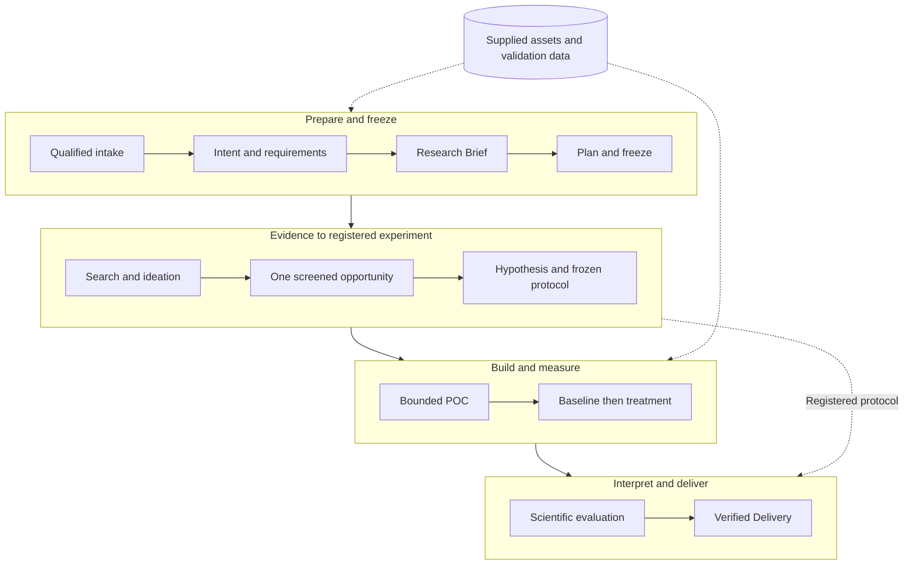
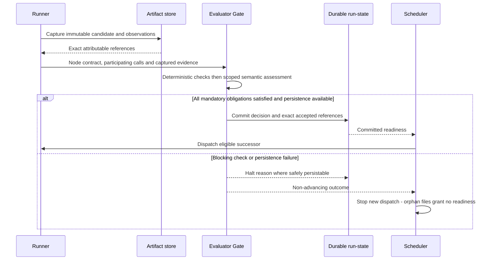

# Full M1: responsibilities and data handoffs

M1 contains a local research journey and operational shell in Delivery Phase 1, independent local-isolated RSI Target 1 in Delivery Phase 2, and expected bounded dynamic integration work in Delivery Phase 3. [Every phase and stage](delivery-phases.md) has an explicit dependency/exit mapping. [Intent Compilation and Verification Slice (formerly TRIAL-1)](immediate-plan.md) implements its first connected boundary. This page plans the remaining system shape; detailed contracts and implementation decomposition belong to Spec Kit. Read the [PRD translation](glossary.md) and [source disposition](coverage.md) alongside it.

## Research path and ports

The table names **semantic ports**, not final wire fields. Each work output is a candidate until deterministic checks, its assigned verifier, and the protected gate accept the exact artifact. Downstream nodes receive accepted references through the runner. Original requests, resources, and the Research Brief remain available where the declared responsibility needs them; the pipeline is not a chain of lossy text summaries.

| Responsibility / source | Needed inputs | Output and next consumer | Important bounds |
|---|---|---|---|
| Intake / §3.1 | Original objective, local profile, permitted document paths, supplied project and validation resources | Qualified intake to Intent; separate resource bindings to requirements, Hypothesis, Builder, Benchmark | `.txt`, `.md`, `.pdf` extraction; readability/size qualification and origin metadata. No repository cloning, dataset downloading, or ingestion web search. Identity binding for release is distinct from intake signing. |
| Intent / §3.2.1–4, §4.7, D5 | Original objective and qualified context | Accepted intent to Requirement compiler | Preserve omissions, conflicts, constraints, and scope without choosing a solution. Intent Compilation and Verification Slice accepts text only. |
| Requirements / §3.2, §4.7, D5 | Accepted intent, original context, supplied resource references, fixed policy/defaults | `Research_Brief.json` to Planner and all research responsibilities | Mandatory outcomes vs preferences, scope, constraints, metrics, evidence obligations, explicit authorized assumptions. Material uncertainty blocks readiness; defaults are marked as defaults, never attributed to the user. |
| Static binder / §6.5; Delivery Phase 3 planner / §4.8, D1 | Accepted Brief, eligible library snapshot, resource bindings, policy and limits | Checked candidate graph, then frozen graph to Scheduler | Baseline binds the fixed sequence without autonomous planning; Delivery Phase 3 may propose compatible nodes. Both preserve responsibilities/coverage and Node Execution Contracts; no live restructuring. Future port values stay references. |
| Search and ideation / §3.3 | Brief, local extracted documents, permitted academic connectors | `Candidate_Set.json` to Screening; cited source evidence retained for later consumers | Fixed query strategy; bounded local and designated academic retrieval, grouped exact source excerpts, 1–3 grounded ideas. No open-web crawler, search swarm, or iterative query repair. |
| Screening / §3.4 | Accepted candidates and citations, Brief constraints | `Opportunity_Card.json` to Hypothesis; rejected/deferred reasons and scoring evidence retained | One-pass consolidation; novelty, feasibility, compute alignment on 1–5 scales with reasons; forbidden dependencies filtered. Baseline sum and Top-1 are retained. Tie/missing-score policy is fixed before use. Pure `rank_opportunities` helper is the independent RSI target; candidate improvement does not rewrite incoming dimensions or verifier criteria. |
| Hypothesis / §3.5 | Accepted opportunity, Brief, supplied baseline and validation resource, cited assumptions | `Hypothesis_Blueprint.json` with frozen protocol to Builder, Benchmark and Evaluation | One claim, mechanism, independent/dependent variables, baseline, fixed measurement functions, success/falsification thresholds and middle-region classification. No invented validation data or actual build code. |
| POC builder / §3.6, §4.9 | Accepted blueprint/protocol, Brief, scoped supplied project assets | `POC_Artifact_Bundle.zip` to Benchmark; build evidence to verifier | Bounded `poc_patch.py`, `run_benchmark.py`, declared `requirements.txt`, environment description. Permitted local CodeSearch; mechanical syntax/readiness only. No dependency installation, scientific trial, large refactor, or repair loop during build. Apply §3.6.2 forbidden-module use/import checks before release; [confinement](placement.md#deployment-and-boundaries) is a separate required boundary. |
| Scientific benchmark / §3.7 | Accepted package, frozen protocol, baseline, fixed validation resource and dependencies | `Benchmark_Payload.json`, empirical results, stdout/stderr and execution evidence to Evaluation | Protected provisioning installs only frozen declarations under restricted identity. Baseline first then treatment, same hardware/data/configuration/seed policy. No threshold changes, dependency-set mutation, or interpretation. Missing environment blocks. |
| Scientific evaluation / §3.8 | Accepted measurements and raw logs, frozen Blueprint, Brief | `Evaluation_Verdict.json` to Delivery | Check empirical origin, complete metrics, validity and pre-registered criteria. No new live leaderboard query, experiment rerun, or post-result threshold change. Record conclusions, residual risks and proposed follow-ups. |
| Delivery / §3.9 | Accepted evaluation, Brief, citations, Blueprint, package and benchmark evidence | Standard Markdown report and evidence package to control plane, then user | Preserve claims, methods, measured delta, scientific verdict, warnings, limits and follow-ups. Use the PRD's standard report structure. No publication or knowledge write-back; valid negative findings are delivered. |

The Delivery Phase 1 operational graph keeps this sequence and supplies the reversible fallback. Delivery Phase 3 D1 permits selecting compatible admitted implementations before freeze; it does not authorize removing these obligations, multiple competing hypotheses, or parallel experimental arms. Each stage may organize private helpers, but a helper does not acquire a new workflow role or broader permissions.

## Checking responsibilities

PRD §4.2 groups six evaluation facets; these are profiles/check obligations, not six mandatory services. Tier 1 handles decidable claims; Tier 2 handles the remaining semantic questions using supplied evidence. The protected host aggregates and releases. The [verification boundary](capsules.md#exact-verification-boundary) applies uniformly.

| Facet | Architectural obligation |
|---|---|
| Contract/schema/artifact conformance (§4.2.2) | Validate port meaning, completeness, scope, subject binding and required evidence. |
| Engineering/code quality (§4.2.3) | Check the bounded build and applicable tests/readiness without converting the verifier into a repair agent. Preserve actual test outputs. |
| Performance/cost/benchmark (§4.2.4) | Check comparable protocol execution and declared limits; token/cost absence stays unavailable. Distinguish platform evaluation from scientific measurement. |
| Security/privacy/IP (§4.2.5) | Enforce scoped effects and restricted execution; check secrets, allowed tools/dependencies, licensing and attribution within M1's supported checks. No fabricated comprehensive legal certification. |
| Evidence/factuality/science (§4.2.6) | Check grounding, measured provenance and correct application of registered scientific criteria. Scientific interpretation remains the Evaluation CC's responsibility. |
| Lifecycle/parity/human review (§4.2.7–8) | Verify real execution, complete transitions, unchanged accepted subjects and durable decisions. Route blocking states to triage or headless halt; a human edit creates new attributable work and cannot override a failed mandatory check. |

PRD §4.2.9 requires intentional failures as well as advancing examples: malformed artifacts, stale/swapped evidence, unavailable environment, timeout, security/effect violation, uncertainty, gate locking, and valid scientific-negative delivery. Spec Kit owns the concrete cases and measured acceptance thresholds. A happy path and a structurally valid graph do not establish the full boundary.

## Data and state ownership

| Information | Writer / authority | Readers and compatibility obligation |
|---|---|---|
| Product account and durable profile | Account/profile adapter under authenticated user authority | Stable user ID distinct from OS identity, persistent defaults outside run/workspace lifetime; optional cloud-backed store never owns local release state. |
| Node Execution Contract and bindings | Protected binder from accepted requirements, admitted pins and policy | CC runner and Evaluator Gate; node-specific immutable authority, participating invocation IDs and artifact bindings are exported with evidence. |
| Original request and resource registration | Intake under run-state authority | Compilers and authorized work/verifiers; preserve raw content and origin before normalization. Required mutable local assets need a captured snapshot or validated identity before consumption. |
| Effective configuration and graph freeze | Configuration resolver and protected freeze path | Runner, scheduler, model bridge, verifiers and exports; record requested vs effective state. Changes affect future runs. |
| Attempt evidence and artifacts | Runner captures observations; artifact store retains immutable content | Gate, downstream accepted consumers, record builders, user inspection. Failed/pre-gate attempts remain attributable; candidate data is inspectable as unaccepted, never advertised as a released result. |
| Check results, raw assessment, final gate decision | Protected check runner, verifier invocation, protected gate host respectively | Run-state commits release or halt; scheduler consumes committed readiness. Files are persisted before accepted references become visible; orphan files after failed commits grant no readiness. |
| Raw run evidence / Run Bundle | Capture infrastructure | Local inspection and permitted exports; retain prompts, tool calls, build/measurement logs, versions and static host facts once at run start. Redact credentials and maintain fixture custody. |
| Capsule Run Record / conformance / scorecard | Derived record builders after execution | Offline analysis and planners where comparisons are appropriate; include schema version, source identities, missing observations and sample counts. Regeneration never rewrites historical decisions. |
| Export and RSI development handoff | Export builder under explicit audience policy | Benchmarker or offline proposer gets only its allowed data. Keep protected evaluation data out of exports, prompts and general-purpose volumes. |
| Library version, lineage, admission, activation | Publishing/admission infrastructure; human controls activation | Plans use eligible snapshots; frozen runs pin versions. Suspension is checked at start/release. Rollback changes future selection, preserving old evidence. |

Store authoritative release state in SQLite and retain PRD-compatible append-only records, per-run files, bundles, static scorecards and exports. This is the explicit D6 persistence realization, not permission to replace portable evidence with a database-only product. Native memory contains compact reasoning summaries/references and is never the gate's authority.

## Commit before successor release

Candidate files may survive a failed commit for diagnosis, but they are not accepted references. Transaction/write-order implementation and crash tests belong to the data/gate owners.

## Operational shell

**Required for full M1 (§5.1–5.6).** Adapt native CLI, web and TUI to the same control plane. CLI submits research, observes transitions and returns human-readable or structured completion; web captures objectives and renders status/report; TUI supplies native inspection and interactive triage. Headless execution never waits on `human_session`. Browser closure leaves the engine running. Restart preserves accepted artifacts, marks interrupted work paused, and does not automatically replay uncertain effects.

Startup automates workspace scaffolding, version-locked capsule seeding, protected state/configuration locations, provider readiness and health diagnostics. Keep `pip install jiuwenswarm` / `jiuwenswarm-start` as the native workstation entry points; D6 adds a packaged Compose entry with equivalent behavior, documented by the implementation task. Docker tooling does not become a second workflow implementation. Doctor distinguishes authenticated model readiness, storage readiness and mandatory isolation from basic HTTP liveness. Full offline RSI also checks fixture isolation before evaluation.

Use stable product-account attribution and durable profile defaults, machine-local execution overrides, project-over-global precedence, protected local token, loopback endpoint and protected model IPC. Profile deletion is separate from workspace/run deletion and requires explicit user action. Keep status tokens and provider credentials out of logs and exported bundles. Local terminal/tmux sessions are inspection/control surfaces, not extra agents or execution authorities. Privacy separates approved account/profile persistence from local project assets, prompts, traces and hidden data; deletion is explicit, never an automatic repair operation. Capture static hardware facts, not continuous host-resource dashboards. No desktop binaries, external chat channels, remote worker deployment or custom workflow editor are added. Cluster Mode is local agent orchestration; optional cloud account/profile storage does not imply cloud research-data synchronization.

## Extension boundaries beyond the first build

| Extension capability | Boundary to preserve now | Current effort or deferred execution |
|---|---|---|
| Advanced compiler | Accepted Brief meaning, attribution, versioned adapter and verification | Expected Delivery Phase 3 attempt, not blanket deferral; later richer modes need explicit supported scope. Retain bounded baseline fallback. |
| Composite CCs and fusion | Typed boundary ports, pinned closure, member evidence/checks, effects and lineage | Composite execution only when supported; fusion separately admitted against unfused reference. No opaque unchecked internal work. |
| Better planning / interaction analysis | Objective mapping, typed graph, library snapshot, evidence uncertainty, effect/precondition parity | Logical lowering, MCTS risk analysis, multiple epochs and richer search remain future decisions. |
| Additional model routes | Audited bridge, role/profile identity, actual effective route and capability constraints | Approved heterogeneous routing and alternate verifier are Delivery Phase 3 efforts; later routes reuse the seam. No silent model/context changes. |
| Broader RSI targets | Target allowlist, frozen contract and protected transitive closure, bounded evaluation/feedback, inactive lineage | Fixed improver can later be replaceable through a versioned interface; changing the referee or activation boundary is excluded. |
| Mid-run installation/removal or remote workers | Invocation/attempt identity, dependency closure, scoped resource/effect semantics, durable readiness | Separate lifecycle/lease and compensation design; removal never erases history or claims effects were undone. |
| Larger benchmark campaigns | Ordinary headless client protocol, profile pins, export versions and audience restrictions | Larger datasets, concurrency and alternate suites must respect domain/access gates and resource budgets. |

These seams preserve meaning; they do not promise support for a serialized but unimplemented feature. Unsupported required behavior blocks binding explicitly. M1 does not need a speculative broker, plugin platform, or distributed control plane to keep these options available.
