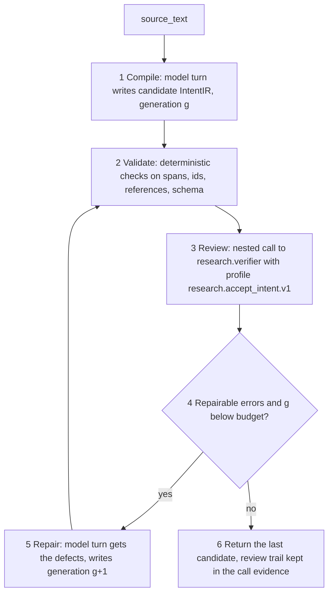

# `research.compile_intent`: what the request means

PRD: 3.2.1, 3.2.2, 4.7.1, 4.7.2, 4.7.3

> Answers: What does a request mean, as a checked IntentIR, and how does the compile call repair itself?

## What it does

Turns the request text into an **[IntentIR](../types/intent-ir.md#term-intentir)**: goals, outcomes, constraints, ambiguities, conflicts, unknowns. Every item cites exact character spans of the request.

It makes model calls, because meaning cannot be checked by rules alone. It does not trust its first answer. It compiles, [checks](../capsule/fields.md#term-check) the result against the original request, and repairs, up to a fixed budget.

This is the existing AI4Research intent compiler, converted into **two CCs**:

| CC | Job | Kind |
|---|---|---|
| `research.compile_intent` (this page) | compile, validate, review, repair, return one IntentIR | `tool`, with brokered [model turns](../system/model-bridge.md#term-model-turn) |
| `research.verifier` with profile `research.accept_intent.v1` ([intent-gate](intent-gate.md)) | independent fidelity review of an IntentIR against the request | shared `skill` [capsule](../capsule/capsule.md#term-capability-capsule) |

The second CC is a Gate-role [verifier capsule](../capsule/gate-capsules.md#term-verifier). It is used twice: inside the repair loop as a nested review call, and again, as a fresh independent call, as the [Gate](../verification.md#term-gate) `G_intent` after this CC returns.

## Where it sits

- Flow node `N_intent`, then Gate `G_intent` ([flow](../flow.md)). The requirement call starts only after `G_intent` [releases](../system/lifecycle.md#term-release).
- **Input:** [`source_text`](../types/source-text.md). **Output:** [`intent_ir`](../types/intent-ir.md). No type changes are expected. `generation` now means "repair count" (0 to the budget).
- Wiring from `intent_ir` into the requirement call: [requirement-capsule](requirement-capsule.md) and the [fixed prep plan](../system/lifecycle.md#term-prep-plan) [prep.plan.json](prep.plan.json).

## How one call runs



1. **Compile.** One model turn from `source_text` using the fixed compile prompt. The output must match the semantic authoring schema. First call is generation 0.
2. **Validate (deterministic).** Schema, id uniqueness, resolved references, span bounds. A failure marked repairable goes to step 5. Spans are bound by code from exact quotes; the model is never trusted for character offsets. If the candidate is not schema-readable, skip step 3 and go to step 4.
3. **Review (model).** A nested call to `research.verifier` with the pinned intent profile. The reviewer compares request and IntentIR and returns the six checks, each exactly once. It judges and never rewrites. The compile CC validates the reviewer's answer with the same completeness checks the [Gate host](../capsule/gate-host.md#term-gate-host) uses (six checks, each once; quotes appear verbatim in the request). A malformed review is an error in the call, never a pass.
4. **Decide.** Repairable errors and repair count below the budget: go to 5. Otherwise go to 6.
5. **Repair.** One model turn receives the previous IntentIR and the defect list and writes the next generation. Back to 2.
6. **Return.** The last candidate is the output. If blocking errors remain after the budget, the output still carries them, and the Gate will fail it. This CC never decides acceptance.

**Budget.** Repairs per call: Policy `intent.max_repairs`, default 1, hard cap 4. The budget, the review step and the pinned profile are [frozen](../system/lifecycle.md#term-freeze) parts of the [Declaration](../capsule/fields.md#term-declaration). Model turns and time per call are also bounded by the [execution profile](../schemas/profiles.md#term-executionprofile); exceeding them ends the call with the standard budget error.

**Why a review inside the CC and a Gate after it.** The loop lets the compiler fix its own mistakes cheaply. The Gate is the control-flow decision and must not depend on the loop: it re-reviews the final IntentIR from scratch in a separate call and decides advance or halt.

Schemas: review result `library-rsi-v1.schema.json#intent_fidelity_review`, repair record `library-rsi-v1.schema.json#intent_repair_record`. The review carries its six checks and one overall `result` (`pass`, `fail` or `unknown`); the field is `result`, not `verdict`, because the Gate's own [Verification](../schemas/verification-record.md#term-verification) is a separate record.

## Gate

`G_intent`: `research.verifier`, profile [`research.accept_intent.v1`](intent-gate.md). [Tier 1](../verification.md#term-tier-1) deterministic checks first, then the verifier's six fidelity checks. A fail [halts](../system/lifecycle.md#term-halt) the run before requirements.

## Declaration (`capsule.json`, abridged)

Checks are listed by id. In `capsule.json` each is a full Check object ([fields](../capsule/fields.md)).

```json
{
  "schema_version": "cc.declaration.v1",
  "identity": {"name": "research.compile_intent", "kind": "tool",
    "carrier": {"ref": "compile_intent.py:compile_intent", "sha256": "<author kit>"},
    "body": ["prompts/compile.md", "prompts/repair.md"],
    "summary": "Compile a request into an IntentIR with bounded compile, validate, independent review and repair, each item citing exact source spans."},
  "ports": {
    "inputs": [{"name": "source_text", "type": "source_text", "required": true}],
    "outputs": [{"name": "intent_ir", "type": "intent_ir", "check_id": "source_spans_exact"}]},
  "needs": {"when": [], "external": [{"ref": "research.verifier", "purpose": "fidelity review", "profile": "research.accept_intent.v1"}],
            "network": "none", "human_interaction": "none"},
  "changes": {"effect_class": "pure", "effects": [], "state_kind": "none"},
  "guarantees": {"checks": ["source_spans_exact", "generation_within_budget", "conflicts_never_self_rejected", "matches_reference (admission only)"]},
  "evolution": {"rsi": "propose",
    "may_change": ["files:compile_intent.py", "files:prompts/compile.md", "files:prompts/repair.md"],
    "notes": "Code and prompt text may change. Ports, checks, the nested verifier dependency and profile, the repair budget and permissions are frozen."}
}
```

## RSI

Allowed in M1 (a [RSI target](../capsule/rsi.md#term-rsi-target), see [decisions](../decisions.md)). May change: the compile code and the compile and repair prompts. Frozen: [ports](../capsule/fields.md#term-port) and types, checks, [effect class](../capsule/fields.md#term-effect-class) and permissions, the nested verifier dependency, the intent profile, the repair budget, and everything about the Gate. The CC makes model calls, so [Candidates](../schemas/candidate.md#term-candidate) are compared with the same model route and settings, using paired repeated calls ([rsi](../rsi.md)).

Fixture sources: the 25 live prompts of the AI4Research intent compiler, with their accepted outputs, seed the visible development [fixtures](../system/test-surfaces.md#term-fixture). Hidden loop and final fixtures are written separately and kept in the oracle ([benchmark material](benchmarking-material.md)).

## Checks

| Check | Source | Meaning |
|---|---|---|
| shape, unique ids, resolved references, well-formed spans | type `intent_ir` | true of any IntentIR |
| `source_spans_exact` | this capsule | every span lies inside the input text |
| `generation_within_budget` | this capsule | `generation` is at most the policy repair budget |
| `conflicts_never_self_rejected` | this capsule | conflicts become clarification questions, never silently rejected |
| `matches_reference` | admission only | on a [test case](../schemas/checks.md#term-test-case), output equals the expected canonical JSON |

## Code work

1. Port the AI4Research compiler: compile prompt, repair prompt, semantic schema, deterministic [validator](../system/planner.md#term-plan-validator), quote-to-span binding, bounded loop. Drop its own acceptance step; acceptance is the Gate.
2. Replace its direct model access with brokered model turns, and its in-process reviewer with the nested verifier call.
3. Check functions use the [check calling convention](../schemas/checks.md#calling-convention).
4. Capsule folder: `capsule.json`, `compile_intent.py`, `prompts/`, `checks/`, `tests/cases.json`.

## Tests

- One case per admission-applied check, on fixed `source_text` fixtures with recorded model replies.
- Loop cases with recorded replies: first candidate passes review; first fails and the repair fixes it; budget spent with errors remaining; review returns a malformed answer; a model turn times out.
- Request text that tells the model to skip review or Gates changes nothing.
- Gate planted defects: faithful IntentIR; constraint removed; goal invented; unrequested execution added.

## Open

- The runner needs a caller [kind](../capsule/capsule.md#term-capsule-kind) for the nested review call: its answer is validated by the calling capsule and is not itself Gated ([decisions](../decisions.md#open)).
- Tune `intent.max_repairs` (default 1, hard cap 4) after the fixtures exist.

## Acceptance seeds

These rows seed the spec AC table. Each is derived from the behavior on this page; the coding spec sets final thresholds and fixtures. Level is [BLOCK](../v-model.md#term-block), [BOUNDARY](../v-model.md#term-boundary) or [SYSTEM](../v-model.md#term-system).

| AC ID | Source | Observable criterion | Level |
|---|---|---|---|
| cap.intent-compile.AC-01 | N_intent, US-02 | On a fixed [source_text](../types/source-text.md#term-source-text) fixture with recorded replies where the first candidate passes review, the call returns generation 0 with exactly 1 compile turn and 1 nested review call. | BLOCK |
| cap.intent-compile.AC-02 | N_intent, US-02 | When the first candidate has a repairable error and budget remains, the call returns generation 1 after exactly 1 repair turn; generation never exceeds policy intent.max_repairs (default 1, hard cap 4). | BLOCK |
| cap.intent-compile.AC-03 | N_intent | When blocking errors remain after the repair budget, the call still returns the last candidate with errors attached and makes no acceptance decision (G_intent fails it). | BLOCK |
| cap.intent-compile.AC-04 | N_intent | A nested review answer that omits a check, repeats one, or quotes text absent from the request is recorded as a call error, never as a pass. | BLOCK |
| cap.intent-compile.AC-05 | N_intent | Every span in the returned intent_ir lies inside the source text and is bound by code from exact quotes; a model-supplied offset is never used. | BLOCK |
| cap.intent-compile.AC-06 | N_intent | A request text that tells the model to skip review or Gates leaves the turn count, the review call and the Gate unchanged. | BLOCK |
| cap.intent-compile.AC-07 | N_intent, US-12 | A model turn timeout ends the call with the standard typed error, keeps capture, and starts no second paid turn automatically. | BOUNDARY |
| cap.intent-compile.AC-08 | US-02, G_intent | The compile, review and repair turns are visible in one call record and the Gate dispatches a separate fresh review call; the requirement call starts only after the Gate release. | SYSTEM |
