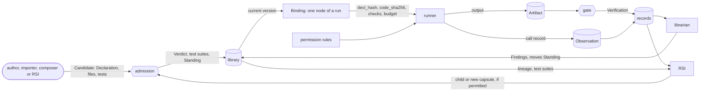

# Capability Capsule

A **capability capsule** (能力胶囊) describes one capability the system can run. The description is the **[Declaration](fields.md)**: what the capability takes, gives, needs, changes and promises, and what RSI may do with it. It refers to the capability's code by the code's hash; it does not contain the code. CC itself runs nothing: [tools](tools.md) read the Declaration and write records about the capsule.

> **A 能力胶囊 is flexible in form and strict in verification and quality assurance.**

Five ideas:

1. **It declares.** Every promise is stated before the capsule runs, so it can be checked and found wrong.
2. **It points, never holds.** The Declaration names its code by hash, like a label on a box.
3. **It is a graph.** Usually a **singleton**, one capability as a one-node graph; sometimes a composite, a graph of capsules.
4. **Flexible in form, strict in checking.** A tool, a skill, an MCP tool, an agent, a gate or a delivery step all fit one schema, and all pass the same admission.
5. **Nothing judges itself.** Tests that certify a capsule come from someone else, and the referee is protected.

## Find your answer

| Question | Page |
|---|---|
| What does a capsule hold? | [Declaration](fields.md): every field, with an [example](fields.md#example); [a fuller, fully-typed example](example-compile-intent.md) |
| How do I author a capsule from a tool I have? | [Authoring a capsule](authoring.md) |
| Why does CC exist? | [Why CC](why.md) |
| How do capsules combine? | [Composition](composition.md) |
| Where are capsules and their tests stored, and how do they get in? | [Library](library.md) |
| How much is a capsule trusted, and why? | [Trust](trust.md) |
| How does the system improve or add capsules? | [RSI](rsi.md), [generalist](generalist.md), [a full generalist example](example-generalist.md) |
| What is recorded when a capsule runs, and how is quality measured? | [Observability and quality](observability.md) |
| What may a capsule touch in jiuwenswarm? | [Permissions](permissions.md) |
| Which tool checks what? | [Tools](tools.md#which-tool-checks-each-field) |
| What does M1 require? | [Checked and unchecked at M1](stages.md) |
| Where do the ideas come from? | [References](references.md) |

## One schema, many roles

CC is a schema connected to a series of tools. The same Declaration serves every part of the system that touches a capability:

| Role | What the Declaration gives it | Tool |
|---|---|---|
| selection | ports, preconditions, effect class, summary: what may be picked for a call | selection index, [Symphony](symphony.md) |
| admission | hashes, checks, rules: what may enter the library | admission |
| running | the code by hash, the kind: how to call it, and whether the code is the code that was tested | runner |
| verification | checks on every output: what each gate checks | check runner, gate |
| permissions | effects, network, dependencies, secrets: what a call may touch | [permission layer](permissions.md), sandbox |
| the library | versions, lineage, test suites: what is stored and what is current | library store, librarian |
| improvement | RSI permissions, lineage, parent suites: what may change and how it is tested | [RSI](rsi.md) |
| composition | members and wiring: capsules made of capsules | composer |
| observability and quality | the record of every call against its declaration ([observability](observability.md)) | runner, gate, librarian |
| import and sharing | a Declaration for any outside tool, skill or server | importer, store |

## This folder

This folder is enough to understand CC. Each fact is stated once and linked from everywhere else.

| Page | What it holds |
|---|---|
| [Why CC](why.md) | the problem, the evidence, what openJiuwen lacks |
| this page | what a capsule is, its kinds, the rules, and everything it connects to |
| [Declaration](fields.md) | what a capsule holds: every field, its type, and what it is for |
| [Authoring](authoring.md) | how to turn a tool into a capsule, step by step |
| [Composition](composition.md) | A, B, A-B and AB: capsules made of capsules |
| [Library](library.md) | storage, the tree of versions, test storage, admission, a capsule's life, the librarian, screening sets |
| [Observability and quality](observability.md) | the record of every call, declared against observed, and how quality is measured |
| [Trust](trust.md) | trust levels, dependency pinning, what raises and lowers trust |
| [RSI](rsi.md) | RSI permissions, improving capsules, building capsules from gaps |
| [Generalist](generalist.md) | the low-trust capsule that fills gaps |
| [Permissions](permissions.md) | how a capsule's declarations become jiuwenswarm permission rules |
| [Symphony](symphony.md) | what agent-core's Symphony does, and how CC plugs into it |
| [Tools](tools.md) | the tools around a capsule, and which tool checks each field |
| [Checked and unchecked at M1](stages.md) | what M1 requires and tests, and what each unchecked field unlocks |
| [References](references.md) | the papers and designs CC draws on |

## Kinds of capsule

One schema covers every kind. The kind tells the runner how to call it and admission how to test it. The values are the `capsule_kind` registry in the [policy](../schemas/policy.md).

| Kind | What it is | M1 |
|---|---|---|
| `tool` | a function or service called directly | checked |
| `skill` | a Markdown skill that a model follows; its files are hashed one by one | checked |
| `prompt_section` | a piece of prompt text inserted into a model call | checked |
| `mcp` | a tool exposed by an MCP server | unchecked |
| `a2a` | a remote agent reached over the A2A protocol | unchecked |
| `subagent` | an agent started for one task | unchecked |
| `agent_template` | a reusable agent definition, such as a [generalist](generalist.md) | unchecked |
| `composite` | a capsule made of other capsules; see [composition](composition.md) | unchecked |

A kind says how a capsule runs, not what job it does. A gate, a verifier or a delivery step is a capsule of one of these kinds.

## Rules

1. **Any node can be a capsule.** Work steps, gates, verifiers and delivery can all be capsules. What is not a node stays outside: admission, the library, the librarian and the record stores.
2. **A capsule declares** what it takes, gives, needs, changes and promises, in its [Declaration](fields.md).
3. **It refers to its code by hash.** If the code changes, the hash no longer matches and the runner refuses to load it.
4. **Its dependencies are always pinned.** A dependency with a stated purpose may be re-pinned to a newer version by RSI, as a new version that passes admission ([RSI](rsi.md#updating-dependencies)).
5. **Declare first, then check.** Every promise has a check, and every call is recorded as an [Observation](../schemas/observation.md). Authors declare each capability's effect class (how reversible its changes are); tools check that the declaration holds.
6. **A capsule holds no task** (INV-7). Which run uses which capsule, and in what role, is recorded outside it, in a [Binding](../schemas/binding.md).
7. **RSI is opt-in.** RSI may change a capsule only if its Declaration allows it, and only the parts it lists in `evolution.may_change`; everything else stays fixed ([RSI](rsi.md)).
8. **Nothing judges itself** (INV-10). No capsule gates its own output; certifying needs tests written by someone else; gates and verifiers are not RSI-able for now ([trust](trust.md#referees)).
9. **Some things are protected.** No capsule writes admission, the test suites, the [policy](../schemas/policy.md) or the record stores. Model weights never change.
10. **Every capsule is a graph of capsules.** Most are **singletons**: one node, its own code. A composite has members instead. A capsule has its own code or members, never both ([composition](composition.md)).
11. **A capsule's output is always an [Artifact](../schemas/artifact.md).** The runner writes the records.
12. **Models are not part of the capsule layer.** Selection picks capsules, never models ([details](fields.md#needs-what-must-hold-and-what-it-uses)).

A **gate** folds check results into `pass`, `fail` or `blocked`, with the folding rules in the policy. A gate may be control code or a capsule. A gate capsule returns its decision as an Artifact, like any capsule; control code writes the Verification from it (INV-3).

## What a capsule connects to

| Connects to | What it is to a capsule |
|---|---|
| [Candidate](../schemas/candidate.md) | how a capsule is submitted: its Declaration, files and tests |
| [Verdict](../schemas/verdict.md) | admission's decision on one version, with its trust level |
| [Test cases, test suites](../schemas/checks.md) | the stored tests that re-run for every child |
| [Standing](../schemas/standing.md) | which version of a name is current, and its state |
| [Binding](../schemas/binding.md) | the pin that makes a capsule one node of a run |
| [Observation](../schemas/observation.md) | the record of one call |
| [Artifact](../schemas/artifact.md) | one value the capsule produced or used |
| [Verification](../schemas/verification-record.md) | the gate's check of one call's output |
| [Finding](../schemas/finding.md) | something learned later: a gap, drift, a measurement |
| [Port types](../schemas/port-types.md), [policy](../schemas/policy.md), [invariants](../schemas/invariants.md) | the shared vocabulary, rules and defaults every capsule is checked against |
| [Permissions](permissions.md) | the jiuwenswarm rules its declarations become |
| [Symphony](symphony.md) | the index and planner that see admitted capsules |
| Other capsules | as dependencies (`needs.external`), as members of a [composite](composition.md), as parents and children through lineage, and as [sets that may fail together](library.md#when-good-capsules-are-bad-together) |

Who writes each record is in the [records table](../schemas/schemas.md#the-records).

CC supports four verbs, each done by tools: **pick** a capsule for a call, by its ports, effect class and Standing; **verify** that the code that runs is the code that was tested, and that each output passes its checks; **improve** it by building a new version from evidence; **remove** it by retiring or revoking it, undoing its effects where it declared how.

## When a call goes wrong (proposed)

A capsule should finish its job whenever it can. The rule is INV-19; this is what it means:

1. **By default, complete the Declaration.** The capsule returns an output that matches its declared ports, even when the input is vague, contradictory or incomplete. It puts the difficulty inside the output as data: an ambiguity, an unknown, a partial result. The checks and the gate judge it.
2. **A declared failure mode is the only way to end without an output.** The capsule lists them in `guarantees.failure_modes`. The runner records the failure as an Observation with `outcome: error` and its code, and the policy folds it into `fail` or `blocked`.
3. **An undeclared exception is a bug.** The runner records it as `CAPSULE_RAISED_UNDECLARED`, and the gate always folds it into `blocked`. A capsule cannot turn a bug into a soft failure by raising.

Any output can also carry its caveats in the `issues` list on its Artifact. At M1, an exception is `CAPSULE_ERROR`, and the gate folds any call that does not end `ok` into `blocked` (policy `gates`). These proposals are unchecked; they unlock retries, fallbacks, quality labels, and RSI learning from failure types.
