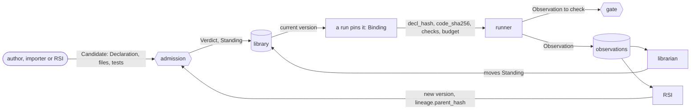

# Capability Capsule

A **capability capsule** (能力胶囊) describes one capability the system can run. The description is the **Declaration**: what the capability takes, gives, needs, changes and promises. The Declaration refers to the capability's code by the code's hash; it does not contain the code. CC itself runs nothing. [Tools](tools.md) read the Declaration and write records about the capsule.

> **A 能力胶囊 is flexible in form and strict in verification and quality assurance.**

## Kinds of capsule

One schema covers every kind. The kind tells the runner how to call it.

| Kind | What it is |
|---|---|
| `tool` | a function or service called directly |
| `skill` | a Markdown skill that a model follows; its files are hashed one by one |
| `prompt_section` | a piece of prompt text inserted into a model call |
| `mcp` | a tool exposed by an MCP server |
| `a2a` | a remote agent reached over the A2A protocol |
| `subagent` | an agent started for one task |
| `agent_template` | a reusable agent definition |
| `composite` (unchecked at M1) | a capsule made of other capsules; see [composition](composition.md) |

Code we host is hashed file by file. A remote service we cannot hash (a remote MCP server, an A2A agent) is pinned by endpoint and version instead. That pin proves what was pinned, not what the service runs.

## Where CC is going

**Now:** a schema for our own system. Every capability the system uses is declared, checked, pinned and improved the same way.

**Later:** a user installs a tool, skill or MCP server from anywhere. It goes through an isolated verification cycle and comes out as a capsule. Its Declaration, checks and [Verdict](../schemas/verdict.md) tell anyone what it does and how well. Capsules can then be shared through stores or repositories, each carrying its Declaration, checks and Verdict as evidence of what it does and how well.

## Rules

1. **A capsule declares** what it takes, gives, needs, changes and promises, in its [Declaration](../schemas/declaration.md).
2. **It refers to its code by hash.** If the code changes, the hash no longer matches and the runner refuses to load it.
3. **Declare first, then check.** Every promise has a [check](../schemas/checks.md). Every call is recorded as an [Observation](../schemas/observation.md). Authors declare each capability's effect class (how reversible its changes are); tools check that the declaration holds.
4. **A capsule holds no task.** Which run uses which capsule is recorded outside it, in a [Binding](../schemas/binding.md).
5. **Nothing that decides is a capsule.** Admission, gates and planners are control code. A capsule may assess an output and report a result; control code decides what happens next.
6. **No capsule is its own final judge.** Admission runs the submitted tests itself. The builder's own results are kept but never count. Certifying a capsule needs tests written by someone else.
7. **Some things are protected.** No capsule writes the gates, the test suites, the [policy](../schemas/policy.md) or the record stores. Model weights never change.
8. **A capsule is a leaf or a composite, never both.** A leaf has its own code; a composite refers to other capsules.
9. **A capsule's output is always an [Artifact](../schemas/artifact.md).** Control code writes the records.

A **gate** in these pages is control code that folds check results into `pass`, `fail` or `blocked`. The rules that fold them live in the policy.

Admission gives a level: `provisional` (the capsule's own checks pass), `certified` (a sealed suite written by someone else also passes; unchecked at M1) or `exempt` (for capabilities that cannot be checked in advance; every call records a trajectory; unchecked at M1).

## What CC does

CC supports four verbs. Each is done by tools, not by the capsule.

| Verb | What it means | What it reads |
|---|---|---|
| **Pick** | choose a capsule for a call, by its ports, effect class and current [Standing](../schemas/standing.md) | name, summary, ports, effect class, Standing |
| **Verify** | prove the code that runs is the code that was tested, and that each output passes its checks | hashes, checks, output ports, effects |
| **Improve** | build a new version from evidence; a version with the parent's interface must also pass the parent's tests | lineage, tests, Observations, [Findings](../schemas/finding.md) |
| **Remove** | retire or revoke a capsule, and undo its effects where it declared how | Standing, `needs`, each effect's `undo` |

## A capsule's life

1. An author, an importer, or RSI (recursive self-improvement: code that builds new capsule versions from evidence), submits a [Candidate](../schemas/candidate.md): a Declaration, the files and tests.
2. **Admission** checks the Declaration, hashes the files again, runs the tests and writes a Verdict. If it admits the capsule, it adds a Standing entry to the **library**, the store of admitted capsules keyed by hash.
3. A run **pins** one capsule version for one call in a [Binding](../schemas/binding.md): its `decl_hash`, `code_sha256`, checks, budget and verifier.
4. The **runner** checks the hashes, calls the capsule, stores its output as an Artifact, writes an Observation and asks the gate to check the output.
5. The librarian and RSI are unchecked at M1. The **librarian** reads Observations and Findings over time and moves the Standing. RSI reads the same records and submits a new version, which starts again at admission.

## How capsules let the system improve itself

RSI (recursive self-improvement) is code that builds new capsule versions from evidence. Capsules give it two ways to make the system better:

1. **More capsules, so the system can do more.** When the system authors a new capsule, for example to close a gap a Finding reports or by wrapping an outside tool, it can do something it could not do before. A capsule the system wrote goes through the same admission as one a person wrote.
2. **Better capsules, so each thing it does gets better.** RSI submits a child of an existing capsule (`lineage.parent_hash`). A child with the same `interface_hash` must pass its parent's test suites as well as its own. A child that changes the interface needs new test cases and records the parent's suite as `inherited_from_hash`. The child becomes current only when admission admits it. The parent stays in the library for rollback.

**Why capsules make this easier.** Each capsule is isolated and testable on its own: it has declared ports, effects and checks, and tests bound to its interface. A change can be tested on one capsule, against its own tests. How it fits a workflow is still checked at the gate. A version that fails its tests stops at admission, and live outputs are still checked at the gate. Every call leaves an Observation, so RSI can see which capsule to improve.

RSI is built on a separate branch that shares this schema. Its fields are in the schema, but M1 does not require or test them.

## When a call goes wrong (proposed)

A capsule should finish its job whenever it can. Three rules:

1. **By default, complete the Declaration.** The capsule returns an output that matches its declared ports, even when the input is vague, contradictory or incomplete. It puts the difficulty inside the output as data: an ambiguity, an unknown, a partial result. The checks and the gate judge it. This is "label for quality": a weak result passes with a label, while a safety breach stops the call.
2. **A declared failure mode is the only way to end without an output.** The capsule lists them in `guarantees.failure_modes`: each has a `reason_code` unique to the capsule, a `when`, and whether it is `retriable`. Codes are only ever added, never removed. The runner records the failure as an Observation with `outcome: error` and that code, and the policy folds it into `fail` or `blocked`.
3. **An undeclared exception is a bug.** The runner records it as `CAPSULE_RAISED_UNDECLARED`, and the gate always folds it into `blocked`, never `pass` or `fail`. A capsule cannot turn a bug into a soft failure by raising.

Any output can also carry its caveats in a standard `issues` list on its Artifact. At M1, the gate folds any call that does not end `ok` into `blocked` (policy `gates`). The code `CAPSULE_RAISED_UNDECLARED`, `failure_modes` and `issues` are proposed and unchecked. They unlock automatic retries, fallbacks, quality labels, and RSI learning from failure types.

## Read next

- [What each field is for](fields.md)
- [Tools](tools.md)
- [Stages](stages.md)
- [Composition](composition.md)
- [A possible first design](../first-design.md): one way a first system could use CC.
- [Terms](../background/terms.md)
