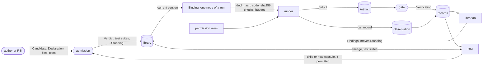

# Capability Capsule

PRD: 4.1.1, 4.1.2, 4.1.4

> Answers: What is a Capability Capsule and where is each part of it defined?

A **capability capsule** (能力胶囊) describes one capability the system can run. The description is the **[Declaration](fields.md)**: what the capability takes, gives, needs, changes and promises, and what [RSI](../rsi.md#term-rsi) may do with it. It refers to the capability's code by the code's hash; it does not contain the code. CC itself [runs](../system/lifecycle.md#term-run) nothing: [tools](tools.md) read the [Declaration](fields.md#term-declaration) and write records about the capsule.

> **A 能力胶囊 is flexible in form and strict in verification and quality assurance.**

Five ideas:

1. **It declares.** Every promise is stated before the capsule runs, so it can be checked and found wrong.
2. **It points, never holds.** The Declaration names its code by hash, like a label on a box.
3. **It is a graph.** Usually a **singleton**, one capability as a one-node graph; sometimes a composite, a graph of capsules.
4. **Flexible in form, strict in checking.** A tool, a skill, an MCP tool or an agent fits one schema, and all pass the same admission. M1 admits `tool` and `skill`; the verifier is one such capsule.
5. **Nothing judges itself.** Tests that certify a capsule come from someone else, and the referee is protected.

## Find your answer

| Question | Page |
|---|---|
| What does a capsule hold? | [Declaration](fields.md): every field, with an [example](fields.md#example); [a fuller, fully-typed example](../capabilities/intent-compile.md) |
| How do I author a capsule from a tool I have? | [Authoring a capsule](authoring.md) |
| Why does CC exist? | [Why CC](why.md) |
| How might capsules combine later? | [Future state: composition](future-state.md#composition) |
| Where are capsules and their tests stored, and how do they get in? | [Library](library.md) |
| How much is a capsule trusted, and why? | [Trust](trust.md) |
| How does the system improve or add capsules? | [RSI](rsi.md); later: [generalist and example](future-state.md#generalist) |
| What is recorded when a capsule runs, and how is quality measured? | [Observability and quality](observability.md) |
| What may a capsule touch in jiuwenswarm? | [Permissions](permissions.md) |
| What happens when a node runs a capsule? | [Runner](runner.md) |
| Which tool [checks](fields.md#term-check) what, and what is still deferred? | [CC tooling and field enforcement](tools.md#field-validation-and-enforcement-map) |
| Where does generated POC code run? | The provisional [M1 untrusted process boundary](process-boundary.md) |
| What does M1 require? | [Checked and unchecked at M1](stages.md) |
| Where do the ideas come from? | [References](references.md) |

## Key terms

| Term | Meaning |
|---|---|
| **Capability Capsule** (also: CC, capsule, capsules) | One capability the system can run, described by its Declaration and pointing at its code by hash. CC itself runs nothing; tools read the Declaration and write records about it. |
| **capsule kind** (also: capsule_kind, kind) | How a capsule runs, not what job it does: `tool`, `skill`, `prompt_section`, or the unchecked `mcp`, `a2a`, `subagent`, `agent_template` and `composite`; M1 checks the first three. The runner calls each kind its own way and admission tests it that way. |

## One schema, many roles

CC is a schema connected to a series of tools. The same Declaration serves every part of the system that touches a capability:

| Role | What the Declaration gives it | Tool |
|---|---|---|
| selection | [ports](fields.md#term-port), preconditions, [effect class](fields.md#term-effect-class), summary: what a planner may pick for a call (in M1 the planner emits a fixed template and makes no selection) | planner |
| admission | hashes, checks, rules: what may enter the library | admission |
| running | the code by hash, the kind: how to call it, and whether the code is the code that was tested | runner |
| verification | checks on every output: what each gate checks | [check runner](gate-host.md#term-check-runner), gate |
| permissions | effects, network, dependencies, secrets: what a call may touch | [permission layer](permissions.md), sandbox |
| the library | versions, lineage, [test suites](../schemas/checks.md#term-test-suite): what is stored and what is current | library store, librarian |
| improvement | RSI permissions, lineage, parent suites: what may change and how it is tested | [RSI](rsi.md) |
| observability and quality | the record of every call against its declaration ([observability](observability.md)) | runner, gate, librarian |

## This folder

Each fact is stated once and linked from the table above. Also: [Toolchain](toolchain.md) (the API of every CC tool M1 needs), [Gate host](gate-host.md) and [gate capsules](gate-capsules.md) (how every step is gated), [RSI fixture oracle](fixture-oracle.md), [Future state](future-state.md) (not M1).

## Kinds of capsule

One schema covers every kind. The kind tells the runner how to call it and admission how to test it. The values are the `capsule_kind` registry in the [policy](../schemas/policy.md).

| Kind | What it is | M1 |
|---|---|---|
| `tool` | a function or service called directly | checked |
| `skill` | a Markdown skill that a model follows; its files are hashed one by one | checked |
| `prompt_section` | a piece of prompt text inserted into a model call | checked |
| `mcp` | a tool exposed by an MCP server | unchecked |
| `a2a` | a remote agent reached over the A2A protocol | unchecked |
| `subagent` | an agent started for one task | unchecked |
| `agent_template` | a reusable agent definition, such as a [generalist](future-state.md#generalist) | unchecked |
| `composite` | a capsule made of other capsules; see [composition](future-state.md#composition) | unchecked |

A kind says how a capsule runs, not what job it does. The verifier (`research.verifier`) is a capsule of kind `skill`. [Gate](../verification.md#term-gate) decisions, the planner and Supervisor are ordinary code, not capsules ([terms](../terms.md)).

## Rules

1. **A capsule is a reusable capability.** Intent and requirement compilers, research work capabilities, search [operators](../capabilities/README.md#term-operator) and the verifier are capsules ([inventory](../capabilities/README.md)). intake, [validator](../system/planner.md#term-plan-validator), binder, Freeze, supervisor, [Gate host](gate-host.md#term-gate-host), delivery, admission, the library, the librarian and the record stores stay ordinary code ([terms](../terms.md)).
2. **A capsule declares** what it takes, gives, needs, changes and promises, in its [Declaration](fields.md).
3. **It refers to its code by hash.** If the code changes, the hash no longer matches and the runner refuses to load it.
4. **Its dependencies are always pinned.** A dependency update creates a new version through admission. M1 RSI cannot re-pin external dependencies; later dependency evolution needs a separately authorized policy ([RSI](rsi.md)).
5. **Declare first, then check.** Every promise has a check, and every call is recorded as an [Observation](../schemas/observation.md). Authors declare each capability's effect class (how reversible its changes are); tools check that the declaration holds.
6. **A capsule holds no task** (INV-7). Which run uses which capsule, and in what role, is recorded outside it, in a [Binding](../schemas/binding.md).
7. **RSI is opt-in.** RSI may change a capsule only if its Declaration allows it, and only the parts it lists in `evolution.may_change`; everything else stays fixed ([RSI](rsi.md)).
8. **Nothing judges itself** (INV-10). No capsule gates its own output; certifying needs tests written by someone else; the verifier has zero RSI-mutable components ([trust](trust.md#referees)).
9. **Some things are protected.** No capsule writes admission, the test suites, the [policy](../schemas/policy.md) or the record stores. Model weights never change.
10. **Every capsule is a graph of capsules.** Most are **singletons**: one node, its own code. A composite has members instead. A capsule has its own code or members, never both ([composition](future-state.md#composition)).
11. **A capsule's output is always an [Artifact](../schemas/artifact.md).** The runner returns the records and the supervisor commits them on its behalf.
12. **Models are not part of the capsule layer.** Selection picks capsules, never models ([details](fields.md#needs-what-must-hold-and-what-it-uses)).

A **gate** folds check results into `pass`, `fail` or `blocked`, with the folding rules in the policy. Every capsule call is followed by a Gate ([verification](../verification.md)). Its semantic part calls the one `research.verifier` capsule with a pinned rubric; the verifier returns a [`verifier_assessment`](../types/verifier-assessment.md), an assessment per criterion, never the decision. Control code, the gate host, folds it with the other checks by policy and writes the [Verification](../schemas/verification-record.md#term-verification) (INV-3).

## What a capsule connects to

| Connects to | What it is to a capsule |
|---|---|
| [Candidate](../schemas/candidate.md) | how a capsule is submitted: its Declaration, files and tests |
| [Verdict](../schemas/verdict.md) | admission's decision on one version, with its trust level |
| [Test cases, test suites](../schemas/checks.md) | the stored tests that re-run for every child |
| [Standing](../schemas/standing.md) | which version of a name is current, and its state |
| [Binding](../schemas/binding.md) | the pin that makes a capsule one node of a run |
| [Observation](../schemas/observation.md) | the record of one call |
| [Artifact](../schemas/artifact.md) | one value the capsule produced or used |
| [Verification](../schemas/verification-record.md) | the gate's check of one call's output |
| [Finding](../schemas/finding.md) | something learned later: a gap, drift, a measurement |
| [Port types](../schemas/port-types.md), [policy](../schemas/policy.md), [invariants](../schemas/invariants.md) | the shared vocabulary, rules and defaults every capsule is checked against |
| [Permissions](permissions.md) | the jiuwenswarm rules its declarations become |
| Other capsules | as dependencies (`needs.external`), as members of a [composite](future-state.md#composition), as parents and children through lineage, and as [sets that may fail together](library.md#failure-eligibility-and-failure) |

Who writes each record is in the [records table](../schemas/schemas.md#the-records).

CC supports four verbs, each done by tools: **pick** a capsule for a call, by its ports, effect class and Standing; **verify** that the code that runs is the code that was tested, and that each output passes its checks; **improve** it by building a new version from evidence; **remove** it by retiring or revoking it, undoing its effects where it declared how.

## When a call goes wrong (proposed)

A capsule should finish its job whenever it can. The rule is INV-19; this is what it means:

1. **By default, complete the Declaration.** The capsule returns an output that matches its declared ports, even when the input is vague, contradictory or incomplete. It puts the difficulty inside the output as data: an ambiguity, an unknown, a partial result. The checks and the gate judge it.
2. **Keep failure declarations economical.** Optional failure_modes identify additional enforceable hazards not already covered by types/checks/effects or standard runner codes. Each needs a matching verification obligation.
3. **An unexpected exception uses CAPSULE_ERROR.** The runner preserves diagnostic evidence and the Gate maps it by policy; an optional declaration cannot authorize missing evidence, retries or release.

Outputs may carry caveats in Artifact issues where the contract allows them. Runtime, timeout, store and security errors retain their standard infrastructure meaning. Partial evidence never becomes a passing output solely through exception handling.
