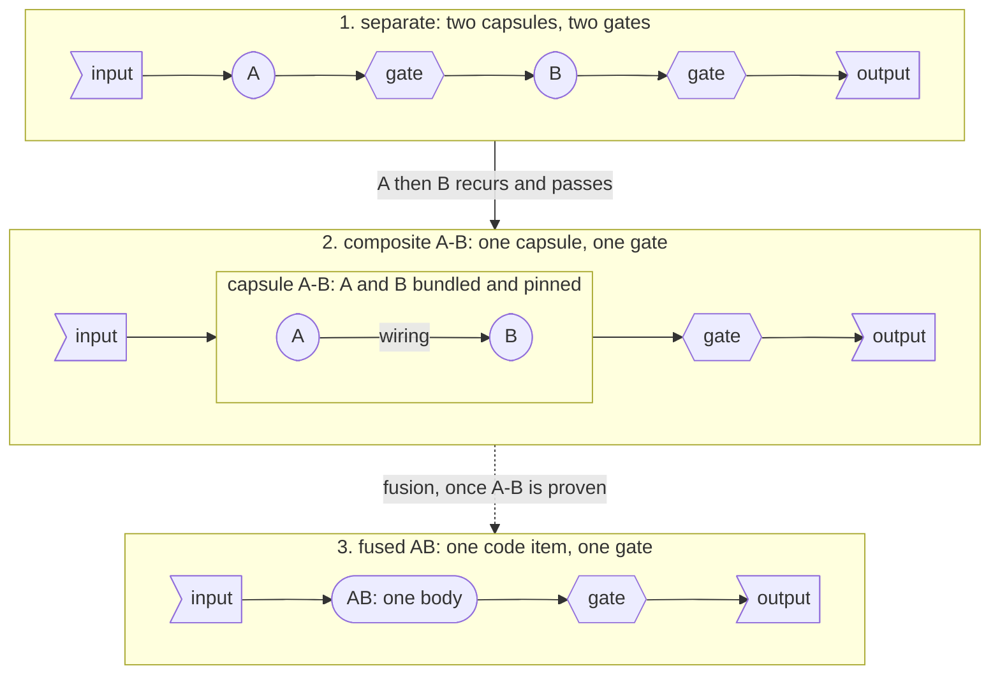

# Composition

**Unchecked at M1. Unlocks: composer.** Composition is an optional feature, not a requirement: something CC makes possible and worth having. The fields exist now, so nothing built for M1 has to change later. The idea is inspired by NVIDIA TensorRT, which fuses layers that always run together into one faster kernel once the network is known to work.

## Every capsule is a graph

A capsule is a graph of capsules, usually of one node. A **singleton**, the most common form, is a one-node capsule whose node is its own code. A **composite**'s nodes are other capsules (`members`, each pinned by `decl_hash`) and its edges are its `wiring`. A sequence, a fan-out and a tree are all graphs, so the schema has no field for the shape. A capsule has its own code or members, never both. Fields: [Declaration](fields.md#composition-capsules-made-of-capsules).

## From A and B to AB

The same task, done three ways:

1. **Separate.** There is no direct A→B. The run is A, then a gate, then B, then a gate. The gates are chosen by the workflow (the planner and the Binding), never by A or B, and gates are not RSI-able for now ([trust](trust.md#referees)).
2. **Composite A-B.** One capsule holds A and B. Both still exist as their own code in the library; A-B bundles them, pins each by hash, and wires A's output to B's input. The input of A goes in, the output of B comes out, and **the block is tested and gated as one**: one gate after A-B instead of one after each. A-B gets its own Declaration, Verdict and quality record.
3. **Fused AB.** Once A-B is known to work well, its members' code can be rewritten into a single code item: **fusion**. AB keeps A-B's ports and checks exactly (the contract is locked, the implementation is free), and A-B is the oracle AB is compared with on stored inputs. Fusion is a proposal, not decided.

**A, B, A-B and AB all stay in the library**, and any of them can be chosen. Nothing is retired by composing, and capsules are never split. The pattern extends: a composite can be a member of a larger one.

**What it buys.** The same task with streamlined testing (one block, one gate) and, after fusion, faster code, once we know A and B work well together.

## How a composite is made

1. **Observe.** Every call is an Observation, so each "A, then B" pair has a count and a pass rate.
2. **Qualify.** A pair qualifies only when it recurs **and** passes, counted over sprints (proposed: in at least 2). Symphony's `flow` already does this; see [Symphony](symphony.md#symphony-already-has-the-merge-algorithm).
3. **Propose.** The composer proposes A-B with a Declaration derived from its members: A's inputs and B's outputs as its ports, `changes` as the union of the members', `needs` as the union minus what the members supply to each other.
4. **Test as a block.** A-B must pass the union of its members' test suites plus its own.
5. **Approve.** A person approves every composite proposal before it is built. Composition is never automatic.

**The asymmetry.** If a pair fails together, it is never composed. If a pair passes, it is still not assumed to pass together: the block earns its own record.

## Rules

- **Only admitted capsules are composed.**
- **Costs.** A-B declares all of its members' effects. A retry repeats the whole of A-B, and a failure is recorded against A-B, so a failure inside the block is found less precisely than with a gate after each member.
- **When a member changes: pinned members never move.** If A gets a new version A′, A-B keeps pinning A. A-B is then stale, not invalid. A′-B is a new candidate, built only if A′ keeps A's interface and the pair is requested again. If a member becomes `suspect`, `revoked` or `retired`, the librarian moves A-B to `suspect`.
- **Lineage.** A-B's `identity.lineage` has `relation: merges`, one member as `parent_hash`, and the others in `co_parent_hashes`.
- **RSI permissions.** A composite states its own `evolution.rsi`. RSI may rebuild a composite only if it allows it, and may change a member only if that member allows it.
- **No gate inside a composite.** Gates stay outside, chosen by the workflow.

## Spatiotemporal composability

**What it means.** Capabilities can be composed in **space**, declaring what each needs and provides so dependencies are resolved when parts are added together, and in **time**, adding and removing a capability while the system runs, with its effects undone when it leaves. The term comes from Cordis, a hyper-plugin framework built around exactly this.

**Why it is held off until last.** Most production software does not do this inside the component. A separate layer does it: the operating system takes back a process's memory when it exits, and a package manager resolves dependencies, instead of every program managing both itself. Restarting is an accepted pattern too: VS Code reloads its window to apply extension changes, and Windows restarts after updates. So CC does not make each capsule responsible for undoing itself at run time. A capsule only **declares** whether its effects can be undone (`effect_class`, each effect's `reversibility` and `undo`), and another layer acts on that.

**What that means now.**

- **Between runs, restart.** A new capsule, a new version or a removal takes effect from the next sprint; a sprint keeps the versions it pinned. For testing this is all that is needed.
- **Mid-run install and uninstall** matter for long research runs, and should be allowed later. Even then, uninstall means no longer routed, and drained; it never means gone. Evidence a capsule already produced stays, and emissions to the outside world cannot be taken back.

The reserved names `changes.provides[]` and `needs.injects[]` in the Declaration are kept for the space half.

Capsules that are fine alone can still fail together without being composed. How the library screens such sets is in [the library](library.md#eligibility-and-failure).

## Open

- Nesting depth and cycles among composites.
- The fusion rules; a `relation` value for a fusion is not in the enum yet.
