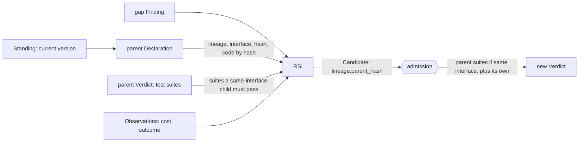

# The Declaration's fields

This page covers every field a capsule's author writes: what it is for, and whether M1 checks it. Types, required flags and rules are on the Declaration page.

- **M1** is the PRD's first milestone.
- **checked** fields are required for M1 and tested for M1 completion.
- **unchecked** fields are part of the shared schema. If present, admission checks their type and hashes them, but M1 neither requires nor tests them. Each one unlocks a tool or feature beyond the original workflow, named in the table. RSI is built on a separate branch that shares this schema.

A field serves one or more of four uses:

- **Verification:** the code that runs is the code that was tested, and outputs keep their promises.
- **RSI** (recursive self-improvement): build a new version from evidence.
- **Selection:** choose a capsule for a call.
- **Observability:** explain afterwards what ran, why and at what cost.

A Declaration also carries `schema_version` and `ext` (extensions, such as agent-core settings) from the common fields.

## Values used on this page

- **Port types.** Every port has a type from one shared list, the port type vocabulary. The base types are `text`, `integer`, `number`, `boolean`, `json` (its schema is given in `Port.value_schema`), `file` (stored by reference), `path` (a path inside the run's workspace) and `collection<T>` (a list of `T`). Domain types are added to the list with their own checks. There is no `any` type. Every type has a check that runs at the gate on every output of that type.
- **`state_kind`:** `none` (the default), `reads_external`, `session` or `persistent`.
- **`evaluable_at`:** `planning` (known before the run starts), `dispatch` (known just before the call, the default) or `both`.
- **`pass`, `fail`, `blocked`.** The gate's decision on one call's output. `blocked` means the result cannot be trusted either way: the call did not end `ok`, a check gave `unknown`, or a judge failed. It is neither a pass nor a fail.
- **Sealed suite.** A test suite written by someone other than the capsule's builder. Builders cannot read it, and it returns only pass or fail. A `certified` capsule must pass one.
- **Hash.** Lowercase hex SHA-256 over RFC 8785 canonical JSON. Files are hashed over their raw bytes.
- **Policy and epoch.** The policy holds every rule, default, threshold and required field. One version of it is an **epoch**, named (for example `e1`) and pinned by hash. Every admission and every run pins one epoch. A stricter epoch may require more fields; the schema does not change.
- **Standing states:** `admitted`, `admitted_inactive`, `deprecated`, `suspect`, `retired` or `revoked`. Admission writes only `admitted`, and only `admitted` versions are offered for selection.

## identity: what it is, and which code

| Field | M1 | What it is for |
|---|---|---|
| `identity.name` | checked | The stable handle, local to a library; `decl_hash` is the global identity. Every version of a capability hangs off it, the Standing is keyed by it, and Observations group by it |
| `identity.kind` | checked | `tool`, `skill`, `prompt_section`; unchecked: `mcp`, `a2a`, `subagent`, `agent_template`, `composite`. The runner calls each kind its own way, and admission tests it that way |
| `identity.carrier` (`.ref`, `.sha256`) | checked | The code, by hash, when it is one file that imports no unpinned local module. Admission hashes it again and refuses a mismatch (`HASH_MISMATCH`); the runner refuses changed code (`CARRIER_CHANGED`) |
| `identity.body[]` (`.path`, `.sha256`) | checked | The same for a capability of several files, such as a skill folder: every file hashed, including imported modules that are not pinned dependencies |
| `identity.summary` | checked | At most 400 characters on what it does. It is the only prose a model sees when choosing a capsule, and it names no workflow step or other capsule |
| `identity.remote` (`.endpoint`, `.version`, `.interface_version_range`) | unchecked: remote capsules | A service we cannot hash, such as a remote MCP server or an A2A agent, pinned by endpoint and version instead. The pin proves what was pinned, not what the service runs |
| `identity.namespace` | unchecked: store, importer | The publisher the name belongs to, when a capsule moves between libraries |
| `identity.owner` | unchecked: store | Who answers for it |
| `identity.tags` | unchecked: store, selection | Labels for search |
| `identity.license` | unchecked: importer, store | An SPDX licence id for imported code |
| `identity.lineage` (`.parent_hash`, `.relation`, `.co_parent_hashes`) | unchecked: RSI, tracking, merge | Where this version came from: the parent's `decl_hash` and the relation (`supersedes`, `specialises`, `merges`, `migrated_from`). For a merge, the other parents. A rollback is a Standing move, not a new version. This is the version tree RSI branches from. A child with the same `interface_hash` must pass its parent's test suites as well as its own; a child that changes the interface needs new test cases and records the parent's suite as `inherited_from_hash` |

## ports: what it takes and gives

| Field | M1 | What it is for |
|---|---|---|
| `ports.inputs`, `ports.outputs` | checked | Typed inputs and outputs, with at least one output. Checks run on every output, and selection matches and chains capsules by type |
| `Port.name`, `.type`, `.description`, `.required` | checked | Each port's name, its type from the port type vocabulary, one line on its meaning, and whether an input is required (default `true`) |
| `Port.value_schema` (`.uri`, `.sha256`) | checked | The JSON Schema of a `json` port, pinned by hash so that it cannot change under a fixed `decl_hash` |
| `Port.check_id` | checked | The check that validates each output, required on every output. A child with the same interface must keep these checks passing |

## needs: what must hold, and what it uses

| Field | M1 | What it is for |
|---|---|---|
| `needs.when[]` (Predicate `id`, `path`, `op`, `value`) | checked | Preconditions. The runner refuses a call whose precondition is false and records each result in the Observation. Selection filters out capsules that cannot run |
| `Predicate.evaluable_at` | unchecked: planner | When the precondition's fact can be known; default `dispatch` |
| `Predicate.state_source` | unchecked: selection | Where the precondition's state comes from: `inputs`, `workspace` or an external source |
| `needs.external[]` (`ref`, `pinned`, `decl_hash`, `unpinned_purpose`) | checked | The other capsules or services it calls. Admission refuses a capsule dependency that is not admitted, or a pinned one whose `decl_hash` is not admitted (`OPERATOR_NOT_ADMITTED`). An unpinned dependency states `unpinned_purpose`. Calls made through the runner are refused outside this list; in-process calls are enforced only in the isolated sandbox |
| `needs.network` | checked | `none` (the default), `egress`, `ingress` or `both`. Where a permission check or the sandbox runs, it allows only this |
| `needs.dependencies` (`runtime`, `platforms`, `packages`, `lockfile`) | unchecked: importer, isolated verification | What must be installed to run it in isolation: runtime version, platforms, packages, and a lockfile pinned by hash |
| `needs.config` (`args`, `env`) | unchecked: importer, isolated verification | Start-up arguments and environment variables that are not ports and not secrets |
| `needs.secrets[]` (`name`, `purpose`) | unchecked: isolated verification | Credentials it needs, by name only, never by value. The sandbox injects them, and the permission check allows them |
| `needs.resources` (`cpu`, `gpu`, `memory_mb`, `disk_mb`, `timeout_s`) | unchecked: isolated verification | What one call needs to run |
| `needs.model` (`min_context`, `families`, `excludes`) | unchecked: routing | Limits on the model for model capsules. Routing picks a model inside them; the capsule never picks one |

## changes: what it does to the world

| Field | M1 | What it is for |
|---|---|---|
| `changes.effect_class` | checked | `pure`, `read_only`, `idempotent`, `compensable` or `irreversible`: the author's promise about state and undo. Admission checks it against `effects`. Retries, parallelism and permissions follow from it through the policy |
| `changes.effects[]` (`resource_key`, `scope`, `idempotent`, `reversibility`, `undo`) | checked | Each effect on the world, such as `fs:workspace/out/*`. `reversibility` is `none`, `compensable` or `reversible`. Admission checks that the effects agree with `effect_class`. `undo` is text: how to undo the effect, applied by a person or a later tool |
| `changes.state_kind` | checked | Which outside state it depends on; default `none`. `reads_external` capsules ship fixtures with their tests, so the tests do not depend on the outside world |

## guarantees: what it promises

| Field | M1 | What it is for |
|---|---|---|
| `guarantees.checks[]` | checked | Every promise, as a check (see the next table); at least one. A child with the same interface must keep these checks passing |
| `guarantees.failure_modes[]` (`reason_code`, `when`, `retriable`) | unchecked: retries, fallbacks, RSI | Proposed. The only ways the capsule may end without an output. Codes are only ever added. An undeclared exception is a bug (`CAPSULE_RAISED_UNDECLARED`, also proposed), which the gate folds into `blocked`. At M1, an exception is `CAPSULE_ERROR`, and any call that does not end `ok` is `blocked` |
| `guarantees.quality` (`criterion_check_id`, `target_rate`) | unchecked: librarian | The pass rate a judged output should reach. The librarian measures the actual rate, and RSI improves toward the target |

## checks: one runnable test each

| Field | M1 | What it is for |
|---|---|---|
| `Check.id` | checked | The check's name, unique within the Declaration. `Port.check_id` refers to it |
| `Check.anchor` | checked | What a pass rests on: `deterministic` (code), `reference` (a known answer) or `judged` (a model or person) |
| `Check.target` | checked | The port or type it tests. Example: `ports.outputs.text` |
| `Check.over` | checked | What it looks at: `each_call`, `outputs` or `inputs_and_outputs` |
| `Check.applies_at` | checked | `admission` (needs a test case's expected result, so runs only at admission), `node` (runs at the gate on a live output, and at admission on test-call outputs) or `both` |
| `Check.runner` (`.ref`, `.sha256`) | checked | The pinned code that runs it; for a judged check, the rubric code, while the Binding's `verifier` pins the model-backed judge. Every result names the runner's hash |
| `Check.description`, `Check.author` | checked | What passes, in one line, and who wrote it. A certifying check is written by someone other than the builder |

## composition: capsules made of capsules

| Field | M1 | What it is for |
|---|---|---|
| `members[]` (`id`, `decl_hash`), `structure`, `wiring[]` | unchecked: composer | For `kind: composite`: the member capsules, each pinned by hash, whether they run in sequence, in parallel or as a graph, and how ports connect. See [composition](composition.md) |

## Computed by admission, never written by the author

| Value | M1 | What it is for |
|---|---|---|
| `decl_hash` | checked | The hash of the whole Declaration with every v1.0 default filled in. A field added in a later v1.x hashes as absent when it is absent, so existing `decl_hash` values never change. It is the capsule's identity and version; there is no version number. Every record about a capsule names it |
| `interface_hash` | checked | The hash of what a test depends on: name, kind, ports (without descriptions), preconditions, effect class, and each check's `id`, `target`, `anchor` and `applies_at`. Moving a file, editing the summary or updating a check's runner leaves it unchanged, so tests still apply. A child with the same interface reuses its parent's tests |
| `code_sha256` | checked | What the loader checks before every call: the carrier's hash, the hash of the `body` list sorted by `path`, of `{endpoint, version}` for a remote, or of the `members` list sorted by `id`. The run's Binding pins it |

Cost, latency and pass rate are measured from Observations, never written by the author. They are recorded in a Finding of kind `measurement` (unchecked: librarian, RSI).

## How RSI uses a capsule

RSI never edits a version; it submits a child.

The lineage index keeps the version tree and shows it to RSI. RSI's own policy chooses where to branch. No record keeps a score.

## The records kept about a capsule

The submitter (an author, an importer or RSI) writes the Candidate, which carries the Declaration. The policy and the port type vocabulary are changed by review. Tools write every other record.

| Record | M1 | Written by | What it says |
|---|---|---|---|
| Candidate | checked | author, RSI, importer | a submission: Declaration, files, tests. Its `builder_evidence` is kept but never counts |
| Verdict | checked | admission | admit, reject or defer, with the checks and test suites run |
| Test case, test suite | checked | admission | one input and its expected result; a hashed set of them |
| Standing | checked | per state: admission (`admitted`), librarian (every other state) | which version of a name is current, and its state |
| Binding | checked | the workflow runtime | the one version pinned for one call: `decl_hash`, `code_sha256`, checks, budget |
| Observation | checked | runner | one call: outcome, reason, model, preconditions, cost |
| Artifact | checked | runner (runs), admission (test inputs and fixtures) | one value a call produced or used |
| Verification | checked | gate | which checks passed for one call's output, and the gate's `pass`, `fail` or `blocked` |
| Finding | unchecked: RSI, librarian | selection, gate, librarian, RSI (one per kind) | something learned later: a gap, drift, an audit result, a measurement |
| Policy, port type vocabulary | checked | a reviewed change | the rules and defaults of one epoch; the list of port types |
