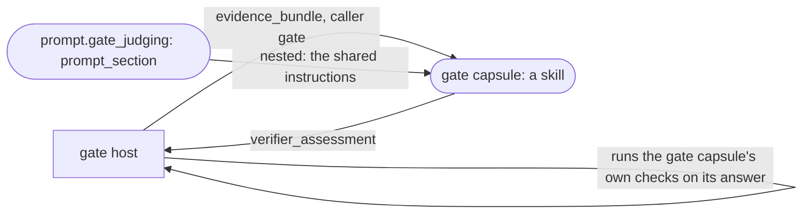

> **Draft: reopened for changed shared contracts.** The pattern every gate capsule follows, and the one shared prompt they all use. The M1 gate capsules are [the intent gate](../m1/intent-gate.md) and [the brief gate](../m1/brief-gate.md).

# Gate capsules

A **gate capsule** assesses one step's output against that step's judged criteria, and answers per criterion. It never decides: the [gate host](gate-host.md) folds its answer with the deterministic checks and writes the Verification. Every step has exactly one ([nodes](../system/nodes.md#gates)).

All gate capsules have the same shape. They differ only in their name, their summary, and the rubric files of the step's own judged checks. The judging instructions are written once, in the `prompt_section` capsule `prompt.gate_judging`, which every gate capsule pins.



## What every gate capsule declares

| Field | Value | Why |
|---|---|---|
| `identity.kind` | `skill` | a gate assesses with a model (PRD 4.2 Tier 2) |
| `identity.summary` | `Assess a <what the work capsule outputs> against the <input> it was compiled from, per the given criteria and rubrics, answering each criterion with a rationale and verbatim quotes.` | INV-7: it names the kind of value judged, never a step or a capsule |
| `identity.body` | `SKILL.md`, then one file per judged **step check** of this step (the run plan's `step_checks`), under `rubrics/`. A work capsule's own judged checks keep their rubric in the work capsule; nothing is copied. `checks/gate_checks.py` is a check runner file, submitted with the Candidate like every runner file, never a body file | a step check's rubric has no other home; a capsule check's rubric already has one |
| `ports.inputs` | exactly one: `evidence_bundle`, type [`evidence_bundle`](../types/evidence-bundle.md), `required: true`; its `description` is free text | the gate host calls every gate capsule the same way |
| `ports.outputs` | exactly one: `verifier_assessment`, type [`verifier_assessment`](../types/verifier-assessment.md), `check_id: answers_every_criterion` | the gate host reads every gate capsule the same way |
| `needs.when` | `[]` | |
| `needs.external` | exactly `[{"ref": "prompt.gate_judging", "decl_hash": <admitted>, "purpose": "the shared judging instructions"}]` | the shared instructions |
| `needs.network`, `needs.human_interaction` | `none`, `none` | |
| `needs.resources.timeout_s` | 120 | policy `budgets`: 120 s per judge call |
| `changes` | `{"effect_class": "pure", "effects": [], "state_kind": "none"}` | a referee changes nothing (rule `every_step_gated`) |
| `guarantees.checks` | the three below | |
| `evolution` | `{"rsi": "none"}`, no `may_change` | the referee is not RSI-able (`referee_no_rsi`) |
| `SKILL.md` | front matter `name: <identity.name>` and **no `model` key** (the runtime's default model); then the two sentences of the [template](#skillmd-template) | every gate reads the same way; only what is judged differs |

**Freeze checks the pattern.** The one list of what freeze refuses about a gate capsule, and with which code, is [toolchain M03 step 5](toolchain.md#m03-freeze-the-binding-writer). The author's own words (summary, descriptions, `SKILL.md`) are not checked.

**The rubric reaches the judge twice.** It appears in the prompt as a body file, and again inside the bundle's `criteria[].rubric`. The bundle's copy is the one the criterion means, and both come from the same hash. The repetition costs prompt length, and buys one admission path for every file.

#**Fixed, and the author's own.** Every row above is fixed, except the author's own words: the summary (within its template), every `description`, and the `SKILL.md` sentence naming what is judged. These are not interface; two authors may word them differently, and the canary compares only interface facts. Further:
- A gate with no step checks has `SKILL.md` as its only body file, and no `rubrics/` folder.
- Writing a default out (such as `required: true`) or leaving it out gives the same `decl_hash`, because defaults are filled in before hashing ([fields](fields.md#computed-by-admission-never-written-by-the-author)).
- Test cases live in `tests/cases.json`, which becomes the Candidate's `tests`, never in the Declaration ([toolchain](toolchain.md#the-capsule-folder)).

## `SKILL.md` template

```text
---
name: research.accept_<name>
---
You judge <a short description of the value judged>. When a criterion looks at inputs, the user's request is
the intake's "prompt" in the bundle's inputs. Follow the judging instructions, and each criterion's rubric.
```

### The three checks every gate capsule carries

They live in one file, `checks/gate_checks.py`, which is byte-identical in every gate capsule (one hash, stored once). The first two are deterministic and read the bundle; the gate host runs them on every gate call's answer ([gate host](gate-host.md#what-it-does-in-order), step 4.4). The third runs only at admission. It compares a test case's recorded reply with the expected answer, so a gate's tests test something, even though they test the recorded reply and not the live judge.

```json
[
 {"id": "answers_every_criterion", "anchor": "deterministic", "target": "ports.outputs.verifier_assessment",
  "over": "inputs_and_outputs", "applies_at": "both",
  "runner": {"ref": "checks/gate_checks.py:answers_every_criterion", "sha256": "<author kit>"},
  "description": "The assessment answers every criterion of the bundle exactly once, in the bundle's order, and no other.",
  "author": "muk"},
 {"id": "quotes_from_bundle", "anchor": "deterministic", "target": "ports.outputs.verifier_assessment",
  "over": "inputs_and_outputs", "applies_at": "both",
  "runner": {"ref": "checks/gate_checks.py:quotes_from_bundle", "sha256": "<author kit>"},
  "description": "Every pass or fail has at least one quote, and every quote appears verbatim in the bundle's inputs or outputs as the skill prompt renders them, after collapsing every run of whitespace to one space in both.",
  "author": "muk"},
 {"id": "assessment_matches_expected", "anchor": "reference", "target": "ports.outputs.verifier_assessment",
  "over": "outputs", "applies_at": "admission",
  "runner": {"ref": "checks/gate_checks.py:assessment_matches_expected", "sha256": "<author kit>"},
  "description": "On a test case, each criterion's result equals the expected result for that check_id.",
  "author": "muk"}
]
```

"As the skill prompt renders them" means the `inputs` and `outputs` parts of `json.dumps(bundle, ensure_ascii=False, indent=2, sort_keys=True)`, the runner's one rendering of a JSON value ([runner](runner.md#skill-model-turns-that-follow-skillmd)), or the plain text of any string inside them. Whitespace runs are collapsed to one space on both sides before comparing, so indentation never decides a match.

## `prompt.gate_judging`

```json
{
  "schema_version": "cc.declaration.v1",
  "identity": {
    "name": "prompt.gate_judging",
    "kind": "prompt_section",
    "body": [{"path": "gate_judging.md", "sha256": "<author kit>"}],
    "summary": "Instructions for assessing an output against given criteria and rubrics: answer each criterion pass, fail or unknown, with a rationale and verbatim quotes, and never decide the outcome."
  },
  "ports": {"inputs": [], "outputs": [{"name": "text", "type": "text", "check_id": "text_not_blank"}]},
  "needs": {"when": [], "external": [], "network": "none"},
  "changes": {"effect_class": "pure", "effects": []},
  "guarantees": {"checks": [
    {"id": "text_not_blank", "anchor": "deterministic", "target": "ports.outputs.text", "over": "outputs",
     "applies_at": "both", "runner": {"ref": "checks/text_checks.py:not_blank", "sha256": "<author kit>"},
     "description": "The text has a non-space character.", "author": "muk"}
  ]},
  "evolution": {"rsi": "none"}
}
```

**`gate_judging.md`**, the whole text:

```text
You assess; you never decide. The run's gate decides from your answers and other checks.

The INPUT block holds an evidence bundle: the capsule whose output is judged (subject), the criteria
to judge it by, and the values it received (inputs) and produced (outputs), with the capsule's own
caveats (issues). Read the issues first.

For each criterion, in the order given:
1. Read its description and its rubric. Judge only what they ask.
2. Look only at the outputs, and also at the inputs when the criterion's "over" is inputs_and_outputs.
3. Answer "pass", "fail" or "unknown". Answer "unknown" when what you were shown is not enough to tell.
   Never answer "pass" because you cannot find a problem you were not shown evidence for.
4. Write a short rationale that names the part of the rubric it rests on.
5. Quote, verbatim, the text from the inputs or outputs your rationale rests on. A pass or a fail
   needs at least one quote.

Answer every criterion exactly once, and no others. Do not judge anything the criteria do not ask.
```

## Tests every gate capsule ships

One test case per check (rule `one_test_per_admission_check`), so three. Each input is an `evidence_bundle`; each carries `model_replies` (the recorded reply of the judge's one turn) and the expected `verifier_assessment`. No check is judged, so admitting a gate capsule needs no admission judge. These tests test the recorded reply; the live judge is uncalibrated, and its results carry `judge_unmeasured`.

## Making a new gate capsule

`cc kit new research.accept_<name> --gate --store <dir>` ([toolchain M13](toolchain.md#m13-author-kit)) writes the folder with this page's fixed rows, `checks/gate_checks.py` and an empty `rubrics/`. The author adds:
- the summary;
- one rubric file per judged step check;
- the `SKILL.md` line naming what is judged;
- the test cases.
