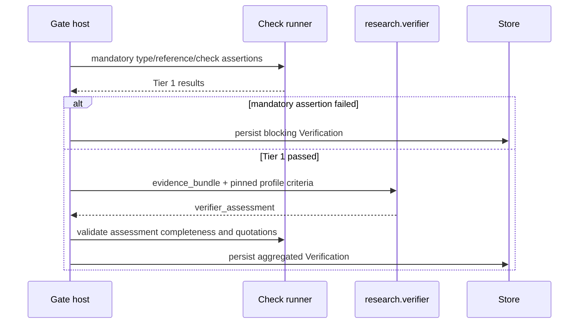

# The verifier capsule

PRD: 4.2.1, 4.2.8

> Answers: What does the shared verifier capsule declare, and how do the Gate host and freeze use it?

[Verification](../verification.md) is the home of the [Gate](../verification.md#term-gate) rules, count and scope, verdicts and test [fixtures](../system/test-surfaces.md#term-fixture). This page is the home of what the `research.verifier` [capsule](capsule.md#term-capability-capsule) itself declares and how the [Gate host](gate-host.md#term-gate-host) and freeze use it.

## One identity, many call sites

M1 admits one verifier CC, `research.verifier`, [kind](capsule.md#term-capsule-kind) `skill`. Every Gate call site (intent, the requirement call, each planned node) reuses it through a pinned [GateProfile](../schemas/profiles.md#term-gateprofile). A profile supplies criteria as data; it is not a separate capsule. The fixed judging instructions are hashed files of this capsule. The scientific evaluator is a separate work capability and never judges its own infrastructure admissibility.

Every verifier-role capsule declares `evolution.rsi: none` and `evolution.may_change: []`: zero RSI-mutable components. [RSI](../rsi.md#term-rsi) cannot change its prompt, body, dependencies, [checks](fields.md#term-check) or criteria. A human referee revision creates a new comparison cohort. Reports retain work/referee/profile/fixture/model/protocol pins so a changed capsule is measured against the same referee. Small fixture suites are smoke/contract evidence, not a statistical success rate.

A Gate failure [halts](../system/lifecycle.md#term-halt) the run, including other ready branches. Committed results stay as diagnostic evidence. Delivery is ordinary code after accepted terminal outputs, not a Gate or capsule.

## Key terms

| Term | Meaning |
|---|---|
| **verifier** (also: research.verifier, verifier capsule) | The one shared judge capsule (`research.verifier`, kind `skill`) that every Gate reuses through a pinned Gate profile. It assesses criteria from an evidence bundle, cannot release a step, and has RSI set to `none`. |

## Declaration-derived construction

At runtime the verifier checks the result of a **node**: the task-specific use of a CC with concrete inputs, output and captured evidence ([node model](../system/nodes.md#capsule-versus-node)). A trusted Gate builder derives a test instance from the producer's exact [Declaration](fields.md#term-declaration) (output schema, guarantees, checks, effects, permissions, allowed failure outcomes) plus mandatory host policy. It prepares that instance at freeze and places the Gate right after the producer's call.

- There is one reusable verifier implementation and one generated test instance per work [Binding](../schemas/binding.md#term-binding). A generated test is a derived artifact, not a new trained verifier.
- The builder may resolve existing deterministic checks and parameterize the fixed instructions. An unsupported declared obligation fails freeze; it is never silently omitted.
- Freeze pins the producer declaration hash, generated test hash, verifier version, profile and policy closure. A producer's Declaration cannot remove mandatory safety checks. Automatic test preparation is trusted contract compilation, not RSI.
- A Declaration or test-policy change makes new pins and a new comparison cohort. A test is not recorded as passed until the Gate [runs](../system/lifecycle.md#term-run) against evidence.
- Builder API, generated test-record schema and Declaration transport are `PENDING_SOURCE` ([decisions](../decisions.md#pending-source-do-not-invent)). Generated code used for tests, if ever, needs its own confinement contract first.

## What the verifier declares

Exactly one `evidence_bundle` input and one `verifier_assessment` output; [effect class](fields.md#term-effect-class) `read_only` or `pure`; RSI `none`; no authority to release a step. It receives only immutable evidence selected by the Gate host and criteria from the pinned Gate profile. The producer cannot choose criteria. Freeze checks these properties ([toolchain M03](toolchain.md#m03-freeze-the-binding-writer) is the one list) and pins the verifier declaration, profile, rubric/check closure and model route.

The host calls the verifier only after mandatory [Tier 1](../verification.md#term-tier-1) checks pass. The verifier returns a per-criterion assessment, rationale and exact quotations from the bundle. Deterministic verifier checks require every requested criterion exactly once, no extras, valid outcome/quote semantics and grounding in the supplied bundle. A malformed, timed-out or unavailable judgment [blocks](../system/modules.md#term-block) release. The host alone aggregates and persists the [Verification](../schemas/verification-record.md#term-verification).

## Profiles

Profiles for the intent and requirement call sites are on [intent Gate](../capabilities/intent-gate.md) and [requirement Gate](../capabilities/brief-gate.md); the profiles `research.accept_*` cover Hypothesis through Report ([research Gates](../capabilities/research-gates.md)), and the [delivery manifest](../capabilities/delivery.md#term-publication-manifest) check belongs to delivery, not to a Gate profile. Existing [Brief](../types/research-brief.md#term-research-brief), Search, Screening, Hypothesis, POC, Benchmark, Evaluation and Report criteria stay as capability references. Sharing the mechanism does not share the producer's prompt or weaken criteria. Ordinary helper modules use deterministic checks inside their enclosing node rather than standalone Gates.

Evidence and criteria are data supplied to one implementation, as in [OPA policy/data separation](https://www.openpolicyagent.org/docs). A changed verifier prompt needs a new admitted version and every planted-defect fixture rechecked. A changed profile rechecks only that profile and its producers/consumers, then needs a new [library snapshot](library.md#term-library-snapshot).

A verifier call is a `gate` call (the caller kind comes from its [dispatch reservation](../system/records.md#term-reservation), not from a field of the `runner_request`), and the host validates its assessment directly to terminate recursion. The nested verifier review inside `research.compile_intent` is validated by the calling capsule and is not itself Gated. That is a role contract, not a bypass for [work capsules](../capabilities/README.md#term-work-capsule). Planted-defect fixtures are in [test surfaces](../system/test-surfaces.md).
