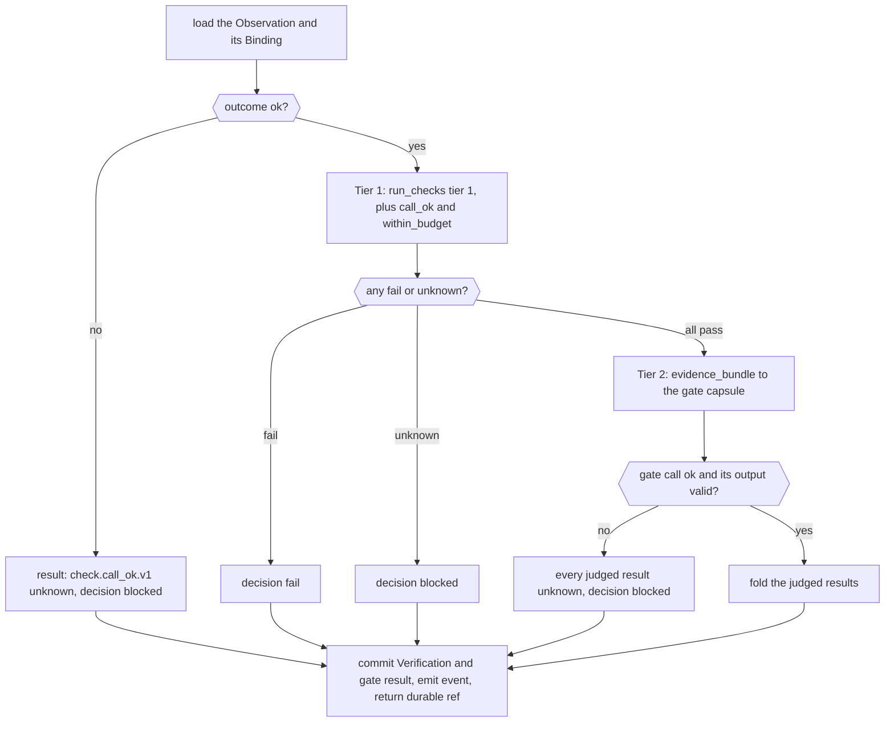

> **Draft recheck.** The full PRD 4.2.8–4.2.9 requires the durable result below. This replaces the previous derived-verdict contract; runner, policy, records, lifecycle, events and Data Foundation are rechecked together.

# The gate host

The gate host checks one finished `dispatch` call and decides whether the run may go on. It runs the deterministic checks itself (Tier 1), asks the step's gate capsule to assess the judged checks (Tier 2), folds every result by policy `gates`, and writes the one [Verification](../schemas/verification-record.md). It holds no stage logic: every criterion it applies comes from the Binding.

**Why it is control code, not a capsule.** The fold, the fixed checks and the Verification are the referee's own rules. A capsule may assess, but only fixed code may decide. So no capsule, and no RSI, can change what passing means ([trust](trust.md#referees)).

## API

```python
@dataclass
class GateResult:
    verification_ref: Ref | None          # None only when no Verification is written (a cancelled call)
    decision: Literal["pass", "fail", "blocked"]
    verdict: Literal["PASS", "PASS_WITH_KNOWN_LIMITATIONS", "FAIL", "ENVIRONMENT_BLOCKED", "INCONCLUSIVE"]
    normalized_verdict: Literal["PASS", "FAIL", "BLOCKED", "INCONCLUSIVE"]
    routing_action: Literal["ADVANCE", "HALT", "ESCALATE_TO_HUMAN"]

async def gate(obs_ref: Ref) -> GateResult
```

Called by the runner's Swarmflow backend (R1) after every `dispatch` call ([runner](runner.md#swarmflow-backend-talking-to-the-engine)). It never raises for a capsule's fault. If its own storage/capture fails, it raises a typed infrastructure error and returns no success. Explicit resume repairs the Gate for an already committed Observation before considering re-execution ([lifecycle](../system/lifecycle.md)). At entry, look up `verification-<obs_id>`; an identical valid committed result is returned without a second judge call. Conflicting/corrupt evidence blocks.

## What it does, in order



1. **Load.** Read the Observation by `obs_ref`. It must be `caller: dispatch`; anything else is a caller bug (raise). Read its Binding by `binding_ref`. When `binding_ref` is null (`BINDING_MISSING`), use the policy every other Binding of the run pins. *Defensive only:* the runner never gates a cancelled call ([runner](runner.md#swarmflow-backend-talking-to-the-engine)). If one arrives anyway (`ext.runner.cancelled: true`), write no Verification and return `decision: blocked`, `verdict: ENVIRONMENT_BLOCKED`, `verification_ref: None`.
2. **A call that did not end `ok`.** A demonstrated capsule/schema/security/declared-budget violation gives `check.call_ok.v1: fail` and FAIL. An unavailable runtime/dependency gives `unknown` and ENVIRONMENT_BLOCKED. Insufficient admissible evidence gives `unknown` and INCONCLUSIVE. Tier 2 is NOT_RUN. The source-verified reason ownership in policy determines the category, never the model. Go to step 6.
3. **Tier 1.** `run_checks(<the Binding's non-judged checks>, obs, ...)` over every `deterministic` and `reference` check in the Binding's `checks`: the work capsule's own, its output types', and the step's ([toolchain M10a](toolchain.md#m10a-check-runner-and-the-check-library)). Then the fixed checks `check.call_ok.v1` and `check.within_budget.v1`, which compares `cost.time_s` with `budget.time_s`. Fold: any `fail` gives `fail`; otherwise any `unknown` gives `blocked`. If this decides, go to step 6; judged checks are not run.
4. **Tier 2.** Every step has at least one `judged` check (rule `every_step_gated`).
   1. Build the [`evidence_bundle`](../types/evidence-bundle.md): `subject` from the work capsule's Declaration; one criterion per judged check, in Binding order, with its `rubric` read from the content store by the check runner's `sha256`; `inputs` when any criterion is `over: inputs_and_outputs`, holding only what the step's `judge_inputs` names (a port, or one field of it), else every input in full; `outputs` and `issues` from the output Artifacts.
   2. If the bundle's canonical JSON is over policy `runner.max_bundle_bytes`, do not call the gate capsule: every judged result is `unknown`, with evidence naming the size, so the decision is `blocked` and the verdict `INCONCLUSIVE`. Otherwise store it: `record_input(run_id, "evidence_bundle", vocabulary_ref=<the Binding's>, value=bundle, origin="control")`. The full [execution manifest](../system/storage.md#required-evidence-and-derived-views) remains separately complete; the bounded semantic projection cannot replace it.
   3. Call the gate capsule through the runner: `caller: gate`, the Binding's `verifier.decl_hash`, `verifier.code_sha256` and `verifier.budget`, input `{"evidence_bundle": ref}`.
   4. **Validate the answer.** The gate call must end `ok`. Its `verifier_assessment` output must pass its type check, and the gate capsule's own `node` and `both` checks. Those are run here with `run_checks(<the gate capsule's Declaration checks, in full>, gate_obs, inputs={"evidence_bundle": bundle})` ([gate capsules](gate-capsules.md#what-every-gate-capsule-declares)). A gate call gets no Verification of its own, so this is where its output is checked.
   5. If any of that fails, every judged check's result is `unknown` (a judge error gives `blocked`), and each judged entry's evidence names the failing gate-capsule check and its message, or the gate call's `outcome` and `reason`. Otherwise each criterion's `result` becomes that check's result.
   6. Fold the judged results the same way as Tier 1.
5. **Labels.** Add `judge_unmeasured` whenever Tier 2 ran, judge error included, and the gate capsule has no calibration on record (a `verifier_audit` Finding). At M1 no judge is calibrated, so every Verification where Tier 2 ran carries it.
6. **Write** one Verification (`producer.component: gate`):
   - `invocation_ref`: the Observation;
   - `results`: the deterministic and reference entries in Binding order, then the fixed checks, then the judged entries in Binding order ([Verification](../schemas/verification-record.md)). Each has:
     - `check_id` and `source` from the Binding;
     - `result`;
     - `runner_sha256`: the check runner's, which for a judged check is its rubric;
     - `evidence`. For a Tier 1 entry, the check's message first ([checks](../schemas/checks.md#calling-convention)). For a judged entry, first `{evidence_type: "judge_rationale", reference: <the gate call's obs_id>, description: <the rationale>}`, then the gate call's Observation;
     - for a judged entry, the separate field `judge: {judge_decl_hash: <verifier.decl_hash>, model: <the gate call's model, when reported>}`;
   - `decision`, `labels`.

   Also construct and validate `gate_result` with every PRD 4.2.8 field on [Verification](../schemas/verification-record.md). Tier summaries, failed-check ids, warnings, limitations, evidence and timestamp are computed from this exact decision. Set only advancing verdicts to ADVANCE; M1 blocking decisions set ESCALATE_TO_HUMAN. Commit the record durably with deterministic id `verification-<obs_id>` through M12. Emit `cc.gate.decided` only after commit succeeds.
7. **Return** the `GateResult` from that stored record. The supervisor rereads and validates the committed Verification before releasing outputs ([authorization](../system/lifecycle.md#startup-and-one-step)).

## Verdicts

The one definition of the five verdicts. The detailed verdict, normalized verdict and routing action are computed once and durably stored in Verification.gate_result under PRD 4.2.8. ESCALATE_TO_HUMAN is an action, not a verdict. The engine envelope is a cache and cannot authorize release without this record.

| Verdict | When | What the run does |
|---|---|---|
| `PASS` | decision `pass`, and no output Artifact has `issues` | continues |
| `PASS_WITH_KNOWN_LIMITATIONS` | decision `pass`, and an output has `issues` | continues; the report lists the issues |
| `FAIL` | mandatory deterministic or semantic defect; decision fail | normalized FAIL; halt with attributable human triage |
| `ENVIRONMENT_BLOCKED` | decision blocked and runtime, dependency, storage or required-capture unavailable | normalized BLOCKED; halt, then explicit reviewed recovery |
| `INCONCLUSIVE` | other insufficient or unassessable evidence; decision blocked | normalized INCONCLUSIVE; halt for native human_session review |

**Judged fails halt at M1.** Policy `blocking` lets a judged `fail` fail a gate, and says a judged fail "is meant for a person to review". At M1 the workflow's choice is to halt, and the `judge_unmeasured` label tells the person the judge is uncalibrated.

## What it never does

- It never decides a criterion. It runs check code and folds results; the gate capsule assesses judged criteria.
- It never lets a capsule override the fold or the fixed checks.
- It never runs a stage-specific rule of its own. A new rule for a step is a step check in the [run plan](../types/run-plan.md), or a criterion in the step's gate capsule.

## Tests

- Each fold row on fixtures: a Tier 1 fail, a Tier 1 unknown, a call that ended `error`, a Tier 2 fail, a Tier 2 pass.
- A gate capsule whose call ends in error, whose output fails its type, or that skips a criterion gives `blocked`, never `pass`.
- An over-declared-budget call ends error BUDGET_EXCEEDED: its Verification has check.call_ok.v1 fail and gate_verdict FAIL. Model/runtime TIMEOUT is separately ENVIRONMENT_BLOCKED.
- A null `binding_ref` still writes a Verification.
- A gate call that ends `TIMEOUT` gives `ENVIRONMENT_BLOCKED`.
- A cancelled call writes none.
- Each verdict row.
- `judge_unmeasured` is on every Tier 2 decision at M1.
