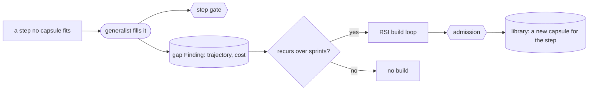

# The generalist capsule

**A vision, unchecked at M1.** The generalist is the low-trust, do-anything capsule. It fills a step that no admitted capsule fits, so the run goes on instead of failing, and it leaves a record of what was missing, so RSI has material to build from.

## Why a generalist must exist

- **Specialists are powerful, but specialising is a bet that the tasks will not move.** Alita-G's GAIA results show that specialised agents with good tool selection beat generalists. But in a long-running research system, a request will always come that no specialist fits.
- **So the generalist is permanent.** It is the recovery path. Its weights are fixed; it improves only by having more admitted capsules to reach for.
- **It replaces the A2A hop.** Today a generalist agent reaches a specialist over A2A, with free-text tags and no contract. With CC, the generalist reaches capsules that each carry a Declaration, and a gap it fills becomes a declared capsule later.

## What it is

- **A capsule** of kind `agent_template`, naming an agent harness: Codex, Claude Code, openJiuwen's own agent. Several may exist.
- **Level `exempt`**: it has no single job to test in advance, so it is never certified. It is enrolled once, on a small suite of sample steps, which checks it can fill a step and that it refuses a protected write.
- **Its Declaration is generic**: one `json` input and one `json` output, with the enrolment checks, so it meets the schema. Its real contract comes from the step it fills: at run time the step's ports and checks apply at the gate. It works by writing a script and running it in the sandbox, so the work can be re-run and inspected.

## Rules

- **Only where nothing fits.** It binds to a step only when selection offers no admitted capsule, and only on steps whose outputs all have deterministic or reference checks. A step that only a judge can check never binds it.
- **Every gate still applies.** Its outputs pass the step's checks like any other capsule's.
- **Lowest trust, always visible.** Its results are marked as generalist work, and delivery lists every generalist step.
- **It never writes the library.** It cannot admit what it built. It leaves a **gap Finding** with its trajectory and cost, and that Finding is where RSI starts.
- **Never on a step that requires a certified capsule**, and capped per run.

## Any agentic system, with no new kind and no use of role

The generalist can run on Codex, on Claude Code, on openJiuwen's own agent, or on any other agentic system. That does not need a new `capsule_kind` or a new use of `Binding.role`.

`kind: agent_template` already says how the runner calls it. That is enough, no matter which harness backs it. `role` is not the right home either: it is the workflow's own label for a call site, and the docs already say the capsule itself never sets it. A harness is a fact about the capsule, not about the call site, so it does not belong there.

Each harness gets its own Declaration instead. `generalist.codex`, `generalist.claude_code`, and so on are separate capsules, each pinned by `identity.remote`, since a harness cannot be hashed as a file the way code can. "The generalist can go to any agentic system" means several admitted generalist capsules exist side by side. Selection picks whichever one fits a step, the same way it picks among any other capsules. See [a full example](example-generalist.md).

## From gap to capsule

Next time, selection finds the new capsule and the generalist is not needed. The build loop is on the [RSI](rsi.md#building-new-capsules-from-gaps) page.

## Controls (proposed)

A run states whether a generalist may be used and how many steps it may fill, and whether a gap may lead to a build: `off`, `propose` (a person decides) or `build`. Earlier drafts kept these in a run contract, which is parked; where they live now is open.
