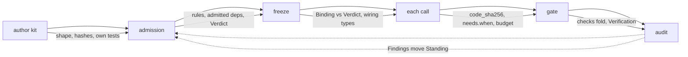

> **Draft, not yet approved.**

# Guards: the checks CC's schemas need

A **guard** is a small, fast function that decides whether one record, or one relationship between two records, is valid and consistent. This page catalogues the guards Capability Capsule (CC) will need. It is not code: it says "we will need this check, on this field, for this reason," so a coding agent can later turn each row into a function with tests. It does not add product rules; a guard checks shape, integrity and consistency, never a business decision (see [Guards we should not add, and why](#guards-we-should-not-add-and-why)).

Sources: [fields.md](fields.md), [tools.md](tools.md), [stages.md](stages.md), [composition.md](composition.md), [library.md](library.md), [trust.md](trust.md), [rsi.md](rsi.md), [capsule.md](capsule.md), [permissions.md](permissions.md), [symphony.md](symphony.md), the [schemas](../schemas/schemas.md) folder, [capability-capsule-design-notes.md](../prd/capability-capsule-design-notes.md), [m1-architecture.md](../m1-architecture.md) and [b1-design.md](../b1-design.md).

## How to read this page

Every guard gets one table row:

| Guard | Checks | Schema and fields | Runs in (tool and M1 module) | When | Fails with | M1 |
|---|---|---|---|---|---|---|

- **Guard** is a stable id, `guard.<schema or area>.<short name>`.
- **Checks** is one line: what the guard tests.
- **Schema and fields** names the record and the field path(s) it reads.
- **Runs in** names a tool from [tools.md](tools.md) and, where one exists, its M1 module id from [m1-architecture.md](../m1-architecture.md). A tool [tools.md](tools.md) marks "not needed" for M1 has no module id; the cell says so.
- **When** is one of: `lint` (a docs or policy check, not a capsule call), `author kit` (an author's own pre-check), `admission`, `freeze` (the Binding writer, M03), `each call` (the runner, M04), `gate` (M10) or `audit` (the librarian's cold path).
- **Fails with** is the existing [policy](../schemas/policy.md) reason code, or **"needs a code"** when the sources name no code for this failure (listed again in [Gaps](#gaps)).
- **M1** is `M1` when the guard serves a field or rule [stages.md](stages.md) marks checked; `later: <unlock>` when it serves only an unchecked field, naming the unlock from [stages.md](stages.md#what-the-unchecked-fields-unlock). Guards once marked `pending` served the [five schema changes](../prd/capability-capsule-design-notes.md#changes-to-make); those were applied on 2026-09-29, so they are now `M1`.

A guard that already has a policy `rules` entry ([policy.md](../schemas/policy.md#sections-with-proposed-values-for-the-first-epoch)) keeps that rule's id as its short name, so the two stay easy to match. Where a guard covers ground several groups share (the envelope, a hash, a graph), it is defined once, in the group closest to its home, and later groups point back to it instead of repeating the row.

`evolution.may_change` (an allow-list: the only paths RSI may touch; absent or empty means nothing) replaced `evolution.frozen` on 2026-09-29, and the rule `changes_allowed` replaced `frozen_kept`.

## Common envelope

Every record extends [`cc.common.v1`](../schemas/common.md) (INV-1), so its shape, its references and its unknown-field rule are checked once, here, rather than once per schema.

| Guard | Checks | Schema and fields | Runs in (tool and M1 module) | When | Fails with | M1 |
|---|---|---|---|---|---|---|
| `guard.common.envelope_shape` | A record has exactly the common envelope fields (`schema_version`, `id`, `scope`, `at`, `producer`, and the optional envelope fields), plus its own schema's fields; Declaration is the one exception (INV-1) | Common: the envelope | Admission (M14) for authored records; Library store (M12) for every other record at write | admission | `SCHEMA_NONCONFORMANT` | M1 |
| `guard.common.scope_exclusive` | Exactly one of `scope.run_id`, `scope.candidate_id`, `scope.library` is set | Common: `scope.*` | Admission (M14); Library store (M12) | admission | `SCHEMA_NONCONFORMANT` | M1 |
| `guard.common.strict_core_fields` | A field outside `ext` that the schema does not name is refused; `ext` keys are namespaced by tool (INV-14) | Common: every record's core fields, `ext` | Author kit (M13); Admission (M14) | author kit | `SCHEMA_NONCONFORMANT` | M1 |
| `guard.common.enum_and_registry_values` | An `enum(...)` value is one of its closed set; a `reg(name)` value is a row of policy `registries.name`; a reason code is `UPPER_SNAKE` (INV-13) | Common and every schema: every `enum`/`reg` field; Policy: `registries.reason_code` | Author kit (M13); Admission (M14) | author kit | `SCHEMA_NONCONFORMANT`, or `VOCAB_UNKNOWN_NAME` for a port type | M1 |
| `guard.common.ref_integrity` | A `Ref {id, sha256}` resolves to a stored record or content whose hash equals `sha256` (INV-6) | Common: `Ref(kind)` wherever used | Library store (M12); Runner (M04) at read | each call | needs a code | M1 |
| `guard.common.unknown_never_passes` | A predicate, check or fold step that returns `unknown`/`defer` is never counted as a pass (INV-8) | Common: every result field typed `pass, fail, unknown` or `defer` | Runner (M04); Check runner and gate (M10a, M10) | each call | `CHECK_UNKNOWN` | M1 |
| `guard.store.write_once` | A second write to a record's key, with different bytes, is refused; the same bytes at the same key are a no-op (INV-2) | Common: `id` as the store key `cc/<kind>/<scope>/<id>` | Library store (M12) | admission | needs a code | M1 |
| `guard.store.one_writer_per_kind` | A record's writer matches the one writer fixed for its kind, or for its discriminator value (`Finding.kind`, `Artifact.scope`, `Standing.state`) (INV-3) | Common: `producer.component`, plus the schema's own discriminator field | Library store (M12) | admission | needs a code | M1 |
| `guard.common.no_new_derived_field` | A record holds no field that only repeats a fact another record already gives, other than the Binding's `checks` (the one named exception) (INV-5) | Common and every schema: no `derived_from`/`upstream`-shaped field | Enforced structurally by `guard.common.strict_core_fields`; the rest is a schema-review check, not a runtime one | lint | needs a code | M1 |
| `guard.docs.field_table_lint` | Every field row on a schema page has Type, Req, M1 and Description, and an Unlocks entry exactly when unchecked (INV-11) | Every schema page's `## Fields` table | `tools/architecture_sync.py` (docs lint, not a capsule-record guard) | lint | needs a code | M1 |
| `guard.docs.field_naming_lint` | Field names are `snake_case`; ids end `_id`; hashes end `_sha256`/`_hash`/`_hashes`; times end `_at`; `Ref` fields end `_ref` (INV-12) | Every schema page's `## Fields` table | `tools/architecture_sync.py` (docs lint) | lint | needs a code | M1 |

## Invariants (INV-1 to INV-19)

Every invariant in [invariants.md](../schemas/invariants.md) is a rule; most already have a guard above or in a later group. This table gives each one's guard, or says why it has none.

| INV | Rule (short) | Guard | M1 |
|---|---|---|---|
| INV-1 | every record extends common, exactly | `guard.common.envelope_shape` | M1 |
| INV-2 | written once, never edited | `guard.store.write_once` | M1 |
| INV-3 | one writer per record kind | `guard.store.one_writer_per_kind` | M1 |
| INV-4 | facts in records, thresholds and rules in the policy | (none — a design discipline about where a fact lives, not a shape a guard can check; see [Gaps](#gaps)) | — |
| INV-5 | no derived copies, except Binding `checks` | `guard.common.no_new_derived_field`, `guard.binding.checks_nonempty` | M1 |
| INV-6 | refer by `{id, sha256}`, never repeat | `guard.common.ref_integrity` | M1 |
| INV-7 | a capsule holds no task | `guard.declaration.no_task_reference` | M1 |
| INV-8 | unknown never passes | `guard.common.unknown_never_passes` | M1 |
| INV-9 | every output port names a check | `guard.declaration.every_output_has_check` | M1 |
| INV-10 | no one is their own final judge | `guard.check.author_independent`, `guard.verification.judge_not_self`, `guard.binding.verifier_rsi_none` | M1 |
| INV-11 | field table shape (lint) | `guard.docs.field_table_lint` | M1 |
| INV-12 | field naming (lint) | `guard.docs.field_naming_lint` | M1 |
| INV-13 | enum lowercase, reason codes UPPER_SNAKE, `reg` from the registry | `guard.common.enum_and_registry_values` | M1 |
| INV-14 | core fields strict, `ext` namespaced | `guard.common.strict_core_fields` | M1 |
| INV-15 | hashes are SHA-256 over canonical JSON | `guard.declaration.decl_hash_recompute`, `guard.declaration.interface_hash_recompute`, `guard.declaration.code_sha256_recompute`, `guard.artifact.content_sha256_correct` (canonical hashing is a [shared helper](#shared-helpers)) | M1 |
| INV-16 | an additive change never moves an existing hash | `guard.policy.schema_version_additive` | M1 |
| INV-17 | one policy epoch per run and per admission | `guard.binding.epoch_and_vocab_consistent`, `guard.binding.policy_epoch_uniform` | M1 |
| INV-18 | a field starts in `ext.<tool>`, promoted only by a reviewed change | (none — promotion is an editorial step, not a shape check; see [Gaps](#gaps)) | — |
| INV-19 | *(proposed)* declared failures only | `guard.observation.capsule_raised_undeclared` | M1 |

## Declaration

The Declaration ([fields.md](fields.md)) is authored once and never edited; every guard below runs before or at admission, since a Declaration that passes admission is fixed. Lineage, composition and the three computed hashes are covered in [Structure guards](#structure-guards), not repeated here.

### Identity and code

| Guard | Checks | Schema and fields | Runs in (tool and M1 module) | When | Fails with | M1 |
|---|---|---|---|---|---|---|
| `guard.declaration.name_present_and_local` | `identity.name` is present, a stable dot-separated handle, unique among live Standing names | Declaration: `identity.name` | Author kit (M13); Admission (M14) | admission | `SCHEMA_NONCONFORMANT` | M1 |
| `guard.declaration.one_code_source` | Exactly one of `carrier`, `body`, `remote`, `members` is set | Declaration: `identity.carrier`, `identity.body`, `identity.remote`, `members` | Author kit (M13); Admission (M14) | admission | `SCHEMA_NONCONFORMANT` | M1 |
| `guard.declaration.kind_known` | `identity.kind` is a `capsule_kind` registry value, and the runner has a handler for it | Declaration: `identity.kind` | Admission (M14); Runner (M04) | admission; each call | `SCHEMA_NONCONFORMANT` | M1 |
| `guard.declaration.carrier_hash_matches` | `carrier.sha256` equals the hash of the file at `carrier.ref`, re-hashed at admission and again at every load | Declaration: `identity.carrier.ref`, `identity.carrier.sha256` | Admission (M14); Runner (M04) | admission; each call | `HASH_MISMATCH` at admission, `CARRIER_CHANGED` at load | M1 |
| `guard.declaration.body_hashes_match` | Every `body[].sha256` equals the hash of the file at `body[].path`, re-hashed the same way | Declaration: `identity.body[]` | Admission (M14); Runner (M04) | admission; each call | `HASH_MISMATCH`, `CARRIER_CHANGED` | M1 |
| `guard.declaration.summary_names_no_task` | `identity.summary` is at most 400 characters and names no step, workflow or other capsule | Declaration: `identity.summary` | Admission (M14) | admission | `SUMMARY_NAMES_TASK` | M1 |
| `guard.declaration.no_task_reference` | The Declaration names no step, stage, run or workflow, anywhere outside `needs.external`, `members` and `identity.lineage` (INV-7) | Declaration: whole document | Admission (M14), as part of shape checking | admission | `SCHEMA_NONCONFORMANT` | M1 |

### Ports

| Guard | Checks | Schema and fields | Runs in (tool and M1 module) | When | Fails with | M1 |
|---|---|---|---|---|---|---|
| `guard.declaration.port_names_unique` | `Port.name` is unique within `ports.inputs` and, separately, within `ports.outputs` | Declaration: `ports.inputs[].name`, `ports.outputs[].name` | Admission (M14) | admission | `SCHEMA_NONCONFORMANT` | M1 |
| `guard.declaration.port_type_known` | `Port.type` names a type in the [port type vocabulary](../schemas/port-types.md) pinned for this epoch | Declaration: `ports.*.type` | Admission (M14) | admission | `VOCAB_UNKNOWN_NAME` | M1 |
| `guard.declaration.every_output_has_check` | Every entry of `ports.outputs` names a `check_id` (INV-9) | Declaration: `ports.outputs[].check_id` | Admission (M14) | admission | `CHECK_MISSING` | M1 |
| `guard.declaration.json_port_has_schema` | A `json`-typed port has `value_schema {uri, sha256}` | Declaration: `Port.value_schema` | Admission (M14) | admission | `SCHEMA_NONCONFORMANT` | M1 |
| `guard.declaration.value_schema_hash_matches` | `value_schema.sha256` equals the hash of the JSON Schema at `value_schema.uri`, re-hashed at admission | Declaration: `Port.value_schema.sha256` | Admission (M14) | admission | `HASH_MISMATCH` | M1 |

### Needs

| Guard | Checks | Schema and fields | Runs in (tool and M1 module) | When | Fails with | M1 |
|---|---|---|---|---|---|---|
| `guard.declaration.predicates_evaluable` | Every `needs.when[].op` is a known `predicate_op` registry value | Declaration: `needs.when[].op` | Admission (M14) | admission | `SCHEMA_NONCONFORMANT` | M1 |
| `guard.declaration.external_admitted_and_pinned` | Every `needs.external[]` names a `decl_hash` that is admitted; a call outside the list is refused | Declaration: `needs.external[]` | Admission (M14); Runner (M04) and Permission layer at each call | admission; each call | `OPERATOR_NOT_ADMITTED` | M1 |
| `guard.declaration.dependencies_pinned` | If `needs.dependencies.packages` is set, `needs.dependencies.lockfile` pins every package, including indirect ones | Declaration: `needs.dependencies.packages`, `.lockfile` | Isolated verification sandbox (no M1 module) | admission | `DEPENDENCY_UNPINNED` | later: isolated verification |

### Changes and guarantees

| Guard | Checks | Schema and fields | Runs in (tool and M1 module) | When | Fails with | M1 |
|---|---|---|---|---|---|---|
| `guard.declaration.effect_class_matches_effects` | `changes.effect_class` is consistent with `changes.effects[]`, by the policy `mappings` order | Declaration: `changes.effect_class`, `changes.effects[]` | Admission (M14) | admission | `EFFECT_CLASS_INCONSISTENT` | M1 |
| `guard.declaration.state_fixtures_present` | A capsule with `changes.state_kind: reads_external` has test cases carrying `fixtures` | Declaration: `changes.state_kind`; Candidate: `tests[].fixtures` | Admission (M14) | admission | `CHECK_UNTESTED` | M1 |
| `guard.declaration.at_least_one_check` | `guarantees.checks` has at least one entry | Declaration: `guarantees.checks` | Admission (M14), from policy `required` | admission | `SCHEMA_NONCONFORMANT` | M1 |
| `guard.declaration.check_id_unique` | `Check.id` is unique within the Declaration | Declaration: `guarantees.checks[].id` | Admission (M14) | admission | `SCHEMA_NONCONFORMANT` | M1 |
| `guard.declaration.check_shape_valid` | Every `Check` has `anchor`, `target`, `over`, `applies_at`, a `runner {ref, sha256}`, `description` and `author`, each of the right type | Declaration: `guarantees.checks[]` | Admission (M14) | admission | `SCHEMA_NONCONFORMANT` | M1 |
| `guard.declaration.check_test_coverage` | Every check whose `applies_at` is `admission` or `both` has at least one Candidate test case | Declaration: `guarantees.checks[]`; Candidate: `tests[]` | Admission (M14) | admission | `CHECK_UNTESTED` | M1 |
| `guard.declaration.failure_modes_additive` | A new version keeps every `failure_modes[].reason_code` its parent declared | Declaration: `guarantees.failure_modes[]` | Admission (M14) | admission | `FAILURE_MODE_REMOVED` | later: retries |
| `guard.declaration.failure_codes_distinct` | No `failure_modes[].reason_code` is also a `reason_code` registry value | Declaration: `guarantees.failure_modes[].reason_code` | Admission (M14) | admission | `SCHEMA_NONCONFORMANT` | later: retries |

### RSI permission

`evolution.may_change` is an allow-list of the only paths RSI may touch; absent or empty means RSI may change nothing, whatever `evolution.rsi` says. Everything not listed stays fixed.

| Guard | Checks | Schema and fields | Runs in (tool and M1 module) | When | Fails with | M1 |
|---|---|---|---|---|---|---|
| `guard.declaration.rsi_permitted` | An RSI Candidate whose parent has `evolution.rsi: none` is refused; one whose parent has `propose` is admitted only as `admitted_inactive` | Declaration: `evolution.rsi`; Candidate: `submitted_by.kind`, `declaration.identity.lineage.parent_hash` | Admission (M14) | admission | `RSI_NOT_PERMITTED` | M1 |
| `guard.declaration.rsi_no_copy` | An RSI Candidate whose files match an admitted capsule with `evolution.rsi: none` is refused, with or without lineage | Declaration: `identity.body`/`identity.carrier`; Candidate: `files[]` | Admission (M14) | admission | `RSI_NOT_PERMITTED` | later: RSI |
| `guard.declaration.changes_allowed` | An RSI child differs from its parent only at paths the parent's `evolution.may_change` lists; this excludes derived values (file hashes that follow from an allowed file, the three computed hashes, and `identity.lineage`) | Declaration: `evolution.may_change`; parent vs. child, field by field | Admission (M14) | admission | `RSI_NOT_PERMITTED` | M1 |
| `guard.declaration.rsi_cannot_grant` | `evolution.may_change` never lists `evolution` or any path under it, so a child can never widen its own or its descendants' permission | Declaration: `evolution.may_change` | Admission (M14) | admission | `SCHEMA_NONCONFORMANT` | M1 |
| `guard.declaration.may_change_path_parses` | Every `evolution.may_change` entry parses under the path grammar: dot form with `[]` for every list item or `[<name>]` for one keyed entry, or `files:<glob>` | Declaration: `evolution.may_change[]` | Admission (M14) | admission | `SCHEMA_NONCONFORMANT` | M1 |
| `guard.declaration.may_change_path_is_real_field` | Every parsed Declaration path in `evolution.may_change` names a field that exists in the Declaration schema at that location | Declaration: `evolution.may_change[]`, resolved against the Declaration grammar | Admission (M14) | admission | `SCHEMA_NONCONFORMANT` | M1 |
| `guard.declaration.repin_needs_purpose` | An RSI child may re-pin a dependency only if the parent gave that dependency a `purpose`, and only if the pin's path is also listed in the parent's `evolution.may_change` | Declaration: `needs.external[].purpose`, `needs.dependencies.packages[].purpose`, `evolution.may_change` | Admission (M14) | admission | `RSI_NOT_PERMITTED` | later: RSI |

## Candidate

A [Candidate](../schemas/candidate.md) is the only way into the library; admission only reads it.

| Guard | Checks | Schema and fields | Runs in (tool and M1 module) | When | Fails with | M1 |
|---|---|---|---|---|---|---|
| `guard.candidate.at_least_one_test` | `tests[]` has at least one entry | Candidate: `tests[]` | Author kit (M13); Admission (M14) | admission | `CHECK_UNTESTED` | M1 |
| `guard.candidate.one_test_per_admission_check` | Every Declaration check whose `applies_at` is `admission` or `both` has a matching `tests[].check_id` | Candidate: `tests[].check_id` | Admission (M14) | admission | `CHECK_UNTESTED` | M1 |
| `guard.candidate.files_hash_matches` | Every `files[].sha256` equals the hash of the bytes at `files[].content_ref`, fetched and re-hashed | Candidate: `files[]` | Admission (M14) | admission | `HASH_MISMATCH` | M1 |
| `guard.candidate.submitter_kind_known` | `submitted_by.kind` is a `submitter_kind` registry value | Candidate: `submitted_by.kind` | Admission (M14) | admission | `SCHEMA_NONCONFORMANT` | M1 |
| `guard.candidate.negative_control_proves_failure` | A test case marked `negative_control: true` actually fails its check, proving the check can fail | Candidate: `tests[].negative_control` | Admission (M14) | admission | needs a code | later: certification |

## Port type vocabulary

The [port type vocabulary](../schemas/port-types.md) is the one list of type names; without it, `text` and `string` could silently fail to match.

| Guard | Checks | Schema and fields | Runs in (tool and M1 module) | When | Fails with | M1 |
|---|---|---|---|---|---|---|
| `guard.porttype.type_name_valid` | `types[].type` is lower snake case, or `collection<T>` with a known `T`; unique within the vocabulary; has a `version` | Port type vocabulary: `types[]` | Port type vocabulary (M00a) | admission | `SCHEMA_NONCONFORMANT` | M1 |
| `guard.porttype.value_schema_present` | `types[].value_schema` is a valid JSON Schema document | Port type vocabulary: `types[].value_schema` | Port type vocabulary (M00a) | admission | `SCHEMA_NONCONFORMANT` | M1 |
| `guard.porttype.checks_include_value_matches_type` | `types[].checks` always includes `check.value_matches_type.v1`, so every type has a `node` check (INV-9) | Port type vocabulary: `types[].checks` | Port type vocabulary (M00a) | admission | `CHECK_MISSING` | M1 |
| `guard.porttype.no_any_type` | No type is named `any` or `unknown` (rule `no_any_type`) | Port type vocabulary: `types[].type` | Admission (M14) | admission | `VOCAB_UNKNOWN_NAME` | M1 |
| `guard.porttype.vocabulary_version_monotonic` | A new vocabulary record's `vocabulary_version` is exactly one higher than the previous | Port type vocabulary: `vocabulary_version` | Library store (M12) | admission | needs a code | M1 |
| `guard.check.value_matches_type` | An output's value matches its port type's `value_schema`, and, for a `json` port, also `Port.value_schema` | Port type vocabulary: `checks` (`check.value_matches_type.v1`); Artifact: `value`/`content_ref` | Check runner and gate (M10a, M10) | gate | `CHECK_FAILED` | M1 |

## Check, test case and test suite

A [check](../schemas/checks.md) is one runnable test; a test case is one input and its expected result; a test suite is a hashed, ordered set of cases.

| Guard | Checks | Schema and fields | Runs in (tool and M1 module) | When | Fails with | M1 |
|---|---|---|---|---|---|---|
| `guard.check.applies_at_consistent` | A check whose `applies_at` is `admission` or `both` has a test case supplying `expected`; one whose `applies_at` is `node` needs only an output | Check: `applies_at`; test case: `expected` | Admission (M14) | admission | `CHECK_UNTESTED` | M1 |
| `guard.check.author_independent` | `Check.author` is not the Candidate's `submitted_by`; a certifying check is written by someone other than the builder (INV-10) | Declaration: `Check.author`; Candidate: `submitted_by` | Admission (M14) | admission | needs a code (`Check.author` is self-declared today; see [Gaps](#gaps)) | M1 |
| `guard.testcase.interface_hash_matches` | A test case's `interface_hash` equals the `interface_hash` of the Declaration version it was written against | Test case: `interface_hash` | Admission (M14) | admission | needs a code | M1 |
| `guard.testcase.inputs_resolve` | Every `inputs[port]` resolves to a stored Artifact whose `type` equals that port's declared type | Test case: `inputs` | Admission (M14) | admission | `PORT_MISMATCH` | M1 |
| `guard.testsuite.hash_pins_cases` | A test suite's hash covers its ordered `tests[]`; every `Ref(test_case)` resolves to a stored case | Test suite: `tests[]` | Admission (M14) | admission | needs a code | M1 |
| `guard.testsuite.access_valid` | `access` is `visible` or `sealed`; a `sealed` suite's cases are never returned to the capsule's submitter, only pass or fail | Test suite: `access` | Admission (M14) | admission | needs a code | later: certification |

## Verdict

The [Verdict](../schemas/verdict.md) is admission's decision on one Declaration, under one policy epoch and one port type vocabulary.

| Guard | Checks | Schema and fields | Runs in (tool and M1 module) | When | Fails with | M1 |
|---|---|---|---|---|---|---|
| `guard.verdict.outcome_level_consistent` | `level` is set only when `outcome` is `admit`; every capsule admitted at M1 is `provisional` | Verdict: `outcome`, `level` | Admission (M14) | admission | `SCHEMA_NONCONFORMANT` | M1 |
| `guard.verdict.checks_run_never_pass_unknown` | No `checks_run[].result` of `unknown` counts toward a level (INV-8) | Verdict: `checks_run[]` | Admission (M14) | admission | `CHECK_UNKNOWN` | M1 |
| `guard.verdict.policy_and_vocab_hash_match` | `policy_ref.sha256` and `vocabulary_ref.sha256` equal the hashes of the pinned policy epoch and vocabulary version | Verdict: `policy_ref`, `vocabulary_ref` | Admission (M14) | admission | `HASH_MISMATCH` | M1 |
| `guard.verdict.remote_not_certified` | A capsule that is, or depends on, a remote (`mcp`/`a2a`) capsule never reaches `level: certified` | Verdict: `level`; Declaration: `identity.remote`, `needs.external` | Admission (M14) | admission | needs a code | later: certification |
| `guard.verdict.judge_named` | `checks_run[]` names the judge (`judge {judge_decl_hash, model}`) for every judged check run at admission | Verdict: `checks_run[].judge` | Admission (M14) | admission | `SCHEMA_NONCONFORMANT` | M1 |
| `guard.verdict.judge_not_self_at_admission` | The admission judge's `decl_hash` never equals the Candidate's own `decl_hash` (INV-10) | Verdict: `checks_run[].judge.judge_decl_hash`; Candidate: `declaration` | Admission (M14) | admission | `JUDGE_IS_SELF` | M1 |

## Standing

[Standing](../schemas/standing.md) is the one moving pointer: for each name, which version is current, and in what state. Its hash chain (`seq`, `prev_hash`) is covered in [Structure guards](#structure-guards).

| Guard | Checks | Schema and fields | Runs in (tool and M1 module) | When | Fails with | M1 |
|---|---|---|---|---|---|---|
| `guard.standing.state_known` | `state` is a `standing_state` registry value | Standing: `state` | Admission (M14); Librarian (no M1 module) | admission; audit | `SCHEMA_NONCONFORMANT` | M1 |
| `guard.standing.one_current_per_name` | At most one live branch (`current_hash`) per name; a second live branch must take a new name (`relation: specialises`) | Standing: `name`, `current_hash` | Librarian (no M1 module) | audit | needs a code | later: librarian |
| `guard.standing.person_move_reason_valid` | A person-initiated move to `suspect`, `deprecated`, `retired`, `revoked`, or a revert, cites a reason code naming that a person asked (e.g. `SUSPENDED_BY_OWNER`, `DEPRECATED_BY_OWNER`) | Standing: `reason` | Librarian command (M15) | audit | `SCHEMA_NONCONFORMANT` | M1 |
| `guard.standing.revert_targets_admitted` | A revert's `current_hash` names a version that was previously `admitted` for this name | Standing: `current_hash`, `reason: REVERTED` | Librarian command (M15) | audit | `SCHEMA_NONCONFORMANT` | M1 |

## Binding

A [Binding](../schemas/binding.md) pins one call site: one capsule version, its Verdict, its checks, its budget and its judge. Its cross-check against the Verdict is covered in [Structure guards](#structure-guards).

| Guard | Checks | Schema and fields | Runs in (tool and M1 module) | When | Fails with | M1 |
|---|---|---|---|---|---|---|
| `guard.binding.code_sha256_recheck` | The loader re-hashes the capsule's code and compares it to `code_sha256` before every call | Binding: `code_sha256` | Runner (M04) | each call | `CARRIER_CHANGED` | M1 |
| `guard.binding.checks_nonempty` | `checks[]` has at least one entry, since every port type carries a `node` check (INV-9) | Binding: `checks[]` | Default DAG and freeze (M03) | freeze | needs a code | M1 |
| `guard.binding.verifier_required_when_judged` | `verifier` is set when any `checks[]` entry is `judged` | Binding: `checks[]`, `verifier` | Default DAG and freeze (M03) | freeze | needs a code | M1 |
| `guard.binding.verifier_rsi_none` | A capsule bound as a gate or verifier has `evolution.rsi: none` (rule `referee_no_rsi`, INV-10) | Binding: `verifier.decl_hash`; Declaration: `evolution.rsi` | Default DAG and freeze (M03) | freeze | `REFEREE_RSI_PERMITTED` | M1 |
| `guard.binding.wiring_types_match` | Every wired output's port type equals the port type of the input it feeds | Binding graph: node-to-node wiring, from the run's plan | Default DAG and freeze (M03) | freeze | `PORT_MISMATCH` | M1 |
| `guard.binding.policy_epoch_uniform` | Every Binding of one run pins the same `policy_ref` (INV-17) | Binding: `policy_ref` | Default DAG and freeze (M03) | freeze | needs a code | M1 |
| `guard.binding.refuses_non_admitted` | The run refuses to start if a named capsule's Standing is not `admitted` | Binding: `decl_hash`; Standing: `state` | Default DAG and freeze (M03) | freeze | `BINDING_MISSING` | M1 |

## Observation

An [Observation](../schemas/observation.md) is one capsule call, written by the runner.

| Guard | Checks | Schema and fields | Runs in (tool and M1 module) | When | Fails with | M1 |
|---|---|---|---|---|---|---|
| `guard.observation.binding_ref_or_refused` | `binding_ref` is set for every call except an admission test call or a `BINDING_MISSING` refusal | Observation: `binding_ref`, `outcome` | Runner (M04) | each call | `BINDING_MISSING` | M1 |
| `guard.observation.decl_hash_matches_binding` | `decl_hash` equals the Binding's `decl_hash` (or `verifier.decl_hash` for a judge call) | Observation: `decl_hash`; Binding: `decl_hash` | Runner (M04) | each call | `CARRIER_CHANGED` | M1 |
| `guard.observation.attempt_monotonic` | `attempt` is 1 for a first try; a retry is a new Observation with `attempt` one higher | Observation: `attempt` | Runner (M04) | each call | needs a code | M1 |
| `guard.observation.outcome_requires_reason` | `reason` is set whenever `outcome` is not `ok`, and null otherwise | Observation: `outcome`, `reason` | Runner (M04) | each call | `SCHEMA_NONCONFORMANT` | M1 |
| `guard.observation.reason_owner_known` | A `blocked` Observation's `reason` resolves to exactly one owner (`runtime`, `capsule`, `refusal`, `judge`, `input`) | Observation: `reason`; Policy: `registries.reason_code` owners | Check runner and gate (M10a, M10) | gate | needs a code | M1 |
| `guard.observation.cost_present` | `cost.time_s` is always present | Observation: `cost.time_s` | Runner (M04) | each call | `SCHEMA_NONCONFORMANT` | M1 |
| `guard.observation.predicates_recorded` | Every `needs.when` entry evaluated is recorded as `{predicate_id, result}`, never silently dropped | Observation: `predicates[]` | Runner (M04) | each call | needs a code | M1 |
| `guard.observation.capsule_raised_undeclared` | *Proposed* (INV-19). An exception not listed in the capsule's `failure_modes` is recorded as `CAPSULE_RAISED_UNDECLARED`, and the gate always folds it to `blocked` | Observation: `reason`; Declaration: `guarantees.failure_modes[]` | Runner (M04); Check runner and gate (M10a, M10) | each call; gate | `CAPSULE_RAISED_UNDECLARED` || later: fallbacks |

## Artifact

Every capsule output is an [Artifact](../schemas/artifact.md): content stored once by hash, plus one record per appearance.

| Guard | Checks | Schema and fields | Runs in (tool and M1 module) | When | Fails with | M1 |
|---|---|---|---|---|---|---|
| `guard.artifact.exactly_one_value_source` | Exactly one of `value` and `content_ref` is set | Artifact: `value`, `content_ref` | Runner (M04); Admission (M14) | each call; admission | `SCHEMA_NONCONFORMANT` | M1 |
| `guard.artifact.content_sha256_correct` | `content_sha256` equals the canonical hash of `value`, or of the bytes behind `content_ref` (INV-15) | Artifact: `content_sha256` | Runner (M04); Admission (M14) | each call; admission | `HASH_MISMATCH` | M1 |
| `guard.artifact.produced_by_iff_capsule` | `produced_by` is set exactly when `origin` is `capsule` | Artifact: `origin`, `produced_by` | Runner (M04) | each call | `SCHEMA_NONCONFORMANT` | M1 |
| `guard.artifact.content_dedup` | The same `content_sha256` is stored once; a second write of matching content is a no-op, not a new content record | Artifact: `content_sha256` | Library store (M12) | each call | needs a code | M1 |
| `guard.artifact.issues_shape_valid` | Every `issues[]` entry is a well-formed `Reason`, with a code from the registry or a declared `failure_modes` code | Artifact: `issues[]` | Runner (M04); Check runner and gate (M10a, M10) | each call; gate | needs a code | M1 |

## Verification

A [Verification](../schemas/verification-record.md) is the gate's check of one live call, written once per `dispatch` Observation.

| Guard | Checks | Schema and fields | Runs in (tool and M1 module) | When | Fails with | M1 |
|---|---|---|---|---|---|---|
| `guard.verification.one_per_dispatch` | Every `dispatch` Observation gets exactly one Verification; judge and admission calls get none | Verification: `invocation_ref`; Observation: `caller` | Check runner and gate (M10a, M10) | gate | needs a code | M1 |
| `guard.verification.results_cover_binding_checks` | `results[]` covers every entry of the Binding's `checks`, in order, then the gate's fixed checks | Verification: `results[]`; Binding: `checks[]` | Check runner and gate (M10a, M10) | gate | needs a code | M1 |
| `guard.verification.decision_fold_correct` | `decision` is the policy `gates` fold of `results[]`; an `unknown` result never becomes `pass` (INV-8) | Verification: `results[]`, `decision`; Policy: `gates` | Check runner and gate (M10a, M10) | gate | `CHECK_UNKNOWN` | M1 |
| `guard.verification.judge_not_self` | A judged check's `judge.judge_decl_hash` never equals the capsule's own `decl_hash` (INV-10) | Verification: `results[].judge`; Observation: `decl_hash` | Check runner and gate (M10a, M10) | gate | `JUDGE_IS_SELF` | M1 |

## Finding

The whole [Finding](../schemas/finding.md) record is unchecked at M1.

| Guard | Checks | Schema and fields | Runs in (tool and M1 module) | When | Fails with | M1 |
|---|---|---|---|---|---|---|
| `guard.finding.kind_has_one_writer` | A Finding of a given `kind` is written only by that kind's registry-assigned writer | Finding: `kind`; Policy: `registries.finding_kind` | Librarian (no M1 module); Check runner and gate (M10a, M10) for `fit_failure`/`use_outcome` | audit; gate | needs a code | later: librarian |
| `guard.finding.subjects_shape_matches_kind` | Each `subjects[].kind` is `decl_hash`, `check_id`, `judge_decl_hash` or `verdict_id`, and its `id` resolves | Finding: `subjects[]` | Librarian (no M1 module) | audit | needs a code | later: librarian |
| `guard.finding.detail_shape_matches_kind` | `detail` matches the shape the Finding's `kind` documents | Finding: `kind`, `detail` | Librarian (no M1 module) | audit | needs a code | later: librarian |

## Policy

The [policy](../schemas/policy.md) holds every "how"; a new epoch is a reviewed change, never an edit.

| Guard | Checks | Schema and fields | Runs in (tool and M1 module) | When | Fails with | M1 |
|---|---|---|---|---|---|---|
| `guard.policy.epoch_immutable` | An epoch's `sections` never change once published; a change is a new epoch naming the old one in `supersedes` | Policy: `epoch`, `supersedes`, `sections` | Policy epochs (M00c) | lint | needs a code | M1 |
| `guard.policy.rules_have_reason_codes` | Every entry of `rules` names a `reason_code` that exists in `registries.reason_code` | Policy: `rules`, `registries.reason_code` | Policy epochs (M00c) | lint | needs a code | M1 |
| `guard.policy.registries_additive` | A new epoch only adds registry rows or reason codes; it never removes one an admitted record still cites (INV-16) | Policy: `registries` | Policy epochs (M00c) | lint | needs a code | M1 |
| `guard.policy.gates_fold_no_unknown_pass` | The `gates` fold never turns an `unknown` check result into `pass` (INV-8) | Policy: `gates` | Policy epochs (M00c) | lint | needs a code | M1 |
| `guard.policy.schema_version_additive` | A `v1.x` schema change only adds an optional field or a registry row; an absent v1.x field hashes as absent (INV-16) | Every schema page's version marker | `tools/architecture_sync.py` (docs lint) | lint | needs a code | M1 |
| `guard.policy.reason_code_has_owner` | Every `registries.reason_code` row names an owner: `runtime`, `capsule`, `refusal`, `judge` or `input` | Policy: `registries.reason_code` owners | Policy epochs (M00c) | lint | needs a code | M1 |

## Structure guards

These guards cross record boundaries: a graph, a chain, a hash a tool recomputes, or two records that must agree.

### Composite graph

A composite's `members` and `wiring` ([composition.md](composition.md)) are unchecked at M1 (Unlocks: composer); the schema exists now so nothing built for M1 changes later.

| Guard | Checks | Schema and fields | Runs in (tool and M1 module) | When | Fails with | M1 |
|---|---|---|---|---|---|---|
| `guard.composite.members_pinned_and_admitted` | Every `members[].decl_hash` names a capsule whose Standing is `admitted` | Declaration: `members[]` | Composer (no M1 module); Admission (M14) | admission | `OPERATOR_NOT_ADMITTED` | later: composer |
| `guard.composite.wiring_well_formed` | Every `wiring[].from`/`.to` parses as `inputs.<port>`, `outputs.<port>` or `<member>.inputs.<port>`/`<member>.outputs.<port>`, naming a port that exists | Declaration: `wiring[]` | Composer (no M1 module); Admission (M14) | admission | `SCHEMA_NONCONFORMANT` | later: composer |
| `guard.composite.wire_types_match` | The port type of every `wiring[].from` equals the port type of `wiring[].to` | Declaration: `wiring[]`, resolved against each member's `ports` | Composer (no M1 module); Admission (M14) | admission | `PORT_MISMATCH` | later: composer |
| `guard.composite.every_output_fed` | Every declared composite output is wired from some member's output, or passed through from a composite input | Declaration: `ports.outputs[]`, `wiring[]` | Composer (no M1 module); Admission (M14) | admission | needs a code | later: composer |
| `guard.composite.no_cycles` | The member graph formed by `wiring[]` has no cycle | Declaration: `members[]`, `wiring[]` | Composer (no M1 module); Admission (M14) | admission | needs a code | later: composer |
| `guard.composite.no_gate_inside` | No member of a composite is used as a gate or verifier inside it; gates stay outside, chosen by the workflow | Declaration: `members[]`; Binding: `verifier` | Composer (no M1 module); Admission (M14) | admission | needs a code | later: composer |
| `guard.composite.nesting_depth_bounded` | A composite's members, followed recursively, do not exceed a maximum depth | Declaration: `members[]`, recursively | Composer (no M1 module); Admission (M14) | admission | needs a code (the depth bound itself is undecided; see [composition.md#open](composition.md#open) and [Gaps](#gaps)) | later: composer |

### Lineage tree

`identity.lineage` (`parent_hash`, `relation`) is checked at M1, for versions from the RSI branch. `co_parent_hashes` stays unchecked (Unlocks: merge, composer).

| Guard | Checks | Schema and fields | Runs in (tool and M1 module) | When | Fails with | M1 |
|---|---|---|---|---|---|---|
| `guard.declaration.lineage_parent_admitted` | `identity.lineage.parent_hash` names a version whose Standing is, or was, `admitted` (rule `parent_admitted`) | Declaration: `identity.lineage.parent_hash` | Admission (M14) | admission | `SCHEMA_NONCONFORMANT` | M1 |
| `guard.declaration.lineage_relation_valid` | `relation` is a known value; `merges` requires at least one `co_parent_hashes` entry | Declaration: `identity.lineage.relation`, `.co_parent_hashes` | Admission (M14) | admission | `SCHEMA_NONCONFORMANT` | M1 |
| `guard.declaration.lineage_no_cycle` | The graph formed by every version's `parent_hash` and `co_parent_hashes` has no cycle | Declaration: `identity.lineage.*` across all versions of a name | Lineage index (no M1 module) | audit | needs a code | later: tracking |
| `guard.declaration.changes_allowed` | *(defined in [Declaration → RSI permission](#rsi-permission))* — a child's diff from its parent stays inside the parent's `evolution.may_change` | Declaration: `evolution.may_change` | Admission (M14) | admission | `RSI_NOT_PERMITTED` | M1 |
| `guard.declaration.parent_suites_pass` | A child whose `interface_hash` equals its parent's also passes every suite in the parent's Verdict `test_suites` | Declaration: `identity.lineage.parent_hash`, `interface_hash`; Verdict: `test_suites` | Admission (M14) | admission | `CHECK_FAILED` | M1 |

### Standing hash chain

Every [Standing](../schemas/standing.md) entry is a log line: `seq` and `prev_hash` make the log tamper-evident.

| Guard | Checks | Schema and fields | Runs in (tool and M1 module) | When | Fails with | M1 |
|---|---|---|---|---|---|---|
| `guard.standing.seq_contiguous` | For one name, `seq` starts at 1 and each new entry is exactly one higher than the last | Standing: `name`, `seq` | Admission (M14); Librarian (no M1 module) | admission; audit | needs a code | M1 |
| `guard.standing.prev_hash_matches` | A new entry's `prev_hash` equals the hash of the name's current entry before the write | Standing: `prev_hash` | Admission (M14); Librarian (no M1 module) | admission; audit | needs a code | M1 |

### `decl_hash`, `interface_hash` and `code_sha256` recomputation

These three are computed by admission, never authored, and every reader who trusts them must be able to recompute them ([fields.md](fields.md#computed-by-admission-never-written-by-the-author)).

| Guard | Checks | Schema and fields | Runs in (tool and M1 module) | When | Fails with | M1 |
|---|---|---|---|---|---|---|
| `guard.declaration.decl_hash_recompute` | `decl_hash` equals the canonical hash of the whole Declaration with every v1.0 default filled in | Declaration: whole document; Verdict, Standing, Binding: `decl_hash` | Author kit (M13); Admission (M14) | author kit; admission | `HASH_MISMATCH` | M1 |
| `guard.declaration.interface_hash_recompute` | `interface_hash` equals the canonical hash of exactly the fields a test depends on (name, kind, ports without descriptions, `needs.when`, `effect_class`, and each check's `id`/`target`/`anchor`/`applies_at`), `failure_modes` excluded | Declaration: the interface-hash field set; Verdict, test case, test suite: `interface_hash` | Author kit (M13); Admission (M14) | author kit; admission | `HASH_MISMATCH` | M1 |
| `guard.declaration.code_sha256_recompute` | `code_sha256` equals the hash the loader checks: `carrier.sha256`, or the sorted `body` list's hash, or `{endpoint, version}`'s hash for `remote`, or the sorted `members` list's hash | Declaration: `identity.carrier`/`body`/`remote`/`members`; Binding: `code_sha256` | Author kit (M13); Admission (M14); Runner (M04) | author kit; admission; each call | `HASH_MISMATCH` at admission, `CARRIER_CHANGED` at load | M1 |

### Binding against Verdict

A [Binding](../schemas/binding.md) may only pin a Verdict that actually grants what the Binding assumes.

| Guard | Checks | Schema and fields | Runs in (tool and M1 module) | When | Fails with | M1 |
|---|---|---|---|---|---|---|
| `guard.binding.verdict_outcome_admit` | The Verdict named by `verdict_ref` has `outcome: admit` | Binding: `verdict_ref`; Verdict: `outcome` | Default DAG and freeze (M03) | freeze | needs a code | M1 |
| `guard.binding.epoch_and_vocab_consistent` | The Verdict's `policy_ref.epoch` is this Binding's epoch, or is listed in that epoch's `levels.accepts`; for every port type the capsule uses, the Binding's `vocabulary_ref.version` equals the Verdict's (INV-17) | Binding: `policy_ref`, `vocabulary_ref`; Verdict: `policy_ref`, `vocabulary_ref` | Default DAG and freeze (M03) | freeze | needs a code | M1 |

### Stage Evidence Bundle

The Stage Evidence Bundle is the output Artifacts, the Declaration and the Observation the gate reads together; the Verification is the record that it read all three ([design-notes.md](../prd/capability-capsule-design-notes.md#where-each-prd-requirement-is-met)).

| Guard | Checks | Schema and fields | Runs in (tool and M1 module) | When | Fails with | M1 |
|---|---|---|---|---|---|---|
| `guard.gate.seb_complete` | Before folding a decision, every output Artifact the Observation names exists and matches its port's type, the Declaration resolves by `decl_hash`, and the Observation is present with `outcome` set | Observation: `outputs[]`, `decl_hash`, `outcome`; Artifact: `type`, `content_sha256` | Check runner and gate (M10a, M10) | gate | needs a code | M1 |

## Formerly pending: the five design-notes changes

[capability-capsule-design-notes.md](../prd/capability-capsule-design-notes.md#changes-to-make) lists five changes, applied to the schema pages on 2026-09-29. The guards that serve them are now `M1`; this table is the index.

| # | Change | Guards |
|---|---|---|
| 1 | Name the admission judge | `guard.verdict.judge_named`, `guard.verdict.judge_not_self_at_admission` |
| 2 | Check Artifact `issues` at M1, adopt INV-19 | `guard.artifact.issues_shape_valid`, `guard.observation.capsule_raised_undeclared` |
| 3 | Give every reason code an owner | `guard.policy.reason_code_has_owner`, `guard.observation.reason_owner_known` |
| 4 | Take the time budget from the capsule | `guard.binding.timeout_from_capsule` |
| 5 | Let a person move a Standing | `guard.standing.person_move_reason_valid`, `guard.standing.revert_targets_admitted` |

| Guard | Checks | Schema and fields | Runs in (tool and M1 module) | When | Fails with | M1 |
|---|---|---|---|---|---|---|
| `guard.binding.timeout_from_capsule` | `budget.time_s` is the lower of the capsule's `needs.resources.timeout_s` and the policy's cap (1800 s, a working choice in [m1-architecture.md](../m1-architecture.md#shared-content)) | Binding: `budget.time_s`; Declaration: `needs.resources.timeout_s` | Default DAG and freeze (M03) | freeze | needs a code | M1 |

The other four guards this table indexes are defined once, in the group their record belongs to (Verdict, Artifact, Observation, Policy, Standing), so they are not repeated here.

## Interfaces to existing code

CC does not rebuild jiuwenswarm or agent-core; it declares, and existing mechanisms enforce. These are the interfaces CC's tools need to the code that already exists, so a coding agent knows what to call rather than what to write from scratch.

| Interface | CC side (tool and M1 module) | Connects to | Where | Direction and payload | M1 |
|---|---|---|---|---|---|
| Runner backend | Runner (M04) | agent-core Swarmflow engine, `AgentBackend` | [b1-design.md](../b1-design.md#the-cc-runner-how-capsules-plug-into-jiuwenswarm): `A/agent_teams/workflow/engine/backends/base.py:101-119` (`AgentBackend`); `A/agent_teams/workflow/engine/runner.py:294-396` (`run_workflow`); `A/agent_teams/workflow/engine/primitives.py:540-735` (`agent()`) | engine to backend: `agent()` call `{node, inputs}`; backend to engine: envelope `{value, decision, obs_id}` | M1 |
| Run entry | M01 launcher and ingestion | jiuwenswarm `CodexSubscriptionAdapter` (agent server) | [b1-design.md](../b1-design.md#the-cc-runner-how-capsules-plug-into-jiuwenswarm): `J/server/runtime/agent_adapter/interface_codex.py:33-49` | browser to adapter: `chat.send` with the CC-run flag; launcher to adapter: the answer as `chat.final` | M1 |
| Model client | M05 model client | Model Routing seam (Codex CLI adapter today) | [m1-architecture.md](../m1-architecture.md#the-modules) "Seams with other workstreams"; [b1-design.md](../b1-design.md#through-jiuwenswarm-the-deep-view): `J/server/runtime/codex_subscription/service.py:131-208`, `transport.py:30-189` | M05 to adapter: `complete(prompt) -> {text, model, tokens?}`; adapter to M05: parsed text, model id, token usage when reported | seam: Model Routing (Xiaoyang) |
| Runner and sandbox enforcement of effects (Codex path) | Runner (M04); M06 `op.workspace_io` | jiuwenbox sandbox | [tools.md](tools.md#what-the-existing-pieces-give); [permissions.md](permissions.md#gaps-and-conflicts) | capsule to `op.workspace_io`: `{path, op: read or write}`; `op.workspace_io` to capsule: bytes, or refused | M1 |
| Permission rail (DeepAgent path, not used by M1's Codex runtime) | Permission layer | agent-core `PermissionEngine` | [permissions.md](permissions.md#what-jiuwenswarm-has): `harness/security/permission_engine/core.py:272` | CC to engine: a per-capsule permission snapshot (ALLOW/ASK/DENY, derived from the Declaration); engine to rail: ALLOW/ASK/DENY per tool call | later: DeepAgent path (not built for M1's Codex runtime; see [permissions.md](permissions.md#gaps-and-conflicts)) |
| `op.deepsearch` | M06 operators | the deepsearch repo | [m1-architecture.md](../m1-architecture.md#m06-operator-capsules-opdeepsearch-opcodesearch-opworkspace_io) | `search_capsule` to `op.deepsearch`: `{query, documents}`; `op.deepsearch` to `search_capsule`: ranked passages with source locators | M1 |
| `op.codesearch` | M06 operators | CodeSearch | [m1-architecture.md](../m1-architecture.md#m06-operator-capsules-opdeepsearch-opcodesearch-opworkspace_io) (no file:line given; not located yet) | `poc_capsule` to `op.codesearch`: `{query, repository}`; `op.codesearch` to `poc_capsule`: files and line references | M1 |
| Record store | Library store (M12) | agent-core `BaseKVStore` and its object store | [tools.md](tools.md#the-tools) "Library store"; [b1-design.md](../b1-design.md#file-level-hooks): `openjiuwen/core/foundation/store/base_kv_store.py:42`, pin `9e339019` | M12 to store: `exclusive_set(cc/<kind>/<scope>/<id>, record)`; store to M12: ok, or already-exists; M12 to store: `get_by_prefix(cc/<kind>/<scope>/)` | M1 |
| Check runner | Check runner and gate (M10a, M10) | agent-core Symphony `Evaluator` protocol | [tools.md](tools.md#the-tools) "Check runner and gate": `symphony/evaluation/base.py` | check runner to `Evaluator`: `evaluate(output, expected)`; `Evaluator` to check runner: a `MetricResult` (pass, fail, unknown) | M1 |
| Gate halt to a person | M10 Evaluator Gate | jiuwenswarm `human_session` | [m1-architecture.md](../m1-architecture.md#m10-evaluator-gate): "on a halting verdict, record the failure trace and open `human_session`. Where it is not available yet, stop and show the failure" | gate to `human_session`: open `{run_id, failure trace, verdict}`; `human_session` to run: a person's decision (not available on the Codex path at M1) | seam: Verifier (Ramika) |
| Progress sink | b1-design.md's progress sink module | jiuwenswarm `WorkflowRunState` / chat stream | [b1-design.md](../b1-design.md#the-cc-runner-how-capsules-plug-into-jiuwenswarm) "progress sink": `agents/harness/team/handlers/workflow_state.py`; `workflow_monitor_handler.py:323-331` | engine to sink: node started/finished, each gate's decision; sink to chat adapter: `workflow.updated` chunks | M1 |
| Isolated verification sandbox | Isolated verification sandbox (no M1 module); M08 `benchmark_runner`'s subprocess run is the M1 slice of this | jiuwenbox | [tools.md](tools.md#what-the-existing-pieces-give) "Sandbox"; [permissions.md](permissions.md#what-jiuwenswarm-has): `jiuwenbox/src/jiuwenbox/models/policy.py:776` | M08/admission to jiuwenbox: run `{harness_command or code, needs.dependencies, .config, .secrets, .resources}`; jiuwenbox to M08/admission: exit status, resource use, effects observed | M1 for M08's own time-limited subprocess; later: isolated verification for the fuller Declaration-driven sandbox |
| Cost meter | Cost meter (no M1 module) | agent-core GenAI span attributes | [tools.md](tools.md#the-tools) "Cost meter": `gen_ai_semconv.py:53-90` | runner to span: `gen_ai.*` attributes; cost meter to Observation: `cost.tokens`, `cost.money` | later: budgets |
| Selection index and Symphony `CapabilityProvider` | Selection index (no M1 module) | agent-core Symphony `CapabilityProvider`, fingerprint service | [symphony.md](symphony.md#what-symphony-does): `shared/fingerprint/`, `interfaces/capability.py`; [tools.md](tools.md#the-tools) "Selection index": `symphony/interfaces/capability.py` | Symphony to CC provider: `capabilities()`; CC provider to Symphony: admitted capsules' ports as `CapabilityIO` | later: selection |
| Importer | Importer for outside sources (no M1 module) | jiuwenswarm `SkillManager`, the MCP registry, agent-core MCP clients | [tools.md](tools.md#the-tools) "Importer for outside sources": `server/runtime/skill/skill_manager.py`; `server/runtime/mcp/registry.py`; `core/foundation/tool/mcp/client/` | importer to `SkillManager`: install request; `SkillManager` to importer: installed files, hashed on a read-only copy; importer to MCP registry: server descriptor; registry to importer: tool list, one capsule per tool | later: importer |
| Composer | Composer (no M1 module) | agent-core Symphony `flow` | [symphony.md](symphony.md#symphony-already-has-the-merge-algorithm): `flow/models.py:118`, `flow/distill.py:195`, `flow/engine.py:227`, `flow/store.py:35`, `flow/review.py:144`, `flow/packager.py:64` | `flow` to composer: a qualified, recurring-and-successful edge (A to B); composer to Admission (M14): a Candidate for the composite | later: composer |
| Catalogue export | M16 catalogue export | Planner Phase 2 (parallel track) | [m1-architecture.md](../m1-architecture.md#m16-catalogue-export) | M16 to Planner Phase 2: a JSON list `{name, summary, ports, effect_class, decl_hash}` of admitted capsules, read only | later: selection |
| RSI submission and fixtures | Admission (M14); M17 fixture export | RSI sandbox (Saurav); RSI data foundation (fixtures in the test-case format) | [m1-architecture.md](../m1-architecture.md#seams-with-other-workstreams) | RSI sandbox to M14: a Candidate `{submitted_by.kind: rsi, lineage.parent_hash}`; M14 to RSI: a Verdict; M17 to RSI: exported fixtures, Declarations, Observations and Verifications per run | seam: RSI (Saurav) |

## Guards we should not add, and why

The team wants relatively open, flexible schemas. A guard checks shape, integrity and consistency; it never encodes a product rule. These would cross that line:

- **Requiring `identity.tags`, `identity.owner`, `identity.namespace` or `identity.license`.** These serve the store, the importer and selection, all unchecked at M1. A capsule that never leaves one library has no publisher and needs no tags. What each epoch requires is the policy's job (INV-17), not a guard's.
- **Closing the `reg(port_type)` registry to a fixed list.** `reg` types are open by design (INV-13); a guard that rejects an unlisted type would block every domain type (`research_brief`, `idea_set`, and so on) the M1 payload types already plan to add.
- **Fixing a number for composite nesting depth.** [composition.md](composition.md#open) leaves the bound open. A guard that hard-codes one would smuggle a product decision into a shape check; `guard.composite.nesting_depth_bounded` checks that *some* bound is respected once the policy names one, not what the bound is.
- **Requiring `guarantees.quality` on every capsule.** It only means something for a judged output with a target pass rate; forcing it onto a deterministic `tool` capsule would add a field with nothing to say.
- **Requiring `needs.external[].purpose` on every dependency.** `purpose` exists to let RSI re-pin a dependency; a dependency nobody intends to evolve does not need one, and requiring it would block admission over a field that changes nothing about correctness.
- **Requiring a fixed set of `failure_modes` codes.** The list is open per capsule and only ever grows (`failure_modes_additive`); requiring specific codes would mean deciding, in the schema, how every future capsule fails.
- **Rejecting unknown `ext.*` keys.** `ext` is deliberately open, namespaced by tool, so a field can be tried out before it is promoted to the core schema (INV-18). Tightening it would remove the one place experimentation is allowed.

## Gaps

**Checks with no hosting tool.**

- A remote (`mcp`/`a2a`) capsule's fingerprint is never checked against what the service actually runs; the pin proves only what was pinned ([CC tooling and field enforcement](tools.md#field-validation-and-enforcement-map)).
- `changes.effects[].reversibility` and `.scope` are not enforced anywhere; only `resource_key` reaches `file_guard` ([permissions.md](permissions.md#gaps-and-conflicts)).
- Network use by MCP tools and by shell outside a sandbox is not checked.
- The composite rules (this page's [Composite graph](#composite-graph) group) have no owning tool yet; `tools.md` calls them "open: the composite checks are not specified yet."
- The maximum nesting depth for composites has no policy value yet ([composition.md#open](composition.md#open)); `guard.composite.nesting_depth_bounded` checks shape only, not a number.
- No Standing state exists yet for a "proposed" or "candidate" version; the Candidate record covers that ground today ([library.md#open](library.md#open)).
- No Finding kind exists for a confirmed bad capsule *set* (SkillFuzz-style screening); `fit_failure` only covers one step at run time ([library.md#open](library.md#open)).
- There is no record for submitting a sealed suite to admission ([schemas.md#known-gaps-not-in-v1](../schemas/schemas.md#known-gaps-not-in-v1)); `guard.testsuite.access_valid` cannot yet check how a sealed suite arrives, only that `access` is well-formed once it does.

**Failures with no reason code.** Marked "needs a code" above; grouped here by shape:

- Store-level integrity: `guard.store.write_once`, `guard.store.one_writer_per_kind`, `guard.common.ref_integrity`, `guard.artifact.content_dedup`.
- Graph integrity: `guard.declaration.lineage_no_cycle`, `guard.composite.no_cycles`, `guard.composite.every_output_fed`, `guard.composite.no_gate_inside`, `guard.composite.nesting_depth_bounded`.
- Cross-record consistency: `guard.standing.seq_contiguous`, `guard.standing.prev_hash_matches`, `guard.binding.verdict_outcome_admit`, `guard.binding.epoch_and_vocab_consistent`, `guard.gate.seb_complete`.
- Per-call bookkeeping: `guard.observation.attempt_monotonic`, `guard.observation.predicates_recorded`, `guard.verification.one_per_dispatch`, `guard.verification.results_cover_binding_checks`, `guard.verification.judge_not_self`.
- The codes the five changes needed (`SUSPENDED_BY_OWNER` and the other `_BY_OWNER` codes, `BUDGET_EXCEEDED`, `JUDGE_IS_SELF`), the reason-code owners and the Verdict judge field now exist in the [policy](../schemas/policy.md) and [Verdict](../schemas/verdict.md).
- `guard.check.author_independent`: [schemas.md#known-gaps-not-in-v1](../schemas/schemas.md#known-gaps-not-in-v1) already names this exact gap — "a verifiable `Check.author`; today it is self-declared" — so the guard can check that the *field* is present and differs from the submitter, but not that the named author is who they say.

**Rules stated in prose that no guard covers.**

- INV-4 ("what, never how"): where a fact belongs — a record or the policy — is a design discipline for whoever writes a new field, not a shape a guard can test.
- INV-18 (field promotion from `ext.<tool>` to the core schema): a reviewed editorial step, not a runtime check.
- INV-5 beyond the Binding `checks` exception: "no derived copies" is caught only indirectly, by strict-schema refusing an unplanned field (`guard.common.strict_core_fields`); whether a *new* field quietly duplicates an existing fact is a review question.
- Screening capsule sets that fail together (SkillFuzz-style, [library.md#when-good-capsules-are-bad-together](library.md#when-good-capsules-are-bad-together)): a probabilistic search over risky pairs, confirmed by a sandbox run, not a deterministic guard.
- Spatiotemporal composability, mid-run install and uninstall ([composition.md#spatiotemporal-composability](composition.md#spatiotemporal-composability)): explicitly deferred; nothing to guard until it is designed.

## Shared helpers

A small number of helpers do most of the work above; a guard is usually a few lines of policy-specific logic wrapped around one of these.

- **Canonical JSON hashing.** SHA-256 over RFC 8785 canonical JSON for a value; SHA-256 over raw bytes for content (INV-15). Used by every `*_hash`/`*_sha256` guard.
- **Registry lookup.** Given a registry name and a value, says whether the value is a known row of the pinned policy epoch's `registries`. Used by every `enum`/`reg` guard, and by the reason-code-owner guards once [change 3](../prd/capability-capsule-design-notes.md#changes-to-make) lands.
- **Type grammar parser.** Parses a field's declared type against the grammar in [invariants.md](../schemas/invariants.md#types-and-names) (`string`, `enum(...)`, `reg(...)`, `Ref(...)`, `list<T>`, `map<K, T>`, `T?`). Used by the shape guards and by `tools/architecture_sync.py`'s own `type_ok`.
- **Declaration path grammar parser.** Parses an `evolution.may_change` entry: a dot path with `[]` for every list item or `[<name>]` for one keyed entry, or `files:<glob>`. Used by `guard.declaration.may_change_path_parses` and `guard.declaration.may_change_path_is_real_field`.
- **Graph cycle check.** Given a set of nodes and directed edges, says whether a cycle exists. Used by `guard.declaration.lineage_no_cycle` (over `parent_hash`/`co_parent_hashes`) and `guard.composite.no_cycles` (over `wiring`).
- **Path-in-workspace check.** Given a path and a workspace root (and, for a capsule call, its declared `fs:` effects), says whether the path stays inside both. Used by `op.workspace_io` and by any guard that checks a `changes.effects[].resource_key` of the form `fs:...`.

## When guards run

A guard that runs at `lint` (docs and policy shape) sits outside this loop: it keeps the schema pages and the policy document themselves consistent, so the loop above has something sound to check against.
