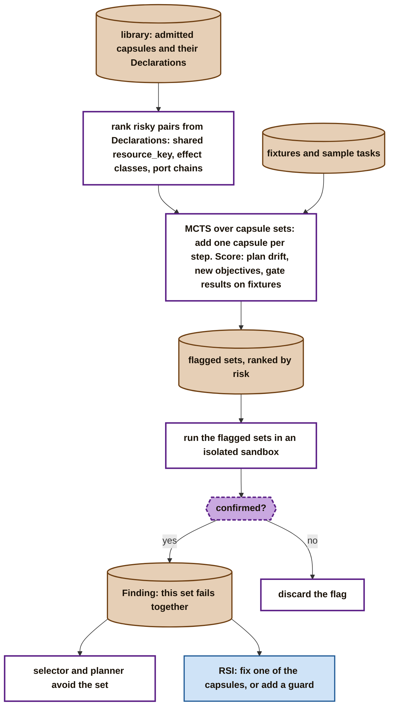

# When good capsules are bad together

Capsule A passes its checks and capsule B passes its checks, yet A and B loaded or run together can go wrong. Admission tests each capsule alone, so it cannot see this. This page shows how the library could look for such sets. It follows one paper, **SkillFuzz** (Hu et al., arXiv 2607.02345, July 2026), and shows why the Declaration makes the method easier for us.

It is unchecked at M1: it needs a library and many capsules. It belongs to the library cold path in [the big picture](../big-picture.md).

## What SkillFuzz found

- **The setting.** Skills are instruction documents loaded into an agent. A marketplace checks each skill alone before listing it.
- **The problem.** Skills that pass one by one can, loaded together, push the agent's plan toward objectives the task never asked for. The paper's examples:
  - an unrequested MP3 file;
  - CSV output where JSON was required;
  - audio sent to an outside API;
  - writing to dataset files that were only meant to be read.
- **The trend.** Severe plan drift appears in 4.7% of plans with one skill, 14.5% with two, and 66.5% with five.
- **The method: search, without running anything.**
  1. An LLM extracts a contract from each skill: preconditions, postconditions, the set of things the skill modifies, invariants, scope and action types.
  2. Pairs of skills are ranked by conflict: shared modifies entries, and invariants that exclude each other.
  3. A Monte Carlo tree search (MCTS) grows skill sets one skill at a time. A node is a set of skills; its reward is how far the agent's plan drifts from the plan with no skills, plus whether new unintended objectives appear.
- **The accuracy.** Of the 98 highest-risk sets it flagged, **80.6% were confirmed** when actually run in a sandbox. Contract guidance mattered: without it, high-severity finds dropped from 90 to 55.
- **Limits to keep in mind:**
  - Random search found slightly more distinct problems (121 vs 116). SkillFuzz found more severe ones (90 vs 64).
  - The execution check had no control group.
  - The paper does not show that each problem needs the combination. Some could come from one skill alone.
  - It tested prose skills in one planner's context, not capsules whose code has enforced, declared effects.

## Why the Declaration helps

SkillFuzz has to ask an LLM to guess each skill's contract. A capsule's author writes it, and admission checks it:

| SkillFuzz contract | In the Declaration |
|---|---|
| preconditions | `needs.when` |
| postconditions | output `ports` and their checks (`guarantees.checks`) |
| modifies set | `changes.effects[].resource_key` |
| action types | `changes.effect_class`, `needs.network`, `needs.external` |
| invariants | `changes.invariants[]`: reserved, not yet specified |
| domain scope | `identity.summary`, `identity.tags` |

So the conflict ranking can be computed directly, with no model:
- two capsules that write the same `resource_key`;
- one capsule that is `irreversible` beside one whose output another reads;
- ports that chain one capsule's output into another's input;
- network access added by a set that no single capsule in it needs.

## How the library could screen sets

- **Screen, then confirm.** The search only ranks sets. A set counts as bad only when running it in the sandbox confirms the problem. So screening is a filter, never a certificate.
- **The score can use our gates.** Besides plan drift, a set can be run on fixtures and scored by how often its gates fail. A capsule that passed alone but fails a `step` check beside another already produces a `fit_failure` Finding.
- **What a confirmed set produces** is a Finding. The selector and planner then avoid the set, and RSI can fix one of the capsules.

## Open

1. **Invariants.** SkillFuzz ranks sets partly by conflicting invariants. `changes.invariants[]` is reserved in the Declaration but not specified. Should it be?
2. **Where screening runs.** It would run in the librarian's cold path when a capsule is admitted. Screening every set is impossible, so which sets are screened, and how often, is a policy question.
3. **A Finding kind for a confirmed bad set.** Today `fit_failure` covers one step at runtime. A set found by screening may need its own kind.
