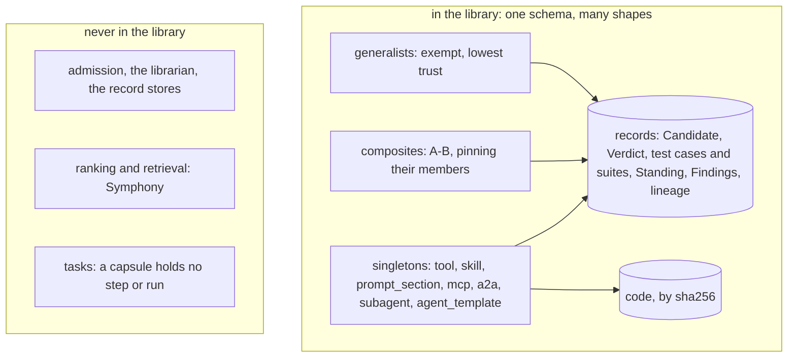
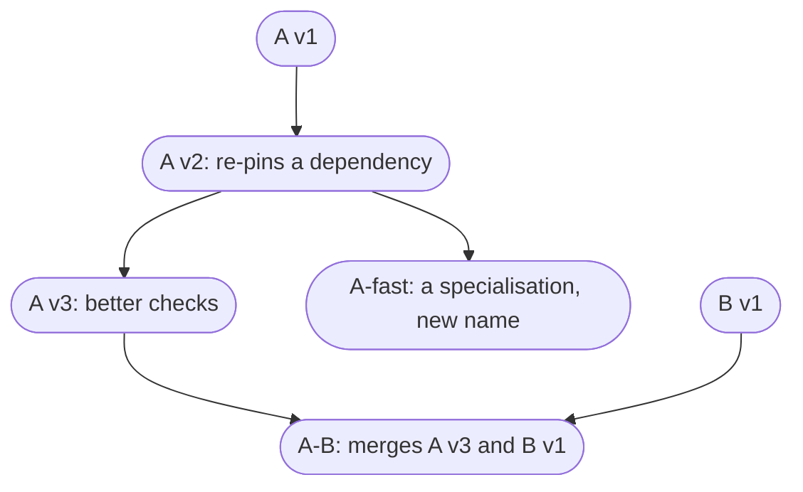
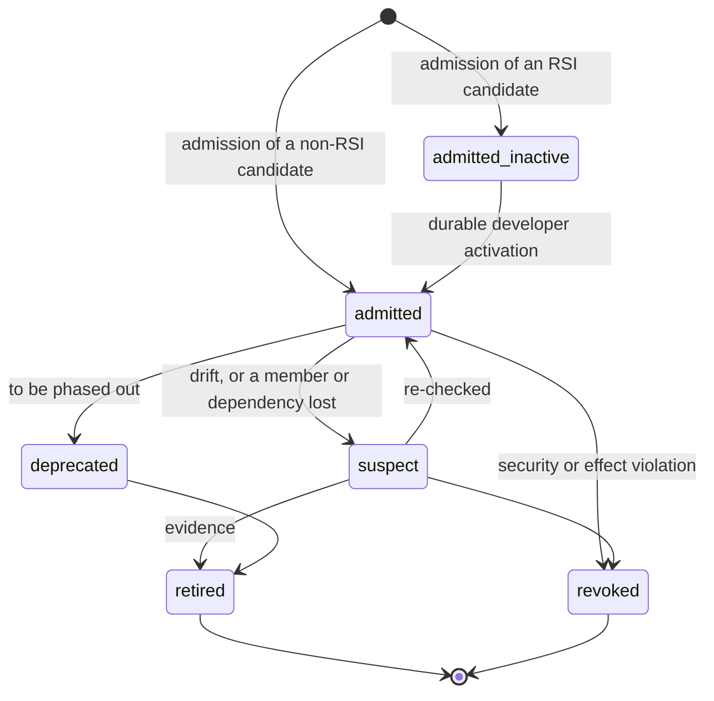
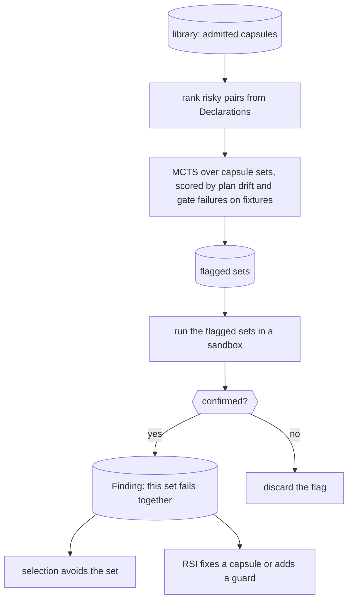

# The library

The **library** is the store of admitted capsules and everything recorded about them. Capsules come in only through admission; runs take pinned versions out; the librarian keeps their Standing honest. The library, admission and the librarian are control code, not capsules: they are not nodes of a run. Most of this page is unchecked at M1, where the library is the capsule folder plus admission; the rest is the vision.

## What the library holds

**Storage.** Code is stored by its sha256, so the same bytes are stored once and a Binding can fetch exactly what was tested. Records are stored by id, keyed `cc/<kind>/<scope>/<id>` under the jiuwenswarm profile root and written with `exclusive_set`, so a record is written once and never overwritten ([B1 file-level hooks](../b1-design.md#file-level-hooks)).

**Properties.** A **sprint** is one run of the workflow, from request to answer (`run_id`). The library is **versioned** (every change is a new hash, so a sprint pins what it uses), **append-only** (nothing is edited or deleted; a retirement is a tombstone) and **monotone** (a new version of a name passes everything its predecessor passed, plus its own cases).

## A tree of versions

Each version names its parent (`identity.lineage.parent_hash`), so the versions of a capability form a linked list, and branches and merges make them a tree. The end vision is a library seeded with many capsules, each growing its own tree of versions.

- **Nothing is removed.** Because the library is append-only, a superseded version keeps its Verdict and stays available: a sprint that pinned it keeps using it to the end, and a new version is used from the next sprint.
- **Standing points at one current version per name**, which is what selection offers by default.
- **Older versions are still known.** In the vision, the binder and the library may also consider older versions, and pick an older one where the records show it works better for that use. This is unchecked and open.

## Where tests are stored

- **Test cases** are one input and its expected result, keyed by the `interface_hash` they were written against, so they still apply after the code changes.
- **Test suites** are hashed sets of test cases. **Visible** suites come from the Candidate's own tests. **Sealed** suites are written by someone other than the builder; builders cannot read them, and they return only pass or fail. Sealed suites live in a store only admission can read.
- **Admission is the only writer** of test cases and suites; the Verdict lists the suites it ran. "The latest tests for X" is: the current Standing, then its Verdict, then that Verdict's suites.
- A child version with its parent's interface re-runs the parent's suites. Fields: [checks](../schemas/checks.md).

## Admission: the only way in

A capsule from a person, importer, RSI or future composer uses the same [AdmissionProvider contract](admission.md). Admission first performs the mandatory Declaration, hash, dependency, permission, interface and policy validation that no provider may waive. It then calls the policy-selected provider:

- `tested_admission` runs the applicable suites and may grant `provisional` or `certified`.
- `puppet_admission`, the M1 Puppet Gate, reads a developer-owned allowlist of exact declaration hashes and may grant only `exempt`.

The provider never writes a runtime Verification or releases a node. Admission writes the immutable [Verdict](../schemas/verdict.md) and initial Standing. An RSI child always starts `admitted_inactive`; activation is a separate durable librarian action. Every refusal carries a reason code, and an assurance suite is recorded only when it actually ran.

## A capsule's life in the library

Standing is one pointer per name, so these are the states of a name's current version. Superseding writes a new `admitted` entry that points at the new version.

- Only admission grants authority; everything else only withdraws it ([trust](trust.md#what-lowers-trust)).
- **Retirement depends on the reason.** Declining success only demotes. An effect violation aborts running calls and quarantines the capsule. A revoked source or a security revocation aborts, and makes every capsule built with it in context `suspect`.
- **Retiring is not reversing.** It un-registers the capsule; it does not un-publish the evidence it already produced.

## Three clocks

The design pages call these the three loops.

| Clock | Pace | Does | Writes |
|---|---|---|---|
| hot | every run; cheap; never waits | select, bind, run, gate | Bindings, Observations, Verifications, gap Findings |
| cold | when gaps recur, or an audit starts an update; rare | build decision, suite author, builder, admission | Candidates, Verdicts, Standing |
| audit | on a schedule, by blast radius and staleness | replays held-out suites, drift probes, judge audits | Findings; the librarian acts on them |

The hot path must work even if the cold path never admits anything. **The sprint is the reuse boundary:** a capsule admitted mid-sprint is used from the next sprint.

## The librarian

How the librarian compares declared with observed behaviour: [observability and quality](observability.md).

The librarian reads Observations, Verifications and Findings, and moves Standing. Its jobs: keep the active set small (start with about ten capsules, importing before building); find drift and demote; audit judges; offer inactive capsules a small exploration quota so they can earn evidence; and tell RSI where the gaps are. **CC exposes the version tree; RSI chooses where to branch.** The library never ranks versions or keeps a score.

## When good capsules are bad together

Capsule A passes its checks and capsule B passes its checks, yet A and B run together can go wrong. Admission tests each alone, so it cannot see this. **SkillFuzz** (Hu et al., arXiv 2607.02345) searches for such sets:

- **The finding.** Skills that pass one by one push an agent's plan toward objectives the task never asked for when loaded together: an unrequested file, the wrong output format, data sent to an outside API, writes to read-only data. Severe plan drift rose from 4.7% of plans with one skill to 66.5% with five.
- **The method.** An LLM extracts a contract from each skill; pairs are ranked by conflict (shared modifies entries, clashing invariants); a Monte Carlo tree search grows risky sets. 80.6% of the 98 highest-risk sets flagged were confirmed in a sandbox.
- **Limits.** Random search found slightly more distinct problems (121 against 116), though fewer severe ones; the execution check had no control group; and it tested prose skills, not capsules with enforced, declared effects.

**The Declaration makes this easier.** SkillFuzz has to guess each contract; a capsule's author writes it and admission checks it:

| SkillFuzz contract | In the Declaration |
|---|---|
| preconditions | `needs.when` |
| postconditions | output `ports` and `guarantees.checks` |
| modifies set | `changes.effects[].resource_key` |
| action types | `changes.effect_class`, `needs.network`, `needs.external` |
| invariants | `changes.invariants[]`: reserved, not yet specified |
| domain scope | `identity.summary`, `identity.tags` |

So risky pairs can be ranked with no model: two capsules writing the same `resource_key`; an `irreversible` capsule beside one whose output another reads; port chains; network access that no single capsule in the set needs.

Screening only ranks sets; a set counts as bad only when a sandbox run confirms it. Screening is a filter, never a certificate.

## Open

- A Standing state for "proposed" and "candidate" versions (today the Candidate record covers them).
- Invariants: `changes.invariants[]` is reserved; SkillFuzz ranks partly by clashing invariants.
- Which sets are screened, and how often.
- A Finding kind for a confirmed bad set (`fit_failure` covers one step at run time).
