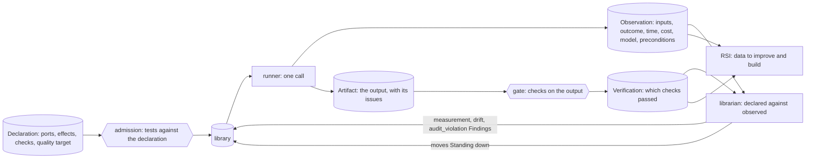

# Observability and quality

CC is declarative: a capsule says what it will do before it runs. That declaration is what makes verification, picking and test writing work well. But a declaration is only a claim. So CC also **records the real result of every call**, the way Symphony fingerprints what actually happened, and keeps comparing the two. Declared, then observed, forever.

## What is recorded for every call

Every call, in a run or at admission, leaves records written by tools, never by the capsule:

| Record | What it holds |
|---|---|
| [Observation](../schemas/observation.md) | who called it, the pinned version, inputs by reference, each precondition's result, outcome and reason, time, cost, the model that served it, and (later) the effects observed |
| [Artifact](../schemas/artifact.md) | each output value, which call produced it, and its `issues`: the caveats the capsule put in its output |
| [Verification](../schemas/verification-record.md) | which checks ran on the output, their results, and the gate's `pass`, `fail` or `blocked`, with labels such as `judge_unmeasured` |

These records are the data RSI learns from, and the evidence the librarian acts on. A call with no Observation went around the runner. Traces (spans) are for debugging only and are joined to the records by `run_id` and `obs_id`; the records are the source of truth.

## Declared against observed

The library does its best to ensure an admitted capsule behaves as its Declaration says:

- **At admission**, the capsule's tests run against its declared checks, and a child also runs its parent's suites.
- **At every call**, the runner checks hashes and preconditions, and the gate checks every output.
- **Over time**, the librarian compares what was observed with what was declared: effects beyond those declared (`audit_violation`), behaviour that moved (`drift`), and measured pass rate, time and cost (`measurement`). Any of these can move a capsule's Standing down; none can move it up.

This is Symphony's fingerprinting idea, observing the real result each time, but with a stated target to compare against. An observation with no target measures nothing.

## Quality: correctness is not enough

A capsule is checked on three layers:

| Layer | What it asks | How it is checked | Result |
|---|---|---|---|
| conformance | is the output the right shape and type? | deterministic checks, port types | pass or fail, every call |
| correctness | is this output right for this input? | reference checks against known answers; deterministic checks | pass or fail, per case |
| quality | how good are its outputs, over time? | judged checks, by a model or a person | a rate over a window, never a single verdict |

**Qualitative capsules are evaluated differently.** A capsule that writes a hypothesis or a report cannot be checked like a parser. Its judged checks give a pass rate, not a proof; `guarantees.quality` states the rate it should reach, and the librarian measures the real rate over enough observations. Judges are not calibrated yet, so their results carry a label and are meant for a person to review. Such capsules will not always do their best, and CC does not pretend they do: **block for safety, label for quality** ([trust](trust.md#block-for-safety-label-for-quality)).

## What it gives

- **Picking:** measured pass rate, time and cost per version, alongside the declaration.
- **Test writing:** real inputs and failures become new test cases.
- **RSI:** which capsule to improve, and evidence that a child is better.
- **People:** an honest record of what ran, what it did, and how good it was.
