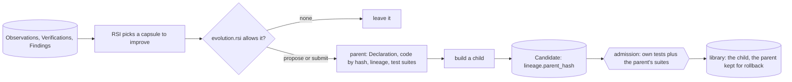
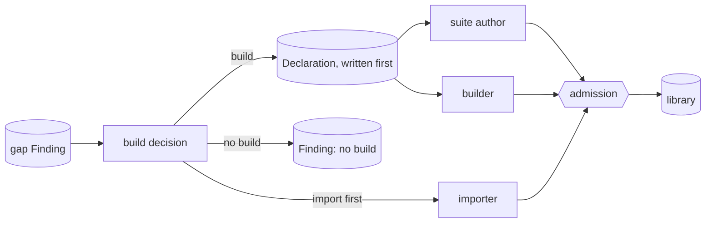

# RSI: improving and building capsules

RSI (recursive self-improvement) is code that builds new capsule versions from evidence. It is built on a separate branch that shares this schema; its fields are in the schema, and M1 neither requires nor tests them, except `evolution.rsi`, which every Declaration states from M1. This page is the vision for it.

Capsules give RSI two ways to make the system better:

1. **Better capsules**, so each thing the system does gets better: [the improve loop](#improving-a-capsule).
2. **More capsules**, so the system can do more: [the build loop](#building-new-capsules-from-gaps).

Each capsule is isolated and testable on its own: declared ports, effects and checks, and tests bound to its interface. So a change is tested on one capsule against its own tests, live outputs are still checked at the gate, and every call leaves an Observation that shows which capsule to improve. RSI is uniform: one mechanism for every capsule, whether a research step, a gate's helper or a composite.

## RSI permissions: opt-in

RSI may change a capsule only if its author allows it. Every Declaration must state `evolution.rsi` ([fields](fields.md#evolution-what-rsi-may-change)):

`none` forbids any RSI child; `propose` lets RSI submit a child that waits for a person; `submit` lets it become current when admitted. RSI cannot get round `none` by submitting a copy as a new capsule: admission refuses an RSI Candidate whose files match a capsule with `none` (rule `rsi_no_copy`).

`evolution.frozen` lists parts a child must keep; `evolution.notes` tells a builder what the author knows. Because any node can be a capsule, these permissions are what keep the system safe to improve: **the actor may improve; the referee may not.** A capsule used as a gate or verifier should be `none` ([trust](trust.md#referees)).

## Improving a capsule

- **RSI never edits a version; it submits a child** with `lineage.parent_hash` pointing at the parent.
- **A child with the parent's interface must also pass the parent's test suites.** A child that changes the interface needs new test cases, and records the parent's `decl_hash` in `inherited_from_hash` on the suites it carries over.
- The child becomes current only when admitted; the parent stays for rollback, which is a Standing move.
- **The version tree** is kept by the lineage index. CC exposes it; RSI's own policy chooses where to branch, from any node.

## Building new capsules from gaps

When no capsule fits a step, the [generalist](generalist.md) fills it and leaves a gap Finding. A gap that recurs starts the build loop. Four roles, in separate sessions:

| Role | Does | Never sees | Why |
|---|---|---|---|
| build decision | decides whether a new capsule is actually needed: build, import, or not build. Designing this decision is RSI's work; CC gives it the gap records and the library to search | drafts | models commit to building at first sight (AllocBench), so deciding is separate from building |
| suite author | writes the tests from the Declaration alone, before the code | the generalist's work, drafts | tests written first catch tools that overfit (Beyond Task Completion) |
| builder | writes the code | the suite; it hears only admit or reject, with capped tries | an uncapped loop learns the suite |
| admission | admits or rejects | anything a capsule writes | an agent gamed its own checker (Darwin Godel Machine) |

- **When to build.** A gap must recur, counted in sprints (proposed: at least 2). Not building is always a valid answer.
- **Import first.** An existing tool, skill or MCP server is tried before building. The importer derives what it can and invents nothing; a person confirms the effects and the checks.
- **Declare first.** The Declaration is written before the code, so the tests bind to the interface and not to one implementation.
- **The options** for an update: a new version of a capsule (it must pass its predecessor's tests), a specialisation under a new name, a new capsule, or no build.
- **The budget is a hard limit**, never a price shown to the builder.
- **What RSI builds gets the same admission** as what a person builds, and starts at `evolution.rsi` chosen by the person who approves it.

## Updating dependencies

Every dependency is pinned in every version, so updating one is ordinary RSI, not a run-time float:

1. The author gives a dependency a `purpose` ("validates port values" for pydantic). Only a dependency with a purpose may be re-pinned by RSI (rule `repin_needs_purpose`); one without is never updated automatically.
2. The librarian sees a newer version upstream and records a `dependency_update` Finding.
3. If the capsule's `evolution.rsi` allows it, RSI builds a child that re-pins the dependency. The purpose tells the builder what the dependency must still do.
4. A re-pin keeps the interface, so admission runs the child's tests and the parent's suites, as for any child.

**Limits.** Re-pins of one capsule are spaced by the policy's `dep_update_min_interval_s`, except for security. A capsule dependency is re-pinned only when the pinned version is superseded or revoked, not on every release. A composite or a user of the dependency with `evolution.rsi: none` keeps its old pin until its author moves it. A security fix never waits for this loop: the librarian withdraws the vulnerable version first ([trust](trust.md#what-lowers-trust)). A re-pin is only as well tested as the parent's suites exercise the dependency.

## What must never evolve

- **The referee:** admission, gates used as referees, test suites, the policy and the record stores. No capsule writes them.
- **Model weights.** The system changes its library and its context, reversibly; never weights.
- Prefer the most reversible change: the library before the context, the context before anything else.

## Evidence

Why verification is the whole value of self-generation: [why](why.md#the-evidence).

## Open

- Where the run-level controls live (whether a gap may lead to a build).
- A meta-level tree of whole-workflow versions.
