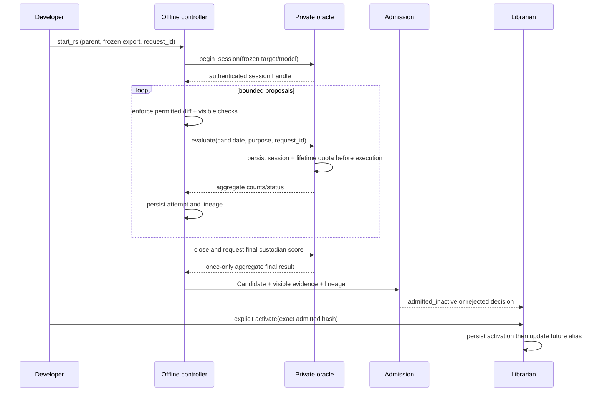

# M1 offline RSI boundaries

The [RSI controller](rsi-engine.md) owns execution and attempt records; the [private oracle](fixture-oracle.md) owns hidden evaluation and quota. This page owns scope. Production never triggers RSI automatically. A developer starts a separate offline session from frozen evidence.

Only a parent with `evolution.rsi: propose` and an explicit nonempty permitted mutation set is eligible. M1 rejects `none`, `submit`, empty permission, and an always-frozen change before execution. Work prompt/rubric wording or one permitted implementation file may change; required ports, effects, permission, dependencies, model-selection text, checks, referee criteria, fixture custody, scoring/acceptance policy and activation remain frozen. Fixed Screening scale/dimensions/arithmetic remain PRD behavior. Owner proposals allowing these to change are superseded by the master PRD.

The session pins parent, model/version, settings, policy, corpus, split and permitted paths. Parent and child compare under the same settings. Drift is `MODEL_MISMATCH` and cannot support admission. Loop queries are capped at 30/session and 90/loop-set lifetime; final holdout is custodian-only once/session after close. Interrupted reservations consume quota.

A Candidate is a new immutable version; RSI never edits its parent. Admission independently checks mandatory integrity and provider evidence. Puppet admission can allowlist a hash as exempt, and never turns hidden optimization results into certified evidence. A separate human activation selects future runs; active runs retain their library snapshot.

New capability creation, dependency repinning, self-improver changes, model-weight changes, automatic promotion, live-run evolution and generalist gap repair are outside the M1 whitelist. Stronger optimization may replace the proposer behind the controller API; it must preserve Candidate, oracle and activation boundaries. Referee isolation follows [METR's observed reward-hacking failure modes](https://metr.org/blog/2025-06-05-recent-reward-hacking/). No claimed test result follows from this precedent.
