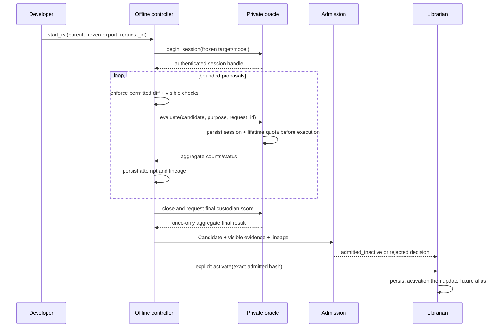

# M1 offline RSI boundaries

PRD: 2.11, 4.1.5, 4.4.9, 4.4.10

> Answers: What are the boundaries of RSI for capsules in M1?

The [RSI controller](rsi-engine.md) is the home of execution and attempt records; the [private oracle](fixture-oracle.md) is the home of hidden evaluation and quota. This page is the home of scope; [RSI](../rsi.md) is the home of the whole offline area. Production never triggers [RSI](../rsi.md#term-rsi) automatically. A developer starts a separate offline session from [frozen](../system/lifecycle.md#term-freeze) evidence.

## Key terms

| Term | Meaning |
|---|---|
| **RSI target** | The one capsule part an offline RSI session is allowed to improve: a permitted implementation file, the Screening prompt and rubric text, or `research.compile_intent`. It is chosen from the parent's `may_change` list. |
| **parent and child** (also: RSI child) | The parent is the admitted capsule version being improved; the child is the new immutable Candidate RSI builds from it. A child is admitted as `admitted_inactive` and compared with its parent under identical settings. |
| **session** | One offline RSI run by a developer from frozen evidence, pinning the parent, model, settings, policy, corpus and permitted paths. It is bounded by oracle quotas and ends with one final custodian score. |

Only a parent with `evolution.rsi: propose` and an explicit nonempty permitted mutation set is eligible. M1 rejects `none`, `submit`, empty permission, and an always-frozen change before execution. The M1 target modes are: one permitted implementation file, the Screening prompt and rubric text, and `research.compile_intent` (its code and its compile and repair prompts, model-backed, scored with paired repeated calls). Work prompt/rubric wording or one permitted implementation file may change; required [ports](fields.md#term-port), effects, permission, dependencies, model-selection text, [checks](fields.md#term-check), referee criteria, fixture custody, scoring/acceptance policy and activation remain frozen. Fixed Screening scale/dimensions/arithmetic remain PRD behavior.

The session pins parent, model/version, settings, policy, corpus, split and permitted paths. Parent and child compare under the same settings. Drift is `MODEL_MISMATCH` and cannot support admission. Loop queries are capped at 30/session and 90/loop-set lifetime; final holdout is custodian-only once/session after close. Interrupted reservations consume quota.

Message shapes for the controller calls shown above are in [RSI engine](rsi-engine.md) (`library-rsi-v1.schema.json#rsi_start_request`, `library-rsi-v1.schema.json#rsi_session_result`, `library-rsi-v1.schema.json#rsi_attempt_entry`) and for the oracle calls in [fixture oracle](fixture-oracle.md) (`library-rsi-v1.schema.json#oracle_begin_request`, `library-rsi-v1.schema.json#oracle_evaluate_request`, `library-rsi-v1.schema.json#oracle_aggregate_result`). Activation is one librarian call (`library-rsi-v1.schema.json#activation_request`).

A RSI child is a new immutable version; RSI never edits its parent. Admission independently checks mandatory integrity and provider evidence. The provider is chosen by policy: `tested_admission` (provisional) is the default, and Puppet is available by developer allowlist (exempt). Either way the child is `admitted_inactive`, and hidden optimization results never become certified evidence. A separate human activation selects future [runs](../system/lifecycle.md#term-run); active runs retain their [library snapshot](library.md#term-library-snapshot).

New capability creation, dependency repinning, self-improver changes, model-weight changes, automatic promotion, live-run evolution and generalist gap repair are outside the M1 whitelist. Stronger optimization may replace the proposer behind the controller API; it must preserve Candidate, oracle and activation [boundaries](../system/modules.md#term-boundary). Referee isolation follows [METR's observed reward-hacking failure modes](https://metr.org/blog/2025-06-05-recent-reward-hacking/). No claimed test result follows from this precedent.
