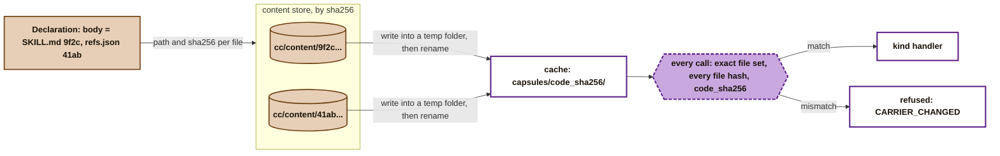
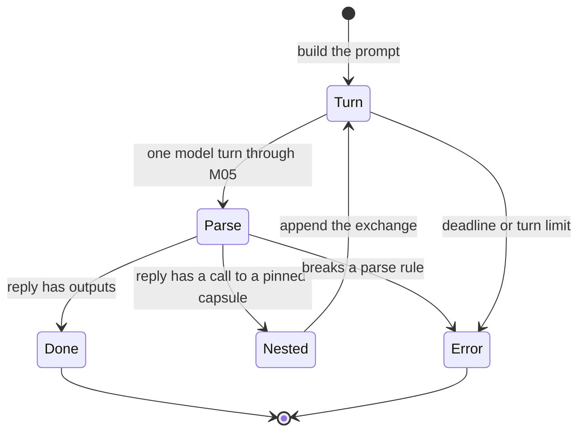

# Runner kind handlers, values and ports

PRD: 4.1.4, 4.2.1

> Answers: How does the runner turn a verified capsule and its input values into output values for each kind?

## Purpose

This page is the second part of the [CC runner](runner.md). It covers what happens inside [steps](../system/nodes.md#term-step) 2 to 8 of the [pipeline](runner.md#behavior-one-call-start-to-finish): how a hash becomes verified code, how each port type travels, how preconditions are evaluated, and how each `kind` [runs](../system/lifecycle.md#term-run) (`tool`, `skill`, `prompt_section`). A handler returns values; it never writes a record. The model client, broker, callers, [Swarmflow](../system/integration.md#term-swarmflow) backend, permissions and records are on [runner broker](runner-broker.md).

## Interface

Messages of the handlers.

- **Record a control or human input value as an Artifact** (call, launcher, gate host -> supervisor-side control function; not a runner operation). Schema: [`execution-v1.schema.json#record_input_request`](../contracts/execution-v1.schema.json).
- **Frames between the runner and a tool-kind child (call, nested, model, result, errors)** (frame, runner <-> tool host, length-prefixed). Schema: [`execution-v1.schema.json#tool_host_frame`](../contracts/execution-v1.schema.json).
- **Required model reply shape in a skill [turn](../system/model-bridge.md#term-model-turn)** (frame, model -> skill handler). Schema: [`execution-v1.schema.json#skill_turn_frame`](../contracts/execution-v1.schema.json).
- **Per model turn record in [Observation](../schemas/observation.md#term-observation) [ext](../schemas/common.md#term-ext).runner.turns** (record, runner -> Observation). Schema: [`execution-v1.schema.json#runner_turn_entry`](../contracts/execution-v1.schema.json).
- **Arguments a check function receives (inputs, outputs, observation, expected, context)** (frame, [check runner](gate-host.md#term-check-runner) (M10a) -> tool host in check mode). Schema: [`tools-v1.schema.json#check_call`](../contracts/tools-v1.schema.json).

## Behavior: from input to output

For one call, in order: verify the code ([from hash to running code](#from-hash-to-running-code)), bind the inputs by their [type rule](#values-how-each-port-type-travels), evaluate the [preconditions](#precondition-evaluator), then run the [kind handler](#kind-handlers). The rest of this page is those four parts.

## From hash to running code

A [Declaration](fields.md#term-declaration) never holds code. It names each file by path and SHA-256 (`identity.carrier` or `identity.body`). This is how the runner gets from those hashes to code it can run.



**Where code comes from.** Code reaches the content store only two ways: admission stores every file of an admitted [capsule](capsule.md#term-capability-capsule) at `cc/content/<sha256>` ([admission](library.md#behavior-admission-the-only-way-in), step 4), and the vocabulary builder stores the [closed type](../types/types.md#term-closed-type) [checks](fields.md#term-check)' files ([toolchain M00a](toolchain.md#m00a-vocabulary-builder)). The runner never reads the author's folder. An author's working copy can change at any time, and jiuwenswarm's skill store can change a skill's files under the same version ([tools](tools.md#what-the-existing-pieces-give)).

**Materialise, once per `code_sha256`.** When the cache folder does not exist:

1. Check every declared `path`: relative, forward slashes, no `..` segment, no drive letter. Otherwise `CARRIER_CHANGED`.
2. Create a temporary folder beside the cache folder. For each file, read `cc/content/<sha256>` and write its bytes unchanged at its `path` (`Path.write_bytes`; never text mode, which turns line endings into CRLF on Windows).
3. Rename the temporary folder to `capsules/<code_sha256>/`. If the rename fails because another call won the race, delete the temporary folder and use the existing one.
4. Mark every file read-only (`os.chmod(path, stat.S_IREAD)`). Folders are not marked, because Windows cannot make a folder read-only; the check below covers them.

**Verify, on every call**, not only after materialising:

1. List every file under the folder, recursively. The set of relative paths must equal the declared set exactly. An extra file (a dropped-in module, a `__pycache__`) or a missing file is `CARRIER_CHANGED`.
2. Hash every file from disk and compare it with its declared `sha256`.
3. Compute `code_sha256` as [fields](fields.md#computed-by-admission-never-written-by-the-author) defines it, and compare it with the expected value from step 3 of the [pipeline](runner.md#behavior-one-call-start-to-finish).

Any change on disk is caught on the next call, whoever made it.

**What this proves, and what it does not.** It proves the capsule's own files are the files admission tested. It does not pin third-party packages: tool code imports them from the agent server's environment. `needs.dependencies` is unchecked at M1, so this gap is accepted and stated.

## Values: how each port type travels

| Port type | Stored as | Into a tool | Into a skill prompt | Out of a tool | Out of a skill |
|---|---|---|---|---|---|
| `text`, `integer`, `number`, `boolean`, `json` | `value` inline | the JSON value | the JSON value in an `INPUT` block | the return value | the value under `outputs` |
| a domain type with a JSON `value_schema` (such as `intent_ir`) | `value` inline | the JSON value | as above | as above | as above |
| `collection<T>`, `T` inline | `value` inline, a JSON list | the list | as above | as above | as above |
| `file` | `content_ref`, bytes at `cc/content/<sha256>` | a read-only path to a copy in the workspace's `.cc/in/<obs_id>/` | the file's text, if it decodes as UTF-8 and is at most `runner.max_inline_file_bytes`; otherwise `refused`, `PORT_MISMATCH` | a path the tool wrote inside the workspace; the runner hashes the bytes and stores them | not allowed at M1: a skill cannot write files. A skill with a `file` output is refused at step 2, `SCHEMA_NONCONFORMANT` |
| `collection<file>` | `value` is a list of `{content_sha256, name, mime_type}` | a list of paths | one `FILE` block per item, same rule | a list of paths | not allowed, as above |
| `path` | `value` inline: a workspace-relative path string | an absolute path | the relative path string | a workspace-relative path string | the relative path string |

**Path confinement.** Every `path` value, in or out, is resolved against the run's workspace with symlinks followed. The result must stay inside the workspace. Otherwise the call is `refused`, `PORT_MISMATCH` for an input, and `error`, `CAPSULE_ERROR` for an output.

**A `path` value pins a name, not contents.** Its Artifact hashes the path string. A workspace file that changes under the same path does not change the call descriptor, so a resumed run replays the earlier result. Capsules that must react to file contents take a `file` port instead.

**Value schemas.** A `Port.value_schema` is `{uri, sha256}`. The runner loads the schema from `cc/content/<sha256>`, and admission stores it there. The `uri` is informative only. Type schemas come from the [port type vocabulary](../schemas/port-types.md#term-port-type) the [Binding](../schemas/binding.md#term-binding) pins.

**Values handed in by control code.** `record_input` is a supervisor-side control function, not a runner operation: the runner operations stay call, cancel and status. The launcher (M01) and the [Gate host](gate-host.md#term-gate-host) call it in the supervisor, which is the only store writer, to write the launcher inputs, the [run plan](../types/run-plan.md#term-run-plan) and the `evidence_bundle` ([Artifact](../schemas/artifact.md)):

```python
async def record_input(run_id: str, type: str, *, vocabulary_ref: dict, value: Any = None,
                       file: Path | None = None, origin: Literal["human", "control"],
                       request_id: str) -> Ref: ...
```

Schema of the call: `execution-v1.schema.json#record_input_request`. The function validates the value against its type in the vocabulary freeze will pin (`vocabulary_ref {id, sha256}`, `id` the vocabulary version name; `request_id` is required, and exactly one of `value` and a file ref is given), runs the type's deterministic checks through M10a and refuses the value if any fails, stores it, commits an Artifact with that `origin`, and returns its `Ref`. The launcher puts these refs in the script's `args`. An inline value over `cc.ipc.max_frame_bytes` is refused when it is later passed to a tool (`LIMIT_EXCEEDED`); use a `file` port.

## Precondition evaluator

One evaluator, shared with selection later. `path` is dotted, rooted at `inputs.<port>` (the bound value). A path that starts with any other root gives `defer` at M1, because `state_source` is unchecked.

| Case | Result |
|---|---|
| `present` / `absent` | whether the path resolves to a value other than JSON `null` |
| `eq`, `ne`, `in`, `not_in` | JSON equality with `value`; `in` and `not_in` need `value` to be a list |
| `gt`, `gte`, `lt`, `lte` | both sides are numbers, else `fail` |
| `matches` | the resolved value is a string and `re.search(value, s)` finds a match; a non-string is `fail` |
| the path does not resolve, for any op but `present` and `absent` | `fail` |
| the op is unknown, or the evaluator raises | `defer` (policy `defaults.on_unknown`; never `pass`, INV-8) |

Each result is recorded in the Observation's `predicates` as `{predicate_id, result}`.

## Kind handlers

The [kind](capsule.md#term-capsule-kind) says how a capsule runs. Each kind has one handler with one interface. A new kind adds a handler; the pipeline, records and gate do not change.

```python
class KindHandler(Protocol):
    kind: str
    async def invoke(self, call: CallContext) -> HandlerResult: ...

@dataclass(frozen=True)
class CallContext:
    run_id: str | None                    # None for admission calls
    scope: dict                           # {"run_id": ...} or {"candidate_id": ...}
    step_id: str | None
    caller: Literal["dispatch", "gate", "admission", "nested"]
    obs_id: str
    decl: Declaration                     # parsed, hash-checked
    root: Path                            # the verified cache folder
    inputs: dict[str, Any]                # port name -> value, per the values table
    workspace: Path
    deadline: float                      # time.monotonic() value
    broker: Broker

@dataclass
class HandlerResult:
    outputs: dict[str, Any]               # port name -> value; empty on failure
    issues: dict[str, list[Reason]]       # port name -> caveats
    failure_code: str | None              # a code from failure_modes, if the capsule raised one
    error: str | None                     # None, or "CAPSULE_ERROR", "BUDGET_EXCEEDED", "TIMEOUT", "RUNTIME_UNAVAILABLE", "EXTERNAL_UNAVAILABLE"
    error_detail: str | None              # a message or traceback, kept in ext.runner
    model_hint: str | None                # task/role hint only; Model Routing is the home of actual endpoint/model
```

A handler never writes records. It returns values; the pipeline builds the [Artifacts](../schemas/artifact.md#term-artifact) and the Observation, and the supervisor commits them ([commit path](runner.md#commit-path-the-supervisor-is-the-only-writer)).

| `kind` | Handler | M1 |
|---|---|---|
| `tool` | [R6a](#tool-a-python-function-in-its-own-process): calls the pinned function in a child process | checked |
| `skill` | [R6b](#skill-model-turns-that-follow-skillmd): model turns that follow the skill's files, with its pinned capsules offered as tools | checked |
| `prompt_section` | [R6c](#prompt_section-text-for-a-skills-prompt): returns its text | checked |
| `mcp`, `a2a`, `subagent`, `agent_template`, `composite` | not in M1. Refused at step 2, `SCHEMA_NONCONFORMANT`. Each is one new handler later | unchecked |

### `tool`: a Python function in its own process

The entry point is `identity.carrier.ref`, written `file.py:function`. A `tool` whose code spans several files uses `body` instead, which names no symbol, so it gives its entry point in `ext.cc.entry`, written the same way, with the file in `body`. A `tool` with neither is refused at step 2, `SCHEMA_NONCONFORMANT` (see [asks](runner.md#what-this-design-asks-of-other-pages) 5). The tool handler starts a **tool host**, a small Python process, for each call.

**Why a separate process.** Each reason is enough on its own:

- **The time budget must be enforceable.** A Python thread cannot be killed; a process can.
- **Local imports must come from the verified folder.** A fresh process imports the capsule's own modules from its cache folder only, so two versions never share a module cache.
- **Model calls must come back to the agent server.** The only signed-in Codex child belongs to the agent server process (B1), so a tool's model calls go back through the broker. That also records every model call.

**Launch.**

```python
argv = [sys.executable, "-I", "-B", "-m", "cc.runner.tool_host",
        "--root", str(root), "--entry", entry_ref, "--mode", mode]   # mode: "call", or "check" for M10a
env  = {"PATH": "<fixed image runtime path>",
        "PYTHONDONTWRITEBYTECODE": "1", "PYTHONIOENCODING": "utf-8"}
cwd  = workspace
```

**Check mode** (`--mode check`, used by M10a): `root` is the materialised folder holding the check's runner file; the `call` frame's `inputs` is `{inputs, outputs, observation, expected, context}`, passed as keyword arguments; there is no broker, so a `nested` or `model` frame ends the check `unknown`; and the `result` frame's `outputs` is the `CheckResult` ([checks](../schemas/checks.md#calling-convention)). Everything else is as for a call.

These argv/env/cwd values are a workload specification passed to the validated Linux execution service, not permission to spawn an unconfined child directly. The launcher applies the fixed image interpreter, namespaces, read-only admitted code/input mounts, private writable attempt root, capability drops and authenticated broker descriptor. The handler retains its namespace-init handle for complete cancellation/reaping. Windows/native-host launch is outside M1. -I ignores user-site/PYTHON variables; -B suppresses bytecode. Trusted cc/cc_sdk packages are installed in the pinned image. The tool host loads the entry file from the verified root inside that profile. The runtime environment contains no secrets. Framing and reader limits use the pinned `cc.ipc.max_frame_bytes`, which applies to tool-host frames; an oversized frame fails the call (`LIMIT_EXCEEDED`) rather than bypassing the configured limit.

**Frames.** The host and the handler exchange length-prefixed frames over the host's stdin and its original stdout: a 4-byte big-endian length, then that many bytes of UTF-8 JSON, one object per frame, at most `cc.ipc.max_frame_bytes` (default 1 MiB). A frame over the limit closes the channel and fails the call with `LIMIT_EXCEEDED`; a large value never travels inline, it goes by ref (a `file` port is a path, a nested output is a `ref`). Before it imports capsule code, the host keeps private copies of both frame descriptors (`os.dup(0)`, `os.dup(1)`) and opens them in binary mode. It then points descriptor 0 at `os.devnull` and descriptor 1 at stderr (`os.dup2(2, 1)`). So a capsule's `print` cannot corrupt a frame, and its `input()` cannot swallow one. Both ends write each frame as `len(body).to_bytes(4, "big") + body`, where `body = json.dumps(frame, ensure_ascii=False).encode("utf-8")`. The handler reads stderr in its own task for the whole call, so a chatty capsule never [blocks](../system/modules.md#term-block). It keeps the first 64 KiB in the Observation's `ext.runner.stderr`.

| Direction | `t` | Other fields | Meaning |
|---|---|---|---|
| host to runner | `ready` | | imports done; send the call |
| runner to host | `call` | `inputs`: object; `failure_codes`: the Declaration's `failure_modes[].reason_code` values | call the function once |
| host to runner | `nested` | `id`: int, `ref`: string, `inputs`: object | `cc.call` |
| runner to host | `nested_result` | `id`; `ok`: bool; if ok `outputs`: `{port: {"ref": Ref, "value": any}}` and `issues`: `{port: [Reason]}`; else `obs_id`, `outcome`, `reason` | |
| host to runner | `model` | `id`, `prompt`: string, `model`: string or null, `route_id`: string or null | `cc.model` |
| runner to host | `model_result` | `id`; `ok`; if ok `text`; else `broker_request_id`, normalized runtime `reason` and safe `message` | Failed reply supplies the reserved [bridge](../system/model-bridge.md#term-model-bridge) request identity separately from local integer id; SDK retains it in ModelUnavailable, and trusted broker records it for attribution |
| host to runner | `issue` | `port`, `code`, `message` | `cc.issue` |
| host to runner | `result` | `outputs`: object | the function returned |
| host to runner | `failure` | `reason_code`, `message` | the function raised a declared failure |
| host to runner | `unavailable` | `service`, `reason`, `message`; `broker_request_id` required for service=model | ExternalUnavailable/nested runtime failure, or model failure matching the trusted broker reply; a forged model attribution is rejected |
| host to runner | `exception` | `type`, `message`, `traceback` | the function raised anything else |

`id` is a counter local to the call; it pairs requests with results. `cc_sdk` calls block, so a capsule makes one request at a time.

Schema: `execution-v1.schema.json#tool_host_frame`. Direction in the table is from the tool host's point of view: `ready`, `nested`, `model`, `issue`, `result`, `failure`, `unavailable` and `exception` go from the tool host to the runner handler; `call`, `nested_result` and `model_result` go from the handler to the host. The runner-to-host `call` frame and the host `nested`/`model` request frames are the "nested call frame" and "model request frame"; `result` is the result frame; `failure`, `unavailable` and `exception` are the error frames. `obs_id` is an optional correlation field on every frame (observability gap 2).

**Calling convention.** The host calls `fn(**inputs)`: each given input port becomes a keyword argument of the same name. An optional input that was not given is not passed. If `fn` is a coroutine function, the host runs it with `asyncio.run`. With exactly one output port, the return value is that port's value. With more than one, it must be a dict whose keys are the output port names. A missing or extra key is `CAPSULE_ERROR` at step 8.

**The capsule-side API, `cc_sdk`.**

| Call | Does |
|---|---|
| `cc.call(ref, **inputs) -> NestedResult` | a nested call to a capsule in `needs.external`. `NestedResult.outputs` is output values by port name; `NestedResult.issues` is each output Artifact's `issues` by port name, so the caller can carry a caveat forward with `cc.issue`. Raises `cc.NestedError(obs_id, outcome, reason)` when the nested call does not end `ok`, and `cc.NestedRefused(ref)` when `ref` is not pinned |
| `cc.model(prompt, *, model=None, route_id=None) -> str` | one authorized model turn through M05; successful model_result returns text. A failed broker reply raises cc.ModelUnavailable carrying broker request id, safe detail and normalized runtime reason. Timeout remains TIMEOUT; auth/provider unavailable maps RUNTIME_UNAVAILABLE with original diagnostic detail. Model hint/route selection obeys [frozen](../system/lifecycle.md#term-freeze) track/session policy |
| `cc.issue(port, code, message)` | adds a caveat to an output's `issues`; `code` must be `INPUT_AMBIGUOUS`, `INPUT_INCOMPLETE`, `INPUT_CONTRADICTORY` or `EXTERNAL_UNAVAILABLE` (an outside service was partly unavailable; `reason_owner` `runtime`). An output with issues makes a passing step `PASS_WITH_KNOWN_LIMITATIONS` |
| `cc.input_ref(port) -> InputRef` | passed as a `cc.call` input, it binds the caller's own input Artifact for that port, by reference: nothing is re-sent in a frame or stored again |
| `cc.Failure(reason_code, message)` | raise to end with a declared failure mode |
| `cc.ExternalUnavailable(service, message)` | raise when an outside service the capsule depends on (arXiv, Semantic Scholar) cannot answer. The call ends `error` with the runtime-owned reason `EXTERNAL_UNAVAILABLE`, never blamed on the capsule |
| `cc.replaying() -> bool` | true at admission and in every nested call under it. An adapter for an outside service then reads recorded responses from `<workspace>/.cc/replay/<adapter>/` instead of the network, and raises `cc.ExternalUnavailable` when a recording is missing |

**How the host reports an ending.** An uncaught cc.ModelUnavailable from a failed model_result is sent as unavailable with service=model, broker request id and normalized reason. The trusted runner matches that id/reason to its recorded failed broker response before preserving runtime attribution; a fabricated unavailable claim is a capsule error. cc.Failure, or an exception whose [reason_code](../schemas/policy.md#term-reason-code) is listed in guarantees.failure_modes, is sent as failure. Other exceptions are sent as exception. No new failure_modes entry is needed for standard model/provider failures.

**What the handler does with each ending.**

| Ending | `HandlerResult` |
|---|---|
| `result` | `outputs`, plus the `issue` frames collected |
| `failure` | `error: CAPSULE_ERROR`, `failure_code` set (see [failures](runner.md#failure-failures-in-one-table)) |
| `unavailable` | `error: EXTERNAL_UNAVAILABLE`, or the nested call's own runtime-owned reason (`TIMEOUT`, `RUNTIME_UNAVAILABLE`), so an outside failure stays an outside failure up the whole call tree |
| `exception`; a bad frame; the host exits without `result` | `error: CAPSULE_ERROR` |
| the deadline passes | terminate the launcher-owned PID namespace init and reap the complete workload tree using the validated Linux execution service, then `error: BUDGET_EXCEEDED`; process-group signalling alone is insufficient. Windows/native-host launch is outside M1 |

**The workspace is not rolled back.** A killed or failed tool may leave files in the workspace. Its declared `effects` say where; the runner does not clean up.

### `skill`: model turns that follow `SKILL.md`

A skill is files a model follows. The handler builds a prompt, calls the model through the broker, and parses the reply into the output [ports](fields.md#term-port). It does not execute local Python postprocessors. A capability mixing prompt work with deterministic local code uses the existing tool handler and brokered cc.model, with its entrypoint and helper files pinned in the Declaration body; Screening is such a tool wrapper. Internal model-reply schemas do not become extra public output ports.

**Front matter.** `SKILL.md` may begin with YAML front matter. The handler reads one key, `model`, and passes it to M05 as the hint. It never picks a model itself.

**Text files only.** Every `body` file of a skill must decode as UTF-8; otherwise step 3 refuses the capsule after its hash check, `SCHEMA_NONCONFORMANT`.

**The prompt**, exactly this layout. Each `<<<...>>>` line is a delimiter on its own line, so a backtick in a skill file never breaks it.

```text
You are running one capability. Follow the SKILL below. Do not run commands or use tools of
your own. Reply with exactly one JSON object as described under REPLY, and nothing else.

<<<FILE SKILL.md>>>
...the file...
<<<END FILE>>>
<<<FILE references/defaults.json>>>      (every other body file, in body order)
...
<<<END FILE>>>
<<<SECTION prompt.citation_rules>>>      (each prompt_section capsule in needs.external, in order)
...its text...
<<<END SECTION>>>
<<<INPUT intake: The Qualified Intake Package>>>      (each given input, in declared order)
{...json.dumps(value, ensure_ascii=False, indent=2, sort_keys=True), or the file's text...}
<<<END INPUT>>>
<<<TOOLS>>>                               (only when needs.external has non-prompt_section capsules)
op.codesearch: Find files and lines in a repository that match a query.
  inputs: query (text, required), repository (path, required)
  outputs: matches (json)
<<<END TOOLS>>>
<<<REPLY>>>
Reply with {"outputs": {...}, "issues": {...}} where outputs has exactly these keys:
  research_brief (research_brief): The Research Brief. JSON Schema: {...the type's value schema from the pinned vocabulary...}
issues is optional: {"<port>": [{"code": "INPUT_AMBIGUOUS" | "INPUT_INCOMPLETE" | "INPUT_CONTRADICTORY", "message": "..."}]}
To use a tool instead, reply with {"call": {"ref": "<tool name>", "inputs": {...}}}. One call per reply.
<<<END REPLY>>>
```

**Parsing a reply**, in this order:

1. Strip surrounding whitespace. If the text starts with a code fence line (```` ``` ```` or ```` ```json ````) and ends with ```` ``` ````, remove those two lines.
2. `json.loads` the rest. It must be one JSON object.
3. It has exactly one of `outputs` and `call`. `issues` is allowed only with `outputs`. Any other top-level key is an error.
4. With `outputs`: its keys equal the output port names exactly, and every `issues` code is one of the three input codes.
5. With `call`: `ref` names a non-`prompt_section` capsule in `needs.external`, and `inputs` is an object.

Schema of a valid reply: `execution-v1.schema.json#skill_turn_frame`. A reply that breaks any rule ends the call with `error: CAPSULE_ERROR`, the reply text in `ext.runner.reply`. An unknown `ref` is treated the same way: the model asked for something it was not offered.

**The tool loop.** After a `call`, the broker runs the nested call. The handler then sends a new single-turn prompt: the same prompt, followed by the exchange so far.

```text
<<<EXCHANGE 1>>>
YOU: {"call": {"ref": "op.codesearch", "inputs": {...}}}
RESULT: {"outputs": {"matches": [...]}}             or  {"error": {"outcome": "error", "reason": "CAPSULE_ERROR"}}
<<<END EXCHANGE>>>
Now reply again, as described under REPLY.
```

A nested `file` output is shown as its text, by the same inline rule as inputs. The loop ends when a reply has `outputs` (success), the deadline passes (`BUDGET_EXCEEDED`), or the number of model turns reaches `runner.max_skill_turns` (`CAPSULE_ERROR`).



**Why every turn is a fresh session.** PRD3.0.1 keeps M1 model requests single-turn. The native service reuses a thread per session ID, so M05 derives a fresh ID from canonical ModelCallScope hash, [request_id](../contracts/principles.md#term-request-id), [obs_id](../system/observability.md#term-obs-id) and turn and re-sends the complete exchange. Planning/run/admission uses public scoped capture; [RSI](../rsi.md#term-rsi) controller/oracle uses private session capture owned by environment. No hidden fixture call invents a research run/Candidate or public Observation. Managed auth profile is reused; conversation identity is fresh. Session metadata stays in the appropriate private/public transport evidence namespace.

Kind says only how the capsule itself runs. Whether it may call others is set by `needs.external`, for every kind.

### `prompt_section`: text for a skill's prompt

A `prompt_section` has exactly one `body` file, no input ports and exactly one output port of type `text`. Anything else is refused at step 2, `SCHEMA_NONCONFORMANT`. (A `carrier` names a symbol, which a text file does not have.)

Its handler returns the file's text as the output. It calls no model and has no side effects. A skill that pins it gets the text through the broker as a `nested` call. That call writes its own Observation and Artifact, so the record shows exactly which text went into which prompt.

## Failure: how a handler call ends

The handler endings and their `HandlerResult` are in the [tool](#tool-a-python-function-in-its-own-process) and [skill](#skill-model-turns-that-follow-skillmd) sections. The pipeline maps each to an Observation outcome and reason in the [failure table](runner.md#failure-failures-in-one-table). No row is retried automatically.

| Situation | Outcome | Recovery |
|---|---|---|
| A frame over `cc.ipc.max_frame_bytes`, or an inline input that large | `LIMIT_EXCEEDED`; the channel closes | pass the value by ref (`file` port) |
| The code on disk differs from its declared files | `refused`, `CARRIER_CHANGED` | re-admit the capsule, then a new run |
| A reply or output breaks its rule | `error`, `CAPSULE_ERROR`, raw text kept in `ext.runner` | fix the capsule; a new run |
| The deadline passes | child tree killed and reaped, `error`, `BUDGET_EXCEEDED` | explicit human review |

**Open items.**

1. **Values that fail their type.** An ill-typed output is never stored; its call ends `CAPSULE_ERROR`. The raw value is kept only in `ext.runner.reply` (skills) or `error_detail` (tools).
2. **Throughput.** Every tool call starts a process. This is deliberate for M1 safety. A pool of tool hosts per `code_sha256` can come later without changing any interface here.
3. **`documents` as files.** A skill reads documents inline, within `runner.max_inline_file_bytes` each. Very long documents need a `search` [operator](../capabilities/README.md#term-operator), not a bigger prompt.

## Tests

Rows in [test surfaces](../system/test-surfaces.md#verification-table): [V05](../system/test-surfaces.md#verification-table) (tool handler), [V06](../system/test-surfaces.md#verification-table) (skill handler).

| Module | Checked by |
|---|---|
| R3 code materialiser | a changed byte, an extra file, or a `__pycache__` folder gives `CARRIER_CHANGED` on the next call; `..` and absolute paths refused; two concurrent first calls both succeed; `code_sha256` equals the author kit's |
| R4 input binder and evaluator | every row of the values table; path escape refused; every row of the evaluator table; an unknown op gives `defer` |
| R6a tool handler | `research.compile_intent`'s admission [fixtures](../system/test-surfaces.md#term-fixture) pass through the host; `print` and `input()` in a capsule do not break a frame; a 10 MiB inline input is refused with `LIMIT_EXCEEDED` and the same bytes passed by ref succeed; 1 MiB written to stderr does not stall the call; a slow function gives `BUDGET_EXCEEDED` and no process is left; a coded exception keeps its code in `failure_code`; a capsule that spawns a child loses it on kill |
| R6b skill handler | with M05 replaying fixtures: each parse rule's failing reply; a fenced reply parses; a `call` runs a nested call and re-sends the exchange; the turn limit holds; one session id per turn |
| R6c `prompt_section` handler | returns the file's text exactly; a malformed `prompt_section` is refused |
