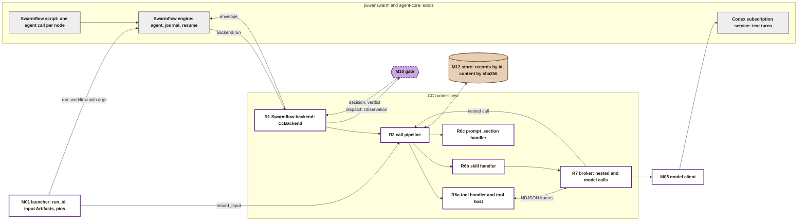
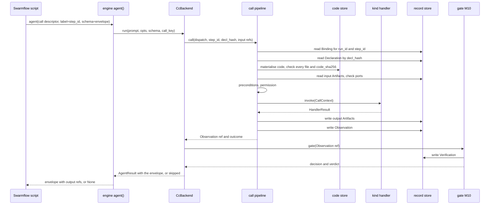
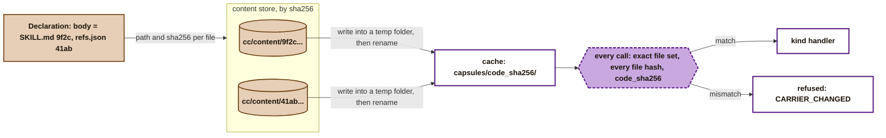
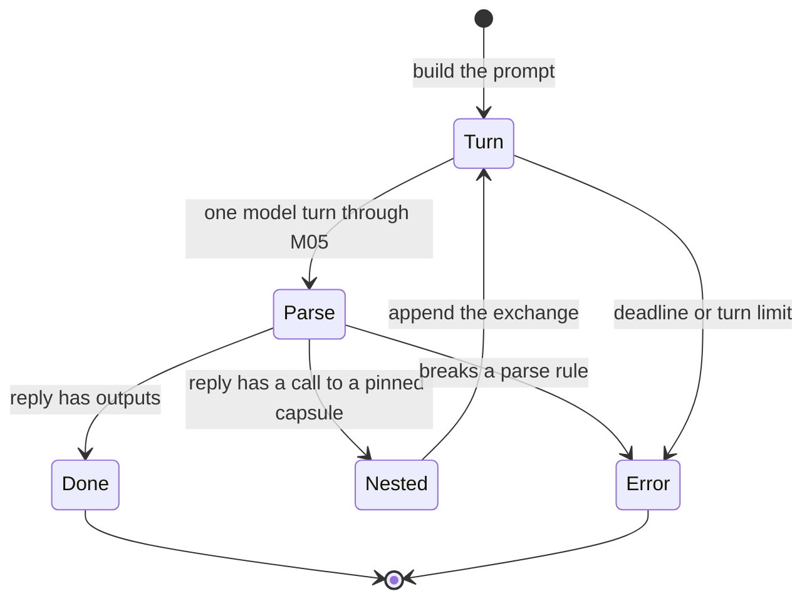
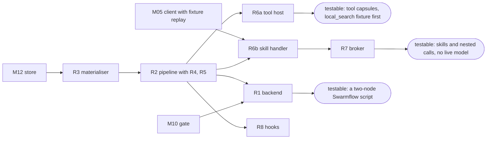

> **Draft recheck.** Earlier call/handler design was reviewed twice. Full-PRD durable authorization, managed subprocess placement, required capture and explicit recovery now reopen R1/R2/R8 and their connected contracts. [Module map](../system/modules.md), [lifecycle](../system/lifecycle.md), [storage](../system/storage.md) and [environment](../system/environment.md) own those additions.

# The CC runner

The **CC runner** is the only code that runs a capsule. A workflow node names a capsule. The runner turns that name into a result: it finds the exact code the capsule's hash points to, checks it, feeds it the node's inputs, calls it the way its `kind` says, stores what comes out, records the call, and hands the result to the next node.

The runner is system code, not a capsule. It reads the [Declaration](fields.md) and the [Binding](../schemas/binding.md), and writes [Artifacts](../schemas/artifact.md) and [Observations](../schemas/observation.md). It writes nothing else. The gate writes the [Verification](../schemas/verification-record.md). The complete Declaration-field map separates admission validation from call-time enforcement on [CC tooling and field enforcement](tools.md#field-validation-and-enforcement-map).

**Execution boundaries are separate.** The CC runner calls the stage capsule. If that capsule asks to run generated POC code for PRD 3.7, the program must run through the separate, provisional [M1 untrusted process boundary](process-boundary.md). The generic runner is not that sandbox; broader jiuwenbox integration remains future work.

**Scope is M1, as the PRD defines it.** Runs enter through the supervisor's CcBackend client; the R2 pipeline/handlers are a managed runner subprocess for PRD 4.6.3. Model calls go through the credential-holding trusted bridge; tool children never receive login files. M1 kinds remain tool, skill and prompt_section.

**How to read this page.** It is written for the coding agent that builds the runner. Every format, key and error mapping it needs is here or on a page it links. Where a rule depends on a change to another page that is not yet approved, it says so, and gives the behaviour to build until then. Code citations are `path:line` at a named commit: agent-core at the jiuwenswarm pin `9e339019`, jiuwenswarm at `6cc05c36b`.

## Contents

1. [Scope](#scope) and [where it sits](#where-it-sits)
2. [One call, start to finish](#one-call-start-to-finish): the ten steps
3. [Ids, keys and clocks](#ids-keys-and-clocks)
4. [From hash to running code](#from-hash-to-running-code)
5. [Values: how each port type travels](#values-how-each-port-type-travels)
6. [Kind handlers](#kind-handlers): `tool`, `skill`, `prompt_section`
7. [The model client contract](#the-model-client-contract-m05)
8. [Nested calls and the broker](#nested-calls-and-the-broker)
9. [The four callers](#the-four-callers)
10. [Swarmflow backend](#swarmflow-backend-talking-to-the-engine)
11. [Permissions and human interaction](#permissions-and-human-interaction-at-m1)
12. [Records](#records-the-runner-writes), [hooks](#hooks-for-observability), [failures](#failures-in-one-table)
13. [Worked calls](#three-worked-calls), [modules](#modules-one-issue-each), [asks of other pages](#what-this-design-asks-of-other-pages), [Open](#open)

## Scope

| In the runner | Not in the runner |
|---|---|
| Resolve a Binding to a Declaration and code, by hash | Choosing a capsule: freeze (M03) pins it, the launcher hands the pins to the script |
| Fetch code by hash and check it before every call | Writing Bindings: freeze (M03) does |
| Bind inputs, check ports, confine paths | Running checks and folding a decision: the check runner (M10a) and the gate (M10) |
| Evaluate `needs.when` | Admission, Standing, the library's contents. The runner does not re-check Standing; freeze bound only admitted capsules |
| Decide permission from `effect_class` and `needs.human_interaction` | Rebuilding jiuwenswarm's permission engine or jiuwenbox |
| Call the capsule by its `kind`, within its time budget | Selecting the model route: Model Routing owns the fixed production Codex configuration or isolated approved experiment route |
| Broker the capsule's nested calls and model calls | The workflow's order and halts: the script and M03 |
| Store every Artifact in a run, and one Observation per call | Spans as a source of truth: they are optional debug data |

## Where it sits



Grey = exists. White = new control code. Purple = the gate. Brown = records. R-numbers are the runner's sub-modules, listed in [modules](#modules-one-issue-each).

**One principle drives the shape.** Values travel by hash; control travels by reference. The Swarmflow script never holds a value. It passes Artifact references from one node to the next, and the runner resolves each reference to stored content. So the run can be replayed from records alone, and the engine's journal stays small.

## One call, start to finish

The common case is a `dispatch` call: a workflow node runs its capsule.



The pipeline's steps, in order. A step that fails ends the call there. Steps 1 to 6 do no work for the capsule; a failure there is `outcome: refused`.

| # | Step | Exactly what it does | Fails with |
|---|---|---|---|
| 0 | **Start the clock** | Verify the supervisor's committed reservation; use its obs_id/attempt, start the clock and emit cc.call.started | |
| 1 | **Resolve the Binding** | `dispatch`: `store.list_records("binding", run_id)` ([M12](toolchain.md#m12-store)), keep the records whose `step_id` equals the descriptor's. Exactly one must remain, and its `decl_hash` must equal the descriptor's. `gate` and `nested`: use the caller's Binding. `admission`: none (see [callers](#the-four-callers)) | `refused`, `BINDING_MISSING` (none, more than one, or a different `decl_hash`) |
| 2 | **Load the Declaration** | read `cc/declaration/library/<decl_hash>`; the SHA-256 of the stored bytes (RFC 8785 canonical JSON, INV-15) must equal `decl_hash`; parse it; `identity.kind` must be `tool`, `skill` or `prompt_section` | `refused`, `CARRIER_CHANGED` (hash), `SCHEMA_NONCONFORMANT` (parse, or a kind M1 does not run) |
| 3 | **Materialise the code** | see [from hash to running code](#from-hash-to-running-code); compare `code_sha256` with the Binding's (`verifier.code_sha256` for a `gate` call; computed from the Declaration for `nested` and `admission`) | `refused`, `CARRIER_CHANGED`, with `seen_code_sha256` |
| 4 | **Bind inputs** | the set of given port names is a subset of the declared input names; every `required` input is given; each `Ref(artifact)` resolves, the stored record hashes to `Ref.sha256`, and its content hashes to `content_sha256`; each Artifact's `type` equals its port's `Port.type`; each value meets its [type rule](#values-how-each-port-type-travels) | `refused`, `PORT_MISMATCH` |
| 5 | **Preconditions** | evaluate every `needs.when` in order with the [evaluator rules](#precondition-evaluator) | `refused`, `PRECONDITION_FAILED` (any `fail`), else `PRECONDITION_DEFERRED` (any `defer`) |
| 6 | **Permission** | the [permission table](#permissions-and-human-interaction-at-m1) | `refused`, `PERMISSION_DENIED` |
| 7 | **Invoke** | the handler for `identity.kind`, with `deadline = t0 + budget_s` | `error`, see [failures](#failures-in-one-table) |
| 8 | **Store outputs** | the output keys equal the declared output names exactly; each value meets its type rule and, for a `json` port, its `Port.value_schema`; write one Artifact per port | `error`, `CAPSULE_ERROR` (nothing is stored) |
| 9 | **Write the Observation** | always, refusals included; `cost.time_s` is measured from step 0 to the end of step 7; emit `cc.call.finished` | |
| 10 | **Return** | the Observation ref and outcome. The pipeline never raises; an internal bug becomes `error`, `RUNTIME_UNAVAILABLE` | |

**Refs.** A `Ref {id, sha256}` names a stored record. `sha256` is the INV-15 hash of that record: SHA-256 over the RFC 8785 canonical JSON of the record exactly as written. Step 8 and `record_input` return Refs computed this way, and the Observation, the envelope and `binding_ref` use the same rule.

`budget_s` is the Binding's `budget.time_s` (`dispatch`), `verifier.budget.time_s` (`gate`), or the [nested](#nested-calls-and-the-broker) or [admission](#the-four-callers) rule.

### Precondition evaluator

One evaluator, shared with selection later. `path` is dotted, rooted at `inputs.<port>` (the bound value). A path that starts with any other root gives `defer` at M1, because `state_source` is unchecked.

| Case | Result |
|---|---|
| `present` / `absent` | whether the path resolves to a value other than JSON `null` |
| `eq`, `ne`, `in`, `not_in` | JSON equality with `value`; `in` and `not_in` need `value` to be a list |
| `gt`, `gte`, `lt`, `lte` | both sides are numbers, else `fail` |
| `matches` | the resolved value is a string and `re.search(value, s)` finds a match; a non-string is `fail` |
| the path does not resolve, for any op but `present` and `absent` | `fail` |
| the op is unknown, or the evaluator raises | `defer` (policy `defaults.on_unknown`; never `pass`, INV-8) |

Each result is recorded in the Observation's `predicates` as `{predicate_id, result}`.

## Ids, keys and clocks

**Ids.** [System records](../system/records.md#reservation-and-replay) owns reservation and identity. Calls use the committed reserved obs_id. Dispatch attempts are supervisor-owned; nested/gate/admission calls reserve through the broker. Output Artifact IDs derive from obs_id and port name. Transport replay never creates another observation or output set.

**Store keys.** M12 keys records as `cc/<kind>/<scope>/<id>`, where `<scope>` is the `run_id`, the `candidate_id`, or `library` ([library](library.md#what-the-library-holds)). Content (code files, value schemas, Artifact bytes stored by reference) is `cc/content/<sha256>`.

| What | Key | Writer |
|---|---|---|
| Binding | `cc/binding/<run_id>/<binding_id>` | freeze (M03) |
| Declaration bytes | `cc/declaration/library/<decl_hash>` | admission (M14); see [asks](#what-this-design-asks-of-other-pages) 1 |
| Artifact | `cc/artifact/<run_id or candidate_id>/<artifact_id>` | the runner |
| Observation | `cc/observation/<run_id or candidate_id>/<obs_id>` | the runner |
| Content | `cc/content/<sha256>` | admission (code, schemas); the runner (Artifact bytes) |
| Port type vocabulary | `cc/vocabulary/library/<sha256>` | the vocabulary builder (M00a); loaded by the Binding's `vocabulary_ref`, or the ref admission passes to `call_admission` |
| Policy epoch | `cc/policy/library/<sha256>` | the policy publisher (M00c); loaded by the Binding's `policy_ref`, or the ref admission passes to `call_admission` |

**The cache folder** for materialised code is `<data dir>/cc/cache/capsules/<code_sha256>/`, where the data dir is `JIUWENSWARM_DATA_DIR` when set, else `~/.jiuwenswarm`. It is a cache, never a record.

**`producer`.** Every record the runner writes has `producer.component: runner` and `producer.version: cc@<package version>`.

**`attempt`.** Use the committed reservation, which counts interruptions even without a terminal Observation. New dispatch attempts require human review; duplicate frames reuse the existing attempt. Nested/gate/admission each use attempt 1 per reserved call. Never count terminal Observations to allocate attempts.

**One clock.** Step 0 starts it. The handler's deadline is `t0 + budget_s`. `cost.time_s` is measured on the same clock from step 0 to the end of step 7, so it leaves out the runner's own writes in steps 8 and 9. A call that ends inside its deadline therefore also passes the gate's `check.within_budget.v1`, and one that does not is `BUDGET_EXCEEDED`.

## From hash to running code

A Declaration never holds code. It names each file by path and SHA-256 (`identity.carrier` or `identity.body`). This is how the runner gets from those hashes to code it can run.



**Where code comes from.** Code reaches the content store only two ways: admission stores every file of an admitted capsule at `cc/content/<sha256>` ([admission](library.md#admission-the-only-way-in), step 4), and the vocabulary builder stores the registry checks' files ([toolchain M00a](toolchain.md#m00a-vocabulary-builder)). The runner never reads the author's folder. An author's working copy can change at any time, and jiuwenswarm's skill store can change a skill's files under the same version ([tools](tools.md#what-the-existing-pieces-give)).

**Materialise, once per `code_sha256`.** When the cache folder does not exist:

1. Check every declared `path`: relative, forward slashes, no `..` segment, no drive letter. Otherwise `CARRIER_CHANGED`.
2. Create a temporary folder beside the cache folder. For each file, read `cc/content/<sha256>` and write its bytes unchanged at its `path` (`Path.write_bytes`; never text mode, which turns line endings into CRLF on Windows).
3. Rename the temporary folder to `capsules/<code_sha256>/`. If the rename fails because another call won the race, delete the temporary folder and use the existing one.
4. Mark every file read-only (`os.chmod(path, stat.S_IREAD)`). Folders are not marked, because Windows cannot make a folder read-only; the check below covers them.

**Verify, on every call**, not only after materialising:

1. List every file under the folder, recursively. The set of relative paths must equal the declared set exactly. An extra file (a dropped-in module, a `__pycache__`) or a missing file is `CARRIER_CHANGED`.
2. Hash every file from disk and compare it with its declared `sha256`.
3. Compute `code_sha256` as [fields](fields.md#computed-by-admission-never-written-by-the-author) defines it, and compare it with the expected value from step 3 of the pipeline.

Any change on disk is caught on the next call, whoever made it.

**What this proves, and what it does not.** It proves the capsule's own files are the files admission tested. It does not pin third-party packages: tool code imports them from the agent server's environment. `needs.dependencies` is unchecked at M1, so this gap is accepted and stated.

## Values: how each port type travels

| Port type | Stored as | Into a tool | Into a skill prompt | Out of a tool | Out of a skill |
|---|---|---|---|---|---|
| `text`, `integer`, `number`, `boolean`, `json` | `value` inline | the JSON value | the JSON value in an `INPUT` block | the return value | the value under `outputs` |
| a domain type with a JSON `value_schema` (such as `intent_ir`) | `value` inline | the JSON value | as above | as above | as above |
| `collection<T>`, `T` inline | `value` inline, a JSON list | the list | as above | as above | as above |
| `file` | `content_ref`, bytes at `cc/content/<sha256>` | a read-only path to a copy in the workspace's `.cc/in/<obs_id>/` | the file's text, if it decodes as UTF-8 and is at most `runner.max_inline_file_bytes`; otherwise `refused`, `PORT_MISMATCH` | a path the tool wrote inside the workspace; the runner hashes the bytes and stores them | not allowed at M1: a skill cannot write files. A skill with a `file` output is refused at step 2, `SCHEMA_NONCONFORMANT` |
| `collection<file>` | `value` is a list of `{content_sha256, name, mime_type}` | a list of paths | one `FILE` block per item, same rule | a list of paths | not allowed, as above |
| `path` | `value` inline: a workspace-relative path string | an absolute path | the relative path string | a workspace-relative path string | the relative path string |

**Path confinement.** Every `path` value, in or out, is resolved against the run's workspace with symlinks followed. The result must stay inside the workspace. Otherwise the call is `refused`, `PORT_MISMATCH` for an input, and `error`, `CAPSULE_ERROR` for an output.

**A `path` value pins a name, not contents.** Its Artifact hashes the path string. A workspace file that changes under the same path does not change the call descriptor, so a resumed run replays the earlier result. Capsules that must react to file contents take a `file` port instead.

**Value schemas.** A `Port.value_schema` is `{uri, sha256}`. The runner loads the schema from `cc/content/<sha256>`, and admission stores it there. The `uri` is informative only. Type schemas come from the port type vocabulary the Binding pins.

**Values handed in by control code.** The launcher (M01) does not write Artifacts itself, because the runner writes every Artifact in a run ([Artifact](../schemas/artifact.md)). It calls:

```python
async def record_input(run_id: str, type: str, *, vocabulary_ref: dict, value: Any = None,
                       file: Path | None = None, origin: Literal["human", "control"]) -> Ref: ...
```

This validates the value against its type in the vocabulary freeze will pin (`vocabulary_ref {version, sha256}`), runs the type's deterministic checks through M10a and refuses the value if any fails, stores it, writes an Artifact with that `origin`, and returns its `Ref`. The launcher puts these refs in the script's `args`.

## Kind handlers

The kind says how a capsule runs. Each kind has one handler with one interface. A new kind adds a handler; the pipeline, records and gate do not change.

```python
class KindHandler(Protocol):
    kind: str
    async def invoke(self, call: CallContext) -> HandlerResult: ...

@dataclass(frozen=True)
class CallContext:
    run_id: str | None                    # None for admission calls
    scope: dict                           # {"run_id": ...} or {"candidate_id": ...}
    step_id: str | None
    caller: Literal["dispatch", "gate", "admission", "nested"]
    obs_id: str
    decl: Declaration                     # parsed, hash-checked
    root: Path                            # the verified cache folder
    inputs: dict[str, Any]                # port name -> value, per the values table
    workspace: Path
    deadline: float                      # time.monotonic() value
    broker: Broker

@dataclass
class HandlerResult:
    outputs: dict[str, Any]               # port name -> value; empty on failure
    issues: dict[str, list[Reason]]       # port name -> caveats
    failure_code: str | None              # a code from failure_modes, if the capsule raised one
    error: str | None                     # None, or "CAPSULE_ERROR", "BUDGET_EXCEEDED", "TIMEOUT", "RUNTIME_UNAVAILABLE", "EXTERNAL_UNAVAILABLE"
    error_detail: str | None              # a message or traceback, kept in ext.runner
    model_hint: str | None                # task/role hint only; Model Routing owns actual endpoint/model
```

A handler never writes records. It returns values; the pipeline stores them.

| `kind` | Handler | M1 |
|---|---|---|
| `tool` | [R6a](#tool-a-python-function-in-its-own-process): calls the pinned function in a child process | checked |
| `skill` | [R6b](#skill-model-turns-that-follow-skillmd): model turns that follow the skill's files, with its pinned capsules offered as tools | checked |
| `prompt_section` | [R6c](#prompt_section-text-for-a-skills-prompt): returns its text | checked |
| `mcp`, `a2a`, `subagent`, `agent_template`, `composite` | not in M1. Refused at step 2, `SCHEMA_NONCONFORMANT`. Each is one new handler later | unchecked |

### `tool`: a Python function in its own process

The entry point is `identity.carrier.ref`, written `file.py:function`. A `tool` whose code spans several files uses `body` instead, which names no symbol, so it gives its entry point in `ext.cc.entry`, written the same way, with the file in `body`. A `tool` with neither is refused at step 2, `SCHEMA_NONCONFORMANT` (see [asks](#what-this-design-asks-of-other-pages) 6). The tool handler starts a **tool host**, a small Python process, for each call.

**Why a separate process.** Each reason is enough on its own:

- **The time budget must be enforceable.** A Python thread cannot be killed; a process can.
- **Local imports must come from the verified folder.** A fresh process imports the capsule's own modules from its cache folder only, so two versions never share a module cache.
- **Model calls must come back to the agent server.** The only signed-in Codex child belongs to the agent server process ([B1](../archive/b1-design.md#the-cc-runner-how-capsules-plug-into-jiuwenswarm)), so a tool's model calls go back through the broker. That also records every model call.

**Launch.**

```python
argv = [sys.executable, "-I", "-B", "-m", "cc.runner.tool_host",
        "--root", str(root), "--entry", entry_ref, "--mode", mode]   # mode: "call", or "check" for M10a
env  = {"PATH": os.environ["PATH"], "SYSTEMROOT": os.environ.get("SYSTEMROOT", ""),
        "PYTHONDONTWRITEBYTECODE": "1", "PYTHONIOENCODING": "utf-8"}
cwd  = workspace
```

**Check mode** (`--mode check`, used by M10a): `root` is the materialised folder holding the check's runner file; the `call` frame's `inputs` is `{inputs, outputs, observation, expected, context}`, passed as keyword arguments; there is no broker, so a `nested` or `model` frame ends the check `unknown`; and the `result` frame's `outputs` is the `CheckResult` ([checks](../schemas/checks.md#calling-convention)). Everything else is as for a call.

`-I` (isolated) ignores the user's site folder and `PYTHON*` variables. `-B` writes no bytecode, so no `__pycache__` appears in the verified folder. The `cc` package and the `cc_sdk` module ([toolchain](toolchain.md#where-code-lives)) are installed in the agent server's environment, which `-I` keeps. The host puts `root` first on `sys.path` before importing the carrier's file. The environment holds no secrets. On Linux the process starts in its own session (`start_new_session=True`). On Windows it starts with `CREATE_NEW_PROCESS_GROUP` and is assigned at once to a Job Object with `JOB_OBJECT_LIMIT_KILL_ON_JOB_CLOSE`, so every process it starts belongs to the job. The handler creates the process with `asyncio.create_subprocess_exec(..., limit=16 * 1024 * 1024)`; a larger frame is `CAPSULE_ERROR`.

**Frames.** The host and the handler exchange JSON frames, one object per line (NDJSON, UTF-8), over the host's stdin and its original stdout. Before it imports capsule code, the host keeps private copies of both frame descriptors (`os.dup(0)`, `os.dup(1)`) and opens them in binary mode. It then points descriptor 0 at `os.devnull` and descriptor 1 at stderr (`os.dup2(2, 1)`). So a capsule's `print` cannot corrupt a frame, and its `input()` cannot swallow one. Both ends write each frame as `json.dumps(frame, ensure_ascii=False).encode("utf-8") + b"\n"`. The handler reads stderr in its own task for the whole call, so a chatty capsule never blocks. It keeps the first 64 KiB in the Observation's `ext.runner.stderr`.

| Direction | `t` | Other fields | Meaning |
|---|---|---|---|
| host to runner | `ready` | | imports done; send the call |
| runner to host | `call` | `inputs`: object; `failure_codes`: the Declaration's `failure_modes[].reason_code` values | call the function once |
| host to runner | `nested` | `id`: int, `ref`: string, `inputs`: object | `cc.call` |
| runner to host | `nested_result` | `id`; `ok`: bool; if ok `outputs`: `{port: {"ref": Ref, "value": any}}` and `issues`: `{port: [Reason]}`; else `obs_id`, `outcome`, `reason` | |
| host to runner | `model` | `id`, `prompt`: string, `model`: string or null, `route_id`: string or null | `cc.model` |
| runner to host | `model_result` | `id`; `ok`; if ok `text`; else `reason` | |
| host to runner | `issue` | `port`, `code`, `message` | `cc.issue` |
| host to runner | `result` | `outputs`: object | the function returned |
| host to runner | `failure` | `reason_code`, `message` | the function raised a declared failure |
| host to runner | `unavailable` | `service` (the service named by `cc.ExternalUnavailable`, or the nested capsule's name for a re-raised `cc.NestedError`), `reason`, `message` | an outside service the capsule depends on is down: `cc.ExternalUnavailable`, or an uncaught `cc.NestedError` whose reason is `runtime`-owned |
| host to runner | `exception` | `type`, `message`, `traceback` | the function raised anything else |

`id` is a counter local to the call; it pairs requests with results. `cc_sdk` calls block, so a capsule makes one request at a time.

**Calling convention.** The host calls `fn(**inputs)`: each given input port becomes a keyword argument of the same name. An optional input that was not given is not passed. If `fn` is a coroutine function, the host runs it with `asyncio.run`. With exactly one output port, the return value is that port's value. With more than one, it must be a dict whose keys are the output port names. A missing or extra key is `CAPSULE_ERROR` at step 8.

**The capsule-side API, `cc_sdk`.**

| Call | Does |
|---|---|
| `cc.call(ref, **inputs) -> NestedResult` | a nested call to a capsule in `needs.external`. `NestedResult.outputs` is output values by port name; `NestedResult.issues` is each output Artifact's `issues` by port name, so the caller can carry a caveat forward with `cc.issue`. Raises `cc.NestedError(obs_id, outcome, reason)` when the nested call does not end `ok`, and `cc.NestedRefused(ref)` when `ref` is not pinned |
| `cc.model(prompt, *, model=None, route_id=None) -> str` | one model turn through M05; `model` is the author's choice, and may differ on every turn; `route_id` is the id of the routing decision that chose it, if a router did ([model routing](../model-routing/README.md)) |
| `cc.issue(port, code, message)` | adds a caveat to an output's `issues`; `code` must be `INPUT_AMBIGUOUS`, `INPUT_INCOMPLETE`, `INPUT_CONTRADICTORY` or `EXTERNAL_UNAVAILABLE` (an outside service was partly unavailable; owner `runtime`). An output with issues makes a passing step `PASS_WITH_KNOWN_LIMITATIONS` |
| `cc.input_ref(port) -> InputRef` | passed as a `cc.call` input, it binds the caller's own input Artifact for that port, by reference: nothing is re-sent in a frame or stored again |
| `cc.Failure(reason_code, message)` | raise to end with a declared failure mode |
| `cc.ExternalUnavailable(service, message)` | raise when an outside service the capsule depends on (arXiv, Semantic Scholar) cannot answer. The call ends `error` with the runtime-owned reason `EXTERNAL_UNAVAILABLE`, never blamed on the capsule |
| `cc.replaying() -> bool` | true at admission and in every nested call under it. An adapter for an outside service then reads recorded responses from `<workspace>/.cc/replay/<adapter>/` instead of the network, and raises `cc.ExternalUnavailable` when a recording is missing |

**How the host reports an ending.** `cc.Failure`, or any exception with a string `reason_code` attribute that the Declaration lists in `guarantees.failure_modes`, is sent as `failure`. Everything else is sent as `exception`. So existing code that raises its own coded errors, such as `compile_intent`'s `IntentCompilerInputError`, needs no rewrite.

**What the handler does with each ending.**

| Ending | `HandlerResult` |
|---|---|
| `result` | `outputs`, plus the `issue` frames collected |
| `failure` | `error: CAPSULE_ERROR`, `failure_code` set (see [failures](#failures-in-one-table)) |
| `unavailable` | `error: EXTERNAL_UNAVAILABLE`, or the nested call's own runtime-owned reason (`TIMEOUT`, `RUNTIME_UNAVAILABLE`), so an outside failure stays an outside failure up the whole call tree |
| `exception`; a bad frame; the host exits without `result` | `error: CAPSULE_ERROR` |
| the deadline passes | kill the process tree (Linux: `os.killpg(pgid, SIGKILL)`; Windows: close the Job Object, with `taskkill /T /F /PID` as the fallback), then `error: BUDGET_EXCEEDED` |

**The workspace is not rolled back.** A killed or failed tool may leave files in the workspace. Its declared `effects` say where; the runner does not clean up.

### `skill`: model turns that follow `SKILL.md`

A skill is files a model follows. The handler builds a prompt, calls the model through the broker, and parses the reply into the output ports.

**Front matter.** `SKILL.md` may begin with YAML front matter. The handler reads one key, `model`, and passes it to M05 as the hint. It never picks a model itself.

**Text files only.** Every `body` file of a skill must decode as UTF-8; otherwise step 3 refuses the capsule after its hash check, `SCHEMA_NONCONFORMANT`.

**The prompt**, exactly this layout. Each `<<<...>>>` line is a delimiter on its own line, so a backtick in a skill file never breaks it.

```text
You are running one capability. Follow the SKILL below. Do not run commands or use tools of
your own. Reply with exactly one JSON object as described under REPLY, and nothing else.

<<<FILE SKILL.md>>>
...the file...
<<<END FILE>>>
<<<FILE references/defaults.json>>>      (every other body file, in body order)
...
<<<END FILE>>>
<<<SECTION prompt.citation_rules>>>      (each prompt_section capsule in needs.external, in order)
...its text...
<<<END SECTION>>>
<<<INPUT intake: The Qualified Intake Package>>>      (each given input, in declared order)
{...json.dumps(value, ensure_ascii=False, indent=2, sort_keys=True), or the file's text...}
<<<END INPUT>>>
<<<TOOLS>>>                               (only when needs.external has non-prompt_section capsules)
op.codesearch: Find files and lines in a repository that match a query.
  inputs: query (text, required), repository (path, required)
  outputs: matches (json)
<<<END TOOLS>>>
<<<REPLY>>>
Reply with {"outputs": {...}, "issues": {...}} where outputs has exactly these keys:
  research_brief (research_brief): The Research Brief. JSON Schema: {...the type's value schema from the pinned vocabulary...}
issues is optional: {"<port>": [{"code": "INPUT_AMBIGUOUS" | "INPUT_INCOMPLETE" | "INPUT_CONTRADICTORY", "message": "..."}]}
To use a tool instead, reply with {"call": {"ref": "<tool name>", "inputs": {...}}}. One call per reply.
<<<END REPLY>>>
```

**Parsing a reply**, in this order:

1. Strip surrounding whitespace. If the text starts with a code fence line (```` ``` ```` or ```` ```json ````) and ends with ```` ``` ````, remove those two lines.
2. `json.loads` the rest. It must be one JSON object.
3. It has exactly one of `outputs` and `call`. `issues` is allowed only with `outputs`. Any other top-level key is an error.
4. With `outputs`: its keys equal the output port names exactly, and every `issues` code is one of the three input codes.
5. With `call`: `ref` names a non-`prompt_section` capsule in `needs.external`, and `inputs` is an object.

A reply that breaks any rule ends the call with `error: CAPSULE_ERROR`, the reply text in `ext.runner.reply`. An unknown `ref` is treated the same way: the model asked for something it was not offered.

**The tool loop.** After a `call`, the broker runs the nested call. The handler then sends a new single-turn prompt: the same prompt, followed by the exchange so far.

```text
<<<EXCHANGE 1>>>
YOU: {"call": {"ref": "op.codesearch", "inputs": {...}}}
RESULT: {"outputs": {"matches": [...]}}             or  {"error": {"outcome": "error", "reason": "CAPSULE_ERROR"}}
<<<END EXCHANGE>>>
Now reply again, as described under REPLY.
```

A nested `file` output is shown as its text, by the same inline rule as inputs. The loop ends when a reply has `outputs` (success), the deadline passes (`BUDGET_EXCEEDED`), or the number of model turns reaches `runner.max_skill_turns` (`CAPSULE_ERROR`).



**Why every turn is a fresh session.** PRD3.0.1 keeps M1 model requests single-turn. The native service reuses a thread per session ID, so M05 derives a fresh ID from canonical ModelCallScope hash, request_id, obs_id and turn and re-sends the complete exchange. Run/admission uses public scoped capture; RSI controller/oracle uses private session capture owned by environment. No hidden fixture call invents a research run/Candidate or public Observation. Managed auth profile is reused; conversation identity is fresh. Session metadata stays in the appropriate private/public transport evidence namespace.

**This settles the kind question.** Earlier drafts made any capsule that calls an operator a `tool`, because a skill was one text turn and could not call anything. With this handler, a skill can call any capsule it pins. Kind now means only how the capsule itself runs. Whether it may call others is set by `needs.external`, for every kind.

### `prompt_section`: text for a skill's prompt

A `prompt_section` has exactly one `body` file, no input ports and exactly one output port of type `text`. Anything else is refused at step 2, `SCHEMA_NONCONFORMANT`. (A `carrier` names a symbol, which a text file does not have.)

Its handler returns the file's text as the output. It calls no model and has no side effects. A skill that pins it gets the text through the broker as a `nested` call. That call writes its own Observation and Artifact, so the record shows exactly which text went into which prompt.

## The model client contract (M05)

The trusted broker additionally exposes the read-only StageContext API owned by [Delivery](../m1/delivery.md#template-and-complete-inputs). It binds run/through-step scope to the current reserved call, captures the exact referenced record hashes in Observation.ext.runner.context_refs, and supplies bounded summaries/refs to the report skill. The model cannot request another run, arbitrary paths or hidden records. Reading prior evidence is recorded behavior, not permission to change it. Shared type/API ownership remains on Delivery; no second StageContext schema is defined here.

The runner depends on M05 through one call. M05 is designed with Model Routing; this is what the runner needs from it.

```python
@dataclass(frozen=True)
class ModelCallContext:       # which capsule call a model turn belongs to; for M05's records and an endpoint that routes itself
    scope: ModelCallScope     # canonical discriminated scope owned by services-v1/environment
    obs_id: str
    turn: int                 # 1, 2, ... within that call
    capsule_name: str | None  # null for non-capsule planner/controller calls
    decl_hash: str | None
    step_id: str | None
    role: str | None          # the Binding's role (unchecked at M1)

@dataclass
class ModelReply:
    text: str
    model_id: str | None          # None when the runtime does not report it
    elapsed_s: float
    tokens: dict | None           # {input, output, cache_hit}, when reported
    route_record_id: str | None   # set only by an endpoint that routes itself (a gateway); a capsule's own routing comes through cc.model's route_id

async def complete(prompt: str, *, model_hint: str | None, session_id: str, deadline: float,
                   context: ModelCallContext) -> ModelReply: ...
# raises ModelError(reason) where reason is a reason_code registry value
```

This page owns ModelCallContext, ModelReply, complete and ModelError. M05 sends the reserved request to the protected [model bridge](../system/environment.md#model-bridge); only that bridge calls the native stream adapter. Router integration is on [seams](../seams.md#model-routing). Each native session is used for one turn, and the bridge retains one request/result identity across transport retries without resubmitting the model call.

**Replay at admission.** When a test case carries model_replies, M05 returns them in turn order instead of calling Codex. There is one sequence across the complete call tree, including nested capabilities and the routing adapter's bounded judge if enabled in that fixture. A missing reply is RUNTIME_UNAVAILABLE.

**Model transport cancellation.** M05 calls the authenticated [model bridge](../system/environment.md#model-bridge), which owns the native subscription stream and raw capture. Cancellation means stop waiting and cancel the reserved bridge request; it never resubmits a turn. The bridge drains an abandoned stream for at most the configured grace period, then terminates its dedicated CC app-server process if necessary. It never terminates a shared user-chat transport. Missing response or forced transport exit halts the call with preserved evidence. A new transport is established only by a subsequent explicit startup/recovery, not an automatic model retry.

**Deadlines.** A timeout before acquiring the serialized model-turn slot is RUNTIME_UNAVAILABLE; after submission it is BUDGET_EXCEEDED for a declared capsule deadline, or TIMEOUT for an upstream runtime timeout. [Lifecycle](../system/lifecycle.md) identifies the clock owner. No successful result is returned before required request/reply capture is committed.

**Error mapping**, from the `CodexError` codes the service and its transport raise (`service.py:131-194`, `transport.py:60-163`):

| `CodexError` | `ModelError` reason | Owner |
|---|---|---|
| `RUNTIME_TIMEOUT` | `TIMEOUT` | runtime |
| `SIGN_IN_REQUIRED`, `SUBSCRIPTION_REQUIRED`, `ACCOUNT_IDENTITY_UNAVAILABLE`, `RUNTIME_DISCONNECTED`, `NEW_SESSION_REQUIRED`, `BUSY` | `RUNTIME_UNAVAILABLE` | runtime |
| `TURN_FAILED` (the turn ended in a failed state, such as a usage limit) | `RUNTIME_UNAVAILABLE` | runtime |
| `RUNTIME_ERROR` (any JSON-RPC error, including a model hint the runtime rejects at `thread/start` or `turn/start`), `DELIVERY_UNKNOWN`, `PROFILE_IN_USE`, `PROFILE_CONFIG_CONFLICT`, `PROFILE_STATE_INVALID`, `RUNTIME_VERSION_MISMATCH`, `RUNTIME_UNAVAILABLE`, any other `CodexError` or unexpected exception | `RUNTIME_UNAVAILABLE` | runtime |
| a `chat.final` with `cancelled: true` (the turn was interrupted) | `RUNTIME_UNAVAILABLE`, never a success | runtime |
| `INVALID_INPUT` (an empty prompt) | `CAPSULE_ERROR` | capsule |

**Every turn is recorded.** For each model turn the runner stores the prompt as sent and the reply text as content (`cc/content/<sha256>`), and appends one entry to the Observation's `ext.runner.turns`: `{turn, session_id, prompt_sha256, reply_sha256, elapsed_s, model_hint, model_id, tokens, route_record_id}`. `model_hint` is the model this turn asked for; `route_record_id` is the `route_id` the capsule passed to `cc.model`, else `ModelReply.route_record_id`. So the exact exchange can be rebuilt from records ([seams](../seams.md#data-foundation)). When any turn reports `tokens`, the Observation's `cost.tokens` is their sum.

**The model field.** `stream()` reports no model id or version. So a model enters the Observation's `models` only when a turn's `model_id` is not `None`; with Codex at M1, `models` is absent. `models` lists each distinct reported model once, in order of first use; `ext.runner.turns` says which turn used which, and what each turn asked for. The runner never records a model it was not told served the call.

**The thread's own settings.** The service starts Codex threads read-only, with `approvalPolicy: untrusted` and fixed developer instructions that say tools are unavailable (`service.py:148`). The skill prompt tells the model not to run commands. If Codex still sends a tool or approval request, the transport refuses it at once with error -32601 (`transport.py:148`). The turn then goes on, or ends `TURN_FAILED`.

## Nested calls and the broker

Every call a capsule makes to another capsule, and every model call, goes through the **broker** (R7). The broker is the one place the runner enforces `needs.external`.

**A nested call, exactly:**

1. Look up `ref` among the caller's `needs.external[].ref`. Not found: no call and no Observation. A tool gets `cc.NestedRefused`; a skill's reply fails its parse rule. If uncaught, either ends the caller with `CAPSULE_ERROR`. (The reason code `OPERATOR_NOT_ADMITTED` is meant for this case, but the policy says it is never the reason of a call; see [asks](#what-this-design-asks-of-other-pages) 2.)
2. Write each input value as an Artifact: `origin: control`, the caller's scope. `causation_id` is the caller's `obs_id`, so the record shows which call produced the value.
3. Run the pipeline with `caller: nested`, `decl_hash` from `needs.external[].decl_hash`, and the caller's Binding as `binding_ref`. Step 3 computes the expected `code_sha256` from the callee's Declaration.
4. The budget is the earlier of the caller's deadline and the callee's own `needs.resources.timeout_s` (or the policy default), measured from now.
5. The nested Observation's `causation_id` is the caller's `obs_id`, so the call tree can be rebuilt from records.
6. Return `{port: {"ref": Ref, "value": value}}` and the outputs' `issues` on `ok`; otherwise `{obs_id, outcome, reason}`. An input given as `cc.input_ref(port)` is bound to the caller's own input Artifact, and step 2 stores nothing for it.

Before returning a nested operator's output to the parent, the Gate host persists its Verification using the parent's frozen dependency GateProfile. Pure mechanical operators have deterministic checks and explicit semantic NOT_APPLICABLE; the parent stage's independent semantic Gate includes nested evidence before downstream release. A nonadvancing or unsaved nested Verification fails the parent call. This grants no workflow release authority. The parent's cost.time_s includes nested execution/check time. Gate/referee calls are not recursively gated.

**A model call:** the broker calls M05 `complete` with the caller's deadline and a session id `cc:<scope id>:<obs_id>:<n>`, where `n` counts the caller's model turns from 1.

**Effects nest; network does not.** A nested call is checked against its own Declaration at step 6. A `pure` caller that pins an `irreversible` dependency would hide that effect, so admission refuses it (proposed rule `effects_cover_dependencies`, in the [policy](../schemas/policy.md)). `needs.network` is different: a capsule declares only the network access its own code uses. A capsule that reaches a service only through an operator declares `network: none`, and the operator declares `egress`.

## The four callers

One pipeline serves four callers. Only the steps around it change.

| Caller | Who calls | Binding (step 1) | Expected `code_sha256` (step 3) | Budget | After the call |
|---|---|---|---|---|---|
| `dispatch` | R1, for a workflow node | looked up by `(run_id, step_id)` | the Binding's | `budget.time_s` | R1 calls the gate |
| `gate` | the gate host (M10), for the step's judged checks | the node's Binding; runs its `verifier` (the gate capsule) | `verifier.code_sha256` | `verifier.budget.time_s` | the gate host reads the output |
| `admission` | M14, for each test case | none; `binding_ref` is null, `test_ref` is the test case | computed from the Candidate's Declaration | `timeout_s`, else policy default 600, never over the cap 1800 | M14 runs the checks |
| `nested` | R7 | the caller's | computed from the callee's Declaration | the [nested rule](#nested-calls-and-the-broker) | returned to the caller |

**An admission call** has its own entry, `call_admission(decl_bytes: bytes, test_case_ref: Ref, workspace: Path, *, vocabulary_ref: dict, policy_ref: dict) -> (Ref, str)`, returning the Observation ref and outcome. It needs a workspace and a Declaration that admission has not stored yet. M14 passes both: the Declaration bytes (step 2 checks their hash against the computed `decl_hash`) and a fresh empty workspace folder. Before the call, the runner copies each of the test case's `fixtures` into that folder, at its `content_ref.name`. M14 deletes the folder afterwards. At step 6 an admission call is unattended.

## Swarmflow backend: talking to the engine

The engine calls `AgentBackend.run(prompt, opts, schema_json, *, call_key)` and expects an `AgentResult` (agent-core `openjiuwen/agent_teams/workflow/engine/backends/base.py:118`). `CcBackend` is that backend.

**One backend per run.** The launcher builds `CcBackend(run_id=..., workspace=..., store=..., gate=..., model_client=...)` and passes the same `run_id` to freeze and to `run_workflow(path, args=..., backend=..., run_id=..., journal_path=..., resume=...)` (`engine/runner.py:294`). `run()` does not receive a run id, so the backend holds it, with the run's workspace folder. Policy and vocabulary are loaded per call from the Binding's pins.

**What the script gets.** The launcher passes `args`:

```json
{"run_id": "run-...", "plan": {"steps": ["..."], "launcher_inputs": {"intake": "intake", "source_text": "source_text"}},
 "pins": {"requirement": {"id": "binding-brief", "sha256": "..."}, "search": {"id": "binding-search", "sha256": "..."}},
 "inputs": {"intake": {"id": "art-...", "sha256": "..."}, "source_text": {"id": "art-source", "sha256": "..."}}}
```

`plan` is the run's [`run_plan`](../types/run-plan.md) value. `pins` maps each `step_id` to its committed Binding Ref from freeze. The backend resolves and verifies that exact Binding before reading its decl_hash or constructing a descriptor; it never resolves a current alias. `inputs` holds the intake and source_text refs from `record_input`. The examples here abbreviate schema/hash bytes to explain the engine envelope and are not standalone validation fixtures. The launcher's exact order is on [toolchain M01](toolchain.md#m01-launcher).

**What the script sends.** The prompt is a **call descriptor**: RFC 8785 canonical JSON of what decides the result.

```json
{"cc":1,"decl_hash":"5d41...","inputs":{"intake":{"id":"art-...","sha256":"..."},"source_text":{"id":"art-source","sha256":"..."}},"step_id":"requirement"}
```

The engine's cache key uses prompt, label, phase, model and schema (call_signature, engine/journal.py:61). The label is step_id. This is only a cache key: the supervisor's dispatch identity and committed Observation/Verification authorize reuse. Every cache hit must pass authorize_advance. Changed inputs/pins start a new run, not an automatic re-execution in the frozen run ([lifecycle](../system/lifecycle.md)).

**The envelope schema**, passed as `schema` to every `agent()` call, and published as the constant `cc.adapters.swarmflow.ENVELOPE_SCHEMA`:

```json
{"type": "object", "additionalProperties": false,
 "required": ["step_id", "obs_id", "outcome", "reason", "decision", "verdict", "outputs"],
 "properties": {
   "step_id":  {"type": "string"},
   "obs_id":   {"type": "string"},
   "outcome":  {"enum": ["ok", "error", "refused"]},
   "reason":   {"type": ["string", "null"]},
   "decision": {"enum": ["pass", "fail", "blocked"]},
   "verdict":  {"enum": ["PASS", "PASS_WITH_KNOWN_LIMITATIONS", "FAIL", "ENVIRONMENT_BLOCKED", "INCONCLUSIVE"]},
   "outputs":  {"type": "object", "additionalProperties": {
       "type": "object", "required": ["id", "sha256"], "additionalProperties": false,
       "properties": {"id": {"type": "string"}, "sha256": {"type": "string"}}}}}}
```

**What `run()` does:**

1. Parse the descriptor. Malformed (not JSON with exactly the keys `cc`, `decl_hash`, `inputs` and `step_id`): write a `dispatch` Observation with `outcome: refused`, `reason: BINDING_MISSING`, `decl_hash: null`, `binding_ref: null`, `inputs: {}` and the raw prompt in `ext.runner.descriptor`; call no gate; return `AgentResult(skipped=True)`. A script bug is never journalled.
2. Run the pipeline as `dispatch`.
3. Call the gate: `gate(obs_ref) -> GateResult(verification_ref, decision, verdict)`. The gate writes one Verification for every `dispatch` Observation, refusals included ([Verification](../schemas/verification-record.md)). A refused or failed call folds to `blocked` (policy `gates`, fold step 1). How the gate handles a null `binding_ref` is M10's job.
4. Return the result:
   - `AgentResult(skipped=True)` when the call should run again on resume: `outcome: refused` with `PRECONDITION_DEFERRED`, or a `runtime`-owned reason (`RUNTIME_UNAVAILABLE`, `TIMEOUT`, `EXTERNAL_UNAVAILABLE`), or a gate verdict of `ENVIRONMENT_BLOCKED` (the gate call hit the runtime). A skipped result is a non-success with no retry (`engine/primitives.py:757-759`), so `agent()` returns `None` before the journal write (`:616-627`, write at `:631`), and a resume re-runs the step.
   - Otherwise `AgentResult(structured=envelope)`. The engine journals it, so a resume replays it.

If the gate raises or any required record/capture write fails, run returns AgentResult(skipped=True) and the supervisor halts. A response with no committed Verification never advances. On explicit resume, a completed Observation without a decision is gated again without re-executing work.

**Cancellation.** Native pause/stop cancels the workflow task. The pipeline terminates/reaps child trees and cancels its reserved model-bridge request under the bounded grace policy. It seals retained capture and attempts an error Observation under a bounded shield, marked ext.runner.cancelled=true, without claiming success if capture/store fails. It calls no Gate and re-raises. Nested requests are cancelled innermost first; no operation is replayed automatically.

Apart from re-raising a cancellation, `run()` never raises and never lets the engine time it out. The engine retries a call only when the backend raises or times out (`primitives.py:726`) or the result fails the schema (`:767`). So the script must never pass `options={"timeout": ...}` for a CC node. The envelope always passes the engine's schema check. Neither cause of a retry can happen.

**The script.** There is one generic Swarmflow script, which walks the run plan and calls `cc_node(args, step_id, **refs)` once per step ([nodes](../system/nodes.md#the-one-generic-script)). `cc_node`, `CcHalt`, `CcBackend` and the script live in `cc.adapters.swarmflow` ([integration](../system/integration.md#swarmflow-run-a-plan-be-the-backend)). No step is wired by hand.

Before returning any advancing envelope, cc_node calls supervisor authorize_advance on the exact attempt's Observation and Verification, including journal replays. Otherwise it raises CcHalt. A skipped result reads that attempt's committed evidence; absent Verification yields ENVIRONMENT_BLOCKED and cannot borrow an older PASS. The launcher invokes the native human-session halt/recovery adapter. ESCALATE_TO_HUMAN is a routing action, not a verdict. The script passes refs only.

**Pause/response loss does not authorize repeated effects.** The engine can drop a completed response while paused (primitives.py:629); the supervisor consults the durable dispatch state before invoking work again. Completed work reuses its Observation; incomplete effects require explicit human review. A reviewed execution retry gets a new attempt, while transport duplicates share the original id/result. This closes the old automatic-duplicate gap.

## Permissions and human interaction at M1

Step 6 decides from policy `mappings` and `needs.human_interaction`. **Every M1 call is unattended.** The Codex runtime has no reply path: `handle_swarmflow_reply` is `handle_user_answer`, which always returns `MILESTONE_TEXT_ONLY` (`jiuwenswarm/server/runtime/agent_adapter/interface_codex.py:67-70`). Admission calls are unattended too.

| Declared | Decision |
|---|---|
| `effect_class: pure` or `read_only` | allow |
| `effect_class: idempotent` or `compensable`, and every `effects[].resource_key` starts with `fs:workspace/` | allow |
| `effect_class: idempotent` or `compensable`, any other effect | ASK, which is DENY when unattended: `PERMISSION_DENIED` |
| `effect_class: nonrepeatable_effect` | allow only the pinned-policy bounded empirical operation through the validated process service, with the exact reserved Binding/attempt; otherwise `PERMISSION_DENIED` |
| `effect_class: irreversible` | ASK, so DENY: `PERMISSION_DENIED` |
| `needs.human_interaction: blocking` | `PERMISSION_DENIED`: nothing can answer |
| `needs.human_interaction: optional` | allowed; `cc_sdk` offers no way to reach a person, so the capsule finishes without an answer |

At M1 an `irreversible` capsule never runs. Stage 3.7 declares `nonrepeatable_effect`: its frozen plan, policy, gated bundle and exact durable dispatch reservation authorize the first bounded empirical execution automatically after predecessor release. The process-service pre-check must pass. Duplicate requests attach to the original running/committed result and cannot execute again; interrupted uncertainty halts. An authenticated human review authorizes a new reserved attempt for explicit restart. This class grants no broader filesystem, network or irreversible authority. Generated program confinement remains the separate validated process boundary.

**Runtime coverage is an execution prerequisite.** Restricted child mount/network/identity profiles and broker capabilities are defined by environment. If the profile cannot prevent host-file/socket bypass, doctor blocks that backend; cwd alone is insufficient. POC execution uses its own fixed profile. [Deployment](../system/deployment.md) owns one Linux image using nested unprivileged Bubblewrap; macOS Docker Desktop executes that same profile. Actual negative probes must pass before enabling it. General jiuwenbox orchestration remains deferred. No runtime safety result is claimed here.

## Records the runner writes

| When | Record | Fields the runner sets |
|---|---|---|
| `record_input` | Artifact, `origin: human` or `control` | `content_sha256`, `type`, `value` or `content_ref`; `scope.run_id` |
| a nested call's inputs | Artifact, `origin: control` | as above, plus `causation_id` = the caller's `obs_id` |
| step 8 | one Artifact per output, `origin: capsule` | `type` from the port, `produced_by {obs_id, port}`, `issues` from the handler |
| step 9 | one Observation per call, refusals included | `caller`, `started_at`, `binding_ref`, `test_ref` (admission), `decl_hash` (null only for `BINDING_MISSING`), `attempt`, `inputs` (the refs it was given), `outputs`, `predicates`, `outcome`, `reason`, `seen_code_sha256`, `models` (only when reported), `cost.time_s`, `causation_id` (nested calls), `ext.runner` |

`ext.runner` holds what is useful for debugging and for Data Foundation, but not part of the record's meaning: `failure_code`, `turns` (each with its own `model_hint`), `stderr`, `reply`, `error_detail`, `engine_call_key`.

Artifacts are written before the Observation that names them; an Artifact names its call by `obs_id` only ([Artifact](../schemas/artifact.md)). Every record is written once through M12, with `producer.component: runner`.

## Hooks for observability

The runner announces each call on the CC event bus: `cc.call.started`, `cc.call.resolved`, `cc.call.refused`, `cc.call.nested`, `cc.model.turn` and `cc.call.finished`. Each event is emitted after the record it describes is written. Their payloads, the bus API and every subscriber are defined once, on [system observability](../system/observability.md#the-events). Adding a subscriber never changes the runner, which is why this page can stay fixed while observability is designed.

## Failures, in one table

Owners are from policy `registries`.

| Outcome | Reason | Detected at | Owner |
|---|---|---|---|
| `refused` | `BINDING_MISSING` | step 1; R1 for a malformed descriptor | refusal |
| `refused` | `CARRIER_CHANGED` | steps 2, 3 | refusal |
| `refused` | `SCHEMA_NONCONFORMANT` | step 2: unparseable Declaration, a kind M1 does not run, a malformed `prompt_section`, a skill with a `file` output, a `tool` with no entry point; step 3: a non-text skill file | open (M1 architecture Open 2) |
| `refused` | `PORT_MISMATCH` | step 4 | refusal |
| `refused` | `PRECONDITION_FAILED`, `PRECONDITION_DEFERRED` | step 5 | refusal |
| `refused` | `PERMISSION_DENIED` | step 6 | refusal |
| `error` | `CAPSULE_ERROR` | step 7: an exception, a declared failure (its code in `ext.runner.failure_code`), a bad frame or reply, the turn limit, an unpinned nested `ref`; step 8: a missing, extra or ill-typed output | capsule |
| `error` | `BUDGET_EXCEEDED` | step 7: the deadline passed | capsule |
| `error` | `TIMEOUT` | M05: the Codex runtime went silent | runtime |
| `error` | `EXTERNAL_UNAVAILABLE` | step 7: a capsule or its operator could not reach an outside service it declares (`needs.network: egress`) | runtime |
| `error` | `RUNTIME_UNAVAILABLE` | M05: the Codex runtime is down or refused the turn; the store failed; a runner bug | runtime |
| `ok` | null | step 9 | |

**Optional failure modes at M1.** A listed enforceable hazard adds a matching verification obligation; its diagnostic code may be retained in ext.runner.failure_code. Standard Observation errors remain CAPSULE_ERROR or their infrastructure code. A declaration cannot authorize retries or redefine Gate failure handling.

## Three worked calls

**`op.local_search` (tool, pure; [local search](../m1/op-local-search.md)).** The frozen dependency closure pins its declaration and code/check hashes. The broker binds intake, query and bounded top_k inputs, validates them, and invokes the restricted tool host. It returns canonical search_hits, stored as an Artifact linked to its Observation. The broker requires a durable mechanical Verification before the parent consumes that output. Input/schema/capture failure returns the documented refusal/error and no successful hit result.

**`research.compile_brief` (skill; [requirement capsule](../m1/requirement-capsule.md)).** Required inputs are intake and source_text; optional intent_ir supplies ordinary deterministic hints. The handler builds its prompt from pinned SKILL.md/reference files, these inputs and the canonical research_brief output contract. M05 uses the fixed configured Codex route, preserving raw prompt/reply capture. Parsing and deterministic output checks precede the independent semantic Gate; a committed Verification and release are required before Search.

**A skill that pins an operator** (Hypothesis with op.codesearch). The first reply requests a permitted pinned capability. The broker verifies needs.external, reserves the nested call identity and asks the supervisor to commit inputs. Nested execution publishes its Observation/output and mechanical Verification before the exchange is returned to the skill. The second reply supplies the parent outputs. Parent and operator Observations are linked through causation_id and the scoped call capture; the parent Gate also checks the nested evidence.

## Modules, one issue each

Each module can be built and tested with fixtures standing in for its neighbours.

| Id | Module | Interface | Tests |
|---|---|---|---|
| R1 | Swarmflow backend: `CcBackend`, `cc_node`, the generic script, in `cc.adapters.swarmflow` | `run(prompt, opts, schema_json, *, call_key) -> AgentResult`; `cc_node(args, step_id, **refs)`; `ENVELOPE_SCHEMA` | a descriptor reaches the pipeline as `dispatch`; a malformed one writes an Observation and returns `skipped`; a cancelled call kills its tool host and still writes an Observation; a runtime failure returns `skipped`; a repeated descriptor replays from the journal; `run` never raises |
| R2 | Call pipeline and `record_input` | `call(caller, ...) -> (obs_ref, outcome)`; `record_input(...) -> Ref` | fixture failure codes; output/capture before Observation; reserved attempts include interrupted calls; duplicate transport cannot create another output set |
| R3 | Code materialiser | `materialise(decl, expected_code_sha256) -> Path` | a changed byte, an extra file, or a `__pycache__` folder gives `CARRIER_CHANGED` on the next call; `..` and absolute paths refused; two concurrent first calls both succeed; `code_sha256` equals the author kit's |
| R4 | Input binder and precondition evaluator | `bind(decl, refs) -> values`; `evaluate(when, values) -> list` | every row of the values table; path escape refused; every row of the evaluator table; an unknown op gives `defer` |
| R5 | Permission check | `decide(decl, attended=False) -> allow or reason` | every row of the permission table |
| R6a | Tool handler, `cc.runner.tool_host`, `cc_sdk` | `KindHandler`; the frame table | `compile_intent`'s admission fixtures pass through the host; `print` and `input()` in a capsule do not break a frame; a 10 MiB input passes; 1 MiB written to stderr does not stall the call; a slow function gives `BUDGET_EXCEEDED` and no process is left; a coded exception keeps its code in `failure_code`; a capsule that spawns a child loses it on kill |
| R6b | Skill handler | `KindHandler`; the prompt template; the parse rules | with M05 replaying fixtures: each parse rule's failing reply; a fenced reply parses; a `call` runs a nested call and re-sends the exchange; the turn limit holds; one session id per turn |
| R6c | `prompt_section` handler | `KindHandler` | returns the file's text exactly; a malformed `prompt_section` is refused |
| R7 | Broker | `call(ref, inputs) -> result`; `model(prompt, hint, route_id) -> text` | an unpinned ref writes no Observation; a nested deadline never exceeds its caller's; nested Observations carry `causation_id` |
| R8 | Event emission | `cc.events.emit` ([system observability](../system/observability.md#the-events)) | events fire in order, after their records; a raising subscriber never fails a call |
| R9 | M1 generated-code process boundary (separate from capsule tool host) | [`execute_poc(PocExecutionRequest) -> PocExecutionResult`](process-boundary.md#provisional-api) | no process starts when boundary pre-check fails; workspace escape, host-file access, unauthorized network/system effects and hidden-fixture access are denied; result preserves workload outcome versus infrastructure/boundary failure and returns evidence refs |

**Depends on:** M12 (`Store`: `put_record`, `get_record`, `list_records`, `put_content`, `get_content`), M05 (`complete`, as above), M10 (`gate`, for R1 only; it calls R2 as `gate` for the gate capsule), M10a (runs checks in the tool host's check mode). R9 depends on the benchmark stage's gated `poc_bundle` and the explicit local security boundary; its open assumptions are on [process-boundary](process-boundary.md). **Depended on by:** M14 (calls R2 as `admission`), M01 (calls `record_input`, builds `CcBackend`), M03 (the script uses `cc_node`), M18 (subscribes to R8), and `research.run_benchmark` (calls R9 for generated execution).

**Build order, and what can be tested when.**



## What this design asks of other pages

These are proposals. Each needs approval before it changes the page that owns it. Until then, the runner builds the behaviour this page states.

1. **[Library](library.md):** admission also stores each admitted Declaration at `cc/declaration/library/<decl_hash>`, as the RFC 8785 bytes of the Declaration with v1.0 defaults filled in (exactly the bytes hashed for `decl_hash`); every `Port.value_schema` file at `cc/content/<sha256>`. The vocabulary and policy documents are stored by their own writers, the vocabulary builder and the policy publisher ([toolchain](toolchain.md#m00c-policy-publisher)).
2. **[Policy](../schemas/policy.md) registries:** allow `OPERATOR_NOT_ADMITTED` as the reason of a refused nested call, owner `refusal`. Until then, an unpinned nested `ref` writes no Observation and fails the caller with `CAPSULE_ERROR`. Also give `SCHEMA_NONCONFORMANT` the owner `refusal` when step 2 raises it.
3. **Policy:** add `runner.max_skill_turns` (proposed: 8), `runner.max_inline_file_bytes` (proposed: 200000), and the rule `effects_cover_dependencies`.
4. **[M1 architecture](../archive/m1-architecture.md):**
   - Drop the working choice "a capsule that calls an operator is a `tool`". A skill may pin operators.
   - M04's return value becomes the envelope on this page, which carries refs, not values.
   - "A `prompt_section` is inserted into a skill's turn" now means through a nested call, as on this page.
   - M05's interface is the [contract above](#the-model-client-contract-m05).
5. **[Observation](../schemas/observation.md):** state that a refused call's `inputs` lists the refs it was given, even when they failed to bind. State that `ext.runner` holds the keys listed on this page.
6. **[Declaration](fields.md):** a `tool` with `body` names its entry point in `ext.cc.entry` (`file.py:function`). By INV-18, this becomes an optional core field, `identity.entry`, once a second tool reads it.
7. **[Artifact](../schemas/artifact.md):** the runner writes every Artifact that comes out of a runner call, in any scope, including admission test calls. Admission writes test inputs, fixtures and library Artifacts. `origin: control` with a `causation_id` also covers the input values the runner records for a capsule's nested call.

## Open

1. **Values that fail their type.** [Artifact](../schemas/artifact.md) says a value is validated before it is stored. So an ill-typed output is never stored, and its call ends `CAPSULE_ERROR`. The raw value is kept only in `ext.runner.reply` (skills) or `error_detail` (tools), for RSI to learn from.
2. **Retries.** No autonomous execution retry at M1. Transport deduplication and human-approved recovery use supervisor identities ([lifecycle](../system/lifecycle.md)); they do not depend on the unchecked generic retry fields.
3. **Throughput.** M05 runs one CC turn at a time, and every tool call starts a process. Both are deliberate for M1 safety. A pool of tool hosts per `code_sha256`, and parallel Codex turns, can come later without changing any interface here.
4. **Structured output.** When the Codex App Server's `outputSchema` is usable (AI4R-001), M05 can take the reply contract as a schema. The parse rules stay as a second line of defence.
5. **`documents` as files.** M1 architecture's M01 makes documents "a `collection<file>` port, one text Artifact per document". A skill reads them inline, within `runner.max_inline_file_bytes` each. Very long documents need a `search` operator, not a bigger prompt.

## Required observed-operation capture

The trusted broker/process collector supplies Observation.effects_observed for every call, including nested and admission calls, as resource_key/op entries backed by committed raw capture. Compare operations against the exact pinned Declaration/Binding and process profile before an ok result. Empty lists denote no observed operations, including refusal before launch; missing mandatory capture is an evidence failure, not proof no effects occurred. An undeclared/denied operation fails with attributable security evidence. An operation whose enforcement or capture cannot be verified remains unsupported. Automated librarian drift analysis and Standing changes are deferred.
