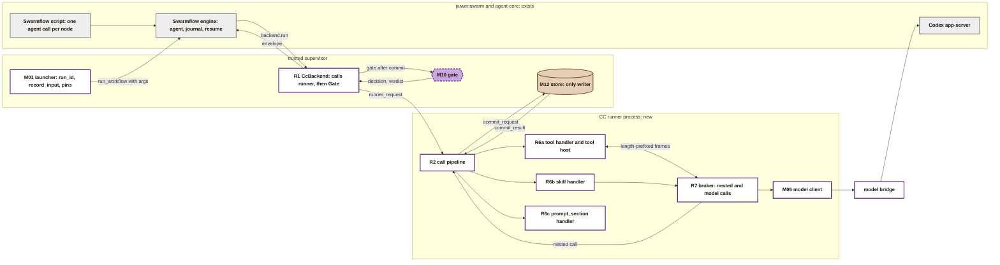
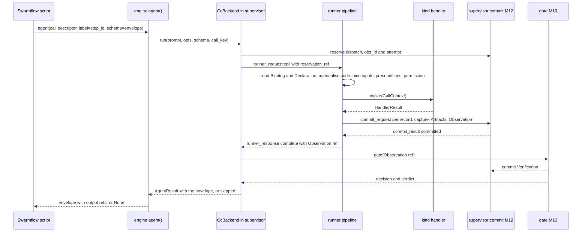

# The CC runner

PRD: 4.1.4, 4.2.1

> Answers: How does the CC runner turn a node that names a capsule into a stored, recorded result?

## Purpose

The **CC runner** is the only code that [runs](../system/lifecycle.md#term-run) a [capsule](capsule.md#term-capability-capsule). A workflow node names a capsule. The runner turns that name into a result: it finds the exact code the capsule's hash points to, [checks](fields.md#term-check) it, feeds it the node's inputs, calls it the way its `kind` says, builds what comes out, records the call, and hands the result back for the next node.

The runner is system code, not a capsule. It reads the [Declaration](fields.md) and the [Binding](../schemas/binding.md). It builds [Artifacts](../schemas/artifact.md) and an [Observation](../schemas/observation.md) and returns them. **It never writes the store.** The runner process asks the supervisor to commit its [Artifacts](../schemas/artifact.md#term-artifact), [Observation](../schemas/observation.md#term-observation) and capture over their authenticated channel, and the supervisor, the only store writer, commits them on its behalf ([commit path](#commit-path-the-supervisor-is-the-only-writer)). The [Gate host](gate-host.md#term-gate-host) commits the [Verification](../schemas/verification-record.md). The complete Declaration-field map is on [CC tooling and field enforcement](tools.md#field-validation-and-enforcement-map).

**Execution [boundaries](../system/modules.md#term-boundary) are separate.** The CC runner calls the [stage capsule](../capabilities/README.md#term-work-capsule). If that capsule asks to run generated POC code for PRD 3.7, the program must run through the separate, provisional [M1 untrusted process boundary](process-boundary.md). The generic runner is not that sandbox; broader [jiuwenbox](../isolation.md#term-jiuwenbox) integration remains future work.

**Scope.** Runs enter through the supervisor's [CcBackend](runner-broker.md#term-ccbackend) client (supervisor to runner frames: `execution-v1.schema.json#runner_request`, `execution-v1.schema.json#runner_response`); the call pipeline and handlers are a managed runner subprocess. Model calls go through the credential-holding trusted [model bridge](../system/model-bridge.md); tool children never receive login files. Kinds are tool, skill and prompt_section. [Module map](../system/modules.md), [lifecycle](../system/lifecycle.md), [storage](../system/storage.md) and [environment](../system/environment.md) define placement, durability, recovery and confinement.

**How to read this page.** It is for the coding agent that builds the runner. The design is split in three pages: this one (pipeline, ids, commit path, failures, module list), [kind handlers, values and ports](runner-handlers.md), and [model client, broker, Swarmflow backend, permissions and records](runner-broker.md). Where a rule depends on a change to another page that is not yet approved, the page says so and gives the behaviour to build until then. Code citations are `path:line` at a named commit: agent-core at the jiuwenswarm pin `9e339019`, jiuwenswarm at `6cc05c36b`.

## Key terms

| Term | Meaning |
|---|---|
| **runner** (also: CC runner) | The only code that runs a capsule: it checks the exact code by hash, binds inputs, calls the capsule by its kind, and returns Artifacts and an Observation. It is system code, not a capsule, and never writes the store; the supervisor commits what it returns. |
| **attempt** | The count of times a dispatch has been reserved, taken from the committed reservation so that interruptions count even without a terminal Observation. A new dispatch attempt needs human review; nested, gate and admission calls each use attempt 1. |

## Contents

1. This page: [scope](#scope), [where it sits](#where-it-sits), [one call, start to finish](#behavior-one-call-start-to-finish), [ids, keys and clocks](#ids-keys-and-clocks), [commit path](#commit-path-the-supervisor-is-the-only-writer), [failures](#failure-failures-in-one-table), [modules](#modules-one-issue-each), [asks of other pages](#what-this-design-asks-of-other-pages)
2. [Runner handlers](runner-handlers.md): [from hash to running code](runner-handlers.md#from-hash-to-running-code), [values](runner-handlers.md#values-how-each-port-type-travels), [preconditions](runner-handlers.md#precondition-evaluator), [kind handlers](runner-handlers.md#kind-handlers)
3. [Runner broker](runner-broker.md): [model client](runner-broker.md#the-model-client-contract-m05), [nested calls](runner-broker.md#nested-calls-and-the-broker), [the four callers](runner-broker.md#the-four-callers), [Swarmflow backend](runner-broker.md#swarmflow-backend-talking-to-the-engine), [permissions](runner-broker.md#permissions-and-human-interaction-at-m1), [records](runner-broker.md#records-the-runner-returns-for-commit), [hooks](runner-broker.md#hooks-for-observability)

## Scope

| In the runner | Not in the runner |
|---|---|
| Resolve a [Binding](../schemas/binding.md#term-binding) to a [Declaration](fields.md#term-declaration) and code, by hash | Choosing a capsule: freeze (M03) pins it, the launcher hands the pins to the script |
| Fetch code by hash and check it before every call | Writing Bindings: freeze (M03) does |
| Bind inputs, check [ports](fields.md#term-port), confine paths | Running checks and folding a decision: the [check runner](gate-host.md#term-check-runner) (M10a) and the gate (M10) |
| Evaluate `needs.when` | Admission, Standing, the library's contents. The runner does not re-check Standing; freeze bound only admitted capsules |
| Decide permission from `effect_class` and `needs.human_interaction` | Rebuilding jiuwenswarm's permission engine or jiuwenbox |
| Call the capsule by its `kind`, within its time budget | Selecting the model route: Model Routing is the home of the fixed production Codex configuration or isolated approved experiment route |
| Broker the capsule's nested calls and model calls | The workflow's order and [halts](../system/lifecycle.md#term-halt): the script and M03 |
| Store every Artifact in a run, and one Observation per call | Spans as a source of truth: they are optional debug data |

## Where it sits

Grey = exists. White = new control code. Purple = the gate. Brown = records. R-numbers are the runner's sub-modules, listed in [modules](#modules-one-issue-each).

**One principle drives the shape.** Values travel by hash; control travels by reference. The [Swarmflow](../system/integration.md#term-swarmflow) script never holds a value. It passes Artifact references from one node to the next, and the runner resolves each reference to stored content. So the run can be replayed from records alone, and the engine's journal stays small.

## Interface

Messages of the runner. The messages of its handlers and broker are listed on [runner handlers](runner-handlers.md#interface) and [runner broker](runner-broker.md#interface).

- **call, cancel or status for one attempt** (call, supervisor -> runner). Operations are exactly `call`, `cancel` and `status`. A gate, nested or admission call carries no `caller` in the request: the caller [kind](capsule.md#term-capsule-kind), parent observation and ordinal come from the Reservation that `reservation_ref` names. Schema: [`execution-v1.schema.json#runner_request`](../contracts/execution-v1.schema.json), reply [`execution-v1.schema.json#runner_response`](../contracts/execution-v1.schema.json).
- **Ask the supervisor to commit one record: an Observation, an Artifact or the capture** (call, runner -> supervisor, authenticated channel, boundary BD21). The request names bytes the runner staged in its own staging area by ref and SHA-256. Schema: [`execution-v1.schema.json#commit_request`](../contracts/execution-v1.schema.json).
- **The supervisor's answer to a commit: committed, refused or conflict** (call, supervisor -> runner). Schema: [`execution-v1.schema.json#commit_result`](../contracts/execution-v1.schema.json).

`record_input` is not a runner operation. It is a supervisor-side control function that writes the launcher's inputs and the [run plan](../types/run-plan.md#term-run-plan) ([values](runner-handlers.md#values-how-each-port-type-travels)). Every local socket and child channel of the runner uses length-prefixed frames, a 4-byte big-endian length and then UTF-8 JSON, at most `cc.ipc.max_frame_bytes` (default 1 MiB); large values travel by ref ([message principles](../contracts/principles.md#5-frames)).

## Behavior: one call, start to finish

The common case is a `dispatch` call: a workflow node runs its capsule. Intent, requirement and planned [nodes](../system/nodes.md#term-node) all use it; every dispatch call has a [Gate](../verification.md), which the supervisor-side CcBackend calls after the runner's commit.

The pipeline's [steps](../system/nodes.md#term-step), in order. A step that fails ends the call there. Steps 1 to 6 do no work for the capsule; a failure there is `outcome: refused`.

| # | Step | Exactly what it does | Fails with |
|---|---|---|---|
| 0 | **Start the clock** | Verify the supervisor's committed reservation; use its [obs_id](../system/observability.md#term-obs-id)/attempt, start the clock and emit cc.call.started | |
| 1 | **Resolve the Binding** | `dispatch`: `store.list_records("binding", run_id)` ([M12](toolchain.md#m12-store)), keep the records whose `step_id` equals the descriptor's. Exactly one must remain, and its `decl_hash` must equal the descriptor's. `gate` and `nested`: use the caller's Binding. `admission`: none (see [callers](runner-broker.md#the-four-callers)) | `refused`, `BINDING_MISSING` (none, more than one, or a different `decl_hash`) |
| 2 | **Load the Declaration** | read `cc/declaration/library/<decl_hash>`; the SHA-256 of the stored bytes (RFC 8785 canonical JSON, INV-15) must equal `decl_hash`; parse it; `identity.kind` must be `tool`, `skill` or `prompt_section` | `refused`, `CARRIER_CHANGED` (hash), `SCHEMA_NONCONFORMANT` (parse, or a kind M1 does not run) |
| 3 | **Materialise the code** | see [from hash to running code](runner-handlers.md#from-hash-to-running-code); compare `code_sha256` with the Binding's (`verifier.code_sha256` for a `gate` call; computed from the Declaration for `nested` and `admission`) | `refused`, `CARRIER_CHANGED`, with `seen_code_sha256` |
| 4 | **Bind inputs** | the set of given port names is a subset of the declared input names; every `required` input is given; each `Ref(artifact)` resolves, the stored record hashes to `Ref.sha256`, and its content hashes to `content_sha256`; each Artifact's `type` equals its port's `Port.type`; each value meets its [type rule](runner-handlers.md#values-how-each-port-type-travels) | `refused`, `PORT_MISMATCH`; `LIMIT_EXCEEDED` for an inline value larger than `cc.ipc.max_frame_bytes` (pass a large value by ref) |
| 5 | **Preconditions** | evaluate every `needs.when` in order with the [evaluator rules](runner-handlers.md#precondition-evaluator) | `refused`, `PRECONDITION_FAILED` (any `fail`), else `PRECONDITION_DEFERRED` (any `defer`) |
| 6 | **Permission** | the [permission table](runner-broker.md#permissions-and-human-interaction-at-m1) | `refused`, `PERMISSION_DENIED` |
| 7 | **Invoke** | the handler for `identity.kind`, with `deadline = t0 + budget_s` | `error`, see [failures](#failure-failures-in-one-table) |
| 8 | **Prepare outputs** | the output keys equal the declared output names exactly; each value meets its type rule and, for a `json` port, its `Port.value_schema`; build one Artifact per port | `error`, `CAPSULE_ERROR` (nothing is committed) |
| 9 | **Commit the Observation** | always, refusals included; `cost.time_s` is measured from step 0 to the end of step 7. The runner stages the bytes in its own staging area and sends one `commit_request` per record (kind `capture`, then `artifact`, then `observation`); the supervisor re-reads each, checks its SHA-256, commits it and answers `commit_result`. Emit `cc.call.finished` after the Observation is committed | `error`, `RUNTIME_UNAVAILABLE` (the supervisor refused or could not commit) |
| 10 | **Return** | `runner_response` with state `complete`, the Observation ref and outcome. `complete` means the supervisor committed the Observation. The pipeline never raises; an internal bug becomes `error`, `RUNTIME_UNAVAILABLE` | |

**Refs.** A `Ref {id, sha256}` names a stored record. `sha256` is the INV-15 hash of that record: SHA-256 over the RFC 8785 canonical JSON of the record exactly as written. Step 8 and the supervisor-side `record_input` return Refs computed this way, and the Observation, the envelope and `binding_ref` use the same rule.

`budget_s` is the Binding's `budget.time_s` (`dispatch`), `verifier.budget.time_s` (`gate`), or the [nested](runner-broker.md#nested-calls-and-the-broker) or [admission](runner-broker.md#the-four-callers) rule.

## Ids, keys and clocks

**Ids.** [System records](../system/records.md#reservation-and-replay) is the home of reservation and identity. Calls use the committed reserved obs_id. Dispatch [attempts](../system/lifecycle.md#term-attempt) are chosen by the supervisor; nested/gate/admission calls reserve through the broker. Output Artifact IDs derive from obs_id and port name. Transport replay never creates another observation or output set.

**Store keys.** M12 keys records as `cc/<kind>/<scope>/<id>`, where `<scope>` is the `run_id`, the `candidate_id`, or `library` ([library](library.md#what-the-library-holds)). Content (code files, value schemas, Artifact bytes stored by reference) is `cc/content/<sha256>`.

| What | Key | Writer |
|---|---|---|
| Binding | `cc/binding/<run_id>/<binding_id>` | freeze (M03) |
| Declaration bytes | `cc/declaration/library/<decl_hash>` | admission (M14); see [asks](#what-this-design-asks-of-other-pages) 1 |
| Artifact | `cc/artifact/<run_id or candidate_id>/<artifact_id>` | the supervisor, committing what the runner returns |
| Observation | `cc/observation/<run_id or candidate_id>/<obs_id>` | the supervisor, committing what the runner returns |
| Content | `cc/content/<sha256>` | admission (code, schemas); the supervisor (Artifact bytes the runner returns) |
| Port type vocabulary | `cc/vocabulary/library/<sha256>` | the vocabulary builder (M00a); loaded by the Binding's `vocabulary_ref`, or the ref admission passes to `call_admission` |
| Policy epoch | `cc/policy/library/<sha256>` | the policy publisher (M00c); loaded by the Binding's `policy_ref`, or the ref admission passes to `call_admission` |

**The cache folder** for materialised code is `<data dir>/cc/cache/capsules/<code_sha256>/`, where the data dir is `JIUWENSWARM_DATA_DIR` when set, else `~/.jiuwenswarm`. It is a cache, never a record.

**`producer`.** Every record the runner returns carries `producer.component: runner` and `producer.version: cc@<package version>`; the supervisor checks that writer identity before it commits.

**`attempt`.** Use the committed reservation, which counts interruptions even without a terminal Observation. New dispatch attempts require human review; duplicate frames reuse the existing attempt. Nested/gate/admission each use attempt 1 per reserved call. Never count terminal Observations to allocate attempts.

**One clock.** Step 0 starts it. The handler's deadline is `t0 + budget_s`. `cost.time_s` is measured on the same clock from step 0 to the end of step 7, so it leaves out the runner's own writes in steps 8 and 9. A call that ends inside its deadline therefore also passes the gate's `check.within_budget.v1`, and one that does not is `BUDGET_EXCEEDED`.

## Commit path: the supervisor is the only writer

The runner process holds no store handle for writing. A call ends in this order:

| # | Who | What |
|---|---|---|
| 1 | supervisor | commits the [dispatch reservation](../system/records.md#term-reservation), then sends `runner_request` `call` with `reservation_ref` |
| 2 | runner | runs steps 1 to 8, staging the capture, the Artifacts and the Observation as bytes in its own staging area |
| 3 | runner | sends one `commit_request` per record, capture first, then Artifacts, then the Observation last |
| 4 | supervisor | re-reads the staged bytes, checks the SHA-256, writer, identity and scope against the reservation, commits through the store (B14) and answers `commit_result` (`committed`, `refused` or `conflict`) |
| 5 | runner | sends `runner_response` state `complete`, only after the Observation's `commit_result` is `committed` |
| 6 | CcBackend (supervisor) | calls the [Gate](../verification.md#term-gate) host with the Observation ref; the Gate commits the [Verification](../schemas/verification-record.md#term-verification); the supervisor then [releases](../system/lifecycle.md#term-release) the node |

`runner_response` `complete` therefore means the supervisor committed the Observation. A `refused` or `conflict` result gives `runner_response` `unavailable` with a reason, no Observation is claimed, and the supervisor halts; a refused commit is never retried automatically. A duplicate `commit_request` with the same bytes returns the first `commit_result`; changed bytes under the same identity are `conflict` (`REQUEST_CONFLICT` or `STORE_CONFLICT`). The Gate host never runs inside the runner: the caller of the Gate is `CcBackend` on the supervisor side ([gate host](gate-host.md)).

## Failure: failures, in one table

`reason_owner` values come from policy `registries`.

| Outcome | Reason | Detected at | Responsible party |
|---|---|---|---|
| `refused` | `BINDING_MISSING` | step 1 after a valid descriptor reservation; malformed R1 descriptors are protocol rejections without an Observation | refusal |
| `refused` | `CARRIER_CHANGED` | steps 2, 3 | refusal |
| `refused` | `SCHEMA_NONCONFORMANT` | step 2: unparseable Declaration, a kind M1 does not run, a malformed `prompt_section`, a skill with a `file` output, a `tool` with no entry point; step 3: a non-text skill file | open (M1 architecture Open 2) |
| `refused` | `PORT_MISMATCH` | step 4 | refusal |
| `refused` | `LIMIT_EXCEEDED` | step 4: an inline input larger than `cc.ipc.max_frame_bytes` | refusal |
| `refused` | `PRECONDITION_FAILED`, `PRECONDITION_DEFERRED` | step 5 | refusal |
| `refused` | `PERMISSION_DENIED` | step 6 | refusal |
| `error` | `CAPSULE_ERROR` | step 7: an exception, a declared failure (its code in `ext.runner.failure_code`), a bad frame or reply, the [turn](../system/model-bridge.md#term-model-turn) limit, an unpinned nested `ref`; step 8: a missing, extra or ill-typed output | capsule |
| `error` | `BUDGET_EXCEEDED` | step 7: the deadline passed | capsule |
| `error` | `TIMEOUT` | M05: the Codex runtime went silent | runtime |
| `error` | `EXTERNAL_UNAVAILABLE` | step 7: a capsule or its [operator](../capabilities/README.md#term-operator) could not reach an outside service it declares (`needs.network: egress`) | runtime |
| `error` | `RUNTIME_UNAVAILABLE` | M05: the Codex runtime is down or refused the turn; the supervisor could not commit (`commit_result` refused); a runner bug | runtime |
| `ok` | null | step 9 | |

Recovery for every row above: the supervisor halts the run and keeps the evidence; explicit human review follows ([lifecycle](../system/lifecycle.md#failure-human-review-and-recovery)). No row is retried automatically. A crash or kill of the runner never resumes by itself: the supervisor writes a `halt_report` with reason `INTERRUPTED` and waits for `cc resume`.

**Optional failure modes at M1.** A listed enforceable hazard adds a matching verification obligation; its diagnostic code may be retained in [ext](../schemas/common.md#term-ext).runner.failure_code. Standard Observation errors remain CAPSULE_ERROR or their infrastructure code. A declaration cannot authorize retries or redefine Gate failure handling.

## Tests

Fixtures and fakes: an admitted toy tool capsule with wrong input and a sleeping child with a grandchild; an admitted toy skill capsule with recorded [model bridge](../system/model-bridge.md#term-model-bridge) replies (including a type-breaking reply); a fake supervisor that answers `commit_request`. Rows in [test surfaces](../system/test-surfaces.md#verification-table): [V05](../system/test-surfaces.md#verification-table), [V06](../system/test-surfaces.md#verification-table), [V07](../system/test-surfaces.md#verification-table), [V10](../system/test-surfaces.md#verification-table), [V42](../system/test-surfaces.md#verification-table) (abort mid-call kills the child tree and commits the Observation). Handler tests are on [runner handlers](runner-handlers.md#tests); broker and backend tests are on [runner broker](runner-broker.md#tests).

## Modules, one issue each

Each module can be built and tested with [fixtures](../system/test-surfaces.md#term-fixture) standing in for its neighbours.

| Id | Module | Interface | Tests |
|---|---|---|---|
| R1 | Swarmflow backend: `CcBackend`, `cc_node`, the generic script, in `cc.adapters.swarmflow` (supervisor side; the only caller of the runner client and the Gate host) | `run(prompt, opts, schema_json, *, call_key) -> AgentResult`; `cc_node(args, step_id, **refs)`; `ENVELOPE_SCHEMA` | a descriptor reaches the pipeline as `dispatch`; a malformed descriptor is rejected before reservation with sanitized protocol diagnostics and no fabricated Observation; a cancelled call kills its tool host and still writes an Observation; a runtime failure returns `skipped`; a repeated descriptor replays from the journal; `run` never raises |
| R2 | Call pipeline | `call(caller, ...) -> (obs_ref, outcome)`; `commit_request` to the supervisor | fixture failure codes; output/capture before Observation; `runner_response` complete only after `commit_result`; reserved attempts include interrupted calls; duplicate transport cannot create another output set |
| R3 | Code materialiser | `materialise(decl, expected_code_sha256) -> Path` | a changed byte, an extra file, or a `__pycache__` folder gives `CARRIER_CHANGED` on the next call; `..` and absolute paths refused; two concurrent first calls both succeed; `code_sha256` equals the author kit's |
| R4 | Input binder and precondition evaluator (and the supervisor-side `record_input`) | `bind(decl, refs) -> values`; `evaluate(when, values) -> list` | every row of the values table; path escape refused; every row of the evaluator table; an unknown op gives `defer` |
| R5 | Permission check | `decide(decl, attended=False) -> allow or reason` | every row of the permission table |
| R6a | Tool handler, `cc.runner.tool_host`, `cc_sdk` | `KindHandler`; the [frame table](runner-handlers.md#tool-a-python-function-in-its-own-process) | `research.compile_intent`'s admission fixtures pass through the host; `print` and `input()` in a capsule do not break a frame; a 10 MiB inline input is refused with `LIMIT_EXCEEDED` and the same bytes passed by ref succeed; a frame over `cc.ipc.max_frame_bytes` closes the channel; 1 MiB written to stderr does not stall the call; a slow function gives `BUDGET_EXCEEDED` and no process is left; a coded exception keeps its code in `failure_code`; a capsule that spawns a child loses it on kill |
| R6b | Skill handler | `KindHandler`; the prompt template; the parse rules | with M05 replaying fixtures: each parse rule's failing reply; a fenced reply parses; a `call` runs a nested call and re-sends the exchange; the turn limit holds; one session id per turn |
| R6c | `prompt_section` handler | `KindHandler` | returns the file's text exactly; a malformed `prompt_section` is refused |
| R7 | Broker | `call(ref, inputs) -> result`; `model(prompt, hint, route_id) -> text` | an unpinned ref writes no Observation; a nested deadline never exceeds its caller's; nested Observations carry `causation_id` |
| R8 | Event emission | `cc.events.emit` ([system observability](../system/observability.md#interface-the-events)) | events fire in order, after their records; a raising subscriber never fails a call |
| R9 | M1 generated-code process boundary (separate from capsule tool host) | [`execute_poc(PocExecutionRequest) -> PocExecutionResult`](process-boundary.md#interface-provisional-api) | no process starts when boundary pre-check fails; workspace escape, host-file access, unauthorized network/system effects and hidden-fixture access are denied; result preserves workload outcome versus infrastructure/boundary failure and returns evidence refs |

**Depends on:** M12 (reads only: `get_record`, `list_records`, `get_content`; every write goes through `commit_request` to the supervisor), M05 (`complete`, [model client](runner-broker.md#the-model-client-contract-m05)), M10 (`gate`, called by R1 in the supervisor, never by the runner process; the Gate host calls R2 as `gate` for the gate capsule), M10a (runs checks in the tool host's check mode). R9 depends on the benchmark stage's gated `poc_bundle` and the explicit local security boundary; its open assumptions are on [process-boundary](process-boundary.md). **Depended on by:** M14 (calls R2 as `admission`), M01 (hosts the supervisor-side `record_input` and builds `CcBackend`), M03 (the script uses `cc_node`), M18 (subscribes to R8), and `research.run_benchmark` (calls R9 for generated execution).

**Build order, and what can be tested when.**

## What this design asks of other pages

These are proposals. Each needs approval before it changes the page that defines it. Until then, the runner builds the behaviour this page states.

1. **[Library](library.md):** admission also stores each admitted Declaration at `cc/declaration/library/<decl_hash>`, as the RFC 8785 bytes of the Declaration with v1.0 defaults filled in (exactly the bytes hashed for `decl_hash`); every `Port.value_schema` file at `cc/content/<sha256>`. The vocabulary and policy documents are stored by their own writers, the vocabulary builder and the policy publisher ([toolchain](toolchain.md#m00c-policy-publisher)).
2. **[Policy](../schemas/policy.md) [registries](../schemas/policy.md#term-registry):** allow `OPERATOR_NOT_ADMITTED` as the reason of a refused nested call, `reason_owner` `refusal`. Until then, an unpinned nested `ref` writes no Observation and fails the caller with `CAPSULE_ERROR`. Also give `SCHEMA_NONCONFORMANT` the `reason_owner` `refusal` when step 2 raises it.
3. **Policy:** add `runner.max_skill_turns` (proposed: 8), `runner.max_inline_file_bytes` (proposed: 200000), and the rule `effects_cover_dependencies`. `LIMIT_EXCEEDED` is a refusal reason of the runner and needs a registry entry with `reason_owner` `refusal`.
4. **[Observation](../schemas/observation.md):** state that a refused call's `inputs` lists the refs it was given, even when they failed to bind. State that `ext.runner` holds the keys listed on this page.
5. **[Declaration](fields.md):** a `tool` with `body` names its entry point in `ext.cc.entry` (`file.py:function`). By INV-18, this becomes an optional core field, `identity.entry`, once a second tool reads it.
6. **[Artifact](../schemas/artifact.md):** the runner returns every Artifact that comes out of a runner call, in any scope, including admission test calls, and the supervisor commits it. Admission writes test inputs, fixtures and library Artifacts. `origin: control` with a `causation_id` also covers the input values the runner records for a capsule's nested call.
