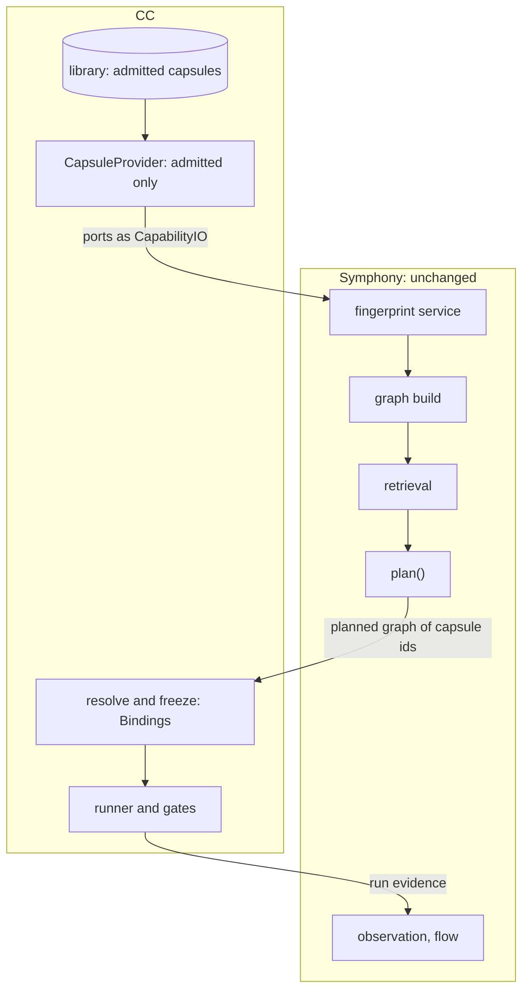

# Symphony and CC

**Symphony** is agent-core's capability module. It indexes the capabilities installed in an agent and plans which to use. It never runs, binds or checks anything. CC does not replace it: **CC decides what Symphony may index, not how it ranks.** Read in source at agent-core `e23806c1`; paths are under `openjiuwen/symphony/`.

## What Symphony does

| Part | What it does | Where |
|---|---|---|
| Fingerprint service, `CapabilityProvider` | reads the inventory of installed capabilities through a provider; rejects a snapshot that changed during the read. The protocol has two methods, `capabilities()` and `source_snapshot()`. No concrete provider exists yet | `shared/fingerprint/`, `interfaces/capability.py` |
| Graph build | links capabilities with `can_feed` edges from their ports, each accepted by a model | `graph_engine.py` |
| Retrieval | a retrieval tree and index over skills | `retrieval/` |
| `plan()` | fast or beam planning: a model returns a graph of capability ids with a status of `ready`, `needs_input` or `no_plan`. The agent then runs the skills through its ordinary tools | `orchestration/planning/` (`fast.py`, `beam.py`) |
| Observation | run evidence updates edge weights | `observation/` |
| `flow` | distils capability chains that recur and succeed into versioned, reviewed skill packs | `flow/` |

**Status (checked 2026-09-24).** One consumer, jiuwenswarm, and everything is off by default (`symphony.enabled`). Young: Symphony's first commit was 2026-07-29. No roadmap. Its graph takes only skill, subagent and agent nodes, so tool capsules are not graphed yet.

## Symphony already has the merge algorithm

`symphony/flow` already does most of what [composition](composition.md) needs:

| Composition needs | Already in `flow` |
|---|---|
| a block with its own internal graph | `ExperienceRecipe.combination_structure`, a DAG (`flow/models.py:118`) |
| merge only an edge that recurs **and** succeeds | `qualified_edges(min_edge_support, min_edge_success_rate)` (`flow/distill.py:195`), called with a rate of 0.8 (`flow/engine.py:227`) |
| failing parts never merge | grouping uses only successful edges (`flow/engine.py`, `distill()`) |
| A, B and A-B kept as versions | immutable `recipes/<id>/vN.json` with a `current` pointer and `content_identity()` (`flow/store.py:35`) |
| the block is gated before use | `PackageReviewGate`: ten static checks, then an isolated model reviewer (`flow/review.py:144`) |
| packaged with integrity | `CapabilityPackager`, `package_id = "cap-" + sha256[:12]` (`flow/packager.py:64`) |

**What `flow` lacks is exactly CC:** no Declaration on the block (no ports, effects, preconditions or guarantees), no lineage back to A and B, grading by observed success counts only with no held-out test, members referenced by id rather than pinned by hash, and no check of declared against observed effects.

## How CC plugs into Symphony

- **CC's provider is the first concrete `CapabilityProvider`.** It exposes admitted capsules only, with their declared ports mapped onto `CapabilityIO`.
- **Symphony's ranking, retrieval and planning are used as they are.** CC does not redo them.
- **The planner's output is resolved and frozen by CC**: each capsule id becomes a [Binding](../schemas/binding.md) pinned by hash.
- **Run evidence flows back** to Symphony's observation.

## What CC does not build

CC supplies the declaration that existing mechanisms check against. It does not rebuild: `flow`, `extension_binder` (binds and unbinds in reverse order), `EvaluationSuite`, `GoalEvaluator`, the `PermissionEngine` (see [permissions](permissions.md)), or Symphony retrieval.

## Open

- Whether M1 plans through Symphony or through the fixed DAG: the M1 design uses the fixed DAG, with the dynamic planner on its own track.
- Questions for Symphony's builders: a deterministic `plan()` path, a stable provider protocol, and an admitted-only provider.
- Graphing tool capsules, which Symphony's graph does not take yet.
