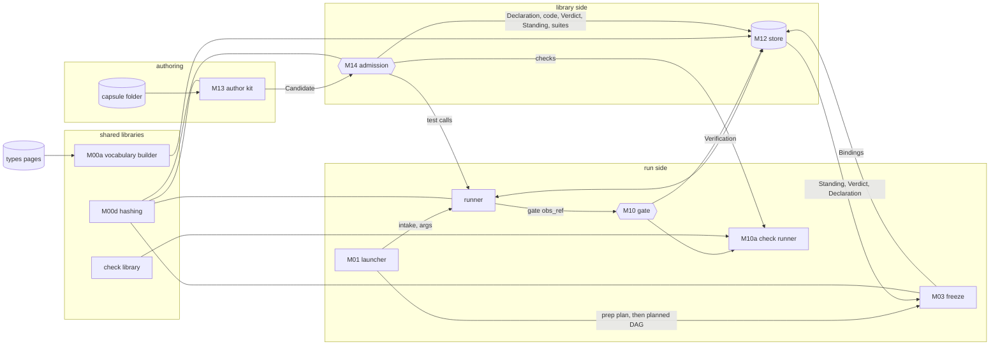
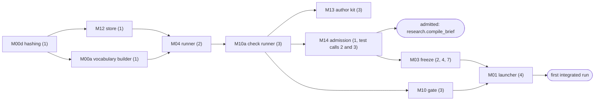

# The CC toolchain

PRD: 4.1.2, 4.1.4

> Answers: Which tools build, admit, freeze and run capsules, and what is each tool API?

## Purpose

CC is a schema; tools do the work ([capsule](capsule.md)). This page keeps the API detail of the library-side and run-side tools, so each can be built against [fixtures](../system/test-surfaces.md#term-fixture) and still fit. The [tools inventory](tools.md) is the one list of every tool, with its status, build step, code path and schemas; the names, step numbers and code paths below are the same as there. [Modules](../system/modules.md) is the home of code and process placement; [storage](../system/storage.md), [lifecycle](../system/lifecycle.md) and [environment](../system/environment.md) define the shared confinement. Generated POC execution uses the separate [process boundary](process-boundary.md).

## Interface

Messages of the tools. The tool sections below give each API and its [test cases](../schemas/checks.md#term-test-case).

- **Freeze one phase (validated plan to [Bindings](../schemas/binding.md#term-binding))** (call, launcher, supervisor -> freeze (M03)). Schema: [`execution-v1.schema.json#freeze_request`](../contracts/execution-v1.schema.json).
- **Step to Binding refs plus [batch](../system/storage.md#term-commit-batch) ref** (call, freeze (M03) -> launcher, supervisor). Schema: [`execution-v1.schema.json#freeze_result`](../contracts/execution-v1.schema.json).
- **Halt report for human review or headless exit 3** (report, halt host -> human session, CLI). Schema: [`execution-v1.schema.json#halt_report`](../contracts/execution-v1.schema.json).
- **run_checks(): full [checks](fields.md#term-check) or Binding entries, [Observation](../schemas/observation.md#term-observation), pins** (call, gate host, admission, author kit -> [check runner](gate-host.md#term-check-runner) (M10a)). Schema: [`tools-v1.schema.json#run_checks_request`](../contracts/tools-v1.schema.json).
- **One Verification-shaped result row per check** (call, check runner (M10a) -> gate host, admission, author kit). Schema: [`tools-v1.schema.json#run_checks_result`](../contracts/tools-v1.schema.json).
- **Report of `cc kit check`: validation, hashes, local test results (advice only)** (report, author kit (M13) -> author). Schema: [`tools-v1.schema.json#author_kit_report`](../contracts/tools-v1.schema.json).
- **`cc policy publish <epoch.json>`** (call, developer CLI -> policy publisher (M00c)). Schema: [`tools-v1.schema.json#policy_publish_request`](../contracts/tools-v1.schema.json).
- **Published, unchanged or refused epoch with its ref** (call, policy publisher (M00c) -> developer CLI). Schema: [`tools-v1.schema.json#policy_publish_result`](../contracts/tools-v1.schema.json).

## Behavior: how the tools connect



Two paths share one store:

- **The library side** (cold): an author writes a [capsule](capsule.md#term-capability-capsule) folder; the author kit packs it into a Candidate; admission tests it through the runner and writes its records.
- **The run side** (hot): the launcher starts a run; freeze pins one admitted capsule per step (the [fixed prep plan](../system/lifecycle.md#term-prep-plan) at launch, the [planned DAG](../types/run-plan.md#term-planned-plan) after requirements); the runner [runs](../system/lifecycle.md#term-run) each; the gate checks each output.

## The capsule folder

What an author writes. One folder per capsule, named by its `identity.name`.

```text
capsules/op.local_search/
  capsule.json          the Declaration; the author writes everything except file hashes
  local_search.py       the code or skill files that carrier or body names. A tool of one file uses carrier;
                        a tool of several files uses body and names its entry in ext.cc.entry (file.py:function)
  checks/               the files that guarantees.checks[].runner names
  tests/cases.json      the test cases: a list in the shape of Candidate tests[]
  make_capsule.md       generated by the author kit; never edited, never hashed
  anything else         the author's own files (notes, unit tests); never submitted
```

| File | Defined by |
|---|---|
| `capsule.json` | [Declaration](fields.md) |
| `tests/cases.json` | [Candidate](../schemas/candidate.md) `tests[]`: `{check_id, inputs, expected, fixtures}` |
| `make_capsule.md` | [make_capsule.md](make-capsule.md) |

**What gets submitted** is exactly the files the [Declaration](fields.md#term-declaration) pins by hash: the `carrier` or `body` files, and every `guarantees.checks[].runner` file. Nothing else in the folder reaches admission, so an author's notes and unit tests never change a capsule's identity.

## Where code lives

The [module map](../system/modules.md) fixes locations and process [boundaries](../system/modules.md#term-boundary); the [inventory](tools.md) lists every tool with its path. Only the groups below are stated here.

| What | Where |
|---|---|
| the CC tools, one Python package | `cc/`, for example `cc/hashing.py` (M00d), `cc/vocab.py` (M00a), `cc/policy/` (M00c), `cc/store.py` (M12), `cc/kit.py` (M13), `cc/admission.py` (M14), `cc/freeze.py` and `cc/planning/bind.py` (M03), `cc/checks/` (M10a), `cc/gate.py` (M10), `cc/launcher/` (M01, M03h), `cc/runner/` (M04), `cc/events.py` |
| <a id="term-the-only-code-that-imports-agent-core-or-jiuwenswarm"></a>**the only code that imports agent-core or jiuwenswarm** | `cc/adapters/`: `swarmflow`, `plan_script`, `codex`, `model_bridge`, `leader`, `local_session`, `entry`, `runview`, `deepsearch`, `codesearch`; `kv`, `symphony` and `tracing` are optional or future. The API of each is on [integration](../system/integration.md#the-adapters) |
| the capsule-side library | `cc_sdk`, a small module of its own, so capsule code never imports the toolchain ([runner](runner-handlers.md#tool-a-python-function-in-its-own-process)) |
| registry check code (type checks, the gate's fixed checks) | `cc/checks/registry/`, one file per type, written by someone other than the producing capsule's author (INV-10) |
| capsule sources | `capsules/<identity.name>/` |
| [payload type](../types/types.md#term-payload-type) definitions | `docs/architecture/types/`, the source the vocabulary builder reads |

## M00d Hashing

Tool: hashing. Step 1. Code `cc/hashing.py`. No message schema.

Every tool that computes or checks a hash uses this one library, so they always agree. Two implementations of `decl_hash` would make admission and the runner disagree about which capsule is which.

```python
def canonical_json(value) -> bytes                 # RFC 8785
def sha256_hex(data: bytes) -> str
def record_sha256(record: dict) -> str              # what a Ref's sha256 is (INV-15)
def fill_defaults(decl: dict) -> dict               # v1.0 defaults written out (INV-16)
def decl_hash(decl: dict) -> str
def interface_hash(decl: dict) -> str
def code_sha256(decl: dict) -> str
```

The three capsule hashes follow [fields](fields.md#computed-by-admission-never-written-by-the-author) exactly. **Tests:** fixed inputs with known hashes; an explicit and an implicit default hash the same.

## M00a Vocabulary builder

Tool: vocabulary and type builder. Step 1. Code `cc/vocab.py`. Output schema: [port types](../schemas/port-types.md).

Builds the [port type vocabulary](../schemas/port-types.md#term-port-type) document from the type pages, so nobody writes a payload type's JSON Schema by hand ([payload types](../types/types.md#the-rules)).

```python
def build_vocabulary(types_dir: Path, policy: dict, previous: dict | None) -> dict
```

- **In:** every `types/*.md` page except the index; the policy (for `reg(...)` values); the previous vocabulary, if any.
- **Out:** a `cc.types.v1` document ([port types](../schemas/port-types.md)): the base types, one entry per page with its `version` and generated `value_schema`, and every registry check in full.
- **Stores** the vocabulary with `put_hashed("vocabulary", doc)`, and each registry check's code file with `put_content`. It is the vocabulary's one writer (INV-3).
- **Rules:** a page's field table compiles by the [generation rules](../types/types.md#the-rules). `vocabulary_version` is the previous one plus 1 whenever anything changed. A type's `version` must go up when the compiled schema accepts less than before; the builder refuses otherwise.
- **Tests:** each M1 type's example validates and a copy with a required field removed fails; a field added without a version change is caught when it is required.

## M00c Policy publisher

Tool: policy publisher. Step 1. Code `cc/policy/`. No wire schema ([policy](../schemas/policy.md)).

```text
cc policy publish <epoch.json>     validate a policy epoch document and store it
```

- **In:** one [policy epoch](../schemas/policy.md#term-epoch), written as a JSON document in `cc/policy/<epoch>.json` and reviewed like code ([policy](../schemas/policy.md)).
- **Does:** validates it against the policy schema, refuses an epoch whose name is already stored with different bytes, and stores it with `put_hashed("policy", doc)`. It is the policy's one writer (INV-3), as the vocabulary builder is the vocabulary's.

**Which policy and vocabulary are current.** jiuwenswarm's `config.yaml` names them: `cc.policy_epoch` (an epoch name) and `cc.vocabulary_sha256` (a vocabulary hash). The launcher and admission resolve those names in the store, and pin the result in every Binding and Verdict. Changing either is a config change, reviewed like code. No record in the store points at "current", because records are written once (INV-2).

## M12 Store

Tool: store. Step 1. Code `cc/store.py`.

```python
class Store:
    async def put_record(kind: str, record: dict) -> Ref          # key cc/<kind>/<scope>/<id>; write once
    async def commit_batch(batch_id: str, records: list[dict]) -> list[Ref]
    async def put_declaration(decl: dict) -> str                  # RFC 8785 bytes with v1.0 defaults; returns decl_hash
    async def put_hashed(kind: str, doc: dict) -> str             # vocabulary, policy: keyed by their INV-15 hash
    async def get_record(kind: str, scope: str, id: str) -> dict  # id is the record id, or the hash for declaration, vocabulary, policy
    async def list_records(kind: str, scope: str) -> list[dict]
    async def put_content(data: bytes) -> str                     # returns the sha256; idempotent
    async def get_content(sha256: str) -> bytes
```

- `kind` is one of `candidate`, `verdict`, `standing`, `binding`, `observation`, `artifact`, `verification`, `finding`, `test_case`, `test_suite`, `declaration`, `vocabulary`, `policy`. Keys are on the [runner](runner.md#ids-keys-and-clocks) page.
- Each commit batch has a manifest. Schema: `execution-v1.schema.json#commit_batch_manifest`.
- `scope` is the `run_id`, the `candidate_id` or `library`. A Declaration has no envelope (INV-1's exception), so it has its own call; vocabulary and policy documents are keyed by hash.
- A second write of different bytes to a key raises; the same bytes are a no-op (INV-2). The store checks the envelope and the writer's `producer.component` against the [records table](../schemas/schemas.md#the-records) (INV-3).
- The authoritative backing is the immutable file publication in [storage](../system/storage.md#interface-store-contract). A native KV index may be a read cache, but exclusive_set alone does not meet durability or multi-record commit. No other CC module reads its backing files/index directly. The supervisor hosts the sole M12 writer; authorized record-producing modules call its public API.

## M13 Author kit

Tool: author kit. Step 3 (toy capsules are hand-authored before it exists). Code `cc/kit.py`. Candidate shape: [candidate](../schemas/candidate.md); the report has no schema def.

```text
cc kit check <folder>       validate, hash, run the admission checks locally; print a report
cc kit candidate <folder>   write the Candidate JSON for that folder
cc kit new <name> --kind tool|skill|prompt_section [--gate] [--store <dir>]   write a new capsule folder from its template
```

- Validates `capsule.json` against the Declaration and the policy's `required` section, with the same code admission uses.
- Fills every file `sha256` in `capsule.json`, computes the three capsule hashes with M00d, and regenerates `make_capsule.md`.
- Runs each test case through the runner as an `admission` call against a local throwaway store, and the checks through M10a. The report is advice: only admission's Verdict counts.
- `cc kit new` writes a folder from a template per [kind](capsule.md#term-capsule-kind):
  - `tool`: `capsule.json` with a `carrier`, the stub function, `checks/`, `tests/cases.json`;
  - `skill`: `SKILL.md` with front matter instead of the stub function;
  - `prompt_section`: one text file, no inputs, one `text` output.
  - `--gate` implies `--kind skill` and scaffolds the `research.verifier` pattern: its fixed checks and hashed judging files. [Gate](../verification.md#term-gate) profiles are policy artifacts, not separate admitted capsules ([verification](../verification.md)). Unfilled fields remain `"<fill>"`, which admission refuses (`SCHEMA_NONCONFORMANT`).

## M14 Admission

Tool: admission. Step 1 (validation, records, Puppet provider seam); the tested provider's test calls are wired at [steps](../system/nodes.md#term-step) 2 and 3. Code `cc/admission.py`. Schemas: `library-rsi-v1.schema.json#admission_request`, `library-rsi-v1.schema.json#admission_decision` (provider and Puppet detail on [admission](admission.md)).

```python
async def admit(candidate: dict, *, policy_ref: dict, vocabulary_ref: dict) -> Ref   # the Verdict
```

In the order the [library](library.md#behavior-admission-the-only-way-in) gives:

1. Check the Declaration's shape against [fields](fields.md) and the policy's `required` section (`SCHEMA_NONCONFORMANT`).
2. Re-hash every submitted file; refuse a mismatch (`HASH_MISMATCH`). The submitted files must be exactly the files the Declaration pins: its `carrier` or `body` files and every check's `runner` file.
3. Apply the policy's `rules` in the order the [policy](../schemas/policy.md) lists them, stopping at the first refusal, with that rule's [reason code](../schemas/policy.md#term-reason-code). Among them, every capsule in `needs.external` must already be admitted (`OPERATOR_NOT_ADMITTED`). An [operator](../capabilities/README.md#term-operator) is admitted before any capsule that pins it; shared verifier instructions are hashed local files.
4. Store each file at `cc/content/<sha256>`, and the Declaration with `put_declaration`.
5. Store each test's inputs and fixtures as [Artifacts](../schemas/artifact.md#term-artifact) with `scope.library` (test cases are library records), then each test case (with its `model_replies`) and one visible suite.
6. Run each test case through the runner's `call_admission`, with M05 replaying the case's `model_replies`. Then run its checks through M10a, with `expected` set: tier 1 always, and tier 2 through the policy's `levels.admission_judge` when the capsule has judged checks. Any `fail` refuses (`CHECK_FAILED`); any `unknown` defers (`CHECK_UNKNOWN`).
7. Write the Verdict, and a Standing entry when admitted: `admitted`, or `admitted_inactive` for an [RSI child](rsi.md#term-parent-and-child) of a `propose` parent.

**What admission stores** is every Declaration-pinned carrier/body/check/rubric/local-value-schema file. Candidate.files supplies exact coverage; admission rehashes bytes and rejects missing or conflicting paths.

## M03 Freeze: the Binding writer

Tool: freeze and binder. Steps 2 (toy plan), 4 (phase `prep`) and 7 (phase `planned`). Code `cc/freeze.py` and `cc/planning/bind.py`.

Freeze runs **twice per run**, from the same pinned [library snapshot](library.md#term-library-snapshot) ([A26](../decisions.md)):

1. **At launch, for the prep plan.** The prep plan (intent step, requirement step) is fixed by the launcher, so freeze binds those steps before dispatch.
2. **After requirements are accepted, for the planned DAG.** The planner's proposal is validated, then bound and [frozen](../system/lifecycle.md#term-freeze). No planned node dispatches before its complete committed Binding mapping exists.

Each pass consumes only a normalized [`run_plan`](../types/run-plan.md) identified by a committed VALID result from [planner validation](../system/planner.md#proposal-envelope); the prep plan uses launcher-committed fixed-plan provenance. It creates one Binding per step. It re-resolves exact snapshot/policy/config pins and refuses changed or revoked dependencies. [ExecutionProfile](../schemas/profiles.md#term-executionprofile) direct-call limits cover every reachable work/verifier/dependency hash before publication.

```python
async def freeze(run_id: str, validation_ref: dict, *, policy_ref: dict, vocabulary_ref: dict,
                 request_id: str) -> dict[str, Ref]   # step_id -> Binding
```

`request_id` is required (`execution-v1.schema.json#freeze_request`); the same id and bytes return the same batch. On the wire `policy_ref` and `vocabulary_ref` are `{id, sha256}`: `id` is the epoch name or the vocabulary version name, `sha256` the hash of its bytes. The Binding record itself keeps the structured form of [Binding](../schemas/binding.md).

Resolve `validation_ref` to the committed services-v1 plan_validation control Artifact, require VALID with zero findings, and resolve its `validated_plan_ref` to the normalized [run_plan](../types/run-plan.md#term-run-plan). Cross-check proposal, task, snapshot, config, policy and run identity against the launcher-committed intake/config/library/provenance. A naked plan dictionary, model assertion or wrong-run validation never authorizes freeze. For each step, freeze:

1. resolves `capsule_name` through the immutable library snapshot whose hash is `run_plan.library_snapshot_sha256`, obtaining its exact [decl_hash](fields.md#term-decl-hash) and Verdict. The validated snapshot and freeze must match; freeze never substitutes a newly activated alias. Missing entries or pin mismatches refuse. Revocation or security state may deny a snapshot version but cannot choose replacement code;
2. re-hashes the pinned capsule's code and transitive needs.external closure from that snapshot/store (CARRIER_CHANGED), and refuses every dependency not admitted at snapshot creation or since revoked (OPERATOR_NOT_ADMITTED); cycles, missing pins and snapshot mutation refuse freeze;
3. checks every wire: the source's type (from `launcher_inputs`, or the earlier step's output port) equals the input port's type, and neither is `json` (`PORT_TYPE_MISMATCH`, rule `wired_ports_named`);
4. assembles `checks` from the [work capsule](../capabilities/README.md#term-work-capsule)'s `node` and `both` checks, its output types' checks, and the step's `step_checks` (copied into the Binding's `step_checks`);
5. **builds the Gate.** A trusted builder derives the Gate test from the producer's Declaration plus mandatory host policy, and freeze pins `research.verifier` with a [GateProfile](../schemas/profiles.md#term-gateprofile) in `verifier`, with its budget (the verifier's `timeout_s`, never over policy `budgets`' 120 s per judge call). A Declaration obligation the builder cannot test fails freeze. The builder API and test-record schema are `PENDING_SOURCE` ([decisions](../decisions.md#pending-source-do-not-invent)); [verification](../verification.md) is the home of the rule. This is the one list of what freeze checks about a verifier ([gate capsules](gate-capsules.md) links here):
   - the step's `checks` hold at least one judged check (`GATE_MISSING`);
   - the verifier has kind `skill`; exactly one input, `evidence_bundle` of type `evidence_bundle`; exactly one output, `verifier_assessment` of type `verifier_assessment`; `effect_class` `pure` or `read_only`; no unapproved external call; hashed local judging instructions; check ids exactly `answers_every_criterion`, `quotes_from_bundle` and `assessment_matches_expected` (`GATE_MISSING`);
   - `evolution.rsi: none` (`REFEREE_RSI_PERMITTED`);
   - it is not the work capsule (`JUDGE_IS_SELF`);
   - judged step check runners equal the verifier's rubric refs/hashes (GATE_RUBRIC_MISMATCH); deterministic/reference checks resolve independent registry or gate-check code pins. All pins enter Binding.step_checks; changes require a new plan;
6. writes the Binding, with this run's `policy_ref` and `vocabulary_ref`. Every Binding of a run pins the same two.

Each pass publishes its Bindings through one commit_batch, then the supervisor commits the `run_phase_started` record for that phase and emits cc.run.frozen ([events](../system/observability.md#interface-the-events)). An incomplete batch is never visible. It returns `{step_id: Binding ref}` plus the batch ref. Schema: `execution-v1.schema.json#freeze_request` for the call, `execution-v1.schema.json#freeze_result` for the return value.

## M03h Halt host

Tool: halt host. Step 4. Code `cc/launcher/halt.py` and `cc/adapters/local_session.py`.

```python
async def halt(run_id: str, err: CcHalt) -> None
```

The engine re-raises a script exception (agent-core agent_teams/workflow/engine/runner.py:268-273). `CcHalt` derives from `BaseException` and sets the engine's `abort_event`, so native `parallel()`, `pipeline()` and `map_parallel()` (which [turn](../system/model-bridge.md#term-model-turn) `Exception` into `None`, `primitives.py:1463`, `:1514`) cannot swallow it; the engine's `except Exception` block does not run, so the launcher emits `cc.run.halted` itself. `CcHalt` reaches the launcher; the halt host reads the exact attempt's committed evidence, reports the verdict/reason (schema `execution-v1.schema.json#halt_report`) and invokes the native [human_session](../system/lifecycle.md#term-human-session) adapter. [Lifecycle](../system/lifecycle.md#failure-human-review-and-recovery) is the home of attributable review, abort and explicit resume; [workstation](../system/workstation.md) is the home of CLI exit codes and Web/TUI presentation. Missing decision storage is reported as infrastructure failure, never substituted with an older advancing record. A crash or kill never resumes by itself: on restart the supervisor writes a halt report with reason `INTERRUPTED` and waits for `cc resume`. Issue 47 keeps the native adapter source-verification requirement open.

## M10a Check runner and the check library

Tool: check runner and check library. Step 3. Code `cc/checks/runner.py` and `cc/checks/registry/`. Result rows are [`check_run`](../contracts/library-rsi-v1.schema.json#check_run); the `run_checks` call itself has no schema def.

M10a runs **deterministic and reference checks only**. Judged checks are the gate host's: it calls the step's gate capsule itself ([gate host](gate-host.md)).

```python
async def run_checks(checks: list[dict], obs: dict, *, vocabulary_ref: dict, policy_ref: dict,
                     inputs: dict | None = None, expected: Any | None = None) -> list[dict]
```

- **`checks`** are full Checks, or Binding entries `{check_id, source}` that M10a resolves:
  - `source: capsule` from the Declaration named by `obs.decl_hash`;
  - `source: type` from the pinned vocabulary;
  - `source: step` from the Binding's `step_checks`.

  A caller with checks from elsewhere (admission with a Candidate's Declaration, the gate host with a gate capsule's own checks) passes full Checks. A judged check passed here is a caller bug (raise).
- **`inputs`** overrides the call's input values when the checked output came with other inputs: the gate host passes the `evidence_bundle` when it checks a gate capsule's answer.
- **Returns** one result per check, in the shape of [Verification](../schemas/verification-record.md#term-verification) `results[]`, in the order given.
- **Each check runs** through the [calling convention](../schemas/checks.md#calling-convention), its code materialised by hash like a capsule's.
- **How a check runs:** in the runner's tool host in check mode ([runner](runner-handlers.md#tool-a-python-function-in-its-own-process)), with `root` the materialised folder holding the check's runner file. The timeout is policy `runner.check_timeout_s`. A crash, timeout or malformed result gives `unknown` (INV-8).
- **The check library** holds the registry checks' code: `check.value_matches_type.v1`, `check.call_ok.v1`, `check.within_budget.v1`, and each type's checks, under `cc/checks/registry/`. The vocabulary builder (M00a) stores each file in the content store and names it by `sha256` in the vocabulary's `checks`, so registry checks are materialised by hash like any other.

## M10 Gate host

Tool: [Gate host](gate-host.md#term-gate-host). Step 3. Code `cc/gate.py`. Defined on [its own page](gate-host.md), called by `CcBackend` on the supervisor side after the runner commit: `gate(obs_ref) -> GateResult` (schemas `execution-v1.schema.json#gate_request`, `execution-v1.schema.json#gate_result`), check runner, [Tier 2](../verification.md#term-tier-2) through the step's [gate capsule](gate-capsules.md), the fold, the Verification and the verdicts.

## M01 Launcher

Tool: launcher. Step 4. Code `cc/launcher/`.

```python
async def launch(prompt: str, channel: str, workspace: Path) -> str     # the run_id
```

Schema of the request (CLI/Web/benchmark entry): `execution-v1.schema.json#launch_request`; of the reply: `execution-v1.schema.json#launch_result`. `workspace` is the user's workspace folder; the input folder is `<workspace>/input/` (PRD 3.1.2), which exists only in the PRD and is created by the installer (it is not created by any existing code). The run is bound to the local single-user profile, whose data dir is `get_user_workspace_dir()` (PRD 3.1.3; [integration](../system/integration.md#kv-the-record-stores-backing)). In this order:

1. **Qualify** (PRD 3.1.5). If the prompt is blank or the input folder is unreadable, reject with exit 2 before minting [run_id](../system/records.md#term-run-id). Load and validate a pinned config snapshot and run doctor. Unavailable environment/security returns exit 4; do not begin an unprotected run. The CLI exit codes are 0 success, 2 launch or configuration rejected, 3 [halted](../system/lifecycle.md#term-halt), 4 environment unavailable ([workstation](../system/workstation.md#interface-cli-and-public-run-api)).
2. **Mint** the `run_id`. Resolve `P` and `V` from `config.yaml`'s `cc.policy_epoch` and `cc.vocabulary_sha256` ([M00c](#m00c-policy-publisher)). Resolve **one** immutable library snapshot and pin its hash for the whole run (A26).
3. **Prepare the prep plan.** The fixed prep plan (intent step, requirement step) comes from launcher configuration, bound to that snapshot. It is frozen at launch and contains no planned DAG. Its wiring must equal the [intent](../capabilities/intent-compile.md) and [requirement](../capabilities/requirement-capsule.md) pages. Port wiring between the two is `PENDING_SOURCE` until both CCs are built together ([decisions](../decisions.md#pending-source-do-not-invent)).
4. **Build intake v2.** Classify supplied/configured local resources, bind immutable project_asset/validation_data snapshots, and extract text only from reference_document. Documents are added in path order under the fixed limits; excluded references are recorded in skipped. Then the supervisor-side `record_input` control function stores the canonical intake and its [source_text](../types/source-text.md#term-source-text) prompt projection ([source_text](../types/source-text.md) is the home of the source/hash/offset basis). Ordinary extraction helpers create these inputs; no capsule runs for intake. Baseline/dataset suitability is a later Gate obligation.
5. **Commit** config/library/source-manifest control Artifact pins and the intake/source_text references. The trusted launcher publishes the prep plan with fixed-plan provenance and invokes deterministic validate. The trusted host publishes the normalized run_plan, then its VALID result. At step 4 the toy plan carries fixed-plan provenance and the plan [validator](../system/planner.md#term-plan-validator) (B06) is wired from step 7. Invalid or failed publication ends launch before freeze. No successor can start from an event alone.
6. `bindings = freeze(run_id, validation_ref, policy_ref=P, vocabulary_ref=V, request_id=...)` for the prep plan (freeze 1). Freeze rereads validation authority and publishes the whole Binding batch.
7. Commit `run_phase_started` with phase `prep` (plan, Binding batch, library, config, intake and source references), emit `cc.run.frozen` and `cc.run.started`. Invoke `cc.adapters.swarmflow.start_run(args)` with `plan_ref`, `pins_ref` (the Binding batch) and `inputs: {intake, source_text}`. The adapter passes `CcBackend` (and asserts the type, because the engine falls back to a mock backend), the run's `run_id` and an `abort_event` to `run_workflow`. `args` hold references only, never secrets and never `None`. Schema: `execution-v1.schema.json#workflow_start_args`.
8. **After the requirement Gate advances**, the planner service emits the fixed template DAG from the accepted intent and requirements (no model call, no planning reservation). The supervisor calls the validator, then `freeze` runs again for the planned DAG against the **same snapshot**. The supervisor commits `run_phase_started` with phase `planned` (with `prep_release_refs`) and starts the generic script a second time with `plan_ref`, `pins_ref` and the prep release refs, before any planned node dispatches ([planner](../system/planner.md), [lifecycle](../system/lifecycle.md)). Planned inputs may use the source form `prep.<step_id>.<port>`.
9. When the script returns its envelopes, emit `cc.run.finished` with them and exit 0. Delivery is ordinary code after the last accepted output. On `CcHalt`, call [`halt`](#m03h-halt-host); in headless mode the halt report is printed and the CLI exits 3.

## Failure

| Situation | Outcome | Recovery |
|---|---|---|
| Admission re-hash differs from a submitted file | refused `HASH_MISMATCH` | resubmit the exact files the Declaration pins |
| A policy rule refuses | stops at the first refusal with that rule's reason code | fix the Candidate or the policy |
| Policy epoch name already stored with different bytes | refused by the policy publisher | publish a new epoch name |
| Freeze finds changed code or an unadmitted dependency | `CARRIER_CHANGED` or `OPERATOR_NOT_ADMITTED`; no dispatch | re-admit, then a new run |
| Launch with a blank prompt or unreadable input folder | rejected with exit 2 before a run id is minted | fix the input |
| Environment, security or storage unavailable at launch | no run begins; exit 4 | fix the environment, then launch again |
| Gate-failed run halts | halt report printed; exit 3 | `cc resume <run_id>` after human review, or a new run |
| A `CcHalt` reaches the launcher | the halt host reports and opens human review | explicit review ([lifecycle](../system/lifecycle.md#failure-human-review-and-recovery)) |

## Tests: build order, and what can be tested when

Rows in [test surfaces](../system/test-surfaces.md#verification-table): [V03](../system/test-surfaces.md#verification-table), [V04](../system/test-surfaces.md#verification-table), [V05](../system/test-surfaces.md#verification-table), [V08](../system/test-surfaces.md#verification-table), [V09](../system/test-surfaces.md#verification-table), [V17](../system/test-surfaces.md#verification-table), [V35](../system/test-surfaces.md#verification-table) (launcher), [V43](../system/test-surfaces.md#verification-table) (exit codes 0, 2, 3, 4), [V45](../system/test-surfaces.md#verification-table) (wrong port types refused at freeze).

The [build order](../build-order.md) is the home of the sequence and the [phases](../system/lifecycle.md#term-phase). The dependencies between these tools are:



- After hashing, the store and the vocabulary builder, every type page is machine-checked.
- After the runner, the check runner and admission, `research.compile_brief` and the shared verifier can be admitted: the first governed work boundary.
- After freeze, the gate and the launcher, ordinary intake preparation supplies the first run.
