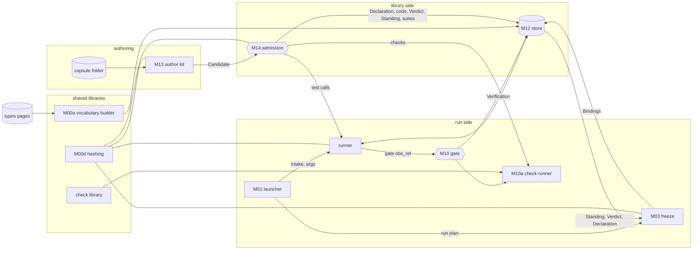
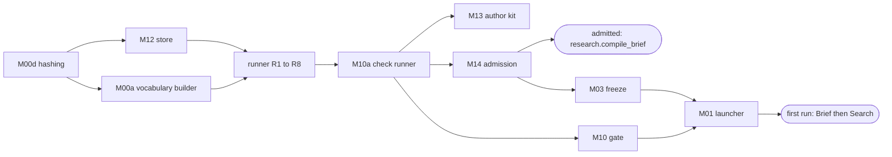

> **Draft recheck.** Durable batch publication, intake v2, committed Gate results and explicit restart reopen the connected toolchain. [Modules](../system/modules.md) owns code/process placement; [storage](../system/storage.md), [lifecycle](../system/lifecycle.md) and [environment](../system/environment.md) own the new shared guarantees. Generated POC execution uses the separate [process boundary](process-boundary.md).

# The CC toolchain

CC is a schema; tools do the work ([capsule](capsule.md)). None of the M1 tools exist yet, except one reference capsule. This page fixes what each tool takes, gives and writes, so each can be built as its own issue against fixtures, by different people, and still fit.

## How the tools connect



Two paths share one store:

- **The library side** (cold): an author writes a capsule folder; the author kit packs it into a Candidate; admission tests it through the runner and writes its records.
- **The run side** (hot): the launcher starts a run; freeze pins one admitted capsule per step; the runner runs each; the gate checks each output.

## The capsule folder

What an author writes. One folder per capsule, named by its `identity.name`.

```text
capsules/op.local_search/
  capsule.json          the Declaration; the author writes everything except file hashes
  local_search.py       the code or skill files that carrier or body names. A tool of one file uses carrier;
                        a tool of several files uses body and names its entry in ext.cc.entry (file.py:function)
  checks/               the files that guarantees.checks[].runner names
  tests/cases.json      the test cases: a list in the shape of Candidate tests[]
  make_capsule.md       generated by the author kit; never edited, never hashed
  anything else         the author's own files (notes, unit tests); never submitted
```

| File | Defined by |
|---|---|
| `capsule.json` | [Declaration](fields.md) |
| `tests/cases.json` | [Candidate](../schemas/candidate.md) `tests[]`: `{check_id, inputs, expected, fixtures}` |
| `make_capsule.md` | [make_capsule.md](make-capsule.md) |

**What gets submitted** is exactly the files the Declaration pins by hash: the `carrier` or `body` files, and every `guarantees.checks[].runner` file. Nothing else in the folder reaches admission, so an author's notes and unit tests never change a capsule's identity.

## Where code lives

The [current module map](../system/modules.md) fixes proposed locations and process boundaries for coding handoff. Coding TASKS allocates builders; it does not create a second interface definition.

| What | Where |
|---|---|
| the CC tools, one Python package | `cc/`: `cc.hashing`, `cc.store`, `cc.vocab`, `cc.kit`, `cc.admission`, `cc.checks`, `cc.gate`, `cc.freeze`, `cc.runner`, `cc.launcher`, `cc.events` |
| **the only code that imports agent-core or jiuwenswarm** | `cc.adapters.{swarmflow, codex, kv, runview, entry, deepsearch, symphony, tracing}`, each with the API on [integration](../system/integration.md#the-adapters) |
| the capsule-side library | `cc_sdk`, a small module of its own, so capsule code never imports the toolchain ([runner](runner.md#tool-a-python-function-in-its-own-process)) |
| registry check code (type checks, the gate's fixed checks) | `cc/checks/registry/`, one file per type, written by someone other than the producing capsule's author (INV-10) |
| capsule sources | `capsules/<identity.name>/` |
| payload type definitions | `docs/architecture/types/`, the source the vocabulary builder reads |

## M00d Hashing

Every tool that computes or checks a hash uses this one library, so they always agree. Two implementations of `decl_hash` would make admission and the runner disagree about which capsule is which.

```python
def canonical_json(value) -> bytes                 # RFC 8785
def sha256_hex(data: bytes) -> str
def record_sha256(record: dict) -> str              # what a Ref's sha256 is (INV-15)
def fill_defaults(decl: dict) -> dict               # v1.0 defaults written out (INV-16)
def decl_hash(decl: dict) -> str
def interface_hash(decl: dict) -> str
def code_sha256(decl: dict) -> str
```

The three capsule hashes follow [fields](fields.md#computed-by-admission-never-written-by-the-author) exactly. **Tests:** fixed inputs with known hashes; an explicit and an implicit default hash the same.

## M00a Vocabulary builder

Builds the port type vocabulary document from the type pages, so nobody writes a payload type's JSON Schema by hand ([payload types](../types/types.md#the-rules)).

```python
def build_vocabulary(types_dir: Path, policy: dict, previous: dict | None) -> dict
```

- **In:** every `types/*.md` page except the index; the policy (for `reg(...)` values); the previous vocabulary, if any.
- **Out:** a `cc.types.v1` document ([port types](../schemas/port-types.md)): the base types, one entry per page with its `version` and generated `value_schema`, and every registry check in full.
- **Stores** the vocabulary with `put_hashed("vocabulary", doc)`, and each registry check's code file with `put_content`. It is the vocabulary's one writer (INV-3).
- **Rules:** a page's field table compiles by the [generation rules](../types/types.md#the-rules). `vocabulary_version` is the previous one plus 1 whenever anything changed. A type's `version` must go up when the compiled schema accepts less than before; the builder refuses otherwise.
- **Tests:** each M1 type's example validates and a copy with a required field removed fails; a field added without a version change is caught when it is required.

This replaces M1 architecture's M00b (hand-written payload schema files).

## M00c Policy publisher

```text
cc policy publish <epoch.json>     validate a policy epoch document and store it
```

- **In:** one policy epoch, written as a JSON document in `cc/policy/<epoch>.json` and reviewed like code ([policy](../schemas/policy.md)).
- **Does:** validates it against the policy schema, refuses an epoch whose name is already stored with different bytes, and stores it with `put_hashed("policy", doc)`. It is the policy's one writer (INV-3), as the vocabulary builder is the vocabulary's.

**Which policy and vocabulary are current.** jiuwenswarm's `config.yaml` names them: `cc.policy_epoch` (an epoch name) and `cc.vocabulary_sha256` (a vocabulary hash). The launcher and admission resolve those names in the store, and pin the result in every Binding and Verdict. Changing either is a config change, reviewed like code. No record in the store points at "current", because records are written once (INV-2).

## M12 Store

```python
class Store:
    async def put_record(kind: str, record: dict) -> Ref          # key cc/<kind>/<scope>/<id>; write once
    async def commit_batch(batch_id: str, records: list[dict]) -> list[Ref]
    async def put_declaration(decl: dict) -> str                  # RFC 8785 bytes with v1.0 defaults; returns decl_hash
    async def put_hashed(kind: str, doc: dict) -> str             # vocabulary, policy: keyed by their INV-15 hash
    async def get_record(kind: str, scope: str, id: str) -> dict  # id is the record id, or the hash for declaration, vocabulary, policy
    async def list_records(kind: str, scope: str) -> list[dict]
    async def put_content(data: bytes) -> str                     # returns the sha256; idempotent
    async def get_content(sha256: str) -> bytes
```

- `kind` is one of `candidate`, `verdict`, `standing`, `binding`, `observation`, `artifact`, `verification`, `finding`, `test_case`, `test_suite`, `declaration`, `vocabulary`, `policy`. Keys are on the [runner](runner.md#ids-keys-and-clocks) page.
- `scope` is the `run_id`, the `candidate_id` or `library`. A Declaration has no envelope (INV-1's exception), so it has its own call; vocabulary and policy documents are keyed by hash.
- A second write of different bytes to a key raises; the same bytes are a no-op (INV-2). The store checks the envelope and the writer's `producer.component` against the [records table](../schemas/schemas.md#the-records) (INV-3).
- The authoritative backing is the immutable file publication in [storage](../system/storage.md#store-contract). A native KV index may be a read cache, but exclusive_set alone does not meet durability or multi-record commit. No other CC module reads its backing files/index directly. The supervisor hosts the sole M12 writer; authorized record-producing modules call its public API.

## M13 Author kit

```text
cc kit check <folder>       validate, hash, run the admission checks locally; print a report
cc kit candidate <folder>   write the Candidate JSON for that folder
cc kit new <name> --kind tool|skill|prompt_section [--gate] [--store <dir>]   write a new capsule folder from its template
```

- Validates `capsule.json` against the Declaration and the policy's `required` section, with the same code admission uses.
- Fills every file `sha256` in `capsule.json`, computes the three capsule hashes with M00d, and regenerates `make_capsule.md`.
- Runs each test case through the runner as an `admission` call against a local throwaway store, and the checks through M10a. The report is advice: only admission's Verdict counts.
- `cc kit new` writes a folder from a template per kind:
  - `tool`: `capsule.json` with a `carrier`, the stub function, `checks/`, `tests/cases.json`;
  - `skill`: `SKILL.md` with front matter instead of the stub function;
  - `prompt_section`: one text file, no inputs, one `text` output.
  - `--gate` scaffolds the shared research.verifier pattern, its fixed checks and hashed judging files. Stage rubric profiles are policy artifacts, not separate admitted prompt capsules.

  `--gate` implies `--kind skill` and scaffolds the shared verifier's hashed local instructions. Unfilled fields remain `"<fill>"`, which admission refuses (`SCHEMA_NONCONFORMANT`).

## M14 Admission

```python
async def admit(candidate: dict, *, policy_ref: dict, vocabulary_ref: dict) -> Ref   # the Verdict
```

In the order the [library](library.md#admission-the-only-way-in) gives:

1. Check the Declaration's shape against [fields](fields.md) and the policy's `required` section (`SCHEMA_NONCONFORMANT`).
2. Re-hash every submitted file; refuse a mismatch (`HASH_MISMATCH`). The submitted files must be exactly the files the Declaration pins: its `carrier` or `body` files and every check's `runner` file ([open issues](../open-issues.md) 2).
3. Apply the policy's `rules` in the order the [policy](../schemas/policy.md) lists them, stopping at the first refusal, with that rule's reason code. Among them, every capsule in `needs.external` must already be admitted (`OPERATOR_NOT_ADMITTED`). An operator is admitted before any capsule that pins it; shared verifier instructions are hashed local files.
4. Store each file at `cc/content/<sha256>`, and the Declaration with `put_declaration`.
5. Store each test's inputs and fixtures as Artifacts with `scope.library` (test cases are library records), then each test case (with its `model_replies`) and one visible suite.
6. Run each test case through the runner's `call_admission`, with M05 replaying the case's `model_replies`. Then run its checks through M10a, with `expected` set: tier 1 always, and tier 2 through the policy's `levels.admission_judge` when the capsule has judged checks. Any `fail` refuses (`CHECK_FAILED`); any `unknown` defers (`CHECK_UNKNOWN`).
7. Write the Verdict, and a Standing entry when admitted: `admitted`, or `admitted_inactive` for an RSI child of a `propose` parent.

**What admission stores** is every Declaration-pinned carrier/body/check/rubric/local-value-schema file. Candidate.files supplies exact coverage; admission rehashes bytes and rejects missing or conflicting paths. Issue 2 is designed, not an outstanding inability to store referee files.

## M03 Freeze: the Binding writer

Freeze consumes only the normalized [`run_plan`](../types/run-plan.md) identified by a committed VALID result from [planner validation](../system/planner.md#proposal-envelope-and-reference-semantics), then creates one Binding per step before dispatch. Production bootstraps from committed intake and its exact fixed-template envelope with no model turn or invented Brief; isolated planning validates the complete Brief-based proposal. Resolve exact snapshot/policy/config pins again and refuse changed/revoked dependencies. ExecutionProfile direct-call limits cover every reachable work/verifier/dependency hash before publication.

```python
async def freeze(run_id: str, validation_ref: dict, *, policy_ref: dict, vocabulary_ref: dict) -> dict[str, Ref]   # step_id -> Binding
```

Resolve validation_ref to the committed services-v1 plan_validation control Artifact, require VALID with zero findings, and resolve its validated_plan_ref to the normalized run_plan. Cross-check proposal, task, snapshot, config, policy and run identity against launcher-committed intake/config/library/provenance for production, or planning_reserved for the isolated experiment. Production does not fabricate a planning reservation. A naked plan dictionary, model assertion or wrong-run validation never authorizes freeze. The resolved `plan` is a run_plan value. For each step, freeze:

1. resolves `capsule_name` and `gate_capsule_name` only through the immutable library snapshot whose hash is run_plan.library_snapshot_sha256, obtaining its exact decl_hash and Verdict. The launcher snapshots active aliases before validation. A planner's validated snapshot and freeze must match; freeze never substitutes a newly activated alias. Missing entries/pin mismatches refuse. Current revocation/security state may deny a snapshot version but cannot choose replacement code;
2. re-hashes both pinned capsules' code and transitive needs.external closure from that snapshot/store (CARRIER_CHANGED), and refuses every dependency not admitted at snapshot creation or subsequently revoked (OPERATOR_NOT_ADMITTED); cycles, missing pins and snapshot mutation refuse freeze;
3. checks every wire: the source's type (from `launcher_inputs`, or the earlier step's output port) equals the input port's type, and neither is `json` (`PORT_TYPE_MISMATCH`, rule `wired_ports_named`);
4. assembles `checks` from the work capsule's `node` and `both` checks, its output types' checks, and the step's `step_checks` (copied into the Binding's `step_checks`);
5. pins the gate capsule in `verifier`, with its budget: the gate capsule's `timeout_s`, never over policy `budgets`' 120 s per judge call. This is the one list of what freeze checks about a gate (the [pattern](gate-capsules.md) links here):
   - the step's `checks` hold at least one judged check (`GATE_MISSING`);
   - the gate capsule has kind `skill`; exactly one input, `evidence_bundle` of type `evidence_bundle`; exactly one output, `verifier_assessment` of type `verifier_assessment`; `effect_class` `pure` or `read_only`; no unapproved external call; shared judging instructions are hashed local files; and check ids exactly `answers_every_criterion`, `quotes_from_bundle` and `assessment_matches_expected` (`GATE_MISSING`);
   - `evolution.rsi: none` (`REFEREE_RSI_PERMITTED`);
   - it is not the work capsule (`JUDGE_IS_SELF`);
   - judged step check runners equal admitted gate body rubric refs/hashes (GATE_RUBRIC_MISMATCH); deterministic/reference checks resolve independent registry or gate-check code pins. Verify hashes and author independence. All pins enter Binding.step_checks; changes require a new plan;
6. writes the Binding, with this run's `policy_ref` and `vocabulary_ref`. Every Binding of a run pins the same two.

Freeze publishes all Bindings through one commit_batch, then emits cc.run.frozen ([events](../system/observability.md#the-events)). An incomplete batch is never visible. It returns `{step_id: Binding ref}`; the launcher turns that into args.pins. No engine dispatch begins before the complete committed mapping exists.

## M03h Halt host

```python
async def halt(run_id: str, err: CcHalt) -> None
```

The engine re-raises a script exception (agent-core agent_teams/workflow/engine/runner.py:268-273). CcHalt reaches the launcher; the halt host reads the exact attempt's committed evidence, reports the verdict/reason and invokes the native human_session adapter. [Lifecycle](../system/lifecycle.md#human-review-and-recovery) owns attributable review, abort and explicit resume; [workstation](../system/workstation.md) owns CLI exit codes and Web/TUI presentation. Missing decision storage is reported as infrastructure failure, never substituted with an older advancing record. Issue 47 keeps the native adapter source-verification requirement open.

## M10a Check runner and the check library

M10a runs **deterministic and reference checks only**. Judged checks are the gate host's: it calls the step's gate capsule itself ([gate host](gate-host.md)).

```python
async def run_checks(checks: list[dict], obs: dict, *, vocabulary_ref: dict, policy_ref: dict,
                     inputs: dict | None = None, expected: Any | None = None) -> list[dict]
```

- **`checks`** are full Checks, or Binding entries `{check_id, source}` that M10a resolves:
  - `source: capsule` from the Declaration named by `obs.decl_hash`;
  - `source: type` from the pinned vocabulary;
  - `source: step` from the Binding's `step_checks`.

  A caller with checks from elsewhere (admission with a Candidate's Declaration, the gate host with a gate capsule's own checks) passes full Checks. A judged check passed here is a caller bug (raise).
- **`inputs`** overrides the call's input values when the checked output came with other inputs: the gate host passes the `evidence_bundle` when it checks a gate capsule's answer.
- **Returns** one result per check, in the shape of Verification `results[]`, in the order given.
- **Each check runs** through the [calling convention](../schemas/checks.md#calling-convention), its code materialised by hash like a capsule's.
- **How a check runs:** in the runner's tool host in check mode ([runner](runner.md#tool-a-python-function-in-its-own-process)), with `root` the materialised folder holding the check's runner file. The timeout is policy `runner.check_timeout_s`. A crash, timeout or malformed result gives `unknown` (INV-8).
- **The check library** holds the registry checks' code: `check.value_matches_type.v1`, `check.call_ok.v1`, `check.within_budget.v1`, and each type's checks, under `cc/checks/registry/`. The vocabulary builder (M00a) stores each file in the content store and names it by `sha256` in the vocabulary's `checks`, so registry checks are materialised by hash like any other.

## M10 Gate host

Defined on [its own page](gate-host.md): `gate(obs_ref) -> GateResult`, Tier 1, Tier 2 through the step's [gate capsule](gate-capsules.md), the fold, the Verification and the verdicts.

## M01 Launcher

```python
async def launch(prompt: str, channel: str, workspace: Path) -> str     # the run_id
```

`workspace` is the user's workspace folder; the input folder is `<workspace>/input/` (PRD 3.1.2). The run is bound to the local single-user profile, whose data dir is `get_user_workspace_dir()` (PRD 3.1.3; [integration](../system/integration.md#kv-the-record-stores-backing)). In this order:

1. **Qualify** (PRD 3.1.5). If the prompt is blank or the input folder is unreadable, reject with exit 2 before minting run_id. Load and validate a pinned config snapshot and run doctor. Unavailable environment/security returns exit 4; do not begin an unprotected run.
2. **Mint** the `run_id`. Resolve `P` and `V` from `config.yaml`'s `cc.policy_epoch` and `cc.vocabulary_sha256` ([M00c](#m00c-policy-publisher)). Resolve the immutable library snapshot and set PLAN.library_snapshot_sha256 to that exact hash. The fixed M1 plan template in `cc/launcher/plans/m1.json` must equal [the M1 pipeline](../m1/pipeline.md)'s wiring; load its concrete snapshot-bound shape, with final validation after intake is committed.
3. Prepare the fixed template and its provenance; no model planning or frozen Binding is needed yet.
4. Build intake v2: classify supplied/configured local resources, bind immutable project_asset/validation_data snapshots, and extract text only from reference_document. Documents are added in path order under the fixed limits; excluded references are recorded in skipped. Then record_input stores the canonical intake and its source_text prompt projection, with exact source/hash/offset basis owned by [source_text](../types/source-text.md). Ordinary extraction/hint helpers create these inputs; no compile_intent capsule runs. Resource readability and ids are checked; baseline/dataset suitability is a later blueprint gate obligation.
5. Commit config/library/source-manifest control Artifact pins and intake/source_text references. The trusted launcher publishes the complete planner_proposal envelope with task_ref=intake_ref, exact fixed PLAN, catalogue selections, policy-bounded budget, empty objective_bindings and proposal_source_ref to fixed-template provenance. Invoke deterministic validate with that proposal reference and exact task/library/policy pins. The trusted host publishes normalized run_plan first, then its VALID result; invalid or failed publication ends launch before freeze. PLAN and plan_ref for subsequent execution refer only to that normalized committed plan. No successor can start from an event alone.
6. `bindings = freeze(run_id, validation_ref, policy_ref=P, vocabulary_ref=V)`; freeze rereads validation authority and emits cc.run.frozen only after complete publication.
7. Commit run_started with all frozen Binding/config/library/source references, then emit `cc.run.started`. Invoke `cc.adapters.swarmflow.start_run(run_id, args={run_id, plan: PLAN, pins, inputs: {intake: intake_ref, source_text: source_text_ref}})`, where `pins` maps each step to its frozen Binding ref. This supplies every required launcher port in the production plan; optional intent_ir hints may be added only when explicitly prepared and bound.
8. When the script returns its envelopes, emit `cc.run.finished` with them. On `CcHalt`, call [`halt`](#m03h-halt-host).

## Build order, and what can be tested when



- After hashing, the store and the vocabulary builder, every type page is machine-checked.
- After the runner, the check runner and admission, `research.compile_brief` and the shared verifier can be admitted: the first governed work boundary.
- After freeze, the gate and the launcher, ordinary intake preparation supplies the first two-step run: Brief then Search. [Build order](../system/build-order.md) owns the complete sequence.
