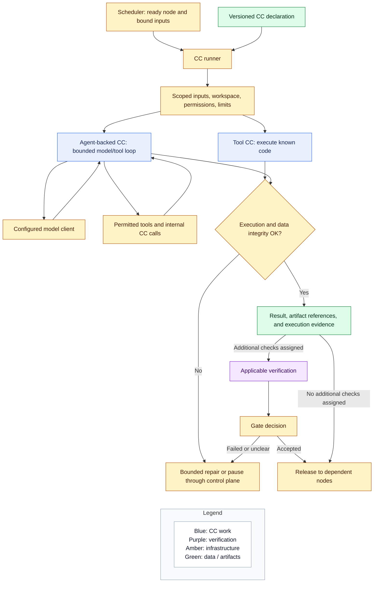

# Capsules, nodes, agents, and verification

## Intent

Make a capability reusable across workflows without confusing its definition with a particular invocation. Keep agent autonomy inside assigned boundaries and place verification where it protects useful decisions. Terms are introduced in the [overview vocabulary](README.md#vocabulary-and-naming).

## Definitions and invocations

A planner-defined task may span many nodes. Each node invokes one CC, which may call other CCs internally. Internal calls do not create outer nodes; the parent completes when its CC finishes. CCs may serve different nodes. Intake and final transfer may remain boundary operations; scheduled processing uses CCs.

## How a node runs internally

The checking path applies where verification is assigned. A node without a separate verifier still goes through ordinary execution, permission, and data-integrity handling; it does not need an invented verifier CC merely to fit this drawing.

A bounded agent loop may make multiple model and tool calls to finish its capability. It cannot grant itself permissions, rewrite the outer DAG, change accepted requirements, or decide that a required gate passed. Reuse the native harness rather than implementing another general agent framework. Multi-agent teams inside CCs are not required for the first pipeline.

Required runner responsibilities are small: resolve the CC, bind inputs, execute a tool or agent-backed implementation, capture outputs and failure, and report back to orchestration. Generated-program execution has a separate restricted boundary; the generic CC runner is not itself a sandbox. Exact process arrangements remain implementation decisions.

## Verification is specific to the work

Use different verifier capabilities for different questions. Mechanical checks inspect formats, code, and execution evidence. Semantic checks compare interpretation or output with the accepted request. Scientific evaluation interprets experimental evidence. A model opinion is not a substitute for a benchmark measurement.

Three places can supply checks:

- The CC declaration describes reusable guarantees and suitable checking hooks.
- A fixed stage configures its stable verification profile, especially intake qualification, intent, and requirements.
- The planner attaches suitable additional verification to the planned nodes and records it in the freeze.

Verification varies both by capability and by invocation. A reusable capability need not always have the same separate verifier. Runtime obligations come from its selected use, fixed-stage profiles, accepted requirements, and run policy. Development-only checks do not automatically become live gates. Ordinary plan checking enforces the applicable obligations; the planner cannot remove them. A check may be an ordinary deterministic function; it is a verifier CC when run as a capability.

The gate combines applicable results into the release decision. Verification can be attached to a node, expressed as a verification node, or cover a meaningful group of outputs. Specify the coverage and what waits for the result. Do not add a separate verifier after every CC, or create an endless verifier-of-verifier chain.

The producer cannot certify success by assertion. A verifier can share the runner and provider but receives a separate checking task and evidence. Protect its criteria. Scientific evaluation remains distinct from hypothesis generation and implementation.

## CC authoring gets more attention

The CC declaration is a shared authoring interface, distinct from a runtime requirements contract. Read [declaration](capsule/declaration.md) and [authoring](capsule/authoring.md). Keep its concepts stable; coding tasks define stage-local payloads and runtime records.

Declaring a capability is different from proving its implementation works. The architecture defines the promises and boundaries; Spec Kit supplies detailed checks, fixtures, acceptance conditions, and evidence for implementation. Runtime scientific protocols remain research inputs established before measurement.
