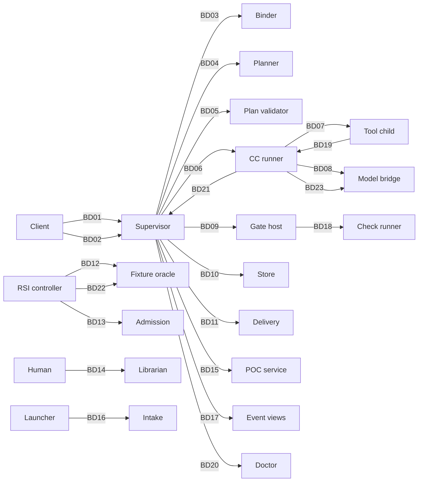

# Boundary sheets: where modules talk

Generated by `python _tools/boundary_sheets.py` from `contracts/boundaries.json`, the schemas and the [fixtures](../system/test-surfaces.md#term-fixture). Do not edit by hand. Rules for messages: [principles](principles.md). Module [blocks](../system/modules.md#term-block): [modules](../system/modules.md).

## Map



## Index

| ID | Boundary | Sender -> receiver | Request | Result |
|---|---|---|---|---|
| [BD01](#bd01) | Client starts a run | Client (CLI, web, benchmark) -> Supervisor | `execution-v1.schema.json#launch_request` | `execution-v1.schema.json#launch_result` |
| [BD02](#bd02) | Benchmark client [runs](../system/lifecycle.md#term-run) a task headless | Benchmark client -> Supervisor | `services-v1.schema.json#benchmark_request` | `services-v1.schema.json#run_handle` |
| [BD03](#bd03) | Supervisor [freezes](../system/lifecycle.md#term-freeze) a plan | Supervisor -> [Binder](../system/planner.md#term-binder) (freeze) | `execution-v1.schema.json#freeze_request` | `execution-v1.schema.json#freeze_result` |
| [BD04](#bd04) | Supervisor asks the planner for a DAG | Supervisor -> Planner | `services-v1.schema.json#planner_request` | `services-v1.schema.json#planner_proposal` |
| [BD05](#bd05) | Supervisor validates the proposal | Supervisor -> [Plan validator](../system/planner.md#term-plan-validator) | `services-v1.schema.json#validation_request` | `services-v1.schema.json#plan_validation` |
| [BD06](#bd06) | Supervisor dispatches a node to the runner | Supervisor -> [CC runner](../capsule/runner.md#term-runner) | `execution-v1.schema.json#runner_request` | `execution-v1.schema.json#runner_response` |
| [BD07](#bd07) | Runner talks to a tool child | CC runner -> Restricted tool child | `execution-v1.schema.json#tool_host_frame` | none (one-way) |
| [BD08](#bd08) | Runner or planner asks the model bridge for one [turn](../system/model-bridge.md#term-model-turn) | CC runner or planner -> [Model bridge](../system/model-bridge.md#term-model-bridge) | `services-v1.schema.json#model_bridge_request` | `services-v1.schema.json#model_bridge_result` |
| [BD09](#bd09) | Supervisor asks the [Gate host](../capsule/gate-host.md#term-gate-host) to check a call | Supervisor -> [Gate](../verification.md#term-gate) host | `execution-v1.schema.json#gate_request` | `execution-v1.schema.json#gate_result` |
| [BD10](#bd10) | Supervisor records a release or phase start | Supervisor -> Store | `execution-v1.schema.json#release_record` | none (one-way) |
| [BD11](#bd11) | Supervisor hands accepted results to delivery | Supervisor -> Delivery | `library-rsi-v1.schema.json#deliver_request` | `library-rsi-v1.schema.json#deliver_result` |
| [BD12](#bd12) | [RSI](../rsi.md#term-rsi) controller scores a candidate | RSI controller -> Fixture oracle | `library-rsi-v1.schema.json#oracle_evaluate_request` | `library-rsi-v1.schema.json#oracle_aggregate_result` |
| [BD13](#bd13) | RSI controller submits a candidate to admission | RSI controller -> Admission | `library-rsi-v1.schema.json#admission_request` | `library-rsi-v1.schema.json#admission_decision` |
| [BD14](#bd14) | Human activates an admitted version | Human via CLI -> Librarian | `library-rsi-v1.schema.json#activation_request` | `library-rsi-v1.schema.json#activation_record` |
| [BD15](#bd15) | Supervisor starts generated-code execution | Supervisor -> POC service | `library-rsi-v1.schema.json#poc_execute_request` | `library-rsi-v1.schema.json#poc_execute_result` |
| [BD16](#bd16) | Launcher takes in a request and its files | Launcher -> Intake | `library-rsi-v1.schema.json#intake_request` | `library-rsi-v1.schema.json#intake_result` |
| [BD17](#bd17) | Runner reports a progress event | Runner or supervisor -> [Event bus](../system/observability.md#term-event-bus) and views | `execution-v1.schema.json#event_envelope` | none (one-way) |
| [BD18](#bd18) | Gate host runs the deterministic [checks](../capsule/fields.md#term-check) | Gate host -> Check runner | `tools-v1.schema.json#run_checks_request` | `tools-v1.schema.json#run_checks_result` |
| [BD19](#bd19) | Capsule asks for a search through the broker | Tool child -> CC runner | `tools-v1.schema.json#broker_search_request` | `tools-v1.schema.json#broker_search_result` |
| [BD20](#bd20) | Startup runs the doctor | Supervisor -> Doctor | `tools-v1.schema.json#config_snapshot` | `tools-v1.schema.json#doctor_report` |
| [BD21](#bd21) | Runner commits through the supervisor | CC runner -> Supervisor | `execution-v1.schema.json#commit_request` | `execution-v1.schema.json#commit_result` |
| [BD22](#bd22) | RSI controller runs an oracle session | RSI controller -> Fixture oracle | `library-rsi-v1.schema.json#oracle_begin_request` | `library-rsi-v1.schema.json#oracle_session_result` |
| [BD23](#bd23) | Runner or planner polls a model bridge turn | CC runner or planner -> Model bridge | `services-v1.schema.json#model_bridge_request` | `services-v1.schema.json#model_bridge_result` |

## BD01

**Client starts a run**

| | |
|---|---|
| Sender | Client (CLI, web, benchmark) |
| Receiver | Supervisor |
| Transport | HTTP on loopback, bearer token |
| Request | `execution-v1.schema.json#launch_request` |
| Result | `execution-v1.schema.json#launch_result` |
| Story / demo | US-01 / D3 |

**On failure:** Sender: show the error and do not retry on its own; a lost response is recovered by sending the same [request_id](principles.md#term-request-id) and bytes again. Receiver: reject before any record is written if the request is invalid or the token is wrong. Exit codes: 2 launch or configuration rejected, 4 environment unavailable.

**A valid request**

```json
{
  "version": 1,
  "prompt": "Study sparse attention for long documents",
  "channel": "cli",
  "workspace": "/workspace/demo",
  "request_id": "req-1",
  "seed": 7,
  "headless": true
}
```

**A rejected request** (rejected because: root: 'prompt' is a required property)

```json
{
  "version": 1,
  "channel": "cli",
  "workspace": "/workspace/demo",
  "request_id": "req-1",
  "seed": 7,
  "headless": true
}
```

**A valid result**

```json
{
  "version": 1,
  "run_id": "run-1",
  "run_dir": "/workspace/records/runs/run-1",
  "state": "pending",
  "status_ref": null,
  "manifest_ref": null
}
```

**A rejected result** (rejected because: root: {'version': 1, '[run_id](../system/records.md#term-run-id)': 'run-1', 'state': 'pending', 'status_ref': None, 'manifest_ref': None} is not valid under any of the given schemas)

```json
{
  "version": 1,
  "run_id": "run-1",
  "state": "pending",
  "status_ref": null,
  "manifest_ref": null
}
```

## BD02

**Benchmark client runs a task headless**

| | |
|---|---|
| Sender | Benchmark client |
| Receiver | Supervisor |
| Transport | HTTP on loopback, bearer token |
| Request | `services-v1.schema.json#benchmark_request` |
| Result | `services-v1.schema.json#run_handle` |
| Story / demo | US-16 / D6 |

**On failure:** Same request id and bytes returns the same handle. Changed bytes returns REQUEST_CONFLICT. Exit codes 0 success, 2 rejected, 3 [halted](../system/lifecycle.md#term-halt), 4 environment unavailable.

**A valid request**

```json
{
  "version": 1,
  "task": {
    "prompt": "Find three ways to speed up beam search decoding for long contexts.",
    "channel": "cli",
    "resources": [
      {
        "resource_id": "doc-beam",
        "kind": "reference_document",
        "source": "supplied",
        "path": "papers/beam.pdf",
        "label": "Beam search survey"
      }
    ],
    "documents": [
      {
        "document_id": "doc-beam",
        "path": "papers/beam.pdf",
        "format": "pdf",
        "size_bytes": 482113,
        "text": "Beam search keeps the k best partial hypotheses."
      }
    ],
    "skipped": []
  },
  "config_ref": {
    "id": "config-effective-2026-10-05",
    "sha256": "560ab0d258b2f2e062cf9fe5bda7993c23e2142dcd2c4628bf65af3e918da963"
  },
  "seed": 42,
  "request_id": "req-benchmark-0042"
}
```

**A rejected request** (rejected because: seed: -1 is less than the minimum of 0)

```json
{
  "version": 1,
  "task": {
    "prompt": "Find three ways to speed up beam search decoding for long contexts.",
    "channel": "cli",
    "resources": [
      {
        "resource_id": "doc-beam",
        "kind": "reference_document",
        "source": "supplied",
        "path": "papers/beam.pdf",
        "label": "Beam search survey"
      }
    ],
    "documents": [
      {
        "document_id": "doc-beam",
        "path": "papers/beam.pdf",
        "format": "pdf",
        "size_bytes": 482113,
        "text": "Beam search keeps the k best partial hypotheses."
      }
    ],
    "skipped": []
  },
  "config_ref": {
    "id": "config-effective-2026-10-05",
    "sha256": "560ab0d258b2f2e062cf9fe5bda7993c23e2142dcd2c4628bf65af3e918da963"
  },
  "seed": -1,
  "request_id": "req-benchmark-0042"
}
```

**A valid result**

```json
{
  "version": 1,
  "run_id": "run-2026-10-05-001",
  "run_dir": "runs/run-2026-10-05-001",
  "state": "running",
  "status_ref": null,
  "manifest_ref": null
}
```

**A rejected result** (rejected because: state: 'done' is not one of ['pending', 'running', 'evaluating', 'halted', 'completed', 'aborted'])

```json
{
  "version": 1,
  "run_id": "run-2026-10-05-001",
  "run_dir": "runs/run-2026-10-05-001",
  "state": "done",
  "status_ref": null,
  "manifest_ref": null
}
```

## BD03

**Supervisor freezes a plan**

| | |
|---|---|
| Sender | Supervisor |
| Receiver | Binder (freeze) |
| Transport | in process |
| Request | `execution-v1.schema.json#freeze_request` |
| Result | `execution-v1.schema.json#freeze_result` |
| Story / demo | US-05 / D3 |

**On failure:** Any unresolved [capsule](../capsule/capsule.md#term-capability-capsule), type mismatch or missing Gate returns a failure and writes no [Binding](../schemas/binding.md#term-binding). The [batch](../system/storage.md#term-commit-batch) is all or nothing.

**A valid request**

```json
{
  "version": 1,
  "run_id": "run-1",
  "phase": "prep",
  "validation_ref": {
    "id": "validation-1",
    "sha256": "9999999999999999999999999999999999999999999999999999999999999999"
  },
  "policy_ref": {
    "id": "epoch-1",
    "sha256": "aaaaaaaaaaaaaaaaaaaaaaaaaaaaaaaaaaaaaaaaaaaaaaaaaaaaaaaaaaaaaaaa"
  },
  "vocabulary_ref": {
    "id": "vocabulary-v3",
    "sha256": "7777777777777777777777777777777777777777777777777777777777777777"
  },
  "request_id": "req-freeze-1"
}
```

**A rejected request** (rejected because: root: 'phase' is a required property)

```json
{
  "version": 1,
  "run_id": "run-1",
  "validation_ref": {
    "id": "validation-1",
    "sha256": "9999999999999999999999999999999999999999999999999999999999999999"
  },
  "policy_ref": {
    "id": "epoch-1",
    "sha256": "aaaaaaaaaaaaaaaaaaaaaaaaaaaaaaaaaaaaaaaaaaaaaaaaaaaaaaaaaaaaaaaa"
  },
  "vocabulary_ref": {
    "id": "vocabulary-v3",
    "sha256": "7777777777777777777777777777777777777777777777777777777777777777"
  },
  "request_id": "req-freeze-1"
}
```

**A valid result**

```json
{
  "version": 1,
  "run_id": "run-1",
  "phase": "prep",
  "plan_ref": {
    "id": "plan-prep",
    "sha256": "cccccccccccccccccccccccccccccccccccccccccccccccccccccccccccccccc"
  },
  "bindings": {
    "intent": {
      "id": "binding-intent",
      "sha256": "bbbbbbbbbbbbbbbbbbbbbbbbbbbbbbbbbbbbbbbbbbbbbbbbbbbbbbbbbbbbbbbb"
    }
  },
  "batch_ref": {
    "id": "batch-prep-1",
    "sha256": "dddddddddddddddddddddddddddddddddddddddddddddddddddddddddddddddd"
  },
  "request_id": "req-freeze-1"
}
```

**A rejected result** (rejected because: root: 'batch_ref' is a required property)

```json
{
  "version": 1,
  "run_id": "run-1",
  "phase": "prep",
  "plan_ref": {
    "id": "plan-prep",
    "sha256": "cccccccccccccccccccccccccccccccccccccccccccccccccccccccccccccccc"
  },
  "bindings": {
    "intent": {
      "id": "binding-intent",
      "sha256": "bbbbbbbbbbbbbbbbbbbbbbbbbbbbbbbbbbbbbbbbbbbbbbbbbbbbbbbbbbbbbbbb"
    }
  },
  "request_id": "req-freeze-1"
}
```

## BD04

**Supervisor asks the planner for a DAG**

| | |
|---|---|
| Sender | Supervisor |
| Receiver | Planner |
| Transport | in process |
| Request | `services-v1.schema.json#planner_request` |
| Result | `services-v1.schema.json#planner_proposal` |
| Story / demo | US-05 / D4 |

**On failure:** A planner failure or timeout halts the run before any task node starts. The proposal is not authority.

**A valid request**

```json
{
  "version": 1,
  "run_id": "run-2026-10-05-001",
  "accepted_requirements_ref": {
    "id": "requirements-run-2026-10-05-001",
    "sha256": "11b453af60e60394089102b5ad00b98fb2ea177b904b2ec70240bc3130dfeb7b"
  },
  "accepted_intent_ref": {
    "id": "intent-run-2026-10-05-001",
    "sha256": "6e2dc483a08f23e9a4fb8045b2f7ff7d58fd6157ec770145eb0a271949b098a7"
  },
  "library_snapshot_ref": {
    "id": "library-snapshot-2026-10-05",
    "sha256": "07394575199dfe208dd9b2f79adbbe7ac97464da5f29471d290444c717fa5f88"
  },
  "config_ref": {
    "id": "config-effective-2026-10-05",
    "sha256": "560ab0d258b2f2e062cf9fe5bda7993c23e2142dcd2c4628bf65af3e918da963"
  },
  "experiment_config_ref": null,
  "request_id": "req-plan-run-2026-10-05-001",
  "task_ref": {
    "id": "requirements-run-2026-10-05-001",
    "sha256": "11b453af60e60394089102b5ad00b98fb2ea177b904b2ec70240bc3130dfeb7b"
  },
  ...
```

**A rejected request** (rejected because: root: 'planning_reservation_ref' is a required property)

```json
{
  "version": 1,
  "run_id": "run-2026-10-05-001",
  "accepted_requirements_ref": {
    "id": "requirements-run-2026-10-05-001",
    "sha256": "11b453af60e60394089102b5ad00b98fb2ea177b904b2ec70240bc3130dfeb7b"
  },
  "accepted_intent_ref": {
    "id": "intent-run-2026-10-05-001",
    "sha256": "6e2dc483a08f23e9a4fb8045b2f7ff7d58fd6157ec770145eb0a271949b098a7"
  },
  "library_snapshot_ref": {
    "id": "library-snapshot-2026-10-05",
    "sha256": "07394575199dfe208dd9b2f79adbbe7ac97464da5f29471d290444c717fa5f88"
  },
  "config_ref": {
    "id": "config-effective-2026-10-05",
    "sha256": "560ab0d258b2f2e062cf9fe5bda7993c23e2142dcd2c4628bf65af3e918da963"
  },
  "experiment_config_ref": null,
  "request_id": "req-plan-run-2026-10-05-001",
  "task_ref": {
    "id": "requirements-run-2026-10-05-001",
    "sha256": "11b453af60e60394089102b5ad00b98fb2ea177b904b2ec70240bc3130dfeb7b"
  }
}
```

**A valid result**

```json
{
  "version": 1,
  "request_id": "req-plan-run-2026-10-05-001",
  "task_ref": {
    "id": "requirements-run-2026-10-05-001",
    "sha256": "11b453af60e60394089102b5ad00b98fb2ea177b904b2ec70240bc3130dfeb7b"
  },
  "library_snapshot_ref": {
    "id": "library-snapshot-2026-10-05",
    "sha256": "07394575199dfe208dd9b2f79adbbe7ac97464da5f29471d290444c717fa5f88"
  },
  "experiment_config_ref": null,
  "plan": {
    "phase": "planned",
    "track": "production",
    "library_snapshot_sha256": "07394575199dfe208dd9b2f79adbbe7ac97464da5f29471d290444c717fa5f88",
    "launcher_inputs": {
      "intake": "intake",
      "source_text": "source_text"
    },
    "prep_inputs": {
      "requirement.research_brief": "research_brief"
    },
    "steps": [
      {
        "step_id": "search",
        "capsule_name": "research.search_ideas",
        "gate_capsule_name": "research.verifier",
  ...
```

**A rejected result** (rejected because: experiment_config_ref: None is not of type 'object')

```json
{
  "version": 1,
  "request_id": "req-plan-run-2026-10-05-001",
  "task_ref": {
    "id": "requirements-run-2026-10-05-001",
    "sha256": "11b453af60e60394089102b5ad00b98fb2ea177b904b2ec70240bc3130dfeb7b"
  },
  "library_snapshot_ref": {
    "id": "library-snapshot-2026-10-05",
    "sha256": "07394575199dfe208dd9b2f79adbbe7ac97464da5f29471d290444c717fa5f88"
  },
  "experiment_config_ref": null,
  "plan": {
    "phase": "planned",
    "track": "isolated_experiment",
    "library_snapshot_sha256": "07394575199dfe208dd9b2f79adbbe7ac97464da5f29471d290444c717fa5f88",
    "launcher_inputs": {
      "intake": "intake",
      "source_text": "source_text"
    },
    "prep_inputs": {
      "requirement.research_brief": "research_brief"
    },
    "steps": [
      {
        "step_id": "search",
        "capsule_name": "research.search_ideas",
        "gate_capsule_name": "research.verifier",
  ...
```

## BD05

**Supervisor validates the proposal**

| | |
|---|---|
| Sender | Supervisor |
| Receiver | Plan validator |
| Transport | in process |
| Request | `services-v1.schema.json#validation_request` |
| Result | `services-v1.schema.json#plan_validation` |
| Story / demo | US-05 / D4 |

**On failure:** INVALID returns findings and the run dispatches nothing from the plan.

**A valid request**

```json
{
  "version": 1,
  "plan_ref": {
    "id": "plan-proposal-run-2026-10-05-001",
    "sha256": "48c050362ac0422d187604cb6d472c86f15ac9a37404ac5f058ba7e39807d6f1"
  },
  "task_ref": {
    "id": "requirements-run-2026-10-05-001",
    "sha256": "11b453af60e60394089102b5ad00b98fb2ea177b904b2ec70240bc3130dfeb7b"
  },
  "library_snapshot_ref": {
    "id": "library-snapshot-2026-10-05",
    "sha256": "07394575199dfe208dd9b2f79adbbe7ac97464da5f29471d290444c717fa5f88"
  },
  "policy_ref": {
    "id": "policy-2026-10",
    "sha256": "963facf702d551791e66e3ba18abe7ed6dd2c6902474d1d526587c3af9223975"
  },
  "request_id": "req-validate-run-2026-10-05-001"
}
```

**A rejected request** (rejected because: root: 'policy_ref' is a required property)

```json
{
  "version": 1,
  "plan_ref": {
    "id": "plan-proposal-run-2026-10-05-001",
    "sha256": "48c050362ac0422d187604cb6d472c86f15ac9a37404ac5f058ba7e39807d6f1"
  },
  "task_ref": {
    "id": "requirements-run-2026-10-05-001",
    "sha256": "11b453af60e60394089102b5ad00b98fb2ea177b904b2ec70240bc3130dfeb7b"
  },
  "library_snapshot_ref": {
    "id": "library-snapshot-2026-10-05",
    "sha256": "07394575199dfe208dd9b2f79adbbe7ac97464da5f29471d290444c717fa5f88"
  },
  "request_id": "req-validate-run-2026-10-05-001"
}
```

**A valid result**

```json
{
  "version": 1,
  "request_id": "req-validate-run-2026-10-05-001",
  "plan_ref": {
    "id": "plan-proposal-run-2026-10-05-001",
    "sha256": "48c050362ac0422d187604cb6d472c86f15ac9a37404ac5f058ba7e39807d6f1"
  },
  "task_ref": {
    "id": "requirements-run-2026-10-05-001",
    "sha256": "11b453af60e60394089102b5ad00b98fb2ea177b904b2ec70240bc3130dfeb7b"
  },
  "library_snapshot_ref": {
    "id": "library-snapshot-2026-10-05",
    "sha256": "07394575199dfe208dd9b2f79adbbe7ac97464da5f29471d290444c717fa5f88"
  },
  "policy_ref": {
    "id": "policy-2026-10",
    "sha256": "963facf702d551791e66e3ba18abe7ed6dd2c6902474d1d526587c3af9223975"
  },
  "status": "VALID",
  "findings": [],
  "validated_plan_ref": {
    "id": "run-plan-validated-run-2026-10-05-001",
    "sha256": "19309a3fed4b39019bf06c3f419ece172d190ffe9b0e5e2cd0ea05b3b0a9e74b"
  }
}
```

**A rejected result** (rejected because: root: 'validated_plan_ref' is a required property)

```json
{
  "version": 1,
  "request_id": "req-validate-run-2026-10-05-001",
  "plan_ref": {
    "id": "plan-proposal-run-2026-10-05-001",
    "sha256": "48c050362ac0422d187604cb6d472c86f15ac9a37404ac5f058ba7e39807d6f1"
  },
  "task_ref": {
    "id": "requirements-run-2026-10-05-001",
    "sha256": "11b453af60e60394089102b5ad00b98fb2ea177b904b2ec70240bc3130dfeb7b"
  },
  "library_snapshot_ref": {
    "id": "library-snapshot-2026-10-05",
    "sha256": "07394575199dfe208dd9b2f79adbbe7ac97464da5f29471d290444c717fa5f88"
  },
  "policy_ref": {
    "id": "policy-2026-10",
    "sha256": "963facf702d551791e66e3ba18abe7ed6dd2c6902474d1d526587c3af9223975"
  },
  "status": "VALID",
  "findings": []
}
```

## BD06

**Supervisor dispatches a node to the runner**

| | |
|---|---|
| Sender | Supervisor |
| Receiver | CC runner |
| Transport | authenticated local socket, length-prefixed frames (4-byte big-endian length, then UTF-8 JSON; max cc.ipc.max_frame_bytes, 1 MiB by default; large values by ref) |
| Request | `execution-v1.schema.json#runner_request` |
| Result | `execution-v1.schema.json#runner_response` |
| Story / demo | US-08 / D1 |

**On failure:** A complete response needs a committed [Observation](../schemas/observation.md#term-observation). A missing response is never a reason to run again. Duplicates attach to the first call.

**A valid request**

```json
{
  "request_id": "rr-1",
  "protocol_version": 1,
  "operation": "call",
  "dispatch_id": "7777777777777777777777777777777777777777777777777777777777777777",
  "obs_id": "obs-1",
  "attempt": 1,
  "reservation_ref": {
    "id": "dispatch-x",
    "sha256": "7777777777777777777777777777777777777777777777777777777777777777"
  },
  "call_descriptor": {
    "cc": 1,
    "decl_hash": "5555555555555555555555555555555555555555555555555555555555555555",
    "inputs": {
      "intake": {
        "id": "art-intake",
        "sha256": "eeeeeeeeeeeeeeeeeeeeeeeeeeeeeeeeeeeeeeeeeeeeeeeeeeeeeeeeeeeeeeee"
      },
      "source_text": {
        "id": "art-source",
        "sha256": "ffffffffffffffffffffffffffffffffffffffffffffffffffffffffffffffff"
      }
    },
    "step_id": "requirement"
  }
}
```

**A rejected request** (rejected because: root: 'call_descriptor' is a required property)

```json
{
  "request_id": "rr-1",
  "protocol_version": 1,
  "operation": "call",
  "dispatch_id": "7777777777777777777777777777777777777777777777777777777777777777",
  "obs_id": "obs-1",
  "attempt": 1,
  "reservation_ref": {
    "id": "dispatch-x",
    "sha256": "7777777777777777777777777777777777777777777777777777777777777777"
  }
}
```

**A valid result**

```json
{
  "request_id": "rr-1",
  "protocol_version": 1,
  "state": "complete",
  "observation_ref": {
    "id": "obs-1",
    "sha256": "1111111111111111111111111111111111111111111111111111111111111111"
  }
}
```

**A rejected result** (rejected because: root: 'observation_ref' is a required property)

```json
{
  "request_id": "rr-1",
  "protocol_version": 1,
  "state": "complete"
}
```

## BD07

**Runner talks to a tool child**

| | |
|---|---|
| Sender | CC runner |
| Receiver | Restricted tool child |
| Transport | inherited socket pair, length-prefixed frames (4-byte big-endian length, then UTF-8 JSON; max cc.ipc.max_frame_bytes, 1 MiB by default; large values by ref) |
| Request | `execution-v1.schema.json#tool_host_frame` |
| Result | none (one-way) |
| Story / demo | US-11 / D1 |

**On failure:** An unknown frame [kind](../capsule/capsule.md#term-capsule-kind), an oversize frame or a missing heartbeat kills the child tree and ends the call with a typed error.

**A valid request**

```json
{
  "t": "ready"
}
```

**A rejected request** (rejected because: root: {'t': 'ping'} is not valid under any of the given schemas)

```json
{
  "t": "ping"
}
```

**No result message (one-way).** The sender gets no reply message; success and failure show in the receiver behavior described above.

## BD08

**Runner or planner asks the model bridge for one turn**

| | |
|---|---|
| Sender | CC runner or planner |
| Receiver | Model bridge |
| Transport | authenticated local socket, length-prefixed frames (4-byte big-endian length, then UTF-8 JSON; max cc.ipc.max_frame_bytes, 1 MiB by default; large values by ref) |
| Request | `services-v1.schema.json#model_bridge_request` |
| Result | `services-v1.schema.json#model_bridge_result` |
| Story / demo | US-12 / D0 |

**On failure:** Timeout, auth loss or provider error returns a typed state. The bridge never resubmits a paid turn on its own.

**A valid request**

```json
{
  "version": 1,
  "request_id": "req-bridge-0001",
  "scope": {
    "kind": "planning",
    "run_id": "run-2026-10-05-001",
    "planning_request_id": "req-plan-run-2026-10-05-001"
  },
  "obs_id": "obs-plan-0001",
  "operation": "turn",
  "target_request_id": null,
  "session_id": "bridge-session-0001",
  "model_id": "gpt-5-codex",
  "deadline_at": "2026-10-05T09:40:00Z",
  "prompt_content_ref": {
    "namespace": "public_artifact",
    "ref": {
      "id": "capture-prompt-0001",
      "sha256": "d965abe12ff945d4b1d306867b7944d05cffe2f08b3091a27f7db777c7552d5f"
    }
  },
  "turn": 1
}
```

**A rejected request** (rejected because: target_request_id: None was expected)

```json
{
  "version": 1,
  "request_id": "req-bridge-0001",
  "scope": {
    "kind": "planning",
    "run_id": "run-2026-10-05-001",
    "planning_request_id": "req-plan-run-2026-10-05-001"
  },
  "obs_id": "obs-plan-0001",
  "operation": "turn",
  "target_request_id": "req-bridge-0001",
  "session_id": "bridge-session-0001",
  "model_id": "gpt-5-codex",
  "deadline_at": "2026-10-05T09:40:00Z",
  "prompt_content_ref": {
    "namespace": "public_artifact",
    "ref": {
      "id": "capture-prompt-0001",
      "sha256": "d965abe12ff945d4b1d306867b7944d05cffe2f08b3091a27f7db777c7552d5f"
    }
  },
  "turn": 1
}
```

**A valid result**

```json
{
  "version": 1,
  "request_id": "req-bridge-0001",
  "scope": {
    "kind": "planning",
    "run_id": "run-2026-10-05-001",
    "planning_request_id": "req-plan-run-2026-10-05-001"
  },
  "state": "timed_out",
  "reply_content_ref": null,
  "reply_content_sha256": null,
  "reason": {
    "code": "TIMEOUT",
    "message": "No reply before deadline_at 2026-10-05T09:40:00Z."
  }
}
```

**A rejected result** (rejected because: reply_content_sha256: None was expected)

```json
{
  "version": 1,
  "request_id": "req-bridge-0001",
  "scope": {
    "kind": "planning",
    "run_id": "run-2026-10-05-001",
    "planning_request_id": "req-plan-run-2026-10-05-001"
  },
  "state": "timed_out",
  "reply_content_ref": {
    "namespace": "public_artifact",
    "ref": {
      "id": "capture-reply-0001",
      "sha256": "29d53a4b5e13bfef08d24f6212dde4d7af78be697a097cfc767919ebe4febf27"
    }
  },
  "reply_content_sha256": "29d53a4b5e13bfef08d24f6212dde4d7af78be697a097cfc767919ebe4febf27",
  "reason": null
}
```

## BD09

**Supervisor asks the Gate host to check a call**

| | |
|---|---|
| Sender | Supervisor |
| Receiver | Gate host |
| Transport | in process |
| Request | `execution-v1.schema.json#gate_request` |
| Result | `execution-v1.schema.json#gate_result` |
| Story / demo | US-07 / D2 |

**On failure:** A Gate that cannot save its [Verification](../schemas/verification-record.md#term-verification) returns no success. Only ADVANCE with a committed Verification [releases](../system/lifecycle.md#term-release) a node.

**A valid request**

```json
{
  "version": 1,
  "obs_ref": {
    "id": "obs-1",
    "sha256": "1111111111111111111111111111111111111111111111111111111111111111"
  },
  "request_id": "req-gate-1"
}
```

**A rejected request** (rejected because: root: 'obs_ref' is a required property)

```json
{
  "version": 1,
  "request_id": "req-gate-1"
}
```

**A valid result**

```json
{
  "version": 1,
  "verification_ref": {
    "id": "verification-obs-1",
    "sha256": "2222222222222222222222222222222222222222222222222222222222222222"
  },
  "decision": "pass",
  "verdict": "PASS",
  "normalized_verdict": "PASS",
  "routing_action": "ADVANCE",
  "request_id": "req-gate-1"
}
```

**A rejected result** (rejected because: [routing_action](../capsule/gate-host.md#term-routing-action): 'ADVANCE' was expected)

```json
{
  "version": 1,
  "verification_ref": {
    "id": "verification-obs-1",
    "sha256": "2222222222222222222222222222222222222222222222222222222222222222"
  },
  "decision": "pass",
  "verdict": "PASS",
  "normalized_verdict": "PASS",
  "routing_action": "HALT",
  "request_id": "req-gate-1"
}
```

## BD10

**Supervisor records a release or phase start**

| | |
|---|---|
| Sender | Supervisor |
| Receiver | Store |
| Transport | in process, single writer |
| Request | `execution-v1.schema.json#release_record` |
| Result | none (one-way) |
| Story / demo | US-08 / D3 |

**On failure:** A failed write is a halt. The same id with different bytes is a conflict, never an overwrite.

**A valid request**

```json
{
  "schema_version": 1,
  "kind": "release",
  "id": "release-7777777777777777777777777777777777777777777777777777777777777777",
  "at": "2026-10-05T10:00:00Z",
  "payload": {
    "step_id": "intent",
    "attempt": 1,
    "dispatch_ref": {
      "id": "dispatch-x",
      "sha256": "7777777777777777777777777777777777777777777777777777777777777777"
    },
    "observation_ref": {
      "id": "obs-1",
      "sha256": "1111111111111111111111111111111111111111111111111111111111111111"
    },
    "verification_ref": {
      "id": "verification-obs-1",
      "sha256": "2222222222222222222222222222222222222222222222222222222222222222"
    }
  },
  "run_id": "run-1"
}
```

**A rejected request** (rejected because: payload: 'verification_ref' is a required property)

```json
{
  "schema_version": 1,
  "kind": "release",
  "id": "release-7777777777777777777777777777777777777777777777777777777777777777",
  "at": "2026-10-05T10:00:00Z",
  "payload": {
    "step_id": "intent",
    "attempt": 1,
    "dispatch_ref": {
      "id": "dispatch-x",
      "sha256": "7777777777777777777777777777777777777777777777777777777777777777"
    },
    "observation_ref": {
      "id": "obs-1",
      "sha256": "1111111111111111111111111111111111111111111111111111111111111111"
    }
  },
  "run_id": "run-1"
}
```

**No result message (one-way).** The sender gets no reply message; success and failure show in the receiver behavior described above.

## BD11

**Supervisor hands accepted results to delivery**

| | |
|---|---|
| Sender | Supervisor |
| Receiver | Delivery |
| Transport | in process |
| Request | `library-rsi-v1.schema.json#deliver_request` |
| Result | `library-rsi-v1.schema.json#deliver_result` |
| Story / demo | US-01 / D4 |

**On failure:** A file whose hash differs from its source ref fails the delivery. Output is written once, atomically.

**A valid request**

```json
{
  "version": 1,
  "run_id": "run-1",
  "terminal_output_refs": [
    {
      "id": "art-report",
      "sha256": "aaaaaaaaaaaaaaaaaaaaaaaaaaaaaaaaaaaaaaaaaaaaaaaaaaaaaaaaaaaaaaaa"
    },
    {
      "id": "art-poc",
      "sha256": "bbbbbbbbbbbbbbbbbbbbbbbbbbbbbbbbbbbbbbbbbbbbbbbbbbbbbbbbbbbbbbbb"
    }
  ],
  "destination_ref": {
    "id": "dest-1",
    "sha256": "aaaaaaaaaaaaaaaaaaaaaaaaaaaaaaaaaaaaaaaaaaaaaaaaaaaaaaaaaaaaaaaa"
  },
  "request_id": "req-del-1"
}
```

**A rejected request** (rejected because: terminal_output_refs: [] should be non-empty)

```json
{
  "version": 1,
  "run_id": "run-1",
  "terminal_output_refs": [],
  "destination_ref": {
    "id": "dest-1",
    "sha256": "aaaaaaaaaaaaaaaaaaaaaaaaaaaaaaaaaaaaaaaaaaaaaaaaaaaaaaaaaaaaaaaa"
  },
  "request_id": "req-del-1"
}
```

**A valid result**

```json
{
  "version": 1,
  "request_id": "req-del-1",
  "run_id": "run-1",
  "publication_manifest_ref": {
    "id": "pub-1",
    "sha256": "aaaaaaaaaaaaaaaaaaaaaaaaaaaaaaaaaaaaaaaaaaaaaaaaaaaaaaaaaaaaaaaa"
  }
}
```

**A rejected result** (rejected because: root: 'publication_manifest_ref' is a required property)

```json
{
  "version": 1,
  "request_id": "req-del-1",
  "run_id": "run-1"
}
```

## BD12

**RSI controller scores a candidate**

| | |
|---|---|
| Sender | RSI controller |
| Receiver | Fixture oracle |
| Transport | private authenticated socket, length-prefixed frames (4-byte big-endian length, then UTF-8 JSON; max cc.ipc.max_frame_bytes, 1 MiB by default; large values by ref) |
| Request | `library-rsi-v1.schema.json#oracle_evaluate_request` |
| Result | `library-rsi-v1.schema.json#oracle_aggregate_result` |
| Story / demo | US-13 / step 11 |

**On failure:** Counts only, never per-case data. An interrupted query still uses its quota. A security violation blocks the session until a human clears it.

**A valid request**

```json
{
  "protocol_version": 1,
  "request_id": "req-oe-1",
  "session_id": "or-s1",
  "trial_ref": {
    "id": "trial-1",
    "sha256": "aaaaaaaaaaaaaaaaaaaaaaaaaaaaaaaaaaaaaaaaaaaaaaaaaaaaaaaaaaaaaaaa"
  },
  "purpose": "proposal"
}
```

**A rejected request** (rejected because: purpose: 'final' is not one of ['baseline', 'proposal', 'ablation'])

```json
{
  "protocol_version": 1,
  "request_id": "req-oe-1",
  "session_id": "or-s1",
  "trial_ref": {
    "id": "trial-1",
    "sha256": "aaaaaaaaaaaaaaaaaaaaaaaaaaaaaaaaaaaaaaaaaaaaaaaaaaaaaaaaaaaaaaaa"
  },
  "purpose": "final"
}
```

**A valid result**

```json
{
  "request_id": "req-oe-1",
  "state": "complete",
  "passed": 18,
  "failed": 2,
  "wins": 2,
  "losses": 0,
  "ties": 18,
  "incumbent_median_ms": 120,
  "child_median_ms": 100,
  "disposition": "kept",
  "scoring_rule_sha256": "6666666666666666666666666666666666666666666666666666666666666666",
  "result_ref": {
    "id": "ores-1",
    "sha256": "aaaaaaaaaaaaaaaaaaaaaaaaaaaaaaaaaaaaaaaaaaaaaaaaaaaaaaaaaaaaaaaa"
  },
  "protocol_version": 1
}
```

**A rejected result** (rejected because: root: 'result_ref' is a required property)

```json
{
  "request_id": "req-oe-1",
  "state": "complete",
  "passed": 18,
  "failed": 2,
  "wins": 2,
  "losses": 0,
  "ties": 18,
  "incumbent_median_ms": 120,
  "child_median_ms": 100,
  "disposition": "kept",
  "scoring_rule_sha256": "6666666666666666666666666666666666666666666666666666666666666666",
  "protocol_version": 1
}
```

## BD13

**RSI controller submits a candidate to admission**

| | |
|---|---|
| Sender | RSI controller |
| Receiver | Admission |
| Transport | in process |
| Request | `library-rsi-v1.schema.json#admission_request` |
| Result | `library-rsi-v1.schema.json#admission_decision` |
| Story / demo | US-13 / step 11 |

**On failure:** Integrity checks run first. A failure returns a rejected Verdict and no provider is asked.

**A valid request**

```json
{
  "version": 1,
  "candidate_ref": {
    "id": "cand-1",
    "sha256": "aaaaaaaaaaaaaaaaaaaaaaaaaaaaaaaaaaaaaaaaaaaaaaaaaaaaaaaaaaaaaaaa"
  },
  "policy_ref": {
    "id": "policy-1",
    "sha256": "bbbbbbbbbbbbbbbbbbbbbbbbbbbbbbbbbbbbbbbbbbbbbbbbbbbbbbbbbbbbbbbb"
  },
  "admission_profile_ref": {
    "kind": "admission",
    "id": "adm-m1",
    "sha256": "cccccccccccccccccccccccccccccccccccccccccccccccccccccccccccccccc"
  },
  "request_id": "req-adm-1"
}
```

**A rejected request** (rejected because: root: 'request_id' is a required property)

```json
{
  "version": 1,
  "candidate_ref": {
    "id": "cand-1",
    "sha256": "aaaaaaaaaaaaaaaaaaaaaaaaaaaaaaaaaaaaaaaaaaaaaaaaaaaaaaaaaaaaaaaa"
  },
  "policy_ref": {
    "id": "policy-1",
    "sha256": "bbbbbbbbbbbbbbbbbbbbbbbbbbbbbbbbbbbbbbbbbbbbbbbbbbbbbbbbbbbbbbbb"
  },
  "admission_profile_ref": {
    "kind": "admission",
    "id": "adm-m1",
    "sha256": "cccccccccccccccccccccccccccccccccccccccccccccccccccccccccccccccc"
  }
}
```

**A valid result**

```json
{
  "version": 1,
  "request_id": "req-adm-1",
  "provider": "tested_admission",
  "candidate_ref": {
    "id": "cand-1",
    "sha256": "aaaaaaaaaaaaaaaaaaaaaaaaaaaaaaaaaaaaaaaaaaaaaaaaaaaaaaaaaaaaaaaa"
  },
  "decl_hash": "1111111111111111111111111111111111111111111111111111111111111111",
  "interface_hash": "2222222222222222222222222222222222222222222222222222222222222222",
  "policy_ref": {
    "id": "policy-1",
    "sha256": "bbbbbbbbbbbbbbbbbbbbbbbbbbbbbbbbbbbbbbbbbbbbbbbbbbbbbbbbbbbbbbbb"
  },
  "admission_profile_ref": {
    "kind": "admission",
    "id": "adm-m1",
    "sha256": "cccccccccccccccccccccccccccccccccccccccccccccccccccccccccccccccc"
  },
  "parent_decl_hash": null,
  "outcome": "admit",
  "admission_basis": "test_evidence",
  "level": "provisional",
  "standing_state": "admitted",
  "checks_run": [
    {
      "check_id": "declaration_parses",
  ...
```

**A rejected result** (rejected because: root: 'developer_decision' is a required property)

```json
{
  "version": 1,
  "request_id": "req-adm-1",
  "provider": "puppet_admission",
  "candidate_ref": {
    "id": "cand-1",
    "sha256": "aaaaaaaaaaaaaaaaaaaaaaaaaaaaaaaaaaaaaaaaaaaaaaaaaaaaaaaaaaaaaaaa"
  },
  "decl_hash": "1111111111111111111111111111111111111111111111111111111111111111",
  "interface_hash": "2222222222222222222222222222222222222222222222222222222222222222",
  "policy_ref": {
    "id": "policy-1",
    "sha256": "bbbbbbbbbbbbbbbbbbbbbbbbbbbbbbbbbbbbbbbbbbbbbbbbbbbbbbbbbbbbbbbb"
  },
  "admission_profile_ref": {
    "kind": "admission",
    "id": "adm-m1",
    "sha256": "cccccccccccccccccccccccccccccccccccccccccccccccccccccccccccccccc"
  },
  "parent_decl_hash": null,
  "outcome": "admit",
  "admission_basis": "developer_decision",
  "level": "exempt",
  "standing_state": "admitted",
  "checks_run": [
    {
      "check_id": "declaration_parses",
  ...
```

## BD14

**Human activates an admitted version**

| | |
|---|---|
| Sender | Human via CLI |
| Receiver | Librarian |
| Transport | in process, authenticated terminal |
| Request | `library-rsi-v1.schema.json#activation_request` |
| Result | `library-rsi-v1.schema.json#activation_record` |
| Story / demo | US-13, US-15 / step 11 |

**On failure:** A stale expected hash returns STORE_CONFLICT. Activation changes future snapshots only.

**A valid request**

```json
{
  "version": 1,
  "capability_name": "research.select_opportunity",
  "admitted_decl_hash": "4444444444444444444444444444444444444444444444444444444444444444",
  "expected_current_hash": "1111111111111111111111111111111111111111111111111111111111111111",
  "actor": "dev-xiaoyang",
  "reason": "Child beats parent on visible suite.",
  "request_id": "req-act-1"
}
```

**A rejected request** (rejected because: root: 'expected_current_hash' is a required property)

```json
{
  "version": 1,
  "capability_name": "research.select_opportunity",
  "admitted_decl_hash": "4444444444444444444444444444444444444444444444444444444444444444",
  "actor": "dev-xiaoyang",
  "reason": "Child beats parent on visible suite.",
  "request_id": "req-act-1"
}
```

**A valid result**

```json
{
  "version": 1,
  "request_id": "req-act-1",
  "capability_name": "research.select_opportunity",
  "previous_decl_hash": "1111111111111111111111111111111111111111111111111111111111111111",
  "decl_hash": "4444444444444444444444444444444444444444444444444444444444444444",
  "actor": "dev-xiaoyang",
  "reason": "rollout",
  "at": "2026-10-05T09:00:00Z",
  "standing_ref": {
    "id": "standing-2",
    "sha256": "aaaaaaaaaaaaaaaaaaaaaaaaaaaaaaaaaaaaaaaaaaaaaaaaaaaaaaaaaaaaaaaa"
  }
}
```

**A rejected result** (rejected because: root: 'standing_ref' is a required property)

```json
{
  "version": 1,
  "request_id": "req-act-1",
  "capability_name": "research.select_opportunity",
  "previous_decl_hash": "1111111111111111111111111111111111111111111111111111111111111111",
  "decl_hash": "4444444444444444444444444444444444444444444444444444444444444444",
  "actor": "dev-xiaoyang",
  "reason": "rollout",
  "at": "2026-10-05T09:00:00Z"
}
```

## BD15

**Supervisor starts generated-code execution**

| | |
|---|---|
| Sender | Supervisor |
| Receiver | POC service |
| Transport | authenticated local socket, length-prefixed frames (4-byte big-endian length, then UTF-8 JSON; max cc.ipc.max_frame_bytes, 1 MiB by default; large values by ref) |
| Request | `library-rsi-v1.schema.json#poc_execute_request` |
| Result | `library-rsi-v1.schema.json#poc_execute_result` |
| Story / demo | US-11 / D6 |

**On failure:** Timeout kills the whole process tree. Unsupported security profile returns [UNSUPPORTED_SECURITY_PROFILE](../system/deployment.md#term-unsupported-security-profile) and nothing runs.

**A valid request**

```json
{
  "version": 1,
  "request_id": "req-poc-2",
  "run_id": "run-1",
  "dispatch_id": "aaaaaaaaaaaaaaaaaaaaaaaaaaaaaaaaaaaaaaaaaaaaaaaaaaaaaaaaaaaaaaaa",
  "obs_id": "obs-9",
  "attempt": 1,
  "reservation_ref": {
    "id": "dres-1",
    "sha256": "aaaaaaaaaaaaaaaaaaaaaaaaaaaaaaaaaaaaaaaaaaaaaaaaaaaaaaaaaaaaaaaa"
  },
  "caller_decl_hash": "bbbbbbbbbbbbbbbbbbbbbbbbbbbbbbbbbbbbbbbbbbbbbbbbbbbbbbbbbbbbbbbb",
  "bundle_ref": {
    "id": "poc-1",
    "sha256": "aaaaaaaaaaaaaaaaaaaaaaaaaaaaaaaaaaaaaaaaaaaaaaaaaaaaaaaaaaaaaaaa"
  },
  "profile": "benchmark",
  "entrypoint_path": "harness.py",
  "working_directory": "attempt-1",
  "argv": [],
  "env": {},
  "timeout_s": 600
}
```

**A rejected request** (rejected because: argv: ['--fast'] is expected to be empty)

```json
{
  "version": 1,
  "request_id": "req-poc-2",
  "run_id": "run-1",
  "dispatch_id": "aaaaaaaaaaaaaaaaaaaaaaaaaaaaaaaaaaaaaaaaaaaaaaaaaaaaaaaaaaaaaaaa",
  "obs_id": "obs-9",
  "attempt": 1,
  "reservation_ref": {
    "id": "dres-1",
    "sha256": "aaaaaaaaaaaaaaaaaaaaaaaaaaaaaaaaaaaaaaaaaaaaaaaaaaaaaaaaaaaaaaaa"
  },
  "caller_decl_hash": "bbbbbbbbbbbbbbbbbbbbbbbbbbbbbbbbbbbbbbbbbbbbbbbbbbbbbbbbbbbbbbbb",
  "bundle_ref": {
    "id": "poc-1",
    "sha256": "aaaaaaaaaaaaaaaaaaaaaaaaaaaaaaaaaaaaaaaaaaaaaaaaaaaaaaaaaaaaaaaa"
  },
  "profile": "benchmark",
  "entrypoint_path": "harness.py",
  "working_directory": "attempt-1",
  "argv": [
    "--fast"
  ],
  "env": {},
  "timeout_s": 600
}
```

**A valid result**

```json
{
  "version": 1,
  "request_id": "req-poc-2",
  "profile": "benchmark",
  "state": "exited",
  "exit_code": 0,
  "stdout_ref": {
    "id": "out-1",
    "sha256": "aaaaaaaaaaaaaaaaaaaaaaaaaaaaaaaaaaaaaaaaaaaaaaaaaaaaaaaaaaaaaaaa"
  },
  "stderr_ref": {
    "id": "err-1",
    "sha256": "aaaaaaaaaaaaaaaaaaaaaaaaaaaaaaaaaaaaaaaaaaaaaaaaaaaaaaaaaaaaaaaa"
  },
  "started_at": "2026-10-05T09:00:00Z",
  "finished_at": "2026-10-05T09:00:00Z",
  "boundary_evidence_ref": {
    "id": "bnd-1",
    "sha256": "aaaaaaaaaaaaaaaaaaaaaaaaaaaaaaaaaaaaaaaaaaaaaaaaaaaaaaaaaaaaaaaa"
  },
  "measurement_manifest_ref": {
    "id": "mm-1",
    "sha256": "aaaaaaaaaaaaaaaaaaaaaaaaaaaaaaaaaaaaaaaaaaaaaaaaaaaaaaaaaaaaaaaa"
  }
}
```

**A rejected result** (rejected because: root: 'measurement_manifest_ref' is a required property)

```json
{
  "version": 1,
  "request_id": "req-poc-2",
  "profile": "benchmark",
  "state": "exited",
  "exit_code": 0,
  "stdout_ref": {
    "id": "out-1",
    "sha256": "aaaaaaaaaaaaaaaaaaaaaaaaaaaaaaaaaaaaaaaaaaaaaaaaaaaaaaaaaaaaaaaa"
  },
  "stderr_ref": {
    "id": "err-1",
    "sha256": "aaaaaaaaaaaaaaaaaaaaaaaaaaaaaaaaaaaaaaaaaaaaaaaaaaaaaaaaaaaaaaaa"
  },
  "started_at": "2026-10-05T09:00:00Z",
  "finished_at": "2026-10-05T09:00:00Z",
  "boundary_evidence_ref": {
    "id": "bnd-1",
    "sha256": "aaaaaaaaaaaaaaaaaaaaaaaaaaaaaaaaaaaaaaaaaaaaaaaaaaaaaaaaaaaaaaaa"
  }
}
```

## BD16

**Launcher takes in a request and its files**

| | |
|---|---|
| Sender | Launcher |
| Receiver | Intake |
| Transport | in process |
| Request | `library-rsi-v1.schema.json#intake_request` |
| Result | `library-rsi-v1.schema.json#intake_result` |
| Story / demo | US-01 / step 5 |

**On failure:** Empty prompt, unreadable folder or oversize file is rejected before any capsule runs.

**A valid request**

```json
{
  "version": 1,
  "request_id": "req-in-1",
  "prompt": "Reduce peak VRAM by 30% without losing 1% accuracy.",
  "channel": "cli",
  "workspace": "/workspace"
}
```

**A rejected request** (rejected because: prompt: '   ' does not match '\\S')

```json
{
  "version": 1,
  "request_id": "req-in-1",
  "prompt": "   ",
  "channel": "cli",
  "workspace": "/workspace"
}
```

**A valid result**

```json
{
  "version": 1,
  "request_id": "req-in-1",
  "run_id": "run-1",
  "intake_ref": {
    "id": "intake-1",
    "sha256": "aaaaaaaaaaaaaaaaaaaaaaaaaaaaaaaaaaaaaaaaaaaaaaaaaaaaaaaaaaaaaaaa"
  },
  "source_text_ref": {
    "id": "st-1",
    "sha256": "aaaaaaaaaaaaaaaaaaaaaaaaaaaaaaaaaaaaaaaaaaaaaaaaaaaaaaaaaaaaaaaa"
  }
}
```

**A rejected result** (rejected because: root: 'source_text_ref' is a required property)

```json
{
  "version": 1,
  "request_id": "req-in-1",
  "run_id": "run-1",
  "intake_ref": {
    "id": "intake-1",
    "sha256": "aaaaaaaaaaaaaaaaaaaaaaaaaaaaaaaaaaaaaaaaaaaaaaaaaaaaaaaaaaaaaaaa"
  }
}
```

## BD17

**Runner reports a progress event**

| | |
|---|---|
| Sender | Runner or supervisor |
| Receiver | Event bus and views |
| Transport | in process |
| Request | `execution-v1.schema.json#event_envelope` |
| Result | none (one-way) |
| Story / demo | US-17 / step 10 |

**On failure:** Events may be dropped. Nothing may depend on one. State is read from records.

**A valid request**

```json
{
  "version": 1,
  "event": "cc.run.started",
  "at": "2026-10-05T10:00:00Z",
  "run_id": "run-1",
  "prep_plan_ref": {
    "id": "plan-prep",
    "sha256": "cccccccccccccccccccccccccccccccccccccccccccccccccccccccccccccccc"
  }
}
```

**A rejected request** (rejected because: root: {'version': 1, 'event': 'cc.call.started', 'at': '2026-10-05T10:00:00Z', '[obs_id](../system/observability.md#term-obs-id)': 'obs-1', 'caller': 'dispatch', '[step_id](../system/records.md#term-step-id)': 'intent'} is no)

```json
{
  "version": 1,
  "event": "cc.call.started",
  "at": "2026-10-05T10:00:00Z",
  "obs_id": "obs-1",
  "caller": "dispatch",
  "step_id": "intent"
}
```

**No result message (one-way).** The sender gets no reply message; success and failure show in the receiver behavior described above.

## BD18

**Gate host runs the deterministic checks**

| | |
|---|---|
| Sender | Gate host |
| Receiver | Check runner |
| Transport | in process, check children restricted |
| Request | `tools-v1.schema.json#run_checks_request` |
| Result | `tools-v1.schema.json#run_checks_result` |
| Story / demo | US-07 / D2 |

**On failure:** A check that fails or cannot run is a result, never an exception. A judged check in the request is refused.

**A valid request**

```json
{
  "version": 1,
  "checks": [
    {
      "id": "local_chunks_verbatim",
      "anchor": "deterministic",
      "target": "ports.outputs.hits",
      "over": "inputs_and_outputs",
      "applies_at": "both",
      "runner": {
        "ref": "checks/local_checks.py:local_chunks_verbatim",
        "sha256": "aaaaaaaaaaaaaaaaaaaaaaaaaaaaaaaaaaaaaaaaaaaaaaaaaaaaaaaaaaaaaaaa"
      },
      "description": "chunks appear verbatim",
      "author": "cc-team"
    },
    {
      "check_id": "check.value_matches_type.v1",
      "source": "type"
    }
  ],
  "obs": {
    "schema_version": "cc.observation.v1",
    "id": "obs-1",
    "scope": {
      "run_id": "r-1"
    },
    "at": "2026-10-05T10:00:00Z",
    "producer": {
      "component": "runner",
      "version": "1"
    },
    "caller": "dispatch",
    "started_at": "2026-10-05T10:00:00Z",
    "binding_ref": {
      "id": "bind-1",
  ...
```

**A rejected request** (rejected because: checks.0.anchor: 'judged' is not one of ['deterministic', 'reference'])

```json
{
  "version": 1,
  "checks": [
    {
      "id": "local_chunks_verbatim",
      "anchor": "judged",
      "target": "ports.outputs.hits",
      "over": "inputs_and_outputs",
      "applies_at": "both",
      "runner": {
        "ref": "checks/local_checks.py:local_chunks_verbatim",
        "sha256": "aaaaaaaaaaaaaaaaaaaaaaaaaaaaaaaaaaaaaaaaaaaaaaaaaaaaaaaaaaaaaaaa"
      },
      "description": "chunks appear verbatim",
      "author": "cc-team"
    }
  ],
  "obs": {
    "schema_version": "cc.observation.v1",
    "id": "obs-1",
    "scope": {
      "run_id": "r-1"
    },
    "at": "2026-10-05T10:00:00Z",
    "producer": {
      "component": "runner",
      "version": "1"
    },
    "caller": "dispatch",
    "started_at": "2026-10-05T10:00:00Z",
    "binding_ref": {
      "id": "bind-1",
      "sha256": "aaaaaaaaaaaaaaaaaaaaaaaaaaaaaaaaaaaaaaaaaaaaaaaaaaaaaaaaaaaaaaaa"
    },
  ...
```

**A valid result**

```json
[
  {
    "check_id": "c1",
    "source": "step",
    "result": "pass",
    "runner_sha256": "aaaaaaaaaaaaaaaaaaaaaaaaaaaaaaaaaaaaaaaaaaaaaaaaaaaaaaaaaaaaaaaa"
  }
]
```

**A rejected result** (rejected because: 0.result: 'blocked' is not one of ['pass', 'fail', 'unknown'])

```json
[
  {
    "check_id": "c1",
    "source": "step",
    "result": "blocked",
    "runner_sha256": "aaaaaaaaaaaaaaaaaaaaaaaaaaaaaaaaaaaaaaaaaaaaaaaaaaaaaaaaaaaaaaaa"
  }
]
```

## BD19

**Capsule asks for a search through the broker**

| | |
|---|---|
| Sender | Tool child |
| Receiver | CC runner |
| Transport | tool host frame via the broker, length-prefixed frames (4-byte big-endian length, then UTF-8 JSON; max cc.ipc.max_frame_bytes, 1 MiB by default; large values by ref) |
| Request | `tools-v1.schema.json#broker_search_request` |
| Result | `tools-v1.schema.json#broker_search_result` |
| Story / demo | US-11 / step 8 |

**On failure:** A partial scholarly outage returns state partial with an issue. Refused calls name the denied effect.

**A valid request**

```json
{
  "version": 1,
  "request_id": "bs-1",
  "service": "scholarly",
  "query": "sparse attention",
  "top_k": 3
}
```

**A rejected request** (rejected because: top_k: 6 is greater than the maximum of 5)

```json
{
  "version": 1,
  "request_id": "bs-1",
  "service": "scholarly",
  "query": "sparse attention",
  "top_k": 6
}
```

**A valid result**

```json
{
  "version": 1,
  "request_id": "bs-1",
  "service": "scholarly",
  "state": "ok",
  "hits": {
    "hits": [
      {
        "source_id": "arxiv:2401.00001",
        "kind": "arxiv",
        "title": "Sparse attention",
        "authors": [
          "A. Author"
        ],
        "published": "2024-01-01",
        "locator": "https://arxiv.org/abs/2401.00001",
        "chunks": [
          "abstract text"
        ]
      }
    ]
  }
}
```

**A rejected result** (rejected because: root: 'issues' is a required property)

```json
{
  "version": 1,
  "request_id": "bs-1",
  "service": "scholarly",
  "state": "partial",
  "hits": {
    "hits": [
      {
        "source_id": "arxiv:2401.00001",
        "kind": "arxiv",
        "title": "Sparse attention",
        "authors": [
          "A. Author"
        ],
        "published": "2024-01-01",
        "locator": "https://arxiv.org/abs/2401.00001",
        "chunks": [
          "abstract text"
        ]
      }
    ]
  }
}
```

## BD20

**Startup runs the doctor**

| | |
|---|---|
| Sender | Supervisor |
| Receiver | Doctor |
| Transport | in process |
| Request | `tools-v1.schema.json#config_snapshot` |
| Result | `tools-v1.schema.json#doctor_report` |
| Story / demo | US-11 / step 2 |

**On failure:** A non-PASS mandatory check blocks the execution profiles it names. ready is true only when every mandatory check passes.

**A valid request**

```json
{
  "version": 1,
  "sha256": "aaaaaaaaaaaaaaaaaaaaaaaaaaaaaaaaaaaaaaaaaaaaaaaaaaaaaaaaaaaaaaaa",
  "effective": {
    "cc": {
      "policy_epoch": "e1",
      "workspace": "/workspace/demo"
    }
  },
  "provenance": {
    "cc.policy_epoch": "/home/u/.jiuwenswarm/config/config.yaml"
  },
  "loaded_at": "2026-10-05T10:00:00Z"
}
```

**A rejected request** (rejected because: effective: Additional properties are not allowed ('policy_epoch' was unexpected))

```json
{
  "version": 1,
  "sha256": "aaaaaaaaaaaaaaaaaaaaaaaaaaaaaaaaaaaaaaaaaaaaaaaaaaaaaaaaaaaaaaaa",
  "effective": {
    "policy_epoch": "e1"
  },
  "provenance": {
    "cc.policy_epoch": "/home/u/.jiuwenswarm/config/config.yaml"
  },
  "loaded_at": "2026-10-05T10:00:00Z"
}
```

**A valid result**

```json
{
  "version": 1,
  "config_sha256": "aaaaaaaaaaaaaaaaaaaaaaaaaaaaaaaaaaaaaaaaaaaaaaaaaaaaaaaaaaaaaaaa",
  "platform": "linux-docker-bwrap",
  "python_version": "3.12.4",
  "profile_id": "restricted_child.v1",
  "checks": [
    {
      "id": "native.run_doctor",
      "status": "PASS",
      "mandatory": true,
      "source": "native_run_doctor",
      "native_status": "ok",
      "message": "native diagnostics ok"
    },
    {
      "id": "model.auth",
      "status": "PASS",
      "mandatory": true,
      "source": "cc_probe",
      "message": "Codex login present"
    }
  ],
  "ready": true
}
```

**A rejected result** (rejected because: checks.1.status: 'PASS' was expected)

```json
{
  "version": 1,
  "config_sha256": "aaaaaaaaaaaaaaaaaaaaaaaaaaaaaaaaaaaaaaaaaaaaaaaaaaaaaaaaaaaaaaaa",
  "platform": "linux-docker-bwrap",
  "python_version": "3.12.4",
  "profile_id": "restricted_child.v1",
  "checks": [
    {
      "id": "native.run_doctor",
      "status": "PASS",
      "mandatory": true,
      "source": "native_run_doctor",
      "native_status": "ok",
      "message": "native diagnostics ok"
    },
    {
      "id": "probe.network",
      "status": "NOT_RUN",
      "mandatory": true,
      "source": "cc_probe",
      "message": "not run"
    }
  ],
  "ready": true
}
```

## BD21

**Runner commits through the supervisor**

| | |
|---|---|
| Sender | CC runner |
| Receiver | Supervisor |
| Transport | authenticated local socket, length-prefixed frames (4-byte big-endian length, then UTF-8 JSON; max cc.ipc.max_frame_bytes, 1 MiB by default; large values by ref) |
| Request | `execution-v1.schema.json#commit_request` |
| Result | `execution-v1.schema.json#commit_result` |
| Story / demo | US-08 / D1 |

**On failure:** The runner holds no store write access. The supervisor checks run_id, [dispatch_id](../system/records.md#term-dispatch-id) and obs_id against the [dispatch reservation](../system/records.md#term-reservation), re-hashes the staged bytes and commits. A hash mismatch or unknown dispatch returns refused; the same record id with different bytes returns conflict. Neither is retried automatically. The runner sends a complete response only after its Observation commit returned committed.

**A valid request**

```json
{
  "version": 1,
  "request_id": "req-commit-obs-0007",
  "run_id": "run-2026-10-05-001",
  "dispatch_id": "disp-run-2026-10-05-001-s3-a1",
  "obs_id": "obs-0007",
  "kind": "observation",
  "content_ref": {
    "id": "stage-obs-0007",
    "sha256": "78c6a357bfc21a9635cfbbd834007f035217d2ed8e482935b26ed049b3d5a52e"
  },
  "sha256": "78c6a357bfc21a9635cfbbd834007f035217d2ed8e482935b26ed049b3d5a52e"
}
```

**A rejected request** (rejected because: kind: 'verdict' is not one of ['observation', 'artifact', 'capture'])

```json
{
  "version": 1,
  "request_id": "req-commit-obs-0007",
  "run_id": "run-2026-10-05-001",
  "dispatch_id": "disp-run-2026-10-05-001-s3-a1",
  "obs_id": "obs-0007",
  "kind": "verdict",
  "content_ref": {
    "id": "stage-obs-0007",
    "sha256": "78c6a357bfc21a9635cfbbd834007f035217d2ed8e482935b26ed049b3d5a52e"
  },
  "sha256": "78c6a357bfc21a9635cfbbd834007f035217d2ed8e482935b26ed049b3d5a52e"
}
```

**A valid result**

```json
{
  "version": 1,
  "request_id": "req-commit-obs-0007",
  "state": "committed",
  "ref": {
    "id": "obs-0007",
    "sha256": "74e1ee9ce2dfc6b20c779bdf250e6b2f4fcc3d77c005074b218da901bac8f748"
  },
  "reason": null
}
```

**A rejected result** (rejected because: ref: None is not of type 'object')

```json
{
  "version": 1,
  "request_id": "req-commit-obs-0007",
  "state": "committed",
  "ref": null,
  "reason": null
}
```

## BD22

**RSI controller runs an oracle session**

| | |
|---|---|
| Sender | RSI controller |
| Receiver | Fixture oracle |
| Transport | private authenticated socket, length-prefixed frames (4-byte big-endian length, then UTF-8 JSON; max cc.ipc.max_frame_bytes, 1 MiB by default; large values by ref) |
| Request | `library-rsi-v1.schema.json#oracle_begin_request` |
| Result | `library-rsi-v1.schema.json#oracle_session_result` |
| Story / demo | US-13 / step 11 |

**On failure:** Calls run in this order: begin_session (oracle_begin_request), evaluate x n (oracle_evaluate_request, at most 30 queries per session), close_session (oracle_close_request), finish_close (oracle_finish_close_request), then evaluate_final (oracle_final_request, custodian channel only, once per closed session). A call out of order, a second final or a different byte string under an existing request_id is refused (REQUEST_CONFLICT or FINAL_SET_LOCKED). An uncleared security latch refuses begin_session with RSI_SECURITY_CLEARANCE_REQUIRED. Evaluate and final replies are oracle_aggregate_result: counts only, never per-case data.

**A valid request**

```json
{
  "protocol_version": 1,
  "request_id": "req-ob-1",
  "target_decl_hash": "1111111111111111111111111111111111111111111111111111111111111111",
  "parent_trial_ref": {
    "id": "trial-0",
    "sha256": "aaaaaaaaaaaaaaaaaaaaaaaaaaaaaaaaaaaaaaaaaaaaaaaaaaaaaaaaaaaaaaaa"
  },
  "model_id": "model-a",
  "model_version": "2026-09",
  "config_sha256": "2222222222222222222222222222222222222222222222222222222222222222",
  "policy_ref": {
    "id": "pol-1",
    "sha256": "aaaaaaaaaaaaaaaaaaaaaaaaaaaaaaaaaaaaaaaaaaaaaaaaaaaaaaaaaaaaaaaa"
  },
  "permitted_paths_sha256": "3333333333333333333333333333333333333333333333333333333333333333",
  "evaluator_sha256": "4444444444444444444444444444444444444444444444444444444444444444",
  "execution_profile_sha256": "5555555555555555555555555555555555555555555555555555555555555555"
}
```

**A rejected request** (rejected because: protocol_version: 1 was expected)

```json
{
  "protocol_version": 2,
  "request_id": "req-ob-1",
  "target_decl_hash": "1111111111111111111111111111111111111111111111111111111111111111",
  "parent_trial_ref": {
    "id": "trial-0",
    "sha256": "aaaaaaaaaaaaaaaaaaaaaaaaaaaaaaaaaaaaaaaaaaaaaaaaaaaaaaaaaaaaaaaa"
  },
  "model_id": "model-a",
  "model_version": "2026-09",
  "config_sha256": "2222222222222222222222222222222222222222222222222222222222222222",
  "policy_ref": {
    "id": "pol-1",
    "sha256": "aaaaaaaaaaaaaaaaaaaaaaaaaaaaaaaaaaaaaaaaaaaaaaaaaaaaaaaaaaaaaaaa"
  },
  "permitted_paths_sha256": "3333333333333333333333333333333333333333333333333333333333333333",
  "evaluator_sha256": "4444444444444444444444444444444444444444444444444444444444444444",
  "execution_profile_sha256": "5555555555555555555555555555555555555555555555555555555555555555"
}
```

**A valid result**

```json
{
  "request_id": "req-ob-1",
  "state": "running",
  "session_id": "or-s1",
  "session_record_ref": {
    "id": "osess-1",
    "sha256": "aaaaaaaaaaaaaaaaaaaaaaaaaaaaaaaaaaaaaaaaaaaaaaaaaaaaaaaaaaaaaaaa"
  },
  "protocol_version": 1
}
```

**A rejected result** (rejected because: root: 'reason' is a required property)

```json
{
  "request_id": "req-ob-2",
  "state": "blocked",
  "session_id": "or-s1",
  "protocol_version": 1
}
```

## BD23

**Runner or planner polls a model bridge turn**

| | |
|---|---|
| Sender | CC runner or planner |
| Receiver | Model bridge |
| Transport | authenticated local socket, length-prefixed frames (4-byte big-endian length, then UTF-8 JSON; max cc.ipc.max_frame_bytes, 1 MiB by default; large values by ref) |
| Request | `services-v1.schema.json#model_bridge_request` |
| Result | `services-v1.schema.json#model_bridge_result` |
| Story / demo | US-12 / D0 |

**On failure:** A status request names the turn by target_request_id and carries no prompt. It never starts or resubmits a paid turn. The reply is queued, running or a final state (complete, cancelled, unavailable, timed_out, denied); a turn still queued or running at its deadline is treated by the caller as unavailable. cancel uses the same shape with operation cancel.

**A valid request**

```json
{
  "version": 1,
  "request_id": "req-bridge-0002",
  "scope": {
    "kind": "planning",
    "run_id": "run-2026-10-05-001",
    "planning_request_id": "req-plan-run-2026-10-05-001"
  },
  "obs_id": "obs-plan-0001",
  "operation": "status",
  "target_request_id": "req-bridge-0001",
  "session_id": "bridge-session-0001",
  "model_id": "gpt-5-codex",
  "deadline_at": "2026-10-05T09:40:00Z",
  "prompt_content_ref": null,
  "turn": 1
}
```

**A rejected request** (rejected because: prompt_content_ref: None was expected)

```json
{
  "version": 1,
  "request_id": "req-bridge-0001",
  "scope": {
    "kind": "planning",
    "run_id": "run-2026-10-05-001",
    "planning_request_id": "req-plan-run-2026-10-05-001"
  },
  "obs_id": "obs-plan-0001",
  "operation": "status",
  "target_request_id": "req-bridge-0001",
  "session_id": "bridge-session-0001",
  "model_id": "gpt-5-codex",
  "deadline_at": "2026-10-05T09:40:00Z",
  "prompt_content_ref": {
    "namespace": "public_artifact",
    "ref": {
      "id": "capture-prompt-0001",
      "sha256": "d965abe12ff945d4b1d306867b7944d05cffe2f08b3091a27f7db777c7552d5f"
    }
  },
  "turn": 1
}
```

**A valid result**

```json
{
  "version": 1,
  "request_id": "req-bridge-0001",
  "scope": {
    "kind": "planning",
    "run_id": "run-2026-10-05-001",
    "planning_request_id": "req-plan-run-2026-10-05-001"
  },
  "state": "running",
  "reply_content_ref": null,
  "reply_content_sha256": null,
  "reason": null
}
```

**A rejected result** (rejected because: reply_content_sha256: None was expected)

```json
{
  "version": 1,
  "request_id": "req-bridge-0001",
  "scope": {
    "kind": "planning",
    "run_id": "run-2026-10-05-001",
    "planning_request_id": "req-plan-run-2026-10-05-001"
  },
  "state": "timed_out",
  "reply_content_ref": {
    "namespace": "public_artifact",
    "ref": {
      "id": "capture-reply-0001",
      "sha256": "29d53a4b5e13bfef08d24f6212dde4d7af78be697a097cfc767919ebe4febf27"
    }
  },
  "reply_content_sha256": "29d53a4b5e13bfef08d24f6212dde4d7af78be697a097cfc767919ebe4febf27",
  "reason": null
}
```
