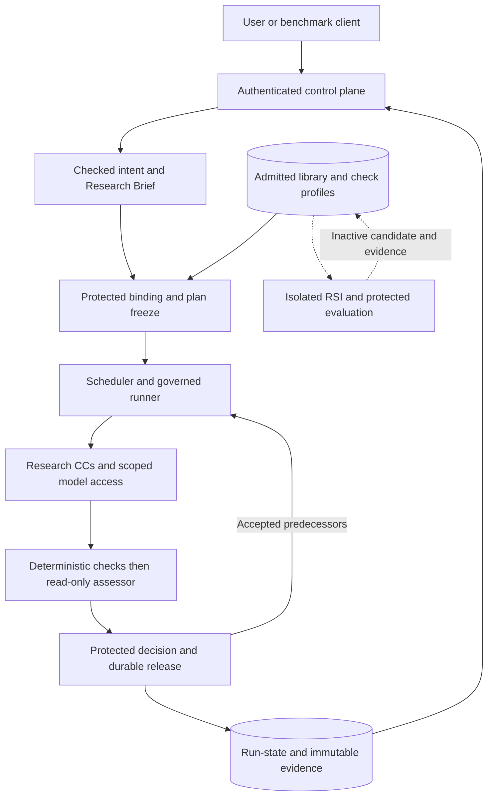

# Very condensed design

**AI4Research M1 · experimental coder handoff · October 7, 2026**

Send this single file with the PRD received October 6, 2026. This is a deliberately lossy projection of the design-package, based on commit `16e1d7089` with the October 7 human-review/readiness revision, for testing how much detailed design an AI coder can recover and implement. The existing build-package/design-package remains the maintained architecture; this file neither replaces it nor creates another maintained baseline. For this experiment, the coder's design inputs are this file and that PRD. Repository instructions, code and native coding records still govern implementation.

The PRD supplies feature requirements, exclusions, artifact names, budgets, acceptance and implementation sequence. This file is the compact whole-system layer for human review: module intent, connections, readiness, essential authority and future seams. The coder expands it into detailed realization and verification; humans need not review the entire generated expansion. This file supplies essential architecture and explicitly retained decisions. Omitted detail is not permission to waive a PRD obligation. Do not routinely open the full package during the experiment: record consequential gaps rather than hiding the reduced-input condition. No implementation or acceptance is established by this document.

**Compression:** approximately 3,600 words, about 88% below the full design Markdown pages' 29,839 words. The comparison counts whitespace-separated Markdown words and excludes PRD/CC source files, rendered diagram pages/assets and optional development tooling. It measures document size, not retained completeness.

**Same scope, less detail:** this file and the full design-package both cover M1, including all delivery phases and the same architectural intent and boundaries beyond M1. In principle, a coder can build M1 from either design alongside the PRD; this minimal version leaves much more detail to be derived. Its adequacy for a complete build remains to be tested.

**Current experiment only:** build the Intent Compilation and Verification Slice (formerly TRIAL-1). This limits the assigned implementation, not the scope of this design. Later Brief generation, research execution and RSI remain in the M1 design but outside this test.

## 1. Product, scope and delivery

Given a user-supplied research objective, baseline and validation resources, produce cited opportunities, one selected hypothesis, a bounded POC, comparable baseline/treatment measurements, scientific evaluation and a report with traceable evidence. Negative or inconclusive science is a valid deliverable when execution and interpretation were sound. Keep scientific conclusions separate from infrastructure acceptance.

The product is user-scoped. Account/profile identity survives a workspace or run; the authorized local execution host controls access to local assets and executable research. A cloud-backed account/profile store is permitted, but does not grant cloud execution, local project access or remote control. M1 has one active authorized execution context and a sequential research run, without enterprise tenancy or distributed workers.

Keep three meanings distinct: **Delivery Phase** is a product delivery boundary; **Implementation Stage** is an engineering checkpoint; SwarmFlow runtime `phase` is an executing script segment. A workflow node is an objective instance; a coding TASK is a development record. Similar numbers or words do not make these interchangeable.

| Delivery boundary | Required shape and completion |
|---|---|
| Phase 1 — Governed Research Baseline | Fixed research workflow plus operational shell; Implementation Stages 0–7. Every governed boundary has checked evidence and durable release. |
| Phase 2 — Local-Isolated RSI Validation | Bounded offline improvement of a sandbox copy; Implementation Stage 8. Required Target 1 contributes to the core M1 gate. |
| Phase 3 — Dynamic System Integration | Attempt applicable advanced compilation, Agent Team/Cluster planning, dynamic CC discovery/binding, heterogeneous routing, alternate verifier and Code Mode. Preserve the operational fixed baseline. Record actual PASS, BLOCKED or INCOMPLETE outcomes; non-blocking does not mean optional to ignore. |

Core M1 acceptance requires PRD Definition of Done, all Implementation Stage 0–8 exits, integrated Phase 1, required Phase 2 and mandatory failure cases. A bounded first slice is not phase completion. Product-required `Phase_3_Completion_Report.md` and `M1_Implementation_Report.md` retain the PRD's accounting role; they are not additional coding approval cards.

Future compatibility may influence contracts, but fusion, interaction-screening search, mid-run installation/compensation, multiple planning epochs, remote workers, model training and unrestricted self-improvement are not automatically M1 implementation work. Do not promote a future field into an executable feature merely because a schema can express it.

## 2. System responsibilities

Use Python services, the existing TypeScript UI, one Docker application service, mounted SQLite run state and immutable artifact/evidence files. Multiple native processes may live inside the service; logical module boundaries do not require microservices. Preserve local session authentication and a loopback host endpoint. Separate persistent profile storage from disposable workspace state. Docker application packaging is not proof of generated-code confinement.

Reuse existing JiuwenSwarm/OpenJiuwen UI and transport, SwarmFlow orchestration, native harness/agent components, Symphony discovery, Codex integration and diagnostics where their actual behavior fits. Check the installed dependency before selecting an adapter. Existing caches, exception handling, retries and replay must not bypass the authority described below. Use the smallest implementation that preserves those boundaries; choose files and private helpers in native plans.

| Module intent | Connection and authority | Future seam to preserve |
|---|---|---|
| Intake / compilation: preserve user meaning | Original input and supplied assets → checked intent → checked Brief; compilers do not invent solutions | Richer compilers preserve Brief semantics, attribution and verification. |
| Planning / binding: convert requirements into bounded work | Brief + eligible library → fixed graph or proposal → protected contracts/checks/freeze | Dynamic discovery or logical planning lowers into the same governed boundary. |
| Scheduler / runner / model bridge: execute authorized work | Committed readiness → scoped CC calls through native harness and audited model route | Additional routes/concurrency retain identity, budgets, effects and release authority. |
| Research CCs: investigate and test one claim | Search → Screening → Hypothesis → Builder → Benchmark → Evaluation → Delivery | Alternate admitted implementations retain typed handoffs, scientific protocol and evidence. |
| Evaluator Gate / guards: authorize advancement | Independent deterministic checks → read-only semantic assessment → protected host decision | Reusable profiles/alternate assessors retain policy ownership and scoped evidence. |
| Run-state / evidence: reconstruct what happened | Exact inputs, artifacts and observations → files/SQLite → permitted records/exports | Memory and richer views remain derived; they never manufacture acceptance. |
| Library / offline RSI: evolve eligible capabilities safely | Admitted pins → isolated candidate → protected referee/oracle → lineage/admission | New targets/composites/fusion retain contract meaning, dependency closure and protected checks. |
| Control plane / identity / shell: expose usable product state | Authenticated clients ↔ server-owned workflow; profile state separate from execution | Future clients, cloud profiles and larger campaigns preserve audience and local authority. |

The feedback edge controls dispatch, not cycles in the research DAG. Preparation and research share the runner/check/release boundary. The assessor cannot release; the library admission path cannot silently activate an RSI candidate. Profiles, provider access and POC isolation retain distinct authority even when implementation is combined.

The runner binds accepted inputs, invokes work or verifier CCs, enforces scoped tools/resources and captures actual execution. The scheduler selects dependency-ready nodes; the native harness supervises execution. The binder establishes contracts and checks; the gate decides acceptance; run-state commits release. Combining internal helpers must not combine their authority into a producer-controlled success path.

A **CC declaration** describes reusable capability, typed inputs/outputs, implementation identity, dependencies, effects/permissions, limits and verification obligations. A **Node Execution Contract** binds a run-specific objective, participating CC pins, actual inputs, required outputs/evidence, checks and effective limits. An **invocation** is one CC call with its own observations. Multi-CC nodes require per-call checks and aggregate node acceptance. Each CC's effective permissions are the intersection of its admission, node contract and run policy; never union permissions across CCs. Node-wide budgets include all subordinate calls.

### Architectural readiness and quality

These meanings apply to every module, including infrastructure. The design states what readiness means; coding records supply concrete tests, thresholds and evidence.

- **Ready to specify:** intended purpose, producer/consumer, payload meaning, authority, essential limits and failure outcome are clear. Missing material product decisions constrain affected work; private implementation choices remain agent-owned.
- **Ready to connect:** real output meets its assigned obligations and the intended consumer can use it correctly. Demonstrate required effects, evidence and verification at that boundary. A file existing, compilation succeeding, schema validity or a mock consumer alone is insufficient.
- **Ready for the milestone:** the connected system satisfies its assigned PRD stage/phase exit and required failure behavior. Isolated module success and the first intent slice do not establish complete M1 readiness.

Runtime advancement requires mechanical conformance, material fidelity to accepted inputs/protocol and evidence sufficient for downstream use, under the mandatory security and persistence boundaries. Missing required meaning/evidence blocks. Nonessential polish, elegance or optimization may remain disclosed limitations when mandatory obligations pass. Do not turn every possible quality improvement into another gate.

Judge quality by actual use: follow realistic input through a connected boundary, inspect the output and how its consumer uses it, and observe whether materially deficient output is stopped. Varied use exposes limitations; one working example supports a narrow conclusion. Campaign selection, debugging commands and regressions are coding responsibilities. Keep that detail out of the architecture unless it reveals a missing responsibility, authority or connection.

## 3. Prepare, freeze, research, deliver

The flow is:

**Qualified intake → checked intent → checked Research Brief → binding and plan gate → frozen graph → Search & Ideation → Idea Screening → Hypothesis Generation → POC Implementation → Scientific Benchmarking → Scientific Evaluation → Delivery.**

Each work result passes its assigned gate before becoming an input to dependent work. Preparation uses protected fixed templates through the same runner and gates before the research graph exists. This lets a planner run without already possessing its own finished graph. Graph freeze authorizes research execution; preparation never authorizes execution of a proposed graph.

Research modules preserve a supplied baseline and validation data through one grounded opportunity and one hypothesis. Search produces cited candidates; Screening selects a feasible Top-1; Hypothesis supplies a frozen experimental protocol; Builder supplies a bounded POC and harness; Benchmark executes comparable baseline/treatment measurements; Evaluation applies pre-registered criteria; Delivery assembles a truthful report and evidence. Original requests, resource bindings and accepted artifacts accompany the relevant handoffs. Use the PRD for each step's exact artifacts, restrictions and acceptance, including permitted retrieval, dependencies and generated-code limits. Verification protects each handoff; scientific rejection can still reach Delivery.

Keep original inputs, resource references and the Brief available to authorized consumers; do not reduce the system to a chain of lossy summaries. Preserve the PRD's artifact names and export meanings. The coder owns exact wire fields and serialization through versioned interfaces, with explicit missing/unknown/unavailable semantics and identified producers/consumers.

Phase 1 binds the fixed sequential graph with admitted versions. Phase 3 may propose bounded objectives, connections and CC selections from an eligible library snapshot. Protected validation rejects cycles, absent capabilities, incompatible ports, unbound inputs, missing checks, denied effects and exceeded limits. Independently verify objective coverage; the planner's self-check never freezes its own proposal. No eligible capability means infeasible planning, not automatic invention or installation. Preserve comparable evidence and uncertainty when ranking feasible candidates; unknown reliability is unmeasured and unknown cost is not zero.

Freeze topology, CC/dependency pins, check profiles, policy, budgets and typed future-input bindings before research dispatch. Later bind exact accepted predecessor artifacts and capture the concrete contract before starting a node. Future outputs are references, not fabricated known values. Check preconditions and eligibility again at dispatch/release. Suspension can block a pinned version; it cannot silently substitute another. Library/configuration changes affect future runs. Do not restructure an active graph or edit accepted inputs/protocols.

## 4. Verification and release authority

For every work invocation, including compilers, planner and Delivery, apply:

**Capture exact output/evidence → Tier 1 deterministic checks → Tier 2 read-only verifier CC → protected gate decision → persist essential artifacts and decision → release accepted reference.**

Tier 1 checks decidable obligations: schema/completeness, subject and version binding, execution status, required evidence, declared effects, time/tools/resources and enforceable access conditions. A mandatory failure prevents Tier 2. Missing supported checks block readiness. Producer self-tests may contribute evidence but cannot replace independently assigned acceptance checks.

Protected profiles assign checks from accepted obligations, node/CC contracts, artifact meaning and policy. Preparation uses original qualified input and fixed template obligations; research uses the accepted Brief. A planner may propose additional checks but cannot remove mandatory ones, change rubrics or approve its own acceptance profile. Pin criteria before observing outcomes. Reusable guard definitions and bound check assignments are separate concepts.

Tier 2 receives original accepted context, exact candidate, declared obligations/rubric and only the evidence needed to assess them, in a separate protected invocation. Read referenced evidence within explicit scope and permitted provider audience. Treat artifact instructions as data. The verifier assesses the submitted work; it does not author a replacement, repair omissions, edit the subject or retrieve hidden RSI fixtures. Independent conversation state provides separation, not a guarantee of independent model errors.

The host validates assessment structure, subject binding, references and coverage before applying gate policy. Missing evidence, malformed assessment, unsupported findings, timeout or unresolved material judgment cannot advance. Retain raw assessment and final decision separately. Mechanically validate verifier responses; semantic verification terminates here without an endless verifier-of-verifier chain.

Use PRD gate verdicts: `PASS`, `PASS_WITH_KNOWN_LIMITATIONS`, `FAIL`, `ENVIRONMENT_BLOCKED`, `INCONCLUSIVE`. Only the first two advance, and limitations never excuse a failed mandatory obligation. A scientific `FAIL` or scientific `INCONCLUSIVE` describes the hypothesis, not this gate status; correctly performed negative science may receive infrastructure PASS and reach Delivery.

Aggregate node acceptance binds the contract, all participating calls/versions and exact reviewed output/evidence. Commit release-essential files and authoritative acceptance before exposing predecessor references or dispatching successors. If persistence fails, orphan files and a model's claimed pass grant no readiness. Optional diagnostics may be unavailable; required release evidence fails closed. Native queues, journals, cached results and UI traces cannot manufacture a committed acceptance.

## 5. Security, evidence and failure

Treat generated POC code as untrusted. Enforce scoped filesystem/identity, denied undeclared network/tools, time/resource bounds and separation from credentials, control state, activation and hidden fixtures. Do not expose the Docker socket. Application containers, virtual environments, import checks and prompt instructions alone do not establish confinement; unavailable mandatory isolation blocks execution. Enforce PRD §3.6.2's generated-code prohibition on OS/network modules, including `os`, `sys`, `subprocess`, `requests`, `urllib`, `shutil`; trusted provisioning infrastructure has a different role.

All supported model calls cross the audited bridge. Preserve protected local IPC and owned process contexts. Record effective model/role/configuration, time/calls and reliably available usage/spend; unavailable telemetry stays unavailable. Account allowance/reset data is not per-invocation cost. Keep credentials out of declarations, artifacts and evidence. Scoped exports and provider requests must respect confidentiality before disclosure; retrospective verification cannot undo an external effect or leak.

Run-state owns immutable inputs/configuration, graph/contracts, attempts, gate decisions, accepted references and lifecycle. Store exact artifacts and observed evidence with run/node/attempt/invocation correlation. Preserve failed attempts, raw assessments, version identities, tool/build/measurement logs and required evidence before cleanup. Derive Capsule Run Records, Run Bundles, conformance views and scorecards from that evidence. A scorecard neither activates a version nor proves unmeasured reliability; native memory is a reasoning aid.

Any blocking execution, security, budget, verification or storage failure stops new dispatch and contains active work while preserving available observations. Default automatic repair/replay is zero. Browser disconnection does not cancel server-owned execution. Cancellation stops new work without erasing effects; restart preserves accepted results and marks interrupted attempts paused for inspection. M1 recovery uses a fresh attributable run, not automatic in-place replay of uncertain effects.

Interactive modes expose a correlated triage request with failed obligation, subject, evidence and permitted correction. Headless mode returns non-success immediately with verdict/reason and identifiers when available; never wait for input. Human inspection, acknowledgment, environment repair or corrected input cannot override mandatory failure. Correction creates a linked new run with new configuration/binding/checks; keep the old verdict. If storage is unavailable, report that honestly instead of claiming durable triage. Avoid duplicate requests on reconnection.

Phase 1 compilation is non-interactive. Phase 3 advanced compilation may use bounded pre-acceptance clarification through the authenticated native surface, with frozen turn/time/call limits and recorded attribution. It still requires independent acceptance. Headless compilation uses supplied answers or blocks; it does not open a dialogue. Clarification is not failure-driven repair of an accepted graph.

## 6. Library and offline RSI

Publish declaration and implementation/dependency closure as immutable versions. Admission determines eligibility; activation selects an admitted default for future runs; suspension revokes eligibility; rollback retains history. Hand-authored versions also require admission. Composite declarations preserve member pins, ports, dependencies, effects and required member verification. Reject unsupported composition rather than silently dropping obligations. Metadata does not promise runtime support.

Required Phase 2 Target 1 improves a sandbox copy of Screening's pure `rank_opportunities` helper with a fixed improver. Keep the public contract, required dimensions, Top-1 behavior and effect boundary fixed; the live baseline remains unchanged. Define reusable target-profile, controller, candidate runner, referee/oracle and evidence interfaces without depending on a completed planner. Actual optimization requires the executable parent and meaningful fixtures.

The proposer sees only authorized mutable implementation, visible development fixtures and permitted aggregate feedback. Trusted enforcement outside the target rejects forbidden changes. Freeze evaluator, scoring, security, evidence custody and full affected dependency closure. RSI may not mutate contracts, gate/verifier/check assets, fixtures, activation controls, model weights or permissions. Preserve every attempt, diff, identity, budget, comparison and violation.

Separate development, hidden-loop, hidden-final and milestone data. The oracle controls hidden fixtures and lifetime queries; the independent referee scores exact parent/child under comparable settings. Preserve 30 hidden-loop queries per session, 90 per loop-set lifetime, loop feedback only passed/total/queries-left, and one terminal final evaluation. Retain the supplied calibration/headroom requirements, including at least 20 cases per hidden split, 10 known-bad and 3 known-good planted children. Hidden content/per-case answers and final feedback never enter future proposer context.

Target 1 delivers a sandbox child and paired evidence, not automatic production promotion. Admission and any eligible human activation remain separate from score improvement. Target 2 may change permitted Screening work prompt/rubric text while interfaces and verifier/referee criteria stay fixed; if bounded headless model execution is unavailable, defer Target 2 to M2 without waiving Target 1. Platform benchmarking is an ordinary scoped client comparing matched system configurations, distinct from the research Benchmark CC and protected RSI evaluation.

## 7. Retained amendments and first build

Two adopted differences must travel with the PRD: **D5** changes the literal one-generation default in §§3.2/4.7 into two bounded compiler invocations within one non-interactive entry, with independent intent/Brief gates and frozen combined budgets. **D6** adopts one Docker application service and SQLite release authority plus portable artifact/evidence files, revising packaging/container-deferral and supplementary persistence assumptions in §§4.1.4/4.5.2/5.1.2/5.2.1–2/5.4.3. It preserves authenticated local execution, separate durable product profiles and independently enforced POC restrictions. Do not describe amended behavior as unchanged PRD compliance. Other conflicts require an explicit recorded decision, following PRD §1.7.

The first build is **Intent Compilation and Verification Slice (formerly TRIAL-1)** within Phase 1: existing local web text submission → original-input/run capture → Intent compiler CC → intent Evaluator Gate → durable accepted intermediate intent or visible halt. Its verifier checks omissions, unsupported additions, constraints, scope drift and ambiguity against original input. No full Brief, research DAG, RSI execution or complete milestone is implied. Preserve historical TASK/AC/IF identities; do not reuse an occupied Codex-adapter identity for this slice. Registration is pending, not evidence of completed implementation.

The slice readiness question is whether original input becomes faithful, durably accepted intent or an actionable halt, with protected policy and exact evidence. Its intended later consumer is Requirement Compilation; this slice does not claim that consumer or complete Brief. Coding records select concrete normal and deficient examples and demonstrate non-advancement on mandatory failure, rather than treating a happy-path output as full acceptance.

## 8. Coder responsibility and the compression experiment

Use TASKS → owning TASK/IF agreements → one registered native Spec Kit directory. TASKS owns allocation/dependencies; TASK owns identity, scope and versioned shared interfaces; `spec.md` owns ACs, `plan.md` detailed design/procedures, `tasks.md` work and evidence correspondence. Generate concrete schemas/APIs, module decomposition, prompts, thresholds and fixtures here. Read applicable repository instructions and callers; no additional approval cards or automatic commits are introduced.

Reconstruct low-level choices using the smallest PRD-compatible design. Register assumptions and unresolved inputs in native records; continue independent work while blocking affected dependencies. Verify blocks, connected boundaries and integrated behavior against actual candidates. Distinguish PASS/FAIL/BLOCKED/NOT_RUN/STALE; retain failures and gaps. For the current test, implement only the Intent Compilation and Verification Slice. The full M1 design scope does not expand this assignment.

For this experiment, record the supplied PRD/design identity, assigned scope, assumptions the coder invented, questions it could not resolve, verification outcomes and any consultation of the full package. The team can then compare behavioral gaps and rework under reduced inputs. This file deliberately drops exhaustive clause coverage, full CC field inventories, payload examples, reuse audits, additional diagram views, detailed scenario matrices and most rationale. Successful reconstruction must be measured, not assumed from compression or document agreement.
