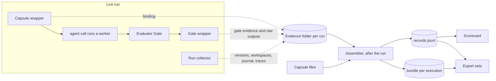

# Capsule Run Records: M1 Technical Design

Date: 2026-09-29 · Owner: Suraj · Status: initial technical design for review; not implemented

Capsule fields follow `cc.declaration.v1`. Platform behavior was read from source: `jiuwenswarm` at `1aaf56a` and `agent-core` at `fff7700`. File paths are given so each claim can be checked. Items marked **unverified** need confirmation on the first real run.

## 0. Decisions requested

1. **Capture raw, derive later.** Small hooks in our own workflow code save raw material while a run happens. Records are built after the run by an offline assembler. No change to agent-core or jiuwenswarm.
2. **One record per capsule execution**, including executions that never reach the gate.
3. **A capsule version is a hash over every file that makes up the capsule**, not only its Declaration.
4. **The gate saves exactly what it judged**, together with its raw outputs.
5. **M1 runs use trace settings that keep full content** (section 2).

Everything else is a proposal and can change.

## 1. Summary

The goal is to capture everything that touches a capsule when it runs, keep it, and hand it over. This design observes only. It does not interpret the data or decide how it is used.

Three reasons for capturing raw material and deriving records afterwards, rather than assembling records live:

- **Failures that skip the gate.** A node that crashes or exhausts the budget never reaches the gate. A record written at the gate would miss exactly the infrastructure failures that need to be told apart from capsule failures.
- **Risk to the run.** Assembling records inside the running process depends on asynchronous span delivery and adds code to the critical path. Appending raw files does neither.
- **The format will change.** Other owners' needs are not settled. If raw material is kept, records can be rebuilt in a new format at any time. If only records are kept, anything not anticipated today is lost.

| Area | M1 design | Boundary |
|---|---|---|
| Live capture | Three small hooks in our workflow code, all append-only, all failure-tolerant | No change to agent-core or jiuwenswarm |
| Records | Built after each run from saved raw material; rebuildable | No live assembly |
| Schema | A baseline layer for every run, plus declared-versus-observed pairs where a Declaration gives something to compare | No change to the Declaration format |
| Storage | One evidence folder per run, one bundle per capsule execution, JSONL records | No database, vector store, or graph |
| Outputs | Scorecard, export sets | No ranking, recommendation, or dashboard |

## 2. What the platform provides, verified in source

| Fact | Consequence for this design | Where |
|---|---|---|
| Each `agent()` call in a Swarmflow script runs as a fresh single-shot worker with a unique member name, its own workspace, and its own model setting | One capsule execution is one worker | agent-core `agent_teams/workflow/backends/team_worker_backend.py` |
| The engine's start event for a call carries its `agent_id`, `label`, `prompt`, `model`, `correlation_id`, and the worker's `member_name` | This event is the join between a node and its trace | `agent_teams/workflow/engine/primitives.py` |
| A call's `label`, `phase`, and `model` are part of its journal signature | Labels set by our wrapper must be deterministic, or a paused run loses its cached calls on resume | `agent_teams/workflow/engine/journal.py` |
| The journal stores each call's result and token count per run, plus pause and seal records with their reasons | Durable raw source for outputs and for how a run stopped | `journal.py`, `engine/runner.py` |
| A completed or stopped run is sealed. Relaunching it forces a fresh run id, and cached results are only served to the same run id | Journal replay does not work after a run completes. Reruns have to start from saved inputs | `tool_swarmflow.py`, `journal.py` |
| Worker workspaces live under the team home and are removed with the team | Worker artifacts must be copied before team cleanup | `team_worker_backend.py` |
| jiuwenswarm's default team trace exporter writes daily files, keeps 7 days, does not redact, and truncates attribute values at 10,240 characters | Long prompts and outputs are cut in the default traces | jiuwenswarm `resources/config.yaml`; agent-core `extensions/observability/redaction.py` |
| The lossless per-session trajectory store is off by default and keeps details up to 4 MiB for 7 days | Switch it on for M1 runs | `trajectory_ui` in `config.yaml`; jiuwenswarm `observability/store.py` |
| Model-call spans record where input messages came from, and context-window and compaction events | Source for what the capsule was given and whether its context was cut | agent-core `extensions/observability/callback_handler.py`, `trajectory_events.py` |
| Tool spans record full arguments and results, and whether a tool reported failure without raising | Source for what the capsule did | `extensions/observability/tool_outcome.py` |
| The standard evaluation attributes are in the pinned registry. The event name `gen_ai.evaluation.result` is defined upstream but not in the pinned file. Nothing in either repo writes them | Writing gate results into telemetry is possible but optional | `extensions/observability/gen_ai_semconv.py` |

**Unverified**, to confirm on the first real run:

- Whether worker agent spans carry `agentteam.member.name`. The team observability rail sets it for team members; whether it is mounted on workers is not confirmed. Fallback join: the worker's time window plus its workspace path, which appears in tool arguments.
- Whether the persisted run state keeps the start event's prompt in full.
- Whether the trajectory store captures spans from team-mode workers.
- Whether an engine-level retry of a failed call starts a new worker.

**M1 trace settings.** Enable `trajectory_ui`, raise `team_observability.attribute_value_max_length` well above the longest expected prompt, and keep redaction off. Without these, the full content this design depends on is not captured.

## 3. Design

### 3.1 Live capture: three hooks in our workflow code

| Hook | When | What it saves |
|---|---|---|
| Capsule wrapper | Around each `agent()` call that runs a capsule | Run id, label, capsule name, capsule content hash, Declaration hash, input artifact paths and hashes, start and end time, how the capsule was selected, route decision reference |
| Gate wrapper | When the gate returns | The exact evidence it judged, each check's result and raw output, the verifier's full output and verdict, the human's question and answer |
| Run collector | Once at run start, once at run end | Start: platform and agent-core versions, configuration hash, workflow script hash, workspace commit and state, host facts. End: copy worker workspaces, the run's journal log, and the run's trace data into the run's evidence folder |

All three append to files and swallow their own errors. A hook failure is logged and never affects the run.

**Label rule.** The wrapper sets `label = "<capsule_name>@<content_hash[:8]>"`. It is deterministic, so a paused run relaunched with the same script keeps its cached calls. It changes when the capsule changes, so the engine correctly reruns that node. It also lets the engine's own start event name the capsule version with no extra state.

### 3.2 After the run: the assembler

The assembler reads the run's evidence folder and the capsule files and writes records and bundles. It is idempotent and can be rerun over old evidence whenever the record format changes.

| From | To | Join key |
|---|---|---|
| Capsule wrapper line | Engine start event | Run id, label, order within the run → `agent_id`, `member_name` |
| Engine start event | Worker's model and tool spans | `member_name` (unverified; fallback in section 2) |
| Capsule wrapper line | Journal result | Run id and call key |
| Capsule wrapper line | Gate output | Run id and label |
| Output artifact | Next node's input | Content hash |
| Capsule wrapper line | Route decision | Execution id, when routing assigns one |

### 3.3 Two layers

**Baseline layer.** Captured the same way for every capsule execution, whatever the capsule declares: identity, environment and state, model and route, cost, every action, behavior signals, how it stopped, gate and verifier results, the human's input, lineage, and the raw bundle.

**Contract layer.** Added on top, where a Declaration gives something to compare against. For each declared clause the record holds what was declared beside what was observed.

| Declaration clause | Declared | Observed |
|---|---|---|
| `ports.inputs`, `ports.outputs` | Name, type, schema | Actual file, hash, schema validation result |
| `needs.external`, `needs.network` | Tools and network access | Tools called and network used, from tool spans |
| `changes.effects` | Resources it may write | Files written, from the worker workspace and tool spans |
| `guarantees.checks` | Check id, target | Result, message, raw output, evidence |
| `guarantees.failure_modes` | Reason codes | The reason code that occurred, or none |

Two things are recorded explicitly rather than left for someone to infer: **undeclared behavior**, such as a tool called that was not declared, and **unused declarations**, such as a declared tool never called. **Declaration coverage** is the share of observed tool calls, file writes, and failures that some declared clause accounts for.

The baseline layer exists because Declarations vary. The `generalist.codex` example accepts any input, may write anywhere in the workspace, and checks only that its output is valid JSON. Comparing against that says almost nothing, yet the generalist is where data matters most.

**What is new here.** Comparing declared behavior with observed behavior is runtime verification against a contract, an established software-engineering practice. Recent agent work applies versions of it: SkillOps treats a missing validator as a measurable gap, AutoRefine's contract gate checks isolation from undeclared state, and Cordis declares effects so they can be reverted. This design's contribution is narrower. It uses the capsule Declaration as the schema of the telemetry record, so every run is stored as a clause-by-clause comparison, and it measures declaration coverage. We have not seen that coverage measure in the papers reviewed.

## 4. The Capsule Run Record

One JSON object per capsule execution.

| Group | Fields | Source |
|---|---|---|
| Identity | `record_version`, `run_id`, `agent_id`, `member_name`, `label`, `stage`, `attempt`, `attempt_cause` (first, engine retry, gate rerun, human rerun) | Wrapper; engine start event |
| Capsule | `name`, `kind`, `owner`, `content_sha256`, `declaration_sha256`, `files[] {path, sha256}`, `selected_by` (static or router) | Capsule files; wrapper |
| Route | `execution_id`, `model_id`, `model_settings`, `route_decision {candidates[], excluded[] {model_id, reason}, judge_rationale, fallback_used}` | Router decision record; engine start event |
| Environment | `platform_version`, `agent_core_version`, `config_sha256`, `workflow_script_sha256`, `tools_available[]`, `tool_servers[]`, `sandbox_policy` | Run collector |
| State at start | `budget_remaining`, `shared_workspace {commit, dirty}`, `context_tokens_at_start` | Workflow events; run collector |
| Given | `prompt_ref`, `inputs[] {port, path, sha256, bytes, schema_valid}`, `message_provenance[]`, `memory_items[]` | Start event; wrapper; model-call spans |
| Produced | `outputs[] {port, path, sha256, bytes, schema_valid}`, `result_ref` | Journal result; worker workspace |
| Cost | `tokens {input, output, cache}`, `cost`, `model_calls`, `latency {total_ms, first_token_ms}` | Model-call spans; router audit when available |
| Actions | `tool_calls[] {seq, name, status, error_type, duration_ms, args_ref, result_ref}`, `files_written[]` | Tool spans; worker workspace |
| Behavior | `repeated_call_count`, `tool_error_count`, `context_compactions`, `stop_reason` (completed, iteration limit, budget, error, human halt, stopped) | Spans; journal pause and seal records |
| Gate | `gate_input_ref`, `checks[] {id, passed, message, output_ref, evidence[]}`, `verifier {verdict, reasoning, criteria[] {id, passed, score, explanation, evidence[]}, votes[], capsule_content_sha256, model_id}` | Gate wrapper |
| Contract | `conformance {coverage, needs_declared[], needs_observed[], effects_declared[], effects_observed[], undeclared[], unused_declared[]}` | Assembler |
| Failure | `failure {class, reason_code, declared_reason, error_text, error_fingerprint, retriable}` | Declaration; assembler |
| Human | `hitl {question, answer, edited_output_ref, answered_at}` | Gate wrapper |
| Lineage | `upstream[] {record_ref, artifact_sha256}`, `downstream[] {record_ref, accepted}` | Content hashes |
| Raw material | `bundle_path`, `journal_call_key`, `session_id`, `trace_ids[]`, `span_link_method` | Assembler |

Rules that apply to every record:

- **Nothing is omitted silently.** A field whose source is unavailable holds `not_available`.
- **Every judgement is labelled.** Check results, verifier results, the failure class, and the failure reason carry `produced_by`: `deterministic`, `model`, or `human`. A model's conclusion is never mistaken for a measurement.
- **Successes are recorded as fully as failures.**

**Failure classes**

| Class | Rule | Counts against the capsule |
|---|---|---|
| `infrastructure` | Adapter timeout, auth failure, budget exhausted, sandbox error, or the run stopped before the gate | No |
| `input` | An input failed schema validation, a check over inputs failed, or the human says upstream | No; attributed to the upstream execution |
| `capsule` | A check over outputs failed, or the verifier failed this deliverable | Yes |
| `scientific` | The hypothesis was tested and the verdict is fail or inconclusive | No, never |

The error fingerprint is the error text with paths, timestamps, ids, and line numbers replaced by placeholders, so the same failure groups together across runs. agent-core's evaluation analyzer uses the same technique.

**Why record the route decision in full.** Evaluating a different decision offline, later, is only possible if the options available and the context of the choice were logged when the choice was made. This is the standard result from offline evaluation of recommendation and ranking systems (Li et al. 2011; Swaminathan and Joachims 2015). Recording the router's candidates, exclusions, and rationale costs little now and cannot be recovered afterwards.

## 5. Environment and state

| State | What to capture | Source | Why |
|---|---|---|---|
| Workflow position | Run, node, attempt, budget remaining | Start event, journal | A capsule starved of budget behaves differently |
| Model context | Messages seen, their origin, context used, compactions | Model-call spans, trajectory events | A capsule can fail because its context was cut |
| Memory | Items retrieved and which store | Tool spans | Memory changes between runs |
| Workspaces | Shared workspace commit and state at start; worker workspace at end | Run collector | Needed to rerun and to observe effects |
| Software | Platform, agent-core, script, tool and tool-server versions | Run collector | Upgrades change results with no capsule change |
| Configuration | Hash of active configuration, model settings | Run collector | Same reason |
| Host | Operating system, CPU model and core count, memory, GPU model and driver | Run collector | Benchmark timings from Stage 3.7 depend on the machine; continuous utilization sampling is not in M1 |
| Model provider | Model, provider, latency, retries, errors, cost | Model-call spans; router audit | Separates capsule problems from provider problems |
| Tools and outside world | Arguments, results, errors, timestamps | Tool spans | Search and fetch results change over time |
| Human | Questions and answers | Gate wrapper, `human_session` | Often the only ground truth |
| Sandbox | Commands, exit codes, output | Sandbox audit log, off by default, output cut at 4 KiB | Shows what code actually ran |
| Permissions | Allow, deny, ask decisions | Text log only today | A denied call can look like a capsule fault |

## 6. Evidence folders, bundles, reruns, retention

- **Evidence folder per run:** `records/runs/<run_id>/` holding hook outputs, copied worker workspaces, the journal log, and trace data.
- **Bundle per execution:** `records/bundles/<run_id>/<agent_id>/` holding the capsule files as run, the prompt as sent, input and output files, the worker workspace, full span payloads, raw gate and verifier outputs, and `manifest.json` with a hash for every file.
- **Reruns.** The journal cannot replay a completed run. Instead, each bundle holds everything needed to run that capsule again on its own: the prompt, the inputs, the capsule files, the model and settings, and tool results with timestamps. Building a rerun tool is not in M1.
- **Controlled comparisons, documented only.** The platform supports pausing a run, editing the script, and relaunching on the same run id, which reuses every unchanged earlier call and reruns the changed node. That gives an exact shared prefix, the same technique Who&When Pro used to build clean comparisons. Not built in M1.
- **Retention.** Copy before the 7-day trace retention and before team cleanup. Nothing is deleted automatically in M1.
- **Sensitivity.** Bundles hold prompts, outputs, and human answers, unredacted. Access needs a decision before bundles leave a developer machine.

## 7. Outputs

**Scorecard.** Per capsule version: executions, gate pass rate, pass rate per check, verdict counts, failure reasons and fingerprints, undeclared-behavior counts, declaration coverage, share of passing outputs accepted downstream, median tokens, duration, and attempts. Failures classed `infrastructure` or `scientific` are shown but do not lower pass rates.

Comparing two versions on identical inputs is only meaningful where inputs really match. Upstream stages are nondeterministic, so natural runs rarely give a later stage identical inputs. Matched comparisons come from fixed first-stage prompts or from reruns on exported inputs. The scorecard reports how many matched pairs it found rather than implying a comparison it cannot make.

**Export sets.** `exports/<export_id>/{manifest.json, records.jsonl, bundles/}` with a content hash for the whole set. Includes successes and failures. Each execution carries a partition label fixed at export.

**Library snapshot.** Computed from capsule files alone: capsules with no checks, capsules with no failure modes, pairs whose output type fits another's input type, identical interfaces, identical content.

## 8. M1 scope tiers

| Tier | Contents |
|---|---|
| Core | Three hooks; assembler; baseline layer; contract layer for ports, checks, failure modes, tools, and workspace writes; bundles; scorecard; export sets |
| Stretch | Library snapshot; gate results written into telemetry so Langfuse shows them; permission decisions; sandbox commands |
| Later | Database and graph queries; rerun tool; redaction and access control; sharing across teams |

## 9. Acceptance checks

| # | Check | Evidence |
|---|---|---|
| A1 | Every capsule execution in a default-workflow run has exactly one record, including one that exhausted the budget before its gate | Record count against the run tree |
| A2 | Changing only a capsule's instructions changes its content hash | Edit and rehash |
| A3 | Each record links to its worker's model and tool spans, and names the linking method used | Inspect `span_link_method` |
| A4 | The bundle's prompt and output are byte-identical to what the worker received and returned | Compare against the journal and worker workspace |
| A5 | A forced output-check failure yields class `capsule` with the declared reason code | Fault injection |
| A6 | A forced adapter timeout yields class `infrastructure` | Fault injection |
| A7 | A scientific fail yields class `scientific` and changes no pass rate | Scorecard comparison |
| A8 | A capsule that calls an undeclared tool gets an `undeclared` entry | Fault injection |
| A9 | One node's output hash equals the next node's input hash | Lineage script |
| A10 | Every file a record references exists in its bundle with a matching hash | Manifest verification |
| A11 | Breaking a hook mid-run does not change the run's outcome | Run completes, warning logged |
| A12 | Rerunning the assembler over the same evidence produces identical records | Byte comparison |
| A13 | A generalist execution has a complete baseline layer and low coverage | Inspect the record |
| A14 | Every judgement value carries `produced_by` | Schema validation |
| A15 | A successful execution's record and bundle are as complete as a failed one's | Field comparison |

## 10. Open questions

Until each is decided, M1 proceeds on these defaults: capsules are fixed per stage, the worker's `agent_id` is the record key when routing supplies no execution id, a capsule's files are its `.md` file, its Declaration, and every file either references, and per-check fields are `not_available` when the gate returns only a verdict.

| # | Question | Who decides |
|---|---|---|
| Q1 | Which files make up a capsule: Declaration, instructions, skills, check runners, schemas? | Capsule owner |
| Q2 | In M1, is each stage's capsule fixed, or does the router select it? | Workflow and router owners |
| Q3 | Will workflow code run capsules through one shared wrapper? | Workflow owner |
| Q4 | Does the gate produce per-check results and raw output, or only a verdict? | Verifier owner |
| Q5 | Native `verify()`, a custom verifier capsule, or both? | Verifier owner |
| Q6 | Can the verifier cite the files and trace steps it relied on? | Verifier owner |
| Q7 | Does routing assign an execution id while M1 runs single-path through the Codex CLI adapter, and will it expose its decision record? | Router owner |
| Q8 | Can M1 runs enable the trajectory store and raise the trace length limit? | Platform configuration owner |
| Q9 | When is the team, and so its worker workspaces, cleaned up relative to run end? | Workflow owner |
| Q10 | Can a node run more than one capsule, or a capsule call another? Which owns the record? | Capsule and workflow owners |
| Q11 | How long are bundles kept, and who may read them? | Project lead |
| Q12 | Can the sandbox audit log be switched on for M1 runs? | Platform configuration owner |

## 11. Not in M1

A database or service; any interpretation, ranking, or recommendation; model-based failure attribution; a rerun tool; synthetic runs; dashboards; writing anything back into the pipeline; redaction; multi-user separation; proposing changes upstream. Because raw material is kept, each of these can be added later without losing past data.

## Appendix A. Research basis

Figures below were checked against the papers' own text.

| Source | Finding | Consequence here |
|---|---|---|
| [TRAIL](https://arxiv.org/abs/2505.08638) (2025) | 148 annotated traces with 841 errors; "the best Gemini-2.5-pro model scoring a mere 11%" at locating them | Record structure at write time; do not rely on reading raw traces later |
| [Which Agent Causes Task Failures and When](https://arxiv.org/abs/2505.00212) (2025) | "53.5% accuracy in identifying failure-responsible agents but only 14.2% in pinpointing failure steps" | Capture links that make attribution mechanical |
| [Who&When Pro](https://arxiv.org/html/2607.09996v1) (2026) | 12,326 failures built by exactly replaying a successful prefix and injecting one failure | Exact prefixes give clean comparisons; section 6 documents how the platform supports this |
| [MAST](https://arxiv.org/pdf/2503.13657) (NeurIPS 2025) | Failure groups: system design 43.8%, inter-agent misalignment 32.2%, task verification 23.5%. Largest modes: step repetition 15.7%, reasoning-action mismatch 13.2%, unaware of termination 12.4%, disobeying the task specification 11.8%. Better role specifications alone added 9.4 points. Final-stage, low-level verification was found inadequate | Record repetition and stop reason; label judgements by source; treat the verifier as observed, not as ground truth |
| [GEPA](https://arxiv.org/abs/2507.19457) (ICLR 2026) | Uses a score plus text feedback per case, including evaluation text "before they are collapsed into scalar rewards"; keeps separate cases for feedback and for selection | Keep raw check and verifier output; partition labels on exports |
| [AutoRefine](https://arxiv.org/pdf/2601.22758) (2026) | Correction and preservation cases tied to record and span ids; removing the replay gate cost 16.1 points, boundary checking 15.0 | Record successes fully; keep rerun material |
| [SkillOps](https://arxiv.org/pdf/2605.13716) (2026) | Skill contract of preconditions, operation, artifacts, validators, failure modes; library health from utility, redundancy, compatibility, failure risk, validation gap | Contract layer and library snapshot |
| [Experience Graphs](https://arxiv.org/abs/2606.29823) (2026) | Stores parent links, artifacts, output, score, evaluation evidence, exact messages; logs fail because extraction becomes "brittle, after-the-fact scraping" | Lineage, fingerprints, full content; flat files are a known M1 limit |
| [AgentOps taxonomy](https://arxiv.org/html/2411.05285v2) (2024) | Complete traces include evaluation and guardrail spans | Gate results become part of the record, and optionally of telemetry |
| [Chronicle](https://arxiv.org/pdf/2609.20625), [Causal Agent Replay](https://arxiv.org/html/2606.08275v1) (2026) | Record at non-deterministic boundaries; replay some, run others live; intervene on one step | Full model and tool content in bundles |
| [Li et al. 2011](https://arxiv.org/abs/1003.5956); [Swaminathan and Joachims 2015](https://arxiv.org/abs/1502.02362) | Offline evaluation of a different decision policy requires logging the context, the options, and the choice at decision time | Record the route decision in full |
| [OpenTelemetry GenAI events](https://github.com/open-telemetry/semantic-conventions-genai/blob/main/docs/gen-ai/gen-ai-events.md) | Standard `gen_ai.evaluation.result` event with name, score, label, explanation | Optional stretch: write gate results into telemetry |
