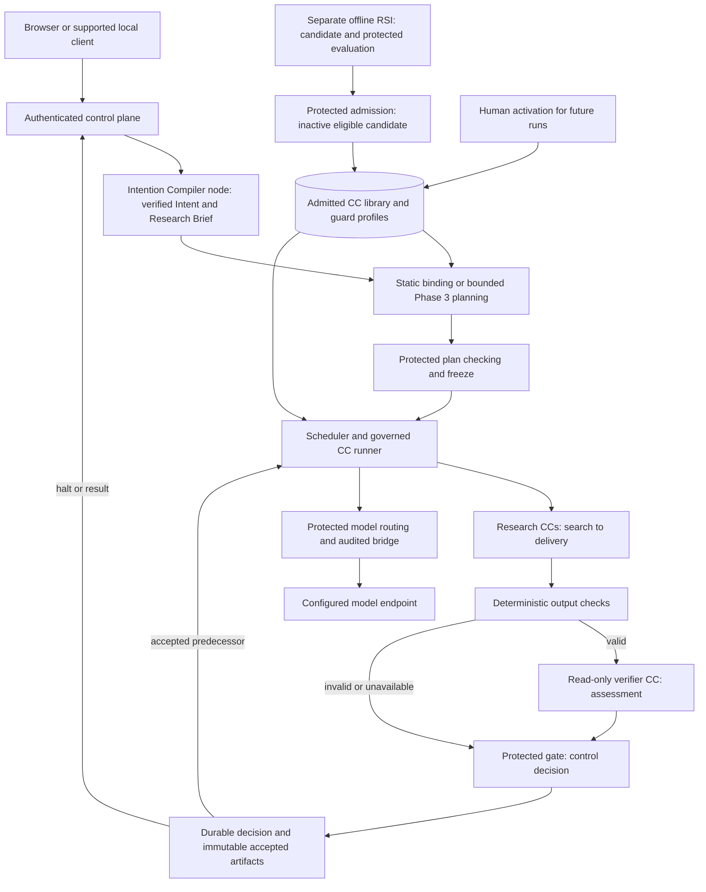

# AI4Research M1: compact design input

**Compact design package, full M1 scope.** The separately supplied PRD defines product obligations; its [source receipt](sources/product/README.md) identifies the reviewed input. This architecture defines components, contracts and authority. It is independently readable; consult only the assigned input during a paired trial. The full design-package owns architectural changes; this matched version compresses explanations and preserves authoritative contracts.

**PRD and design authority:** The PRD owns overall requirements and required outcomes. Design interprets the PRD and owns architecture and implementation-facing details that achieve those outcomes. If implementation guidance conflicts, follow the current design. Product obligations remain binding; a conflict that changes an obligation needs an explicitly recorded authorized decision.

## Human super-important read: understand the whole system

Read this README → [system](m1-design.md) → [principles](principles.md). This covers the whole M1, deployment, authority, phases and next build. Fields are reference; phase/component detail is selected by question.

## For design authors and human reviewers

[Design method](design-method.md) defines architectural depth, project decision handoffs, tiered review and change propagation. [Decision review](decision-review.md) preserves identical decisions, source exceptions and pros/cons. Documentation checks do not mean human approval or runtime success.

**PRD supplied separately:** This folder contains architecture, source receipts and clause mappings, not the PRD body. Use the PRD Main/Context supplied by the coding prompt.

## Build a specific component

For the complete Intention Compiler, start with the [Architecture Main entrypoint](builds/intention-compiler/README.md) and [Architecture Context](builds/intention-compiler/context.md). Follow their required foundation and schema links. Success reaches accepted `Research_Brief.json`; accepted Intent IR alone is incomplete.

## Human should read: review the affected responsibility

| Question | Detailed design |
|---|---|
| What makes Intent usable, and how does it become Requirements? | [Intent and Requirements](intent-design.md) |
| How do plans freeze, bind future inputs and execute? | [Workflow](workflow.md) |
| What does each research responsibility produce? | [Research design](research-design.md) |
| What is a CC, and how do checking and library changes work? | [Capsules](capsules.md), [authoring](capsule/authoring.md) |
| Who assigns checks and constructs verifier evidence? | [Guard design](guard-design.md) |
| Where do models, generated code, state and the browser live? | [Placement](placement.md), [model routing](model-routing.md) |
| What happens after a halt, cancellation or restart? | [Failure handling](failure-and-human.md) |
| How do people inspect results and technical evidence? | [Artifact inspection](artifact-inspection.md), [automation/client boundary](automation.md) |
| Where is RSI and what can it change? | [Offline RSI](offline-rsi.md) |
| What must a phase or the next build demonstrate? | [Delivery phases](delivery-phases.md), [phase details](phase-details.md), [Immediate Plan](immediate-plan.md) |

## AI read: human-readable reference, selective human review

[Reference index](reference/README.md), [field catalog](reference/field-catalog.md), [CC declaration](capsule/declaration.md) and [examples](reference/examples/README.md) are identical to the full condition. [Vocabulary](glossary.md), [coverage](coverage.md) and [clause index](coverage-allocation.md) retain traceability. Private algorithms/classes/adapters remain constrained implementation choices; shared fields cannot be invented independently.

Find any artifact or field through the [contract index](reference/contract-index.md).

## System picture

AI4Research turns a supplied research purpose/resources into grounded opportunity, registered hypothesis, bounded POC, matched measurements and report. Candidate artifacts reach consumers only after protected durable acceptance. Intent describes meaning; Requirements produces the contract that planning must fulfil. Verifiers assess submitted artifacts; gates control progression. RSI is outside live research.

Preparation and planning use the same checking pattern. The release edge is dependency dispatch, not a cyclic scientific graph. RSI evidence goes through admission; only human activation changes future selection.

## Responsibility and authority

| Component | Owns | Connects to |
|---|---|---|
| Compiler/work CC | Candidate artifact fulfilling its assigned responsibility | Runner supplies inputs; checking consumes outputs |
| Verifier CC | Read-only verdict, findings, reasons and uncertainty about the submitted artifact | Protected review context in; assessment out to host |
| Protected binder | Concrete contracts, typed bindings and independent check assignments | Accepted requirements, admitted pins, policy, evidence and durable state |
| Protected gate | Checked decision and durable acceptance; no release before commit | Exact contract, subject, evidence and assessment |
| Protected library admission | Inactive candidate eligibility and standing history | Declaration/body/provenance, independent evaluation; human activation |
| Scheduler/runner | Eligible dispatch, scoped execution, budgets and observed evidence | Frozen contracts, CCs, model bridge and restricted experiment executor |
| Control plane | Authenticated submission, inspection and visible results/blockers | Browser/CLI/TUI and server-owned run state |
| Offline RSI | Bounded implementation improvement and comparable evidence | Protected target profile, isolated runner/referee and inactive library candidates |

## Deployment and scope

One app image bundles frontend/service/runtime. Entrypoint starts the product; browser uses host-loopback `http://127.0.0.1:5173` through `127.0.0.1:5173:5173`. Private sidecar clients use service DNS, compatibility/readiness handshake and scoped authentication, outside M1 prerequisites. Model IPC, persistent account/state/evidence and restricted scientific execution have distinct authority/access. Restart pauses without replay; browser disconnect does not cancel.

Full M1 covers baseline research/workstation, required isolated RSI and every applicable bounded integration effort. The current build produces an accepted Research Brief or visible halt, including compiler foundations; it does not complete downstream research or M1. Future remote workers, fusion and recursive improvement remain context, not implemented scope.

## Review and evidence

Use [phase detail](delivery-phases.md) and [Immediate Plan](immediate-plan.md) before reviewing a build. Exact contracts/versions/examples and decision behavior match the full input. The controlled difference is explanatory depth and views. D5/D6 remain explicit authorized departures from literal PRD wording. Human review and real implementation evidence remain unperformed.
