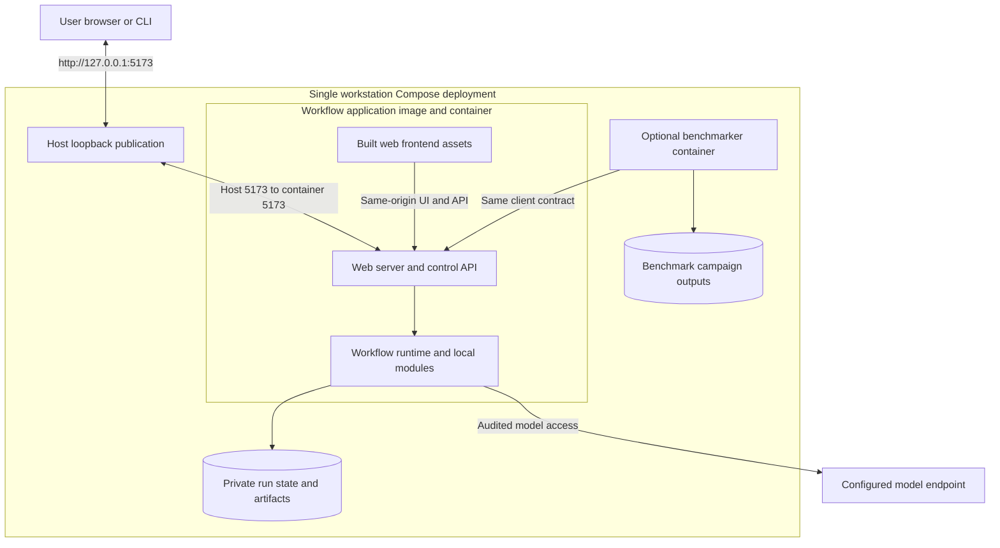

# Automated development and platform benchmarking

**Reading level: human potential.** Question answered: How do authenticated clients connect, observe and recover without release authority?

## Local Compose topology

## Client contract and campaign behavior

The workflow application exposes one versioned, authenticated client boundary for supported UI/CLI clients and external clients such as the optional benchmarker or development sidecar. On the container network, clients reach it through the configured application service name and container port `5173` by default; browser users reach the same UI/control service through the host-loopback publication described above. The product boundary provides a readiness/capability response containing the client-contract version, target instance/build identity, supported operations and prerequisite states. A client verifies target and compatibility before submission; mismatch or missing required capability blocks the operation. Readiness distinguishes HTTP/process liveness from storage, authentication, model and required-isolation readiness. The [client field contract](reference/other-contracts.md#client-and-model-boundaries) defines shared readiness/submission/status/evidence information. Route names, transport encoding and internal adapters remain implementation choices within that contract. The [sidecar connection contract](development-tools/sidecar/README.md#application-connection-and-compatibility) relies on this product boundary and adds no privileged product endpoint.

| Operation | Meaning that must be stable |
|---|---|
| Readiness | Verify target instance/build and client-contract compatibility; distinguish service liveness from model/authentication, storage and required-security readiness. Declare an unavailable prerequisite rather than measuring a mock as a real model run. |
| Submit | After readiness and compatibility pass, submit the original objective, permitted resources, explicit product/evaluation mode, approved profile identity and requested seed where supported. Return one run identity; ambiguous transport completion does not automatically resubmit. |
| Observe | Read correlated status and events, with reconnect/poll support. Transport disconnection never cancels or duplicates research work. |
| Finish/retrieve | Structured terminal status, detailed verdict/reason, accepted result references and allowed Run Bundle. Headless failures never wait for a human. |
| Cancel | Explicit authenticated control action; preserve work already performed and cancellation evidence. It cannot undo external effects. |

## Development capabilities worth establishing early

Use shared invocation, output validation, trusted evidence-context assembly, runtime verifier CC assessment, protected gate decision, release persistence and export builders across the slice and full M1. Native UI, CLI and benchmark adapters should call one application use-case boundary rather than reimplementing workflow decisions. Supply inspectable effective configuration and fixture-based mock adapters; protect real runtime paths from test-only verdict injection. Deliberately exercise loss of model access, artifact substitution, storage failure, malformed verifier output and browser/client disconnect through the same boundary.

## Benchmark and RSI evidence connections

Export versions, exact effective configuration, run identity, admitted outputs, observations and limitations in an audience-scoped manifest. Platform benchmarker analyzes exports; Data Foundation prepares them; offline RSI consumes only explicitly approved development material. The RSI referee/oracle remains a protected independent path. Platform evaluation must stay within the master PRD: no expanded model access, uncontrolled benchmark downloads, training or hidden-feedback leakage. Detailed campaigns belong to their owning specification.
