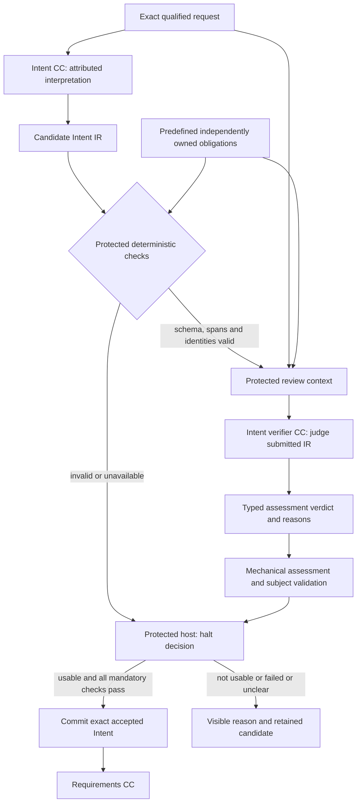
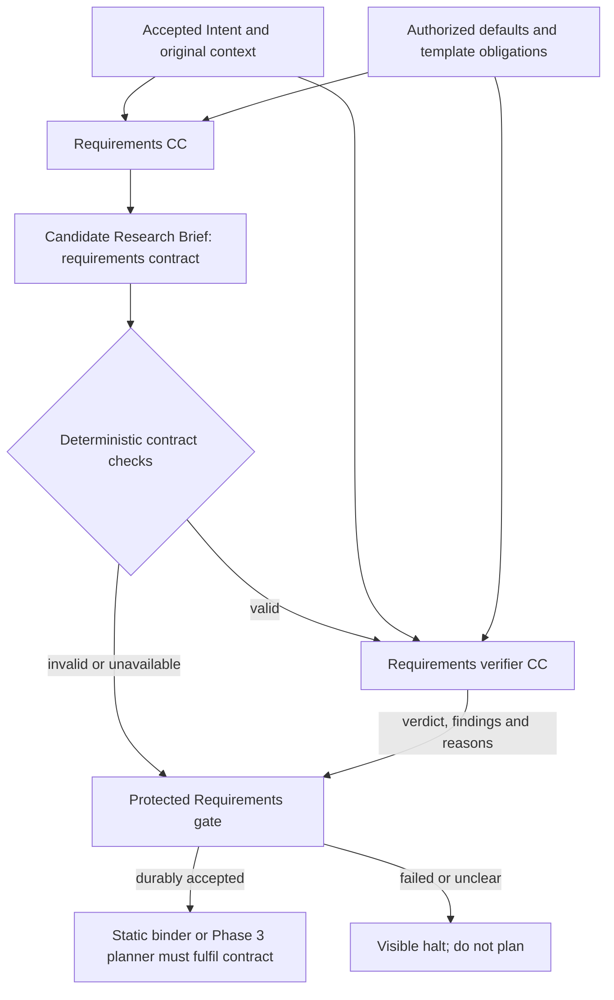

# Intent and Requirements: interpretation, checking and release

**Reading level: human potential.** Question: what does the compiler need to understand, what must its verifier establish, and why does Requirements wait? [Immediate Plan](immediate-plan.md) selects the first build; [field contracts](reference/intent-and-requirements.md) define its interoperable data.

## Intent CC responsibility

The compiler takes the exact qualified original request and permitted context. In a bounded generative pass it extracts the problem/research purpose, desired change, requested result, affected entities, scope, exclusions, constraints, preferences and stated targets. It preserves source attribution and separates absent information from stated values. It produces **Intent IR**, not a Research Brief or proposed scientific solution.

## Deterministic boundary

## Intent verifier responsibility

The verifier receives the candidate IR as its primary subject, original request/context as evidence, protected criteria and relevant execution observations. It asks whether **this artifact** performed Intent's job: faithful coverage, no unsupported additions, preserved scope/constraints, consistent interpretation, explicit material uncertainty and a workable purpose/result for Requirements.

## Gate responsibility and human outcome

Protected host code validates and interprets deterministic results plus the assessment, then writes the authoritative decision. It alone publishes accepted output after persistence succeeds. Missing references, contradictory findings, failed mandatory obligations, material unresolved uncertainty or unavailable evidence cannot advance. A compiler-generated readiness flag is advisory.

## Requirements CC and the second boundary

Requirements receives **accepted** Intent, original context, supplied resource references and protected defaults. A second bounded generative pass produces the Research Brief: objective, scope, mandatory outcomes, optional preferences, constraints, targets, deliverables, acceptance expectations, evidence obligations, attributed assumptions/defaults and remaining uncertainty. It cannot silently repair misunderstood intent or select the eventual experiment.

## Source and build boundaries

D5 explicitly permits two compiler generations instead of the unchanged PRD's literal single bounded generation. Combined limits are frozen; each compilation remains bounded/non-interactive in the baseline. Verifier calls are separate checking work. The Immediate Plan builds only Intent and its boundary. Complete Stage 2 includes qualified documents/resources, accepted Brief and initialized baseline graph; the Intent verifier is not downstream work Node B.

## Connected behavior summary

Intent compiler records what the user means: problem, desired change/result, scope, explicit constraints, source-supported claims, omissions/conflicts and readiness. It chooses no solution. Capture candidate → deterministic structure/reference/scope checks → independent read-only verifier of fidelity/coherence/usability against original source evidence → mechanically validate assessment → protected gate commits accepted Intent or halts visibly. Invalid structure prevents verifier spend. Topic-only honest uncertainty cannot pass usability; missing optional methodology need not block actionable meaning. Verifier judges submitted IR, not a second interpretation.

Only accepted Intent reaches Requirements. Requirements produces Research Brief governing downstream obligations: objective, mandatory outcomes/preferences, scope, constraints, target metrics, deliverables, evidence and attributed authorized defaults. Never attribute defaults to user; do not default missing purpose/result. Repeat deterministic/semantic/protected checking; unresolved material contradictions block binder/planner. Defaults/profile cannot widen permissions. Hypothesis later registers experiment-specific criteria; Brief is not measured scientific success.

Phase 1 uses two bounded compiler passes under D5, no dialogue/repair. Phase 3 may declare bounded pre-acceptance clarification; accepted meaning/Brief and downstream contract remain governed. [Fields](reference/intent-and-requirements.md) connect producer obligations, deterministic checks and semantic obligations; examples show actionable, unusable, contradictory and negative-science cases.
