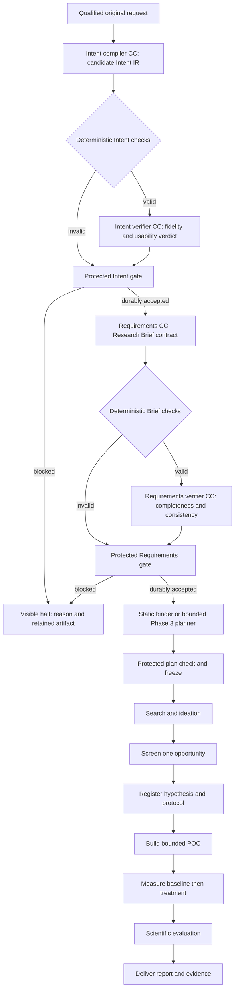
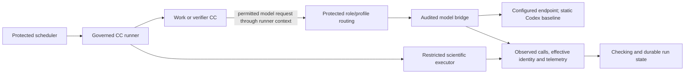
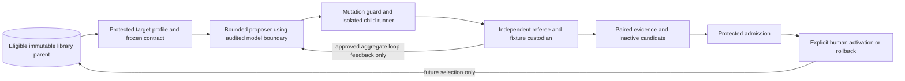

# System architecture

**Reading level: human immediate.** This page connects the whole M1 system. [Research design](research-design.md) expands each responsibility; [reference](reference/README.md) defines the information crossing boundaries.

## From meaning to a governed research program

Intake captures the original request and qualifies permitted local documents/assets. It rejects unreadable required inputs rather than silently losing them. Intent compilation identifies the user's problem, desired change and requested result. Requirements turns accepted meaning into the Research Brief contract. Neither compiler chooses the scientific solution.

Search → Screening → Hypothesis → Builder → Benchmark → Scientific Evaluation → Delivery is one governed research sequence. Every stage uses the shared capture/check/verifier/protected-commit boundary; the diagram abbreviates those repeated boundaries. Scientific FAIL may be a valid accepted result, not infrastructure failure.

## Execution and model routing

Each M1 execution node has one work CC. Additional work CCs use separate gated nodes; verifier invocations remain separately governed checking assignments. Composite/merged CCs and internal member graphs remain later work.

## Where RSI connects

## Placement, state and human inspection

The application image contains the frontend, same-origin web/control API and workflow runtime. Its entrypoint starts the product. The browser reaches container port 5173 through host-loopback publication, normally `127.0.0.1:5173:5173`. No external UI script or separate frontend container is required. A separate sidecar/benchmarker uses configured private-network service DNS and the container port, ordinary scoped authentication and a compatibility handshake; its own localhost is not the application.

SQLite owns durable lifecycle/release state; immutable files retain artifacts and observations. Account/profile state survives run/workspace deletion. Readable views are derived from the same records; restart pauses without replay, and saved inspection never executes work.

## Full M1 and the next build

| Delivery phase | Required architecture and exit meaning |
|---|---|
| Phase 1: baseline, Stages 0–7 | Governed foundation; qualified request → accepted Brief → static bound research graph; search/screen/hypothesis; POC and matched measurements; scientific verdict/report; persistence, evidence and native workstation clients. Demonstrate real connected work and failure handling |
| Phase 2: Stage 8 RSI | Independent bounded Target 1 mutation/evaluation/evidence with frozen referee and security; sandbox candidate stays outside production. Target 2 depends on available bounded model execution |
| Phase 3: integration | Attempt every applicable advanced compiler, Team/Cluster planning, dynamic discovery/binding, heterogeneous routing, alternate verifier and Code Mode effort. Preserve baseline; distinguish validated, blocked and incomplete outcomes |
